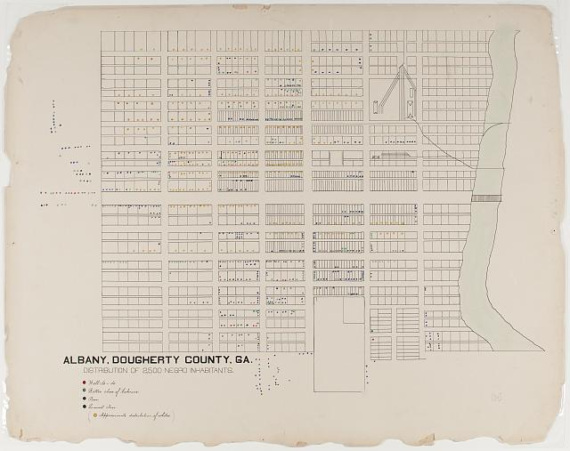

## Öğrenme Çıktıları

Bu oturumun sonunda:

- İstatistiğin ne olduğunu, neden önemli olduğunu ve hangi kararları beslediğini açıklarsınız.
- Bir sayının veya grafiğin ne zaman yanıltıcı olabileceğini sorgulayabilirsiniz.
- R ve RStudio'nun temel bileşenlerini tanımlar; konsol ile script farkını kavrarsınız.
- R'da temel aritmetik, karşılaştırma ve mantıksal işlemleri uygularsınız.
- İlk R hatalarınızı okuyup yardım kaynaklarını kullanabilirsiniz.
- Versiyon kontrolünün ne olduğunu ve araştırmada neden gerekli olduğunu açıklarsınız.

------------------------------------------------------------------------

# 1. İstatistiğin Anlamı ve Önemi

## 1.1 İstatistik Nedir?

"İstatistik" kelimesi, Almanca *Statistik*'ten gelir; bu terimi 1740'ların sonunda Gottfried Achenwall türetmiştir. Kaynağı ise Yeni Latince *statisticus* ("devlet işlerine dair") ve İtalyanca *statista* ("devlet adamı, siyasetçi") kelimeleridir. Yani istatistik, en baştan beri **devletleri, toplumları ve nüfusları anlama** ihtiyacından doğmuş bir bilimdir — mühendislik veya doğa bilimlerinden ödünç alınmış değil. Bir siyaset bilimi, kamu yönetimi veya işletme öğrencisi olarak siz bu disiplinin **yabancısı değil, tarihsel ev sahibisiniz.**

İstatistik, **verilerden anlam çıkarma sanatıdır**. Sayılardan ibaret değildir; sayıların arkasındaki hikâyeyi keşfetmeye çalışır. İstatistik, karmaşık veri yığınlarını **düzenlememizi, özetlememizi ve yorumlamamızı** sağlar.

::: callout-tip
**Kısa tanım:** İstatistik, belirsizlik altında veriye dayanarak **çıkarım** yapma ve **karar** alma sürecidir.
:::

## 1.2 Bir Sosyal Bilim Öğrencisinin İstatistikle İlk Karşılaşması

Bu senaryo size tanıdık gelebilir: Siyaset bilimi, Kamu Yönetimi ya da İşletme gibi bir sosyal bilim dalında okumaya karar verdiğinizde aklınızda genellikle sayılar değil; kurumlar, söylemler ve karar süreçleri vardı. Ancak müfredatta istatistik dersi belirdiğinde ilk tepki çoğu zaman şöyle olur: “Ben bu bölümü sayılardan kaçmak için seçtim.” Yıllardır bu alanda eğitim veren bir akademisyen olarak, bu tutumla sıklıkla karşılaşıyorum.

Bu tepki anlaşılır, fakat yanlış bir varsayıma dayanıyor: istatistiğin “sayısal bilimlere ait, sosyal bilimlere yabancı” bir araç olduğu düşüncesine. Oysa gerçek tam tersi. Bir seçim sonucunu yorumlamak, “halk hoşnutsuz” gibi bir ifadeyi kanıtla desteklemek, bir kamu politikasının etkisini değerlendirmek ya da bir işletmenin iş akışındaki tıkanıklığı tespit etmek—bunların hiçbiri istatistiksel akıl yürütme olmadan savunulabilir biçimde yapılamaz.

En önemlisi ise, bugünün dünyasında istatistiksel düşünmeye her zamankinden daha çok ihtiyaç duyuyoruz. Veri bombardımanı altında yaşıyoruz ve sezgilerimiz bizi çoğu kez yanıltıyor. Haberler, politikalar, sağlık önerileri ve pazarlama mesajları sürekli istatistiksel iddialarla karşımıza çıkıyor. İstatistiksel düşünme, bu iddiaları eleştirel biçimde değerlendirmemizi; örneklem hatalarını, yanlılığı ve rastlantısallığı ayırt etmemizi sağlar.

Dolayısı ile istatistik ve istatistiksel düşünme yeteneği bir sosyal bilim eğitiminin olmazsa olmazı durumundadır. Fakat bir sosyal bilim öğrencisi olarak farkınız şudur: mühendislik öğrencisi istatistiği bir hesaplama aracı olarak öğrenirken, siz onu bir argüman kurma ve kanıt oluşturma aracı olarak öğrenirsiniz.

Bu ders de tam olarak ikincisini hedeflemekte ve sizi bu doğrultuda yetiştirmek üzere kurgulanmıştır.

::: callout-note
**Dönem sonunda test edilecek bir iddia:** Bu dersin sonunda, bir gazete haberindeki "araştırmaya göre" cümlesinin arkasındaki sayıyı sorgulayabilecek, hangi sorunun sorulması gerektiğini bilecek duruma geleceksiniz. Bu iddiayı 16. hafta genel tekrarda birlikte sınayacağız.
:::

"Veri, argüman kurma aracıdır" iddiasının soyut kalmaması için tarihten iki örnek verelim.

::: callout-note
**Tarihte bir örnek: Nightingale'in Gül Diyagramı (1858).** Florence Nightingale, hemşirelik alanındaki çalışmalarıyla tanınır — ama aynı zamanda döneminin önde gelen istatistikçilerindendi. Kırım Savaşı sırasında, İngiliz askerlerinin çoğunun **çarpışmada değil, önlenebilir hastane koşullarından** öldüğünü fark etti. Bunu İngiliz Parlamentosu'na anlatmak için "gül diyagramı" (coxcomb) adı verilen özgün bir daire grafiği tasarladı: hastalıktan ölümleri temsil eden dilim, savaş yaralarından ölümleri temsil eden dilimden çok daha büyüktü — tek bakışta görülüyordu. Bu grafik, sıhhi koşulların iyileştirilmesi için siyasi iradeyi harekete geçirdi.

*(Görsel: "Diagram of the causes of mortality in the army in the East", Florence Nightingale, 1858 — kamu malı, Wikimedia Commons, `File:Nightingale-mortality.jpg`. Görseli depoya eklemek için: dosyayı indirip `images/nightingale-rose-diagram.jpg` olarak kaydedin, aşağıdaki satırı yorumdan çıkarın.)*


:::

::: callout-note
**Tarihte bir örnek: Du Bois'nın Paris Sergisi İnfografikleri (1900).** Sosyolog W.E.B. Du Bois, 1900 Paris Dünya Sergisi'nde "Amerikalı Zenciler" (The Exhibit of American Negroes) başlıklı bölüm için Atlanta Üniversitesi'ndeki öğrencileriyle birlikte 58 adet elle çizilmiş istatistiksel grafik hazırladı. Bu grafikler, Amerika'daki siyahi nüfusun eğitim, gelir, meslek ve göç örüntülerini — dönemin ırkçı "bilimsel" iddialarına karşı — somut sayılarla göstererek güçlü bir argümana dönüştürdü. Bugün bu grafikler hem veri görselleştirme tarihinin hem de "veri toplumsal bir tartışmayı nasıl değiştirir" sorusunun en çarpıcı örneklerinden sayılır.

*(Kaynak: Library of Congress, Daniel Murray Koleksiyonu — `loc.gov/pictures/item/2005679642/`, 1900 tarihli, kamu malı. Görseli eklemek isterseniz koleksiyondan bir grafiği indirip `images/dubois-1900-paris.jpg` olarak kaydedin.)*


:::

## 1.3 Neden İstatistik?

Günlük hayatta sürekli veriyle karşılaşırız:

- Kamuoyu araştırmalarında parti desteği,
- Ekonomi haberlerinde enflasyon ve işsizlik oranları,
- Sağlık haberlerinde bir tedavinin etkinliği,
- Sosyal medyada "araştırmalar gösteriyor ki..." ile başlayan paylaşımlar.

Bu örneklerin tümü istatistiğin farklı uygulama alanlarını gösterir. **İstatistik olmadan güvenilir karar vermek** çoğu zaman mümkün değildir — ama istatistiği *okuyamamak*, yanlış kurulmuş bir iddiayı sorgusuz kabul etmek anlamına da gelir.

## 1.4 İstatistiğin Kullanım Alanları

- **Bilimsel araştırmalarda:** hipotez testleri, araştırma sonuçlarının değerlendirilmesi.
- **Ekonomi ve siyasette:** büyüme, enflasyon, işsizlik verileri; seçim tahminleri, kamuoyu araştırmaları.
- **Sağlıkta:** ilaç etkinliği, salgın yayılımının izlenmesi.
- **Günlük yaşamda:** reklam etkinliği, müşteri tercihleri, trafik yoğunluğu.

## 1.5 İstatistik Ne İşe Yarar?

İstatistik:

- **Özetler:** Büyük veri kümelerini birkaç sayı (ortalama, medyan, sapma) ya da grafikle anlaşılır kılar.
- **Karşılaştırır:** Gruplar arasındaki benzerlik/farklılıkları ortaya çıkarır.
- **Tahmin eder:** Eğilimleri ve olası gelecek değerlerini öngörür.
- **Karar destekler:** Politika, iş dünyası ve bireysel seçimlerde daha bilinçli karar almamıza hizmet eder.

## 1.6 Neden İstatistik Okumalıyız?

İstatistik, yalnızca teknik bir araç değil, **eleştirel düşünme** becerisidir. Bir grafiğe ya da rakama bakınca şu soruları sorabilmeliyiz:

- Bu sayı **ne anlama** geliyor?
- Doğru ve **bağlamında** mı sunulmuş?
- **Alternatif** yorumlar mümkün mü?
- Bu sonuç **kaç kişiden** elde edildi?

Bu sorgulama, çağımızda **veri okuryazarlığının** temelidir ve tam da bir önceki bölümde sözünü verdiğimiz "argüman kurma becerisi"nin başlangıç noktasıdır.

::: callout-tip
**“Üç tür yalan vardır: yalan, nitelikli yalan ve istatistik.” (Anonim)**\
Bu söz, istatistiklerin son derece güçlü bir ikna aracı olduğunu; ancak yanlış, eksik ya da kasıtlı biçimde kullanıldığında en tehlikeli yalanları bile “bilimsel” ve “nesnel” bir görünüm altında sunabileceğini vurgulamaktadır. Rakamların ve grafiklerin yarattığı otorite algısı, dinleyicinin eleştirel sorgulamasını zayıflatabilir; böylece yanıltıcı iddialar, sanki kanıtlanmış gerçeklermiş gibi kabul görebilir. Dolayısıyla, bilimsel gerçeklik adı altında karşılaştığımız onlarca bilgiyi ancak iyi bir istatistik okuru olarak aşabiliriz.
:::

::: callout-tip
**Önden bir uyarı: Korelasyon nedensellik değildir.** İki şeyin birlikte değişmesi, birinin diğerine yol açtığı anlamına gelmez. Klasik örnek: dondurma satışları arttıkça boğulma vakaları da artar — ama dondurma boğulmaya yol açmaz, ikisi de aynı üçüncü sebepten, **sıcak havadan**, kaynaklanır. Bu ayrımı 12. haftada regresyon konusunda ayrıntılı işleyeceğiz; şimdilik yalnızca "birlikte hareket ediyor" ile "biri diğerine sebep oluyor" cümlelerini birbirine karıştırmamayı hatırınızda tutun.
:::

## 1.7 Yanıltıcı İstatistik ve Görselleştirme

Aynı veriyi farklı biçimlerde sunmak, tamamen farklı izlenimler yaratabilir. Somut bir örnekle görelim.

**Kurgusal örnek.** Bir ankette A partisine desteğin %38, B partisine desteğin %41 çıktığını varsayalım. Aradaki fark 3 puan. Şimdi bu farkın iki farklı grafikte nasıl göründüğüne bakalım.

::: callout-note
**Önizleme:** Aşağıdaki kodda `ggplot2` paketini kullanıyoruz — bu paketi ve söz dizimini **resmî olarak 4. haftada** ayrıntılı öğreneceğiz. Şimdilik kodun her satırını anlamanız gerekmiyor; amacımız yalnızca sonucu görmek. R'a resmî girişi birazdan Bölüm 2'de yapacağız.
:::

- **Grafik 1:** Dikey eksen 0'dan 100'e kadar gidiyor. İki çubuk neredeyse aynı yükseklikte — gerçek durumu, yani farkın küçük olduğunu, doğru yansıtıyor.

  ```{r}
  library(ggplot2)

  veri <- data.frame(
    parti = factor(c("A Partisi", "B Partisi")),
    destek = c(38, 41)
  )

  ggplot(veri, aes(x = parti, y = destek, fill = parti)) +
    geom_col(width = 0.5, show.legend = FALSE) +
    coord_cartesian(ylim = c(0, 100)) +
    labs(title = "Gerçek: Baş Başa Bir Yarış", y = "% Destek", x = "") +
    theme_minimal()
  ```

- **Grafik 2:** Dikey eksen 35'ten başlıyor. Aynı 3 puanlık fark artık B çubuğunun A çubuğundan **çok daha uzun** görünmesine yol açıyor — sanki B partisi ezici bir üstünlükle önde gibi bir izlenim veriyor.

  ```{r}
  ggplot(veri, aes(x = parti, y = destek, fill = parti)) +
    geom_col(width = 0.5, show.legend = FALSE) +
    coord_cartesian(ylim = c(35, 45)) +
    labs(title = "Algı: B Partisi Ezici Farkla Önde", y = "% Destek", x = "") +
    theme_minimal()
  ```

İki grafik de **aynı sayılardan** üretildi. Aradaki tek fark eksenin nereden başladığı. Bu, veriyi değiştirmeden algıyı değiştirmenin en yaygın yollarından biridir.

Diğer sık görülen yanıltma biçimleri:

- **Veri seçmeciliği (cherry-picking):** Bir zaman serisinin yalnızca lehe olan kısmını göstermek.
- **Oran yerine ham sayı kullanmak:** "500 vaka artışı" demek, bu 500'ün 10.000 kişilik bir nüfusta mı yoksa 10 milyonluk bir nüfusta mı olduğunu söylemeden bir şey ifade etmez.
- **Örneklem büyüklüğünü gizlemek:** "%80 destekliyor" ifadesi, bu %80'in 10 kişiden mi 10.000 kişiden mi geldiğini bilmeden yorumlanamaz. Büyük örneklem bile yanlış olabilir: 1936'da bir dergi 2 milyondan fazla kişiye anket yaparak yanlış adayı kazanan ilan etmişti — sorun sayı değil, **kimlere** ulaşıldığıydı. Bu ünlü vakayı 7. haftada örnekleme konusunda ayrıntılı işleyeceğiz.

::: callout-important
**Bu haftadan çıkaracağınız tek şey bu olsun:** Bir grafik veya sayı gördüğünüzde önce eksenlere, sonra örneklem büyüklüğüne bakın. İkisi de söylenmemişse, sonuç henüz değerlendirilebilir değildir.
:::

------------------------------------------------------------------------

# 2. R ve RStudio'ya Hızlı Giriş

## 2.1 Neden R? (Python ile Kısa Karşılaştırma)

- **R:** İstatistik ve görselleştirmede güçlü; akademide çok yaygın; zengin paket ekosistemi (örn. *tidyverse*, *ggplot2*, *dplyr*).
- **Python:** Genel amaçlı dil; makine öğrenmesi ve üretim ortamlarında güçlü.
- **Not:** Birini bilmek diğerini öğrenmeyi **kolaylaştırır**, birbirini tamamlar. Bu derste R'ı seçmemizin sebebi, istatistiksel düşünmeyi öğretme amacına en doğrudan hizmet eden dil olması.

## 2.2 RStudio Arayüzü

RStudio, R ile çalışmayı kolaylaştıran bir IDE'dir (geliştirme ortamı). Temel paneller:

- **Source (Script):** Kalıcı kod dosyaları.
- **Console:** Anlık komut çalıştırma.
- **Environment/History:** Nesneler ve komut geçmişi.
- **Plots/Files/Packages/Help:** Grafikler, dosyalar, paketler, yardım.

::: callout-important
**Konsol vs Script:** Konsol anlık denemeler içindir; **script** ise tekrar çalıştırılabilir analizlerinizi **kalıcı** hale getirir. Bu dersteki tüm örnekler script mantığıyla yazılmıştır — konsola tek tek yazmak yerine bir `.R` veya `.qmd` dosyasında çalışmaya alışın.
:::

::: callout-tip
**Neden Quarto?** Elinizdeki bu ders notu bir `.qmd` (Quarto) dosyasıdır — metin, çalıştırılabilir R kodu ve kodun ürettiği çıktı (tablo, grafik) **aynı belgede** bir arada durur. Buna **okunabilir programlama** (literate programming) denir. Bir analizi altı ay sonra açtığınızda hangi kodun hangi sonucu ürettiğini hatırlamanıza gerek kalmaz — belge zaten bunu gösterir. Bu, Bölüm 4'te göreceğimiz tekrarlanabilirlik ilkesinin R'daki karşılığıdır.
:::

## 2.3 İlk Komutlar

```{r}
2 + 2
mean(c(1, 2, 3, 4, 5))
```

Örnek veri kümeleriyle çalışmak — R'ın içinde hazır gelen `iris` veri setiyle ısınalım:

```{r}
head(iris)
mean(iris$Sepal.Length)
```

Aynı mantığı, alanınıza daha yakın bir örnekle de deneyelim. Üç ilin nüfusunu bir vektörde tutalım:

```{r}
il_adi   <- c("İstanbul", "Ankara", "İzmir")
nufus    <- c(15840900, 5747325, 4462056)

names(nufus) <- il_adi
nufus
mean(nufus)
```

R, yalnızca "istatistik yazılımı" değil; elinizdeki gerçek sayılarla düşünmenizi sağlayan genel bir araçtır.

Az önce üç ilin nüfusunu elle bir vektörde topladık. Şimdi onlarca ülkeyi, elli yılı ve birden fazla değişkeni içeren gerçek bir veri setine bakalım — **`gapminder`**. Bu, ülkelerin yıllara göre yaşam beklentisi, nüfus ve kişi başı gelirini içeren, dünya çapında istatistik ve veri bilimi eğitiminde yaygın kullanılan bir veri setidir. Bu ders boyunca sık sık bu veri setine döneceğiz.

```{r}
library(gapminder)

head(gapminder)
```

Türkiye'ye ait satırları filtreleyelim (bu filtreleme sözdizimini 3. haftada ayrıntılı işleyeceğiz — şimdilik yalnızca sonuca bakın):

```{r}
gapminder[gapminder$country == "Turkey", c("year", "lifeExp", "gdpPercap")]
```

::: callout-tip
**`gapminder` nereden geliyor?** İsveçli istatistikçi Hans Rosling'in kurduğu Gapminder Vakfı'nın derlediği bu veriler, 1952'den 2007'ye kadar çok sayıda ülkenin kalkınma göstergelerini içerir. R'da kullanmak için ek bir dosya indirmenize gerek yok — yalnızca `library(gapminder)` yazmanız yeterli, tıpkı `iris` gibi.
:::

## 2.4 Temel Aritmetik Operasyonlar

```{r}
# Toplama, çıkarma, çarpma, bölme
toplam    <- 5 + 3
cikarma   <- 5 - 3
carpma    <- 5 * 3
bolme     <- 5 / 3

# Üs alma, modülüs, tam bölme
us_alma   <- 2^3
modulus   <- 5 %% 3
tam_bolme <- 5 %/% 3

list(toplam = toplam, cikarma = cikarma, carpma = carpma, bolme = bolme,
     us_alma = us_alma, modulus = modulus, tam_bolme = tam_bolme)
```

## 2.5 Karşılaştırma ve Mantıksal Operatörler

```{r}
# Karşılaştırmalar
c(5 == 3, 5 == 5)
c(5 != 3, 5 != 5)
c(5 > 3, 3 > 5)
c(5 < 3, 3 < 5)
c(5 >= 3, 5 >= 5, 3 >= 5)
c(5 <= 3, 5 <= 5, 3 <= 5)

# Mantıksal operatörler
c(TRUE & TRUE, TRUE & FALSE)
c(TRUE && TRUE, TRUE && FALSE)   # yalnızca ilk elemanları karşılaştırır
c(TRUE | TRUE, TRUE | FALSE, FALSE | FALSE)
c(TRUE || TRUE, TRUE || FALSE, FALSE || FALSE)
c(!TRUE, !FALSE)
```

## 2.6 Diğer Yaygın Operatörler

```{r}
# Kolon operatörü
sequence <- 1:10
sequence

# Atama operatörleri
x <- 10
y = 20
c(x, y)

# Üye olma operatörü
vec <- c(1, 2, 3, 4, 5)
c("3 in vec?" = 3 %in% vec, "6 in vec?" = 6 %in% vec)

# Dizi (seq) ve tekrar (rep)
seq(1, 10, by = 2)
rep(1:3, times = 3)
```

::: callout-note
**Bu operatörleri neden şimdi görüyoruz?** Bu haftaki amaç R'ın sözdizimine göz alıştırmak — vektör ve veri çerçevesi gibi veri yapılarının **kendisini** 2. haftada ayrıntılı işleyeceğiz. Burada gördüğünüz `vec <- c(1,2,3,4,5)` satırı yalnızca `%in%` operatörünü göstermek içindir.
:::

------------------------------------------------------------------------

# 3. R'da Hata Mesajları ve Yardım Alma

## 3.1 Hataları Okumak

R ile ilk saatlerinizde hata mesajlarıyla sık karşılaşacaksınız. Bu normaldir — deneyimli kullanıcılar da her gün hata alır. Önemli olan hatayı **okuyup anlamaktır**, ezberlemek değil.

**Hata 1 — sözdizimi hatası:**

```{r}
# 3 x 5  # Bu satır hata üretir: "unexpected symbol"
3 * 5     # Doğrusu: çarpma işareti * , harf x değil
```

**Hata 2 — kapanmamış parantez.** Aşağıdaki satırı olduğu gibi çalıştırırsanız R sizden girdi beklemeye devam eder (konsolda `+` işareti görürsünüz):

```         
mean(c(1, 2, 3)
```

Çözüm: parantezi kapatın —`mean(c(1, 2, 3))`. Konsol `+` bekliyorsa `Esc` tuşuna basıp yeniden yazabilirsiniz.

**Hata 3 — büyük/küçük harf duyarlılığı.** R'da `Mean()` ile `mean()` farklı şeylerdir:

```{r}
#| error: true
Mean(c(1, 2, 3))   # Hata: could not find function "Mean"
```

```{r}
mean(c(1, 2, 3))    # Doğrusu, küçük harfle
```

**Hata 4 — eşleşmeyen tırnak işareti.** `"metin` gibi tek tırnaklı bir ifade bırakırsanız R satırın bittiğini anlamaz. Çözüm: her açılan tırnağın bir kapanışı olduğundan emin olun.

::: callout-important
**Genel kural:** Hata mesajını **tam okuyun** — çoğu zaman hangi satırda ve ne tür bir sorun olduğunu doğrudan söyler. Panik yapıp kodu silmek yerine, mesajdaki anahtar kelimeyi (`unexpected symbol`, `could not find function`, `unused argument` gibi) not alın.
:::

## 3.2 Yardım Alma Yolları

```{r}
#| eval: false
?mean          # yardım sayfasını açar
help(mean)     # ?mean ile aynı işi yapar
example(mean)  # yardım sayfasındaki örnekleri çalıştırır
```

Paket belgeleri (CRAN), RStudio **Help** paneli ve topluluk kaynakları (Stack Overflow, Posit Community forumu) değerlidir. Hata mesajının tamamını arama motoruna yapıştırmak, çoğu zaman en hızlı çözümdür — büyük ihtimalle aynı hatayla sizden önce biri karşılaşmıştır.

------------------------------------------------------------------------

# 4. Versiyon Kontrolü: Git ve GitHub Nedir, Neden Önemlidir?

## 4.1 Versiyon Kontrolü Nedir?

**Versiyon kontrolü**, bir dosyada (kodda, yazıda) yapılan her değişikliğin zaman içinde kaydedilmesi ve istenildiğinde önceki bir duruma dönülebilmesidir. **Git**, bunu yapan yazılımın adıdır. **GitHub**, Git ile tutulan projelerin bulutta saklandığı ve paylaşıldığı platformdur.

## 4.2 Neden Bir Sosyal Bilim Öğrencisi Bunu Bilmeli?

Bu sorunun cevabı **tekrarlanabilirlik** kavramında yatıyor. Bir araştırmacı bir bulguyu yayımladığında, başka birinin — hatta altı ay sonra kendisinin — aynı analizi aynı veriyle tekrar çalıştırıp **aynı sonucu** alabilmesi gerekir. Bu, bilimin temel ilkelerinden biridir ve versiyon kontrolü olmadan neredeyse imkânsızdır:

- Hangi kod dosyasının makaledeki Tablo 2'yi ürettiğini bir yıl sonra hatırlamak zordur — versiyon kontrolü bunu kayıt altına alır.
- Bir veri setini temizlerken yaptığınız bir değişikliğin sonucu bozduğunu fark ettiğinizde, önceki çalışan haline dönebilirsiniz.
- Bir tez veya makale üzerinde danışmanınızla ortak çalışırken, kim neyi ne zaman değiştirdi sorusunun cevabı otomatik olarak kaydedilir.

::: callout-important
**Bunun bedeli gerçek olabilir: Reinhart-Rogoff Vakası (2010).** Ekonomistler Carmen Reinhart ve Kenneth Rogoff, kamu borcu GSYH'nin %90'ını aştığında ekonomik büyümenin ciddi biçimde yavaşladığını iddia eden etkili bir makale yayımladılar — bu tez, birçok ülkede kemer sıkma politikalarını savunmak için kullanıldı. 2013'te bir doktora öğrencisi analizi tekrar etmeye çalıştığında, makalenin dayandığı **Excel tablosunda bazı ülkelerin formüle dahil edilmediğini** keşfetti. Hata düzeltildiğinde iddia edilen keskin eşik ortadan kalktı. **Ders:** Excel gibi arayüzler hesaplama adımlarını gizler; bir R script'i ve versiyon geçmişi ise her adımı denetime açık bırakır.
:::

Bu ders boyunca kullanacağınız ders deposu da bir GitHub deposudur — her hafta güncellenen içeriği **pull** ederek almanız, aslında bu sistemin en temel kullanımıdır.

::: callout-note
**Uygulamalı adımlar bu dosyada değil.** GitHub hesabı açma, depoyu klonlama ve haftalık güncelleme alma adımlarının tamamı **`GitHub Kullanım Kılavuzu`**'ndadır. R ve RStudio kurulumu için **`R ve RStudio Kurulum Rehberi`**'ne bakınız. Bu bölümün amacı yalnızca kavramı tanıtmaktır.
:::

------------------------------------------------------------------------

# Sık Sorulan Sorular

**S: R mi Python mu?**\
**C:** İkisi de güçlü araçlardır; R istatistik/görselleştirmede, Python genel amaçlı ve üretim uygulamalarında öne çıkar. Birini bilmek diğerini öğrenmeyi kolaylaştırır.

**S: R zor mu?**\
**C:** Temel sözdizimi kısa sürede öğrenilir. RStudio arayüzü ve hazır paketler öğrenme eğrisini yumuşatır. İlk haftaki hata mesajları sizi yıldırmasın — bölüm 3.1'de gördüğünüz gibi, bunlar herkesin yaşadığı, çözümü olan sorunlardır.

**S: LaTeX gerekiyor mu (PDF için)?**\
**C:** Quarto'da PDF üretmek için sisteminizde bir TeX dağıtımı gerekebilir. HTML formatı ek kurulum gerektirmez.
