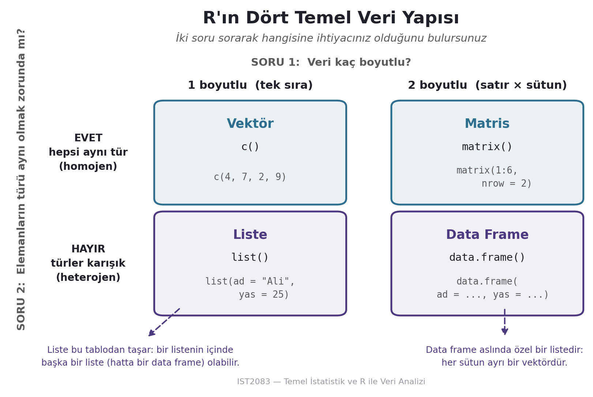

🎯 Öğrenme Hedefleri

Bu haftanın sonunda öğrenciler:

-   R’daki temel veri türlerini (numeric, character, logical) tanımlayabilecek,

-   Basit matematiksel ve mantıksal işlemleri uygulayabilecek,

-   Yerleşik fonksiyonların (sum(), mean(), length(), vb.) kullanımını kavrayabilecek,

-   Vektör, liste, matris ve data frame gibi basit veri yapıları ile çalışabilecek,

-   Bir CSV dosyasını R’a aktarıp inceleyebilecek.

# 1. Değişkenler ve Veri Türleri

R dilinde, verileri saklamak ve işlemek için değişkenler kullanılır. Değişkenler, belirli bir değeri tutar ve bu değer üzerinde işlemler yapmanıza olanak tanır.

Değişken Tanımlama (\<- Operatörü) R’da bir değişken tanımlamak için \<- operatörü kullanılır. Bu operatör, sağdaki değeri soldaki değişkene atar.

```{r}
x <- 10   # x değişkenine 10 değerini atar
y <- "Merhaba"   # y değişkenine bir karakter dizisi atar
```

## **R'da Veri Türleri**

R’da değişkenlerin farklı veri türleri olabilir. R’ın sık kullanılan veri türleri şunlardır:

-   **Sayısal (Numeric)**: Ondalıklı veya tam sayı olarak saklanan sayılar.

    ```{r}
    a <- 5.7 # Ondalıklı bir sayısal veri 
    b <- 10 # Tam sayı olarak bir sayısal veri
    ```

-   **Karakter (Character)**: Metin veya harf dizisi olarak saklanan veriler.

    ```{r}
    metin <- "R programlama dili" # Karakter veri türünde bir veri
    ```

    ::: callout-warning
    ## Değişken adı seçerken dikkat

    R, bir değişkene `c`, `data`, `sum`, `mean` gibi **yerleşik fonksiyon
    adları** vermenizi engellemez. `c <- "metin"` yazmak hata üretmez, ama
    kodunuzu okuyan (ve birkaç hafta sonra sizin de olacağınız) kişi için
    ciddi bir kafa karışıklığı kaynağıdır. Kural: **değişken adları
    fonksiyon adlarıyla çakışmasın.**
    :::

-   **Mantıksal (Logical)**: TRUE veya FALSE değerlerini saklayan değişkenler.

    ```{r}
    durum <- TRUE   # Logical
    ```

## Değişkenlerle Matematiksel İşlemler

Sayısal veri türüne sahip değişkenlerde matematiksel işlemler yapabilirsiniz. Örneğin:

```{r}
a <- 5 
b <- 3
```

**Toplama**

```{r}
toplam <- a + b 
print(toplam) # Çıktı: 8
```

**Çıkarma**

```{r}
cikarma <- a - b 
print(cikarma) # Çıktı: 2
```

**Çarpma**

```{r}
a*b # Çıktı: 15
```

**Bölme**

```{r}
bolme <- a / b 
print(bolme) # Çıktı: 1.666667
```

**Üs Alma**

```{r}
us <- a^b 
print(us) # Çıktı: 125
```

# 2. R'da Temel Fonksiyonlar

R programlama dilinde temel fonksiyonlar, veri analizi ve istatistiksel hesaplamalar için yaygın olarak kullanılır. İşte bazı temel fonksiyonlar ve örnek kullanımları:

R’ın Yerleşik Fonksiyonları Yerleşik fonksiyonlar, R dilinin varsayılan olarak sunduğu işlevlerdir. Örneğin, mean() fonksiyonu bir vektörün ortalamasını hesaplar, sum() toplamını verir ve length() bir vektörün kaç eleman içerdiğini gösterir.

Örnekler:

1.  print() Bir nesneyi konsola yazdırır.

    ```{r}
    print("Merhaba Dünya")
    ```

<!-- -->

2.  sum(): Bir vektörün elemanlarının toplamını hesaplar.

    ```{r}
     toplam <- sum(c(1, 2, 3, 4, 5))
    ```

3.  mean(): Bir vektörün elemanlarının ortalamasını hesaplar.

    ```{r}
    ortalama <- mean(c(1, 2, 3, 4, 5))
    ```

4.  sd(): Bir vektörün standart sapmasını hesaplar.

    ```{r}
    standart_sapma <- sd(c(1, 2, 3, 4, 5))
    ```

5.  length(): Bir vektörün uzunluğunu döndürür.

    ```{r}
    uzunluk <- length(c(1, 2, 3, 4, 5))
    ```

6.  seq(): Belirli bir aralıkta ardışık sayılar oluşturur.

    ```{r}
    dizi <- seq(1, 10, by=2)
    ```

7.  rep(): Bir değeri belirli sayıda tekrar eder

    ```{r}
    tekrar <- rep(1, times=5)
    ```

8.  c(): Vektör oluşturur.

    ```{r}
    vektor <- c(1, 2, 3, 4, 5)
    ```

9.  data.frame(): Veri çerçevesi oluşturur.

    ```{r}
    veri <- data.frame( isim = c("Ali", "Ayşe", "Fatma"), yas = c(25, 30, 35) )
    ```

10. summary(): Bir nesnenin özet istatistiklerini döndürür.

    ```{r}
    ozet <- summary(c(1, 2, 3, 4, 5))
    ```

## Parametrelerle Fonksiyon Kullanımı

Fonksiyonlar, belirli bir işlevi gerçekleştirmek için parametre alabilir. Parametreler, fonksiyonun nasıl çalışacağını belirler. Örneğin, mean() fonksiyonuna na.rm = TRUE parametresi eklenerek eksik değerleri göz ardı edebilirsiniz.

```{r}
sayilar <- c(10, 20, NA, 40, 50)
ortalama <- mean(sayilar, na.rm = TRUE)   # NA değerini göz ardı ederek ortalama hesaplar
```

## Fonksiyon Oluşturma

R dilinde kendi fonksiyonlarınızı oluşturmak oldukça basittir. Fonksiyonlar, belirli bir işlevi gerçekleştirmek için bir dizi komut içerir ve gerektiğinde parametreler alabilir. Fonksiyonlar, function anahtar kelimesi kullanılarak tanımlanır.

Fonksiyon Oluşturma Bir fonksiyon oluşturmak için aşağıdaki adımları izleyebilirsiniz:

-   function anahtar kelimesini kullanarak fonksiyonunuzu tanımlayın.
-   Fonksiyonun alacağı parametreleri parantez içinde belirtin.
-   Fonksiyonun gövdesinde, fonksiyonun gerçekleştireceği işlemleri yazın.
-   return() fonksiyonunu kullanarak fonksiyonun döndüreceği değeri belirtin (isteğe bağlı).

```{r}
# Toplama fonksiyonu oluşturma
topla <- function(a, b) {
  sonuc <- a + b
  return(sonuc)
}

# Fonksiyonu çağırma
toplam <- topla(5, 3)
print(toplam)  # 8
```

## R Fonksiyonları İçin Yardım Alma ( ? ve help() Komutları)

Bir R fonksiyonu hakkında bilgi almak için ? veya help() komutlarını kullanabilirsiniz. Bu komutlar, ilgili fonksiyonun nasıl kullanılacağı ve parametrelerinin ne olduğu hakkında detaylı bilgi verir.

**Örnekler**:

```{r}
#| eval: false
?mean      # mean() fonksiyonu hakkında yardım alır
help(sum)  # sum() fonksiyonu hakkında yardım alır
```

Bu komutlar, fonksiyonun açıklamasını, hangi argümanları kabul ettiğini ve nasıl çalıştırılacağını gösteren bir dokümantasyon penceresi açar.

## Belgeleme ve Fonksiyonların Anlamı

R’ın tüm fonksiyonlarının nasıl çalıştığını, örnekler ve açıklamalarla birlikte görebilirsiniz. R'da her fonksiyonun geniş bir açıklaması bulunur ve bu belgeleme, fonksiyonların nasıl kullanılacağını öğrenmenin etkili bir yoludur.

**Örnek**:

```{r}
#| eval: false
help(mean)  # Ortalama hesaplayan mean() fonksiyonunu anlamak için yardım alabiliriz
```

# 3. Basit Veri Yapıları

R dilinde, veriler çeşitli veri yapıları kullanılarak organize edilir. Temel veri yapıları, vektörler, listeler ve matrislerdir.

## Vektörler

R dilinde en temel veri yapılarından biri vektörlerdir. Vektörler, aynı veri türüne sahip bir dizi elemanı saklar. Vektör oluşturmak için c() fonksiyonu kullanılır.

```{r}
# Sayısal vektör oluşturma
numeric_vector <- c(1, 2, 3, 4, 5)

# Karakter vektör oluşturma
character_vector <- c("a", "b", "c", "d")

# Mantıksal vektör oluşturma
logical_vector <- c(TRUE, FALSE, TRUE)

# Vektör elemanlarına erişim
print(numeric_vector[1])  # 1
print(character_vector[3])  # "c"

# Vektör elemanlarını güncelleme
numeric_vector[2] <- 10

# Vektör toplama
sum_vector <- numeric_vector + c(1, 1, 1, 1, 1)

# Vektör elemanlarının toplamı
total_sum <- sum(numeric_vector)

# Güncellenmiş vektörleri yazdırma
print(numeric_vector)
print(sum_vector)
print(total_sum)
```

## Mantıksal İndeksleme

Yukarıda vektör elemanlarına **konumlarına** göre eriştik: `vektor[2]`
"ikinci elemanı ver" demektir. Ama gerçek veri analizinde soru neredeyse
hiç böyle sorulmaz. "Beşinci ülkenin nüfusu nedir?" diye sormayız;
"nüfusu 50 milyondan **büyük olan** ülkeler hangileridir?" diye sorarız.

Bunun için R'da köşeli parantezin içine bir konum numarası değil, bir
**mantıksal ifade** yazarız.

### Adım 1: Karşılaştırma bir mantıksal vektör üretir

```{r}
sayilar <- c(4, 7, 2, 9, 5)
sayilar > 5
```

Dikkat edin: çıktı bir sayı değil, `sayilar` ile **aynı uzunlukta** bir
`TRUE`/`FALSE` vektörüdür. Her eleman için "bu koşulu sağlıyor mu?"
sorusunun cevabıdır.

### Adım 2: Bu maskeyi indeks olarak kullanırız

```{r}
sayilar[sayilar > 5]
```

R, `TRUE` olan konumlardaki elemanları tutar, `FALSE` olanları atar. Bu
işleme **mantıksal indeksleme** (İng. *logical subsetting*) ya da
**maskeleme** denir.

Koşulları 1. haftada gördüğünüz `&` (ve), `|` (veya), `!` (değil)
operatörleriyle birleştirebilirsiniz:

```{r}
sayilar[sayilar > 3 & sayilar < 9]   # 3'ten büyük VE 9'dan küçük
sayilar[!(sayilar == 2)]             # 2'ye eşit OLMAYANLAR
```

::: callout-tip
## Sık yapılan hata: `=` ile `==` karışıklığı

`sayilar[sayilar = 5]` **hata verir**. Eşitliği sınamak için daima çift
eşittir (`==`) kullanın; tek eşittir (`=`) atama içindir.
:::

## Listeler

Listeler, farklı türdeki verileri bir arada saklayabilen veri yapılarıdır. Bir liste içinde sayılar, karakterler, mantıksal değerler ve hatta başka vektörler bulunabilir.

```{r}
# Liste oluşturma
my_list <- list(number = 5, greeting = "Hello", flag = TRUE, numbers = c(1, 2, 3))

# Liste elemanlarına erişim
print(my_list$number)  # 5
print(my_list$greeting)  # "Hello"
print(my_list$flag)  # TRUE
print(my_list$numbers)  # c(1, 2, 3)

# Liste elemanlarını güncelleme
my_list$number <- 10
my_list$greeting <- "Hi"

# Listeye yeni eleman ekleme
my_list$new_element <- "New Element"

# Liste elemanlarını silme
my_list$new_element <- NULL

# Güncellenmiş listeyi yazdırma
print(my_list)
```

## Matrisler

Matrisler, satırlar ve sütunlar şeklinde organize edilmiş sayısal veri yapılarıdır. Tüm elemanlar aynı türde olmalıdır.

```{r}
# 2x3 boyutunda bir matris oluşturma
my_matrix <- matrix(1:6, nrow = 2, ncol = 3)

# Matris elemanlarına erişim
print(my_matrix[1, 2])  # 3
print(my_matrix[2, ])  # c(4, 5, 6)
print(my_matrix[, 3])  # c(5, 6)

# Matris elemanlarını güncelleme
my_matrix[1, 2] <- 10

# Matris toplama
matrix1 <- matrix(1:4, nrow = 2)
matrix2 <- matrix(5:8, nrow = 2)
sum_matrix <- matrix1 + matrix2

# Matris çarpma
product_matrix <- matrix1 %*% matrix2

# Güncellenmiş matrisleri yazdırma
print(my_matrix)
print(sum_matrix)
print(product_matrix)
```

## Data Frameler

Data frameler, R dilinde kullanılan ve farklı veri türlerine sahip sütunları içerebilen iki boyutlu veri yapılarıdır. Data frameler, genellikle tablo şeklinde verileri saklamak için kullanılır ve her sütun bir vektör olarak temsil edilir. Data frameler, data.frame() fonksiyonu kullanılarak oluşturulur.

```{r}
# Data frame oluşturma
my_data_frame <- data.frame(
  numbers = c(1, 2, 3, 4, 5),
  letters = c("a", "b", "c", "d", "e"),
  logicals = c(TRUE, FALSE, TRUE, FALSE, TRUE)
)

# Data frame elemanlarına erişim
print(my_data_frame[1, 2])  # "a"
print(my_data_frame[2, ])  # tek satırlık bir data frame (vektör değil!)
print(my_data_frame[, 3])  # c(TRUE, FALSE, TRUE, FALSE, TRUE)
print(my_data_frame$numbers)  # c(1, 2, 3, 4, 5)

# Data frame elemanlarını güncelleme
my_data_frame[1, 2] <- "z"
my_data_frame$numbers[2] <- 10

# Mantıksal indekslemeyi satır filtrelemek için kullanma
# Virgülden ÖNCESİ satırları, SONRASI sütunları seçer:
my_data_frame[my_data_frame$numbers > 2, ]

# Yeni bir sütun ekleme
my_data_frame$new_column <- c(10, 20, 30, 40, 50)

# Satır ekleme
new_row <- data.frame(numbers = 6, letters = "f", logicals = FALSE, new_column = 60)
my_data_frame <- rbind(my_data_frame, new_row)

# Sütun ekleme
new_column <- c(100, 200, 300, 400, 500, 600)
my_data_frame <- cbind(my_data_frame, new_column)

# Güncellenmiş data frame'i yazdırma
print(my_data_frame)
```

## Dördünü Birlikte Görmek

Bu dört yapıyı ezberlemenize gerek yok. Elinizdeki veriye **iki soru**
sorarsanız hangisine ihtiyacınız olduğunu kendiniz bulursunuz: veri kaç
boyutlu, ve elemanların türü aynı olmak zorunda mı?

{width=95%}

Şemanın altındaki iki not önemlidir. **Liste bu tablodan taşar:** bir
listenin elemanı yine bir liste olabilir, bu yüzden aslında iki boyutlu
bir tabloya tam oturmaz — R'ın en esnek yapısıdır. **Data frame ise
aslında özel bir listedir:** her sütunu bir vektör olan, tüm sütunları
eşit uzunlukta olmak zorunda olan bir liste. Bu yüzden hem `df$sutun`
(liste sözdizimi) hem `df[1, 2]` (tablo sözdizimi) çalışır.

::: callout-note
## 3. haftaya köprü

`my_data_frame[my_data_frame$numbers > 2, ]` yazımı doğru ama hantaldır:
veri çerçevesinin adını iki kez tekrarlamak zorunda kalırsınız. 3.
haftada `dplyr` paketini öğrendiğinizde aynı işi
`filter(my_data_frame, numbers > 2)` biçiminde yazacaksınız. `dplyr`'ın
yaptığı sihir bu değildir — **taban R'da zaten var olan bu mantığı**
okunabilir hale getirmesidir. Bu yüzden önce burayı öğreniyoruz.
:::

# 4. Veri İçe Aktarma ve Kaydetme

Veri içe aktarma ve temel manipülasyon, veri analizi sürecinin önemli adımlarıdır. R dilinde veri içe aktarma ve temel manipülasyon işlemleri için çeşitli fonksiyonlar ve paketler kullanılır.

## Veri İçe Aktarma

R dilinde veri içe aktarmak için read.csv(), read.table(), read_excel() gibi fonksiyonlar kullanılır.

```{r}
# CSV dosyasını içe aktarma (doğrudan bir internet adresinden)
titanic <- read.csv("https://raw.githubusercontent.com/datasciencedojo/datasets/refs/heads/master/titanic.csv")
```

```{r}
# readxl paketini yükleme
# install.packages("readxl")
library(readxl)
library(here)

# Excel dosyasını içe aktarma (depo içindeki data/ klasöründen)
ornek <- read_excel(here("data", "sample_excel.xlsx"))
```

## Veri Kaydetme

R dilinde veri kaydetmek için çeşitli fonksiyonlar kullanabilirsiniz. En yaygın kullanılan dosya formatları arasında CSV, Excel ve RDS dosyaları bulunur.

**CSV Dosyasına Veri Kaydetme** Veri çerçevesini CSV dosyasına kaydetmek için write.csv() fonksiyonunu kullanabilirsiniz:

```{r}
# Veri çerçevesini CSV dosyasına kaydetme
# write.csv(data, "path/to/your/file.csv", row.names = FALSE)
```

**Excel Dosyasına Veri Kaydetme** Excel dosyasına veri kaydetmek için writexl paketini kullanabilirsiniz:

```{r}
# writexl paketini yükleme
# install.packages("writexl")
# library(writexl)

# Veri çerçevesini Excel dosyasına kaydetme
# write_xlsx(data, "path/to/your/file.xlsx")
```

## Veri Yapısını İnceleme

Veri inceleme, veri analizi sürecinin önemli bir parçasıdır. R dilinde veri incelemek için çeşitli fonksiyonlar ve paketler kullanabilirsiniz. Bu işlemler arasında veri yapısını kontrol etme, özet istatistikler oluşturma ve veri görselleştirme gibi işlemler bulunur. Veri yapısını incelemek için str(), summary(), head(), ve tail() fonksiyonlarını kullanabilirsiniz.

```{r}
# Veri yapısını kontrol etme: kaç satır, kaç sütun, her sütun hangi türde?
str(titanic)

# Sayısal sütunlar için özet istatistikler
summary(titanic)

# İlk birkaç satırı görüntüleme
head(titanic)

# Son birkaç satırı görüntüleme
tail(titanic)
```

::: callout-note
📚 Ek Kaynak olarak RStudio Cheat Sheet: Base R'a bakmayı unutma!
:::
