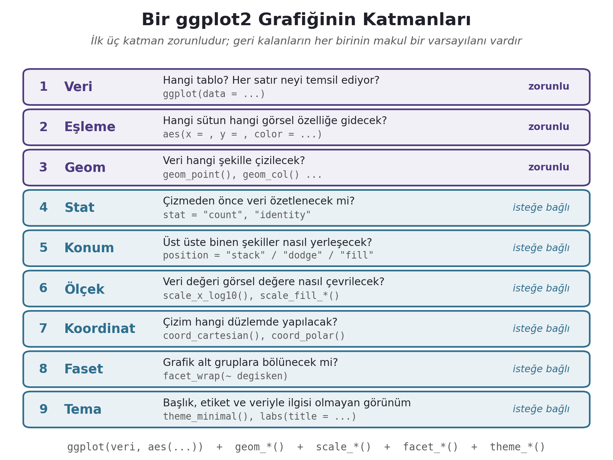

```{r}
#| label: setup
#| include: false
library(ggplot2)
library(dplyr)
library(gapminder)
library(here)

set.seed(2083)  # geom_jitter() her render'da aynı sonucu versin
```

## Öğrenme Çıktıları

Bu oturumun sonunda:

-   Bir grafiğin neden özet istatistiklerin göremediği şeyleri gösterdiğini bir örnekle açıklarsınız.
-   Bir `ggplot2` kodunu **katman katman** okuyabilir; veri, eşleme ve geom katmanlarını ayırt edersiniz.
-   Bir görsel özelliğin **veriye eşlenmesi** (`aes()` içinde) ile **sabit olarak ayarlanması** (`aes()` dışında) arasındaki farkı bilir, bu farktan doğan hataları tanırsınız.
-   Değişkenlerin türüne göre uygun grafiği seçersiniz: tek sayısal, tek kategorik, iki sayısal, sayısal × kategorik, kategorik × kategorik ve zaman.
-   Log ölçeğin ne zaman gerektiğini, fasetin ne zaman renkten iyi olduğunu ve üçüncü bir değişkenin bir ilişkiyi nasıl tersine çevirebileceğini gösterirsiniz.
-   Bir grafiği başkası için hazırlarsınız: başlık, eksen adı, kaynak künyesi, renk körlüğüne uygun palet ve dosyaya kaydetme.

::: callout-note
## Bu belge neyi bildiğinizi varsayıyor?

3. oturumda `dplyr` ile gördüğünüz `filter()`, `mutate()`, `count()`, `group_by()` + `summarise()` fiillerini ve `|>` borusunu (pipe) bildiğinizi varsayıyoruz. Bu belgedeki veri hazırlama adımlarının hepsi bu fiillerle yazılmıştır; yeni bir veri işleme fonksiyonu öğretilmez.
:::

------------------------------------------------------------------------

# 1. Neden Veriye Bakmalıyız?

1. oturumda aynı iki sayıyı (%38 ve %41) iki farklı eksenle çizmiş ve birinin "baş başa bir yarış", ötekinin "ezici bir fark" gibi göründüğünü görmüştük. O örnek, grafiğin **yanıltabileceğini** gösteriyordu. Bu bölüm tersini gösteriyor: grafiğe bakmamak da yanıltır.

İstatistikçi Francis Anscombe 1973'te dört küçük veri seti yayımladı. Her birinde 11 gözlem ve iki değişken ($x$, $y$) vardır. R bu veriyi `anscombe` adıyla hazır getirir. Önce dört seti uzun biçimde tek bir tabloya toplayalım, sonra her grubun özet istatistiklerine bakalım:

```{r}
anscombe_uzun <- data.frame(
  grup = rep(paste("Set", 1:4), each = 11),
  x    = c(anscombe$x1, anscombe$x2, anscombe$x3, anscombe$x4),
  y    = c(anscombe$y1, anscombe$y2, anscombe$y3, anscombe$y4)
)

anscombe_uzun |>
  group_by(grup) |>
  summarise(
    ort_x    = mean(x),
    ort_y    = round(mean(y), 2),
    ss_y     = round(sd(y), 2),
    korelasyon = round(cor(x, y), 2)
  )
```

Dört setin ortalamaları, standart sapmaları ve korelasyonları **virgülden sonra ikinci haneye kadar aynıdır.** Yalnızca bu tabloya bakan biri, dört setin aynı ilişkiyi anlattığı sonucuna varır. Şimdi çizelim:

```{r}
#| fig-height: 4.6
ggplot(anscombe_uzun, aes(x = x, y = y)) +
  geom_point(size = 2) +
  geom_smooth(method = "lm", formula = y ~ x, se = FALSE, color = "grey50") +
  facet_wrap(~ grup) +
  labs(title = "Anscombe dörtlüsü: aynı özet, dört farklı ilişki")
```

Set 1 gerçekten doğrusal ve gürültülü bir ilişkidir. Set 2 doğrusal değil, eğridir. Set 3'te tek bir aykırı gözlem, aksi hâlde kusursuz olan doğruyu yamultur. Set 4'te ise tek bir uç nokta olmasa $x$ ile $y$ arasında hiçbir ilişki olmazdı; korelasyonun tamamını o tek nokta üretir.

::: callout-important
## Bu oturumun ana fikri

Bir özet istatistik, veriyi **tek bir sayıya** sıkıştırır ve bu sıkıştırma sırasında bilgi kaybolur. Grafik, hangi bilginin kaybolduğunu gösterir. Bu yüzden iyi bir analizde sıra şudur: **önce çiz, sonra özetle, sonra test et.** 5. oturumdaki tanımlayıcı istatistiklerin ve 10. oturumdaki korelasyonun her birine bu dört setin gölgesi düşer.
:::

------------------------------------------------------------------------

# 2. Grafiklerin Dilbilgisi

`ggplot2`'deki "gg", *grammar of graphics*, yani **grafiklerin dilbilgisi** demektir. Fikir, Leland Wilkinson'ın aynı adlı kitabından gelir; Hadley Wickham bu fikri R'da katmanlı bir sisteme dönüştürmüştür. Temel iddia şudur: her istatistiksel grafik, birkaç bağımsız bileşenin birleşimidir. "Çubuk grafiği", "dağılım grafiği" gibi adlar ayrı ayrı ezberlenecek şeyler değildir; aynı bileşenlerin farklı birleşimleridir.

{width="92%"}

Her grafik için gereken asgari şablon üç katmandan oluşur:

``` r
ggplot(data = <VERİ>, mapping = aes(<EŞLEMELER>)) +
  <GEOM_FONKSİYONU>()
```

-   **Veri:** Bir veri çerçevesi. Her satır bir gözlemdir. Grafiği çizmeden önce sormanız gereken ilk soru şudur: **bir satır neyi temsil ediyor?** Bir ülkeyi mi, bir ülke-yılı mı, bir seçmeni mi?
-   **Eşleme** (*aesthetic mapping*): Veri çerçevesindeki hangi sütunun grafikteki hangi görsel özelliğe (yatay konum, dikey konum, renk, boyut, şekil) gideceğini söyler. `aes()` fonksiyonunun içine yazılır.
-   **Geom** (*geometric object*): Verinin hangi şekille çizileceğini söyler: nokta (`geom_point`), çubuk (`geom_col`, `geom_bar`), çizgi (`geom_line`), kutu (`geom_boxplot`).

Katmanlar `+` işaretiyle eklenir. **`+` her zaman satırın sonunda durur**, bir sonraki satırın başında değil. R, satır sonunda `+` görürse ifadenin devam ettiğini anlar; görmezse ifadeyi orada bitirir.

## 2.1 Bir grafiği adım adım kurmak

Ders boyunca kullandığımız `gapminder` verisinden yalnızca 2007 yılını alalım. Her satır bir **ülke** olacak:

```{r}
gapminder_2007 <- gapminder |> filter(year == 2007)
nrow(gapminder_2007)
```

**Adım 1 — Yalnızca veri.** `ggplot()` bir tuval açar ama neyi nereye çizeceğini bilmediği için boş bir gri alan üretir:

```{r}
#| fig-height: 2.2
ggplot(data = gapminder_2007)
```

**Adım 2 — Veri + eşleme.** Artık hangi sütunun hangi eksene gideceğini biliyor; eksenleri ve ölçeklerini çizer. Ama henüz şekil yok:

```{r}
#| fig-height: 2.6
ggplot(data = gapminder_2007, mapping = aes(x = gdpPercap, y = lifeExp))
```

**Adım 3 — Veri + eşleme + geom.** Her ülke bir nokta olarak çizilir:

```{r}
ggplot(data = gapminder_2007, mapping = aes(x = gdpPercap, y = lifeExp)) +
  geom_point()
```

Bundan sonra `data =` ve `mapping =` argüman adlarını yazmayacağız: `ggplot()` için ilk argüman veri, ikincisi eşlemedir. `ggplot(gapminder_2007, aes(x = gdpPercap, y = lifeExp))` aynı şeyi söyler.

Grafiğin kendisi de şimdiden bir şey anlatıyor: kişi başı gelir arttıkça yaşam beklentisi önce çok hızlı yükseliyor, sonra düzleşiyor. Bu eğrinin **neden** böyle göründüğüne 9. bölümde, ölçekleri öğrendiğimizde döneceğiz.

------------------------------------------------------------------------

# 3. Eşleme mi, Sabit Ayar mı?

Bu bölüm oturumun en önemli bölümüdür; ggplot2'de yapılan hataların büyük çoğunluğu buradaki ayrımın karıştırılmasından doğar.

Bir görsel özelliği (örneğin rengi) iki farklı biçimde verebilirsiniz:

-   **Eşleme** — rengin **veriye göre değişmesini** istiyorsanız, sütun adını `aes()` **içine** yazarsınız. ggplot2 her kategoriye bir renk atar ve bir **lejant** (açıklama kutusu) ekler.
-   **Sabit ayar** — tüm noktaların **aynı renkte** olmasını istiyorsanız, renk adını `aes()` **dışına**, geom fonksiyonunun argümanı olarak yazarsınız. Lejant oluşmaz, çünkü açıklanacak bir fark yoktur.

```{r}
#| layout-ncol: 2
#| fig-width: 4.2
#| fig-height: 3
# Eşleme: renk kıtaya göre değişir
ggplot(gapminder_2007, aes(x = gdpPercap, y = lifeExp, color = continent)) +
  geom_point()

# Sabit ayar: tüm noktalar aynı renk
ggplot(gapminder_2007, aes(x = gdpPercap, y = lifeExp)) +
  geom_point(color = "steelblue")
```

::: callout-tip
## Tek cümlelik kural

**Veriye bağlı olan her şey `aes()` içine; herkese aynı uygulanan her şey `aes()` dışına.**
:::

## 3.1 İki yaygın hata

**Hata 1: Sabit bir değeri `aes()` içine yazmak.** Aşağıdaki kodu yazan kişi noktaların mavi olmasını istiyor:

```{r}
#| fig-height: 3
ggplot(gapminder_2007, aes(x = gdpPercap, y = lifeExp, color = "blue")) +
  geom_point()
```

Noktalar mavi değil, pembemsi turuncu çıktı ve sağda "blue" yazan bir lejant belirdi. Neden? `aes()` içindeki her şeyi ggplot2 **veri** olarak yorumlar. `"blue"` kelimesi burada bir renk adı değil, bütün satırlarda aynı değeri taşıyan tek kategorili bir değişkendir. ggplot2 bu tek kategoriye kendi varsayılan paletinin ilk rengini atamış ve kategorinin adını ("blue") lejanta yazmıştır.

**Hata 2: Saydamlığı `aes()` içine yazmak.** Aynı hata saydamlık (`alpha`) ve boyut (`size`) için de yapılır ve daha sinsidir, çünkü sonuç ilk bakışta doğru görünür:

```{r}
#| layout-ncol: 2
#| fig-width: 4.2
#| fig-height: 3
# Yanlış: 0.5 bir "değişken" gibi eşlenir, anlamsız bir lejant çıkar
ggplot(gapminder_2007, aes(x = gdpPercap, y = lifeExp, alpha = 0.5)) +
  geom_point()

# Doğru: saydamlık sabit bir ayardır
ggplot(gapminder_2007, aes(x = gdpPercap, y = lifeExp)) +
  geom_point(alpha = 0.5)
```

Soldaki grafikte noktaların saydamlığı sizin istediğiniz 0,5 **değildir**: ggplot2 tek değerli "değişkene" kendi saydamlık ölçeğinin ortasından bir değer (0,55) atamış ve "0.5" diye anlamsız bir lejant eklemiştir. Başka bir değer yazsanız da (0,1 ya da 0,9) sonuç değişmez, çünkü tek değerli bir değişken ölçeğin hep aynı noktasına düşer. Grafikte gereksiz bir lejant görüyorsanız, ilk şüphelenmeniz gereken yer `aes()` içidir.

## 3.2 Hangi özellik hangi tür değişkene?

| Görsel özellik | `aes()` adı | Sayısal değişkenle | Kategorik değişkenle |
|------------------|------------------|------------------|------------------|
| Yatay / dikey konum | `x`, `y` | Evet | Evet |
| Renk (nokta, çizgi) | `color` | Evet — renk geçişi | Evet — ayrı renkler |
| Dolgu rengi (çubuk, kutu, alan) | `fill` | Evet — renk geçişi | Evet — ayrı renkler |
| Boyut | `size` | Evet | Uygun değil |
| Şekil | `shape` | **Hayır** | Evet (en fazla 6 kategori) |
| Çizgi tipi | `linetype` | **Hayır** | Evet |
| Saydamlık | `alpha` | Evet | Nadiren |
| Gruplama | `group` | — | Evet (bkz. 8. bölüm) |

Aynı özellikler **sabit ayar** olarak da verilebilir: `color = "firebrick"`, `size = 2`, `shape = 17`, `alpha = 0.3`, `linewidth = 1` (çizgi kalınlığı).

Hangi görsel özellikleri seçeceğinizi yalnızca teknik uygunluk belirlemez. Cleveland ve McGill'in (1984) deneyleri, insanların farklı görsel özellikleri **farklı doğrulukta** okuduğunu göstermiştir. En doğru okunan, ortak bir eksen üzerindeki **konumdur**; onu uzunluk, sonra açı ve eğim, en son da alan, hacim ve renk tonu izler. Bu yüzden karşılaştırmak istediğiniz en önemli değişkeni daima `x` veya `y`'ye verin; renk ve boyutu ikincil bilgiler için saklayın. Pasta grafiklerinin önerilmemesinin nedeni de budur: pasta grafiği karşılaştırmayı **açıya** yükler, çubuk grafiği ise **uzunluğa**.

------------------------------------------------------------------------

# 4. Tek Değişkenin Dağılımı

Bir değişkenin **dağılımı**, hangi değerleri ne sıklıkla aldığıdır. Tek bir değişkene bakarken kullanacağınız grafik, değişkenin türüne bağlıdır.

## 4.1 Sayısal değişken: histogram

Histogram, sayısal ekseni eşit genişlikte **aralıklara** (*bin*) böler ve her aralığa düşen gözlem sayısını bir çubukla gösterir. 2007'de ülkelerin yaşam beklentisi:

```{r}
ggplot(gapminder_2007, aes(x = lifeExp)) +
  geom_histogram(binwidth = 5, fill = "grey70", color = "white") +
  labs(x = "Yaşam beklentisi (yıl)", y = "Ülke sayısı")
```

**Nasıl okunur?** Dikey eksen "kaç **ülke**" diyor, çünkü veride her satır bir ülke. (Kaç **kişi** değil — bu ayrım, 1. oturumda sorduğumuz "bir satır neyi temsil ediyor?" sorusunun ta kendisidir.) Dağılım simetrik değil: ülkelerin çoğu 70–80 yıl bandında toplanmış, ama sol tarafta 40–55 yıl aralığında ikinci, daha küçük bir yığılma var. Bu, dünyanın 2007'de tek bir dağılım değil, **iki ayrı grup** gibi davrandığını düşündürür. Bu gözlemin arkasında ne olduğunu 6. bölümde, kıtalara göre ayırdığımızda göreceğiz.

**Aralık genişliği bir karardır.** `binwidth`, her çubuğun kaç birim genişlikte olacağını belirler ve histogramın anlattığı hikâyeyi değiştirebilir:

```{r}
#| layout-ncol: 2
#| fig-width: 4.2
#| fig-height: 2.8
ggplot(gapminder_2007, aes(x = lifeExp)) +
  geom_histogram(binwidth = 1, fill = "grey70", color = "white") +
  labs(title = "binwidth = 1", x = "Yaşam beklentisi", y = "Ülke sayısı")

ggplot(gapminder_2007, aes(x = lifeExp)) +
  geom_histogram(binwidth = 15, fill = "grey70", color = "white") +
  labs(title = "binwidth = 15", x = "Yaşam beklentisi", y = "Ülke sayısı")
```

Çok dar aralıklar (solda) gürültüyü büyütür: her çubuk birkaç ülkeden ibarettir ve rastlantısal inişli çıkışlı bir desen çıkar. Çok geniş aralıklar (sağda) ise yapıyı siler: iki grup ayrımı kaybolur. Evrensel olarak doğru bir genişlik yoktur; birkaç değer deneyip verinin yapısını en dürüst gösteren değeri seçersiniz. `binwidth` vermezseniz ggplot2 veriyi 30 aralığa böler ve sizi bir mesajla uyarır. Bu mesaj, "bu kararı sizin yerinize ben verdim" demektir.

## 4.2 Sayısal değişken: yoğunluk eğrisi

Yoğunluk grafiği aynı bilgiyi aralıklar yerine **pürüzsüz bir eğriyle** gösterir. Dikey eksendeki "yoğunluk" değerleri, eğrinin altındaki toplam alan 1 olacak biçimde ölçeklenmiştir; tek tek okunmaları değil, eğrinin **biçimi** önemlidir.

```{r}
#| fig-height: 3
ggplot(gapminder_2007, aes(x = lifeExp)) +
  geom_density(fill = "grey70", color = NA) +
  labs(x = "Yaşam beklentisi (yıl)", y = "Yoğunluk")
```

Eğrinin pürüzsüzlüğünü `adjust` argümanı belirler (varsayılan 1). `adjust = 0.5` daha dalgalı, `adjust = 2` daha düz bir eğri verir: bu, histogramdaki aralık genişliği kararının karşılığıdır.

## 4.3 Sayısal değişken: kutu grafiğinin okunuşu

Kutu grafiği (*box plot*) bir dağılımı beş öğeyle özetler. Bu oturumda kutu grafiğini **okumayı** öğreniyoruz; kutunun sınırlarını belirleyen sayıların (çeyrekler, çeyrekler açıklığı) nasıl hesaplandığını 5. oturumda tanımlayıcı istatistiklerle birlikte göreceğiz.

```{r}
#| fig-height: 2.2
ggplot(gapminder_2007, aes(x = lifeExp)) +
  geom_boxplot() +
  labs(x = "Yaşam beklentisi (yıl)", y = NULL) +
  theme(axis.text.y = element_blank(),   # dikey eksenin burada anlamı yok
        axis.ticks.y = element_blank())
```

-   **Kutunun içindeki kalın çizgi:** Ortanca (medyan). Ülkelerin yarısı bu değerin altında, yarısı üstündedir.
-   **Kutunun kendisi:** Gözlemlerin **ortadaki yarısı**. Kutu ne kadar genişse, tipik ülkeler birbirinden o kadar farklıdır.
-   **Bıyıklar:** Kutunun iki ucundan, kutu uzunluğunun 1,5 katını aşmayan **en uç gözleme** kadar uzanır. Bıyık, bir en küçük ya da en büyük değer göstergesi değildir.
-   **Tek tek noktalar:** Bıyıkların ötesinde kalan gözlemler. Bunlar "aykırı değer adayı" olarak işaretlenir; hata oldukları anlamına gelmez, **bakılması gereken** gözlemler olduklarını söyler.

Kutu grafiğinin önemli bir sınırı vardır: 4.1'deki iki gruplu yapıyı **hiç göstermez**. Kutu grafiği her dağılımı tek tepeli bir dağılım gibi özetler. Tek bir değişkene bakarken histogram daha çok şey söyler; kutu grafiğinin asıl gücü, 6. bölümde göreceğimiz gibi, **grupları yan yana karşılaştırmaktır.**

## 4.4 Kategorik değişken: çubuk grafiği

Kategorik bir değişkenin dağılımı, her kategorinin kaç kez görüldüğüdür. Bunu çizmenin iki yolu vardır ve aralarındaki fark, şemadaki dördüncü katmanın, yani **stat**'ın ne işe yaradığını gösterir.

**`geom_bar()` — satırları kendisi sayar.** Veriyi olduğu gibi verirsiniz, her kategoride kaç satır olduğunu ggplot2 hesaplar. Arka planda `stat = "count"` çalışır; bu yüzden `y` eşlemesi **verilmez**:

```{r}
#| fig-height: 3
ggplot(gapminder_2007, aes(x = continent)) +
  geom_bar() +
  labs(x = NULL, y = "Ülke sayısı")
```

**`geom_col()` — hazır sayıyı çizer.** Sayımı önceden kendiniz yaptıysanız (ya da çizmek istediğiniz değer bir sayım değil de bir ortalama, oran veya toplamsa), çubuğun yüksekliğini `y` ile verirsiniz. Arka planda `stat = "identity"` çalışır: "değeri olduğu gibi kullan."

```{r}
kita_sayilari <- gapminder_2007 |> count(continent)
kita_sayilari
```

```{r}
#| fig-height: 3
ggplot(kita_sayilari, aes(x = continent, y = n)) +
  geom_col() +
  labs(x = NULL, y = "Ülke sayısı")
```

İki grafik aynıdır. Hangisini seçeceğinizi, elinizdeki verinin **ham** mı yoksa **özetlenmiş** mi olduğu belirler. İkisini karıştırırsanız R sizi durdurur:

```{r}
#| error: true
ggplot(kita_sayilari, aes(x = continent, y = n)) +
  geom_bar()
```

Hata mesajı, `geom_bar()`'ın arka plandaki sayma işleminin (`stat_count`) bir `y` eşlemesi kabul etmediğini söylüyor: `y`'yi kendisi hesaplayacaktır. Çözüm ya `y`'yi kaldırmak ya da `geom_col()` kullanmaktır.

::: callout-note
## Kategorileri sıralamak

Kategorik bir eksende çubuklar varsayılan olarak **alfabetik** sıralanır. Kategoriler arasında doğal bir sıra yoksa (kıtalar, partiler, ülkeler), çubukları değere göre sıralamak okumayı çok kolaylaştırır: `aes(x = reorder(continent, n), y = n)`. `reorder(kategori, deger)` ifadesi, kategorileri değerin küçükten büyüğe sırasına dizer. Doğal bir sıra varsa (anket cevapları, eğitim düzeyi), o sıra korunmalıdır; bunu 7. bölümde göreceğiz.
:::

------------------------------------------------------------------------

# 5. İki Sayısal Değişken: Dağılım Grafiği

İki sayısal değişken arasındaki ilişkiyi göstermenin temel aracı **dağılım grafiğidir** (*scatter plot*): her gözlem, yatay konumu bir değişkene, dikey konumu diğerine karşılık gelen bir noktadır.

## 5.1 Bir siyaset bilimi yasası: Gamson Yasası

Sosyolog William Gamson 1961'de koalisyon hükümetleri hakkında bir öngörüde bulundu: bir koalisyona katılan partiler, kabinedeki bakanlıkları koalisyona **getirdikleri sandalye oranında** paylaşır. %30 sandalye getiren parti bakanlıkların %30'unu alır. Bu öngörü, siyaset biliminin en tutarlı ampirik bulgularından biri olarak bilinir ve "Gamson Yasası" diye anılır.

Depodaki `gamson.csv` dosyası bunu sınamamızı sağlıyor. Her satır, bir koalisyon hükümetindeki **bir partidir.** İki sütun var: partinin koalisyon içindeki sandalye payı (`seat_share`) ve kabinedeki bakanlık payı (`portfolio_share`). Bu veri, Kosuke Imai'nin *Quantitative Social Science* kitabında da kullanılır; asıl kaynağı Carroll ve Cox'un (2007) çalışmasıdır.

```{r}
gamson <- read.csv(here("data", "gamson.csv"))
nrow(gamson)
head(gamson)
```

```{r}
#| fig-height: 4
ggplot(gamson, aes(x = seat_share, y = portfolio_share)) +
  geom_point() +
  labs(x = "Koalisyon içindeki sandalye payı",
       y = "Kabinedeki bakanlık payı")
```

## 5.2 Aşırı çizim (*overplotting*)

826 nokta var, ama grafiğe bakınca kaç nokta olduğunu bilemezsiniz: özellikle sol alt köşede noktalar birbirinin **üstüne** biniyor. Tek bir siyah nokta bir partiyi de gösterebilir, üst üste binmiş on partiyi de. Buna **aşırı çizim** denir. Veride tamamen aynı değerleri taşıyan satırlar da var (örneğin iki partili ve sandalyeleri eşit bölünmüş koalisyonlar), bu yüzden bazı noktalar tam olarak çakışıyor.

İki çare var:

-   **Saydamlık** (`alpha`): Her nokta yarı saydam çizilir; noktaların üst üste bindiği yerler daha koyu görünür. Yoğunluk görünür hâle gelir.
-   **Titreştirme** (`geom_jitter()`): Her noktaya küçük rastgele bir kaydırma eklenir, böylece çakışan noktalar birbirinden ayrılır. Bu, verinin kendisini **değiştirir**; bu yüzden kaydırma miktarını (`width`, `height`) küçük tutarsınız ve bunu yaptığınızı okuyucuya söylersiniz.

## 5.3 Referans çizgisi: grafiği bir iddiaya karşı okumak

Gamson Yasası kesin bir sayısal öngörüde bulunuyor: bakanlık payı **eşittir** sandalye payı. Grafikte bu, 45 derecelik bir doğrudur ($y = x$). Bu doğruyu `geom_abline()` ile çizip noktaları ona karşı okuyabiliriz:

```{r}
#| fig-height: 4.2
ggplot(gamson, aes(x = seat_share, y = portfolio_share)) +
  geom_point(alpha = 0.25) +
  geom_abline(intercept = 0, slope = 1, color = "firebrick", linewidth = 0.8) +
  coord_equal() +
  labs(x = "Koalisyon içindeki sandalye payı",
       y = "Kabinedeki bakanlık payı",
       caption = "Kırmızı doğru: bakanlık payı = sandalye payı")
```

Bu grafikten okunacak üç şey var:

1.  **Yasa büyük ölçüde tutuyor.** Noktalar kırmızı doğrunun etrafında sıkı biçimde toplanıyor. Sandalye payı yüksek olan partiler, bakanlık payı da yüksek olan partilerdir.
2.  **Ama sistematik bir sapma var.** Sol alt köşede, yani **küçük partilerde**, noktaların çoğu doğrunun **üstünde**: küçük partiler getirdikleri sandalyeden daha fazla bakanlık alıyor. Sağ üstte, **büyük partilerde**, noktalar doğrunun **altında**: büyük partiler "payından az" alıyor. Siyaset bilimi literatürü bunu küçük partilerin **pazarlık gücüyle** açıklar: büyük parti, küçük ortağı olmadan hükümet kuramıyorsa, küçük ortak sandalyesinin ağırlığından fazlasını isteyebilir.
3.  **Sapmayı yalnızca referans çizgisi gösterir.** Kırmızı doğru olmasa, göz noktaları "düz bir çizgi" olarak okur ve bu sapmayı fark etmezdi. Bir grafiğe bir **karşılaştırma ölçütü** eklemek, çoğu zaman grafiğin söylediği şeyi değiştirir.

`coord_equal()` iki eksenin birimini eşit uzunlukta çizer. Burada bu önemlidir: iki eksen de aynı şeyi (0 ile 1 arası bir payı) ölçüyor ve 45 derecelik doğrunun gerçekten 45 derece görünmesi gerekiyor.

::: callout-note
## Bu grafik ile regresyon arasındaki bağ

Noktaların arasından geçen "en iyi" doğruyu R'a hesaplatmak da mümkündür (`geom_smooth(method = "lm")`). Bu, 10. oturumda göreceğimiz **doğrusal regresyonun** grafiksel karşılığıdır. Burada ise doğruyu biz çizdik, çünkü bir **teorinin** öngördüğü doğruyu sınıyoruz; veriden bir doğru tahmin etmiyoruz.
:::

------------------------------------------------------------------------

# 6. Sayısal × Kategorik: Grupları Karşılaştırmak

Bir sayısal değişkenin, bir kategorik değişkenin grupları arasında nasıl farklılaştığını görmek için en yaygın araç **yan yana kutu grafikleridir**. 4.1'deki histogramda gördüğümüz iki gruplu yapının kaynağını arayalım:

```{r}
ggplot(gapminder_2007, aes(x = continent, y = lifeExp)) +
  geom_boxplot() +
  labs(x = NULL, y = "Yaşam beklentisi (yıl), 2007")
```

Histogramdaki sol yığılmanın büyük kısmı **Afrika**'dan geliyor: Afrika'nın kutusu diğer kıtaların çok altında ve çok daha geniş. Afrika içinde yaşam beklentisi 40'larda olan ülkeler de var, 70'lerde olanlar da.

Bu grafikte iki iyileştirme yapabiliriz:

-   **Kıtaları ortancaya göre sıralamak.** Kıtaların alfabetik sırası bir şey ifade etmez. `reorder(continent, lifeExp, FUN = median)` ifadesi kıtaları ortanca yaşam beklentisine göre dizer.
-   **Noktaları da göstermek.** Kutu grafiği her grubun kaç gözlemden oluştuğunu gizler. Okyanusya'nın kutusu yalnızca **iki ülkeden** (Avustralya ve Yeni Zelanda) hesaplanmıştır, ama diğer kutular kadar "sağlam" görünür. Noktaları kutunun üstüne titreştirerek eklemek bunu görünür kılar.

```{r}
ggplot(gapminder_2007,
       aes(x = reorder(continent, lifeExp, FUN = median), y = lifeExp)) +
  geom_boxplot(outlier.shape = NA, color = "grey40") +
  geom_jitter(width = 0.15, height = 0, alpha = 0.5) +
  labs(x = NULL, y = "Yaşam beklentisi (yıl), 2007")
```

`outlier.shape = NA`, kutu grafiğinin aykırı değer noktalarını gizler; aksi takdirde bu ülkeler hem kutu grafiğinin kendi noktası hem de titreştirilmiş nokta olarak iki kez çizilirdi. `height = 0` titreştirmenin yalnızca **yatay** yönde yapılmasını sağlar: dikey konum yaşam beklentisinin kendisi olduğu için onu kaydırmak veriyi bozar.

Son olarak bu grafikte her noktanın bir **ülke** olduğunu hatırlayın. Hindistan'ın (1,1 milyar kişi) noktası ile İzlanda'nın (300 bin kişi) noktası aynı ağırlıktadır. Grafik "tipik bir **ülkede**" yaşam beklentisini gösterir, "tipik bir **insanın**" değil. Bu, gözlem biriminin grafik yorumunu nasıl belirlediğine bir örnektir.

------------------------------------------------------------------------

# 7. Kategorik × Kategorik: Konum Ayarları

İki kategorik değişkenin ilişkisi için yine çubuk grafiği kullanılır, ama bu kez ikinci değişken çubukların **dolgu rengine** (`fill`) eşlenir. Çubuk parçalarının nasıl yerleşeceğini **konum ayarı** (`position`) belirler; şemadaki beşinci katman budur.

Örnek verimiz, 2019'da İngiltere'de seçim güvenliği algısı üzerine yapılmış bir anketten (`VF_England.csv`). Her satır bir **seçmendir**. İki değişkene bakacağız: 2016 Brexit referandumundaki oy (`brexit_vote`) ve parti yakınlığı (`pid`). Önce değişkenleri Türkçe etiketlerle yeniden kodlayalım ve referandum oyu bilinmeyenleri ayıralım:

```{r}
vf <- read.csv(here("data", "VF_England.csv"))

vf_brexit <- vf |>
  filter(!is.na(brexit_vote)) |>
  mutate(
    brexit = factor(brexit_vote,
                    levels = c("1. Remain", "2. Leave"),
                    labels = c("Kal", "Ayrıl")),
    parti  = factor(pid,
                    levels = c("Conservative", "UKIP Brexit", "Other"),
                    labels = c("Muhafazakâr", "UKIP / Brexit", "Diğer"))
  )

nrow(vf)
nrow(vf_brexit)
```

Anketteki `r nrow(vf)` seçmenin `r nrow(vf) - nrow(vf_brexit)` tanesinin referandum oyu bilinmiyor. Onları çıkardığımızı hem kodda hem de grafiğin künyesinde açıkça söylemeliyiz: sessizce çıkarılan gözlemler, grafiği okuyanın bilmediği bir karar demektir.

Üç konum ayarını karşılaştıralım:

```{r}
#| fig-height: 1.9
p <- ggplot(vf_brexit, aes(y = parti, fill = brexit)) +
  labs(y = NULL, fill = "Referandum")

p + geom_bar(position = "stack") + labs(title = "stack", x = "Seçmen sayısı")
p + geom_bar(position = "dodge") + labs(title = "dodge", x = "Seçmen sayısı")
p + geom_bar(position = "fill")  + labs(title = "fill",  x = "Oran")
```

Bu kodda iki yeni şey var. Birincisi, kategorik değişkeni `x`'e değil `y`'ye verdik; böylece çubuklar **yatay** çizildi. Kategori adları uzun olduğunda yatay çubuklar etiketlerin üst üste binmesini önler. İkincisi, grafiğin ortak kısmını bir kez `p` adlı bir nesneye kaydettik, sonra ona üç farklı geom ekledik. Bir ggplot grafiği sıradan bir R nesnesidir; saklanabilir ve üzerine katman eklenebilir.

-   **`stack` (yığma, varsayılan):** Parçalar uç uca eklenir. Çubuğun toplam uzunluğu grubun büyüklüğünü gösterir. "Diğer" grubu açık ara en kalabalık grup; ama gruplar içindeki Kal/Ayrıl dengesini okumak zor, çünkü ikinci parçanın başlangıç noktası sıfırda değil.
-   **`dodge` (yan yana):** Parçalar yan yana konur. Her parçanın tabanı sıfırda olduğu için sayılar doğrudan karşılaştırılabilir. Ama gruplar farklı büyüklükte olduğu için "Diğer"deki 388 Ayrılcı ile UKIP'teki 127 Ayrılcıyı karşılaştırmak, oranlar hakkında yanıltıcı bir izlenim verir.
-   **`fill` (oran):** Her çubuk %100'e tamamlanır. Grup büyüklüğü bilgisi kaybolur, ama **grup içi oranlar** doğrudan okunur: UKIP/Brexit yakınları neredeyse tamamen Ayrıl, Muhafazakârların kabaca üçte ikisi Ayrıl, "Diğer" partililerin ise yaklaşık üçte ikisi Kal.

Hangisinin doğru olduğu **sorunuza** bağlıdır. "Hangi grup daha kalabalık?" sorusu için `stack`; "gruplar içinde oy dağılımı nasıl farklılaşıyor?" sorusu için `fill`. Bir grafiği seçmeden önce, grafiğin cevaplayacağı soruyu tek cümleyle yazabilmelisiniz.

## 7.1 Sıralı kategoriler: alfabe tuzağı

Ankette seçmenlere "seçim hilesi bir sorundur" ifadesine ne ölçüde katıldıkları sorulmuş (`vfproblem`). Cevaplar yedi basamaklı bir ölçekte: "Strongly disagree"den "Strongly agree"ye. Doğrudan çizelim:

```{r}
#| fig-height: 3.2
ggplot(vf, aes(y = vfproblem)) +
  geom_bar() +
  labs(x = "Seçmen sayısı", y = NULL)
```

Grafik çalışıyor ama **yanlış**: basamaklar alfabetik sıralanmış. "Agree" en altta, "Strongly agree" "Strongly disagree"nin yanında. R, bir karakter değişkenin anlamını bilemez; ona sırayı sizin söylemeniz gerekir. Sırayı `factor()` fonksiyonunun `levels` argümanıyla veririz. Aynı adımda cevapları Türkçeleştirelim:

```{r}
olcek_en <- c("Strongly disagree", "Disagree", "Slightly disagree",
              "Neither agree nor disagree",
              "Slightly agree", "Agree", "Strongly agree")
olcek_tr <- c("Kesinlikle katılmıyorum", "Katılmıyorum",
              "Biraz katılmıyorum", "Kararsızım", "Biraz katılıyorum",
              "Katılıyorum", "Kesinlikle katılıyorum")

vf_brexit <- vf_brexit |>
  mutate(sorun = factor(vfproblem, levels = olcek_en, labels = olcek_tr))
```

Şimdi sıralı ölçeği Brexit oyuna göre karşılaştıralım. İki grubun büyüklüğü farklı olduğu için sayıları değil oranları karşılaştırmalıyız; bunu yapmak için `position = "fill"` ile çubukları referandum oyuna göre çiziyoruz ve sıralı ölçeği dolgu rengine veriyoruz:

```{r}
#| fig-height: 3.4
ggplot(vf_brexit, aes(y = brexit, fill = sorun)) +
  geom_bar(position = position_fill(reverse = TRUE)) +
  scale_fill_brewer(palette = "RdBu", direction = -1) +
  labs(x = "Oran", y = NULL, fill = NULL,
       title = "“Seçim hilesi bir sorundur” ifadesine katılım",
       caption = "Referandum oyu bilinmeyen seçmenler çıkarılmıştır.") +
  theme(legend.position = "bottom") +
  guides(fill = guide_legend(nrow = 3))
```

Sıralı bir ölçek, **sıralı bir palet** ister: burada katılmayanlar maviden, katılanlar kırmızıdan, kararsızlar ortadaki beyazımsı tondan gösteriliyor (`RdBu`, "kırmızıdan maviye" demektir; `direction = -1` yönünü çevirir). `position_fill(reverse = TRUE)` ise parçaların dizilişini ters çevirir; böylece çubuk, ölçeğin doğal okunuş yönüyle uyumlu olarak soldaki "Kesinlikle katılmıyorum"dan sağdaki "Kesinlikle katılıyorum"a doğru ilerler. Grafik şunu söylüyor: iki grupta da en büyük tek kategori "Kararsızım", ama "katılıyorum" tarafının (kırmızılar) toplam payı Ayrılcılarda belirgin biçimde daha büyük. Bu, 9. oturumda ki-kare testiyle sınayacağımız türden bir iddiadır: iki kategorik değişken birbirinden bağımsız mı?

------------------------------------------------------------------------

# 8. Zaman: Çizgi Grafiği ve `group` Estetiği

Zaman içinde değişimi göstermenin aracı **çizgi grafiğidir** (`geom_line()`): zaman yatay eksende, ölçülen değer dikey eksendedir ve ardışık gözlemler bir çizgiyle birleştirilir. Çizgi, "bu noktalar arasında süreklilik var" demektir; bu yüzden yalnızca sıralı bir yatay eksen için anlamlıdır.

Türkiye'de yaşam beklentisi, 1952–2007:

```{r}
#| fig-height: 3
gapminder |>
  filter(country == "Turkey") |>
  ggplot(aes(x = year, y = lifeExp)) +
  geom_line() +
  geom_point() +
  labs(x = NULL, y = "Yaşam beklentisi (yıl)")
```

Burada veri hazırlığını borunun içinde yaptık ve sonucu doğrudan `ggplot()`'a aktardık. Boruyla `ggplot()`'a geçtikten sonra katmanların `+` ile eklendiğine dikkat edin: **`dplyr` adımları `|>` ile, ggplot2 katmanları `+` ile bağlanır.**

## 8.1 Her ülke bir çizgi: `group` estetiği

Şimdi bütün ülkeleri aynı grafikte çizmeyi deneyelim:

```{r}
#| fig-height: 3
ggplot(gapminder, aes(x = year, y = lifeExp)) +
  geom_line()
```

Sonuç anlamsız bir testere dişi. Neden? ggplot2, hangi noktaların **aynı çizgiye** ait olduğunu bilmiyor. Her yıl için 142 ülkenin 142 değeri var ve ggplot2 hepsini sırayla tek bir çizgiyle birleştirmeye çalışıyor. Hangi noktaların birlikte bir çizgi oluşturacağını `group` estetiği söyler:

```{r}
#| fig-height: 3.4
ggplot(gapminder, aes(x = year, y = lifeExp, group = country)) +
  geom_line(alpha = 0.2)
```

Her çizgi artık bir ülke. `alpha = 0.2` 142 çizginin birbirini boğmasını önlüyor ve genel deseni ortaya çıkarıyor: yaşam beklentisi neredeyse her yerde artmış. Ama birkaç çizgi sert biçimde **düşüyor**, ve her birinin arkasında tarihsel bir olay var: 1960'ların başında Çin'deki büyük kıtlık, 1970'lerde Kızıl Kmer rejimi altındaki Kamboçya, 1990'ların başında iç savaş ve soykırım yaşayan Ruanda ve 1990'ların sonundan itibaren HIV/AIDS salgınının vurduğu Güney Afrika ülkeleri (Botsvana, Zimbabve, Lesotho, Svaziland). Çizgiler kaybolmadan bu tür istisnaları fark edebilmek, grafiğin tablodan üstün olduğu yerdir.

## 8.2 Bir ülkeyi öne çıkarmak

Bir katman, grafiğin genel verisinden **farklı bir veri** kullanabilir. Aşağıda tüm ülkeleri gri arka plan olarak çiziyor, sonra yalnızca Türkiye'yi içeren ikinci bir katmanı kırmızı olarak üstüne ekliyoruz:

```{r}
#| fig-height: 3.4
turkiye <- gapminder |> filter(country == "Turkey")

ggplot(gapminder, aes(x = year, y = lifeExp, group = country)) +
  geom_line(color = "grey80") +
  geom_line(data = turkiye, color = "firebrick", linewidth = 1.2) +
  labs(x = NULL, y = "Yaşam beklentisi (yıl)",
       title = "Türkiye (kırmızı) ve dünyanın geri kalanı")
```

## 8.3 Birkaç ülkeyi karşılaştırmak

Az sayıda ülkeyi karşılaştırırken `group` yerine `color` kullanırız. `color` bir gruplama da yapar (her renk ayrı bir çizgidir), üstelik bir lejant ekler:

```{r}
#| fig-height: 3.4
secili <- c("Turkey", "Greece", "Bulgaria", "Iran", "Korea, Rep.")

gapminder |>
  filter(country %in% secili) |>
  ggplot(aes(x = year, y = lifeExp, color = country)) +
  geom_line(linewidth = 1) +
  labs(x = NULL, y = "Yaşam beklentisi (yıl)", color = NULL)
```

1952'de Türkiye'de yaşam beklentisi Yunanistan'dan 22 yıl düşüktü; 2007'de bu fark sekiz yıla inmişti. Güney Kore'nin çizgisi ise daha çarpıcı: Türkiye'ye yakın bir noktadan başlayıp neredeyse Yunanistan'ı yakalamış. Aynı başlangıç, farklı yörüngeler; bu grafik, bir kalkınma sorusunun **nasıl sorulacağını** gösteriyor ama cevabını vermiyor.

------------------------------------------------------------------------

# 9. Ölçekler

**Ölçek**, bir veri değerinin bir görsel değere nasıl çevrileceğini belirler: 1000 dolar eksende nereye düşecek, "Afrika" hangi renk olacak? ggplot2 her eşleme için makul bir ölçeği kendisi seçer; siz yalnızca varsayılan işinize yaramadığında müdahale edersiniz. Ölçek fonksiyonlarının adı daima `scale_<estetik>_<tür>()` kalıbındadır: `scale_x_log10()`, `scale_fill_brewer()`, `scale_color_viridis_d()`.

## 9.1 Log ölçeği

2. bölümdeki gelir–yaşam beklentisi grafiğine dönelim. Noktaların çoğu grafiğin sol kenarına sıkışmıştı. Nedeni kişi başı gelirin dağılımıdır:

```{r}
#| fig-height: 2.8
ggplot(gapminder_2007, aes(x = gdpPercap)) +
  geom_histogram(binwidth = 2500, fill = "grey70", color = "white") +
  labs(x = "Kişi başı gelir (ABD doları)", y = "Ülke sayısı")
```

Gelir **sağa çarpıktır**: ülkelerin çoğu düşük gelirlidir, küçük bir grup ise çok yüksek gelirlidir. 2007'de en yoksul ülke ile en zengin ülke arasında 150 kattan fazla fark var. Doğrusal bir eksende bu, yoksul ülkelerin hepsinin eksenin ilk birkaç milimetresine sığması demektir.

**Log ölçeği** ekseni eşit **farklara** göre değil eşit **oranlara** göre böler: 1.000'den 10.000'e uzaklık, 10.000'den 100.000'e uzaklıkla aynıdır. Gelir gibi, "100 dolar artış" yerine "yüzde 10 artış" diye düşünmenin daha anlamlı olduğu değişkenler için doğal ölçektir.

```{r}
ggplot(gapminder_2007, aes(x = gdpPercap, y = lifeExp)) +
  geom_point(aes(size = pop, color = continent), alpha = 0.6) +
  scale_x_log10(labels = scales::label_dollar()) +
  scale_size_area(max_size = 12, guide = "none") +
  labs(x = "Kişi başı gelir (log ölçek)", y = "Yaşam beklentisi (yıl)",
       color = NULL, title = "Gelir ve yaşam beklentisi, 2007",
       caption = "Nokta alanı nüfusla orantılıdır. Kaynak: Gapminder.")
```

Bu, Hans Rosling'in ünlü grafiğidir. Log ölçeği iki şey yaptı. Birincisi, yoksul ülkeler artık birbirinden ayırt edilebiliyor. İkincisi, 2. bölümdeki eğri **düz bir doğruya** dönüştü. Bu şunu söyler: gelirdeki her **iki katına çıkış**, yaşam beklentisinde kabaca aynı miktarda artışla birlikte gider. Yoksul bir ülkede kişi başı 500 dolarlık artış, zengin bir ülkede 5.000 dolarlık artış kadar "büyüktür".

Grafikte iki estetik daha kullandık. `size = pop` noktaların büyüklüğünü nüfusa eşler; `scale_size_area()` noktanın **alanının** (çapının değil) nüfusla orantılı olmasını sağlar, çünkü göz büyüklüğü alan üzerinden algılar. `scales::label_dollar()` eksen etiketlerini dolar biçiminde yazar; `scales` paketi ggplot2 ile birlikte kurulur, `paket::fonksiyon` yazımı ise paketi `library()` ile yüklemeden tek bir fonksiyonunu kullanmamızı sağlar.

::: callout-warning
## Log ölçeği okurken

Log ölçekli bir eksende eşit aralıklı işaretler eşit **farkları** göstermez. 1.000 ile 10.000 arasındaki mesafe, 10.000 ile 100.000 arasındakiyle aynıdır, ama ikincisi ilkinin on katı kadar dolardır. Log ölçekli bir grafiği başkası için hazırlıyorsanız, bunu eksen adında mutlaka belirtin.
:::

## 9.2 Genel ve yerel eşleme

Log ölçekli grafiğe her kıta için bir eğilim çizgisi ekleyelim. `geom_smooth(method = "lm")`, noktalar arasından en iyi uyan doğruyu çizer:

```{r}
ggplot(gapminder_2007, aes(x = gdpPercap, y = lifeExp, color = continent)) +
  geom_point(alpha = 0.6) +
  geom_smooth(method = "lm", formula = y ~ x, se = FALSE) +
  scale_x_log10() +
  labs(x = "Kişi başı gelir (log ölçek)", y = "Yaşam beklentisi (yıl)",
       color = NULL)
```

`color = continent` eşlemesi `ggplot()` içinde, yani **genel** (*global*) düzeyde verildi. Genel eşlemeler **bütün katmanlara miras kalır**: hem noktalar hem de eğilim çizgileri kıtaya göre renklendi ve `geom_smooth()` her kıta için ayrı bir doğru çizdi.

Tüm ülkeler için **tek** bir doğru istiyorsak, rengi yalnızca noktalar katmanına veririz. Bir geom'un içinde verilen eşleme **yerel**dir (*local*): yalnızca o katmanı etkiler.

```{r}
ggplot(gapminder_2007, aes(x = gdpPercap, y = lifeExp)) +
  geom_point(aes(color = continent), alpha = 0.6) +
  geom_smooth(method = "lm", formula = y ~ x, se = FALSE, color = "black") +
  scale_x_log10() +
  labs(x = "Kişi başı gelir (log ölçek)", y = "Yaşam beklentisi (yıl)",
       color = NULL)
```

Tek bir satırın yeri değişti ve grafiğin söylediği şey değişti: ilk grafik "her kıtada ayrı bir ilişki var" diyor, ikincisi "dünya genelinde tek bir ilişki var". Hangisini çizeceğiniz, yine sormak istediğiniz soruya bağlıdır.

------------------------------------------------------------------------

# 10. Üçüncü Bir Değişken: Renk mi, Faset mi?

İki boyutlu bir grafiğe üçüncü bir değişkeni eklemenin iki temel yolu vardır:

-   **Renk (veya şekil, boyut):** Tüm gruplar aynı panelde kalır. Gruplar arası **doğrudan karşılaştırma** kolaydır, ama grup sayısı arttıkça ve noktalar üst üste bindikçe grafik okunmaz hâle gelir.
-   **Faset** (*small multiples*, küçük çoklular): Grafik, üçüncü değişkenin her kategorisi için ayrı bir panele bölünür. Her panel kendi başına okunaklıdır; `facet_wrap()` panelleri aynı eksen ölçeğiyle çizdiği için paneller arası karşılaştırma da mümkündür.

```{r}
#| fig-height: 4.4
ggplot(gapminder_2007, aes(x = gdpPercap, y = lifeExp)) +
  geom_point(alpha = 0.6) +
  scale_x_log10(breaks = c(1000, 10000)) +  # dar panellerde az etiket
  facet_wrap(~ continent) +
  labs(x = "Kişi başı gelir (log ölçek)", y = "Yaşam beklentisi (yıl)")
```

`facet_wrap(~ continent)` ifadesindeki `~` işareti "şuna göre" diye okunur: "kıtaya göre panellere böl." İki kategorik değişkene göre bir ızgara istiyorsanız `facet_grid(satir_degiskeni ~ sutun_degiskeni)` kullanırsınız.

## 10.1 Üçüncü değişken ilişkiyi tersine çevirdiğinde

Faset ve renk yalnızca görsel tercihler değildir; bazen bir ilişkinin **yönünü** ortaya çıkarırlar. 1990'ların ortasında ABD'de eğitim harcamalarının etkisi üzerine tartışmada kullanılan bir veri seti bunu çarpıcı biçimde gösterir (Guber 1999). `mosaicData` paketindeki `SAT` verisinde her satır bir **eyalettir**: öğrenci başına harcama (`expend`, bin dolar) ve eyaletin ortalama SAT puanı (`sat`).

```{r}
library(mosaicData)

ggplot(SAT, aes(x = expend, y = sat)) +
  geom_point() +
  geom_smooth(method = "lm", formula = y ~ x, se = FALSE,
              color = "firebrick") +
  labs(x = "Öğrenci başına harcama (bin $)", y = "Ortalama SAT puanı")
```

Eğilim **negatif**: öğrenci başına daha çok harcayan eyaletlerin ortalama SAT puanı daha **düşük**. Bu grafik, "eğitime para harcamak işe yaramıyor, hatta zarar veriyor" iddiasının kanıtı olarak kullanılmıştır.

Ama veride üçüncü bir değişken var: eyaletteki lise son sınıf öğrencilerinin yüzde kaçının SAT'a girdiği (`frac`). Bazı eyaletlerde SAT'a yalnızca üniversiteye başka eyaletlerde başvurmak isteyen, dolayısıyla genellikle en başarılı küçük bir öğrenci grubu girer; bazılarında ise neredeyse herkes girer. Eyaletleri bu orana göre üç gruba ayıralım ve rengi bu gruplara eşleyelim:

```{r}
SAT <- SAT |>
  mutate(katilim = case_when(
    frac <= 15 ~ "Düşük (%15 ve altı)",
    frac <= 55 ~ "Orta (%16–55)",
    TRUE       ~ "Yüksek (%56 ve üstü)"
  ))

ggplot(SAT, aes(x = expend, y = sat, color = katilim)) +
  geom_point() +
  geom_smooth(method = "lm", formula = y ~ x, se = FALSE) +
  labs(x = "Öğrenci başına harcama (bin $)", y = "Ortalama SAT puanı",
       color = "SAT'a girenlerin oranı")
```

Üç grubun **her birinin içinde** eğilim artık **pozitif**: benzer oranda öğrencinin sınava girdiği eyaletler kendi aralarında karşılaştırıldığında, daha çok harcayanın puanı daha yüksek. Bütünde görülen negatif ilişki şuradan doğuyor: yüksek katılımlı eyaletler hem **daha çok harcıyor** hem de sınava daha geniş (dolayısıyla ortalamada daha düşük puanlı) bir öğrenci kitlesi soktuğu için **daha düşük ortalama** alıyor. Harcama ile puan arasındaki negatif ilişkiyi, ikisini birden etkileyen üçüncü bir değişken üretiyor.

Bu olguya **Simpson paradoksu** denir: bir ilişki, veri gruplara ayrıldığında yön değiştirir. 1. oturumda "korelasyon nedensellik değildir" uyarısıyla dondurma ve boğulma örneğini görmüştük; bu, aynı uyarının gerçek bir politika tartışmasındaki karşılığıdır. Üçüncü değişkenin (burada: katılım oranı) bir ilişkiyi nasıl **karıştırdığını** 10. oturumda çoklu regresyonla sayısal olarak göreceğiz.

::: callout-important
## Bu örnekten çıkan ders

Grafik yalan söylemedi: harcama ile ortalama puan arasındaki ilişki gerçekten negatiftir. Yanlış olan, grafiğin **cevaplamadığı** bir soruya (harcama puanı düşürür mü?) cevap olarak okunmasıdır. Bir dağılım grafiğine bakarken daima şunu sorun: bu iki değişkeni birlikte etkileyen başka bir şey olabilir mi?
:::

------------------------------------------------------------------------

# 11. Grafiği Başkası İçin Hazırlamak

Keşif için çizdiğiniz grafik yalnızca size hizmet eder. Bir rapora, teze veya sunuma koyacağınız grafik ise başlığı olmadan, kodu görmeden, sizinle konuşma şansı olmadan okunacaktır. Bu bölümdeki katmanlar verinin kendisini değiştirmez; grafiğin **başkası tarafından doğru okunmasını** sağlar.

## 11.1 Etiketler ve künye

`labs()` fonksiyonu grafikteki tüm metinleri tek yerden yönetir:

```{r}
ggplot(gapminder_2007, aes(x = gdpPercap, y = lifeExp, color = continent)) +
  geom_point(alpha = 0.7) +
  scale_x_log10(labels = scales::label_dollar()) +
  labs(
    title    = "Zengin ülkelerde insanlar daha uzun yaşıyor",
    subtitle = "Kişi başı gelir ve yaşam beklentisi, 142 ülke, 2007",
    x        = "Kişi başı gelir (log ölçek, ABD doları)",
    y        = "Yaşam beklentisi (yıl)",
    color    = "Kıta",
    caption  = "Kaynak: Gapminder Vakfı, gapminder R paketi."
  ) +
  theme_minimal()
```

-   **`title`** grafiğin ne gösterdiğini değil, ne **söylediğini** yazmalıdır. "Gelir ve yaşam beklentisi" bir konu adıdır; "Zengin ülkelerde insanlar daha uzun yaşıyor" bir bulgudur.
-   **`subtitle`** kapsamı verir: kim, nerede, ne zaman, kaç gözlem.
-   **Eksen adları** değişkenin R'daki adı (`gdpPercap`) değil, okuyucunun anlayacağı ad ve **birim** olmalıdır.
-   **`caption`** veri kaynağını ve grafiğe dair önemli kararları (çıkarılan gözlemler, log ölçek, nokta büyüklüğünün anlamı) belirtir.

## 11.2 Temalar

**Tema**, verinin kendisiyle ilgisi olmayan her şeyi yönetir: arka plan, ızgara çizgileri, yazı tipleri, lejantın konumu. Hazır temalar tek satırda görünümü değiştirir: `theme_minimal()`, `theme_bw()`, `theme_classic()`. Tek tek ayarlar `theme()` ile yapılır, örneğin `theme(legend.position = "bottom")`.

Sıraya dikkat edin: hazır bir tema, kendinden **önce** yazılmış `theme()` ayarlarını sıfırlar. Bu yüzden önce hazır temayı, sonra `theme()` ile yaptığınız değişiklikleri yazarsınız:

``` r
# Doğru sıra: önce hazır tema, sonra ayar
... + theme_minimal() + theme(legend.position = "bottom")

# Yanlış sıra: theme_minimal() lejant ayarını ezer
... + theme(legend.position = "bottom") + theme_minimal()
```

## 11.3 Renk seçimi

Renk en göz alıcı ama en kolay yanlış kullanılan görsel özelliktir. Üç kural:

-   **Kategorik değişkene ayrışan renkler, sayısal ya da sıralı değişkene geçişli renkler.** Kıtalar için birbirinden belirgin biçimde farklı tonlar; gelir düzeyi veya bir tutum ölçeği için açıktan koyuya giden bir renk geçişi. 7.1'deki `RdBu` paleti, ortada nötr bir değer bulunan sıralı ölçekler içindir.
-   **Renk körlüğünü hesaba katın.** Erkeklerin yaklaşık %8'i, kadınların ise %1'den azı kırmızı ile yeşili ayırt etmekte güçlük çeker. Kırmızı–yeşil karşıtlığına dayanan bir grafik, okuyucularınızın bir kısmı için tek renktir. ggplot2 ile birlikte gelen **viridis** paletleri hem renk körlüğüne uygundur hem de siyah-beyaz basıldığında sıralarını korur: `scale_color_viridis_d()` (kategorik) ve `scale_color_viridis_c()` (sürekli).
-   **Rengi yalnızca bilgi taşıyorsa kullanın.** Tek bir değişkenin çubuklarını her biri başka renkte çizmek (1. oturumdaki parti grafiğinde yaptığımız gibi) yeni bilgi eklemez; lejantı gizlemek gerekir (`show.legend = FALSE`), yoksa okuyucu var olmayan bir anlam arar.

```{r}
#| fig-height: 3.6
ggplot(gapminder_2007, aes(x = gdpPercap, y = lifeExp, color = continent)) +
  geom_point(size = 2) +
  scale_x_log10() +
  scale_color_viridis_d(end = 0.9) +
  labs(x = "Kişi başı gelir (log ölçek)", y = "Yaşam beklentisi (yıl)",
       color = NULL) +
  theme_minimal()
```

`end = 0.9` paletin en açık (sarı) ucunu kırpar; beyaz arka plan üzerinde sarı noktalar zor görünür.

## 11.4 Dürüst eksenler

1. oturumdaki "algı ve gerçek" örneğinin kuralını artık adıyla koyabiliriz: **çubuk grafiğinin ekseni sıfırdan başlamalıdır.** Çubuk grafiği değeri çubuğun **uzunluğuyla** gösterir; eksen 35'ten başlarsa, 41'lik çubuk 38'lik çubuğun iki katı uzun görünür ve göz bu uzunluk oranını okur. ggplot2 bu nedenle `geom_col()` ve `geom_bar()` için ekseni sıfırdan başlatır.

Nokta ve çizgi grafikleri için bu kural **geçerli değildir**: bu grafikler değeri uzunlukla değil **konumla** gösterir. 8. bölümdeki yaşam beklentisi grafiklerinin ekseni 40'tan başlıyordu; sıfırdan başlasaydı tüm değişim grafiğin üst kenarında sıkışmış bir çizgiye dönüşürdü. Yanıltıcı olan, eksenin sıfırdan başlamaması değil, **uzunluğun anlam taşıdığı** bir grafikte başlamamasıdır.

## 11.5 Grafiği dosyaya kaydetmek

`ggsave()` bir grafiği dosyaya kaydeder. Dosya türünü uzantıdan anlar (`.png`, `.pdf`, `.svg`):

```{r}
#| eval: false
rosling <- ggplot(gapminder_2007, aes(x = gdpPercap, y = lifeExp)) +
  geom_point() +
  scale_x_log10()

ggsave("rosling.png", plot = rosling,
       width = 16, height = 10, units = "cm", dpi = 300)
```

`plot` argümanını vermezseniz `ggsave()` **en son çizilen** grafiği kaydeder; bu yüzden kaydetmek istediğiniz grafiği bir nesneye atayıp açıkça vermek daha güvenlidir. Boyutu `width` ve `height` ile belirtin: aksi hâlde grafik, o anki RStudio pencerenizin boyutunda kaydedilir ve sizin ekranınızda iyi görünen grafik başka bir ekranda bozulur. Dosya, **proje klasörünüze** (RStudio'nun çalışma dizinine) kaydedilir.

------------------------------------------------------------------------

# 12. Hangi Soru, Hangi Grafik?

| Soru | Değişkenler | Grafik | `ggplot2` |
|------------------|------------------|------------------|------------------|
| Değerler nasıl dağılıyor? | 1 sayısal | Histogram, yoğunluk | `geom_histogram()`, `geom_density()` |
| Kategoriler ne sıklıkta görülüyor? | 1 kategorik | Çubuk | `geom_bar()` (ham veri), `geom_col()` (hazır sayı) |
| İki değişken birlikte nasıl değişiyor? | 2 sayısal | Dağılım | `geom_point()`; çok gözlemde `alpha` veya `geom_jitter()` |
| Gruplar bir sayısal değişkende nasıl farklılaşıyor? | 1 sayısal + 1 kategorik | Yan yana kutu grafiği | `geom_boxplot()` (+ `geom_jitter()`) |
| Gruplar içinde dağılım nasıl farklılaşıyor? | 2 kategorik | Yığılmış / yan yana / oransal çubuk | `geom_bar(position = "stack"/"dodge"/"fill")` |
| Zaman içinde nasıl değişti? | zaman + 1 sayısal | Çizgi | `geom_line()` (+ `group` veya `color`) |
| İlişki üçüncü bir değişkene göre değişiyor mu? | + 1 kategorik | Renk veya faset | `aes(color = ...)`, `facet_wrap(~ ...)` |

Bu tablo bir ezber listesi değil, bir soru listesidir. Grafik seçerken sırasıyla şunları sorun: (1) Hangi soruyu cevaplamak istiyorum? (2) Bu soruda kaç değişken var ve türleri ne? (3) En önemli karşılaştırma **konuma** (eksenlere) verildi mi?

::: callout-note
## Taban R'da hızlı bakış: `plot()` ve `hist()`

R, ggplot2'yi yüklemeden de grafik çizebilir: `plot(gapminder_2007$gdpPercap, gapminder_2007$lifeExp)` bir dağılım grafiği, `hist(gapminder_2007$lifeExp)` bir histogram çizer. Bunlar, analiz sırasında "şu değişkene bir bakayım" demek için hızlı ve yeterlidir. Ancak her grafik türü ayrı bir fonksiyon ve ayrı bir argüman kümesi ister; renk, faset, lejant gibi katmanları eklemek çok daha fazla el emeği gerektirir. Bu derste grafiklerin tamamını ggplot2 ile çiziyoruz.
:::

------------------------------------------------------------------------

# 13. 5. Oturuma Köprü

Bu oturumda dağılımları **gördük**: bir histogramın iki tepeli olduğunu, bir kutunun ötekinden geniş olduğunu, bir grubun diğerinden yukarıda durduğunu. 5. oturumda aynı gözlemleri **sayılarla** ifade edeceğiz: ortalama, ortanca, standart sapma, çeyrekler açıklığı. Kutu grafiğinin kutusunu ve bıyıklarını belirleyen sayıları orada hesaplayacağız.

Anscombe dörtlüsünü aklınızda tutun: 5. oturumda göreceğiniz her özet istatistik, bu oturumda gördüğünüz bir grafiğin **sıkıştırılmış** hâlidir. Sıkıştırmanın neyi kaybettirdiğini bilmenin tek yolu, önce grafiğe bakmaktır.

------------------------------------------------------------------------

## Okuma

-   **R4DS**, 2. baskı: Bölüm 1 (*Data visualization*), 9 (*Layers*), 10 (*Exploratory data analysis*), 11 (*Communication*) — <https://r4ds.hadley.nz/>
-   **Kieran Healy**, *Data Visualization: A Practical Introduction*: Bölüm 1 (hangi grafik neden yanıltır), 3–5 — <https://socviz.co/>

## Kaynaklar

-   Anscombe, F. J. (1973). Graphs in statistical analysis. *The American Statistician*, 27(1), 17–21.
-   Carroll, R., & Cox, G. W. (2007). The logic of Gamson's law: Pre-election coalitions and portfolio allocations. *American Journal of Political Science*, 51(2), 300–313.
-   Cleveland, W. S., & McGill, R. (1984). Graphical perception: Theory, experimentation, and application to the development of graphical methods. *Journal of the American Statistical Association*, 79(387), 531–554.
-   Gamson, W. A. (1961). A theory of coalition formation. *American Sociological Review*, 26(3), 373–382.
-   Guber, D. L. (1999). Getting what you pay for: The debate over equity in public school expenditures. *Journal of Statistics Education*, 7(2).
-   Imai, K. (2017). *Quantitative Social Science: An Introduction*. Princeton University Press.
-   Wickham, H. (2010). A layered grammar of graphics. *Journal of Computational and Graphical Statistics*, 19(1), 3–28.
-   Wilkinson, L. (2005). *The Grammar of Graphics* (2. baskı). Springer.
