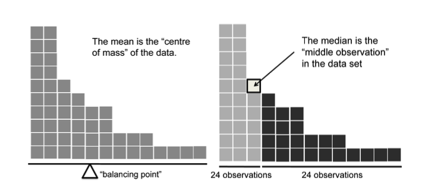
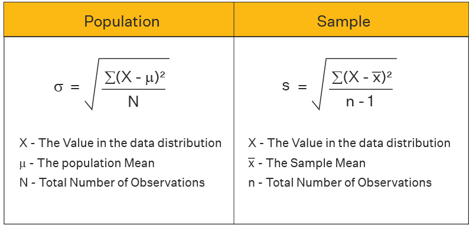
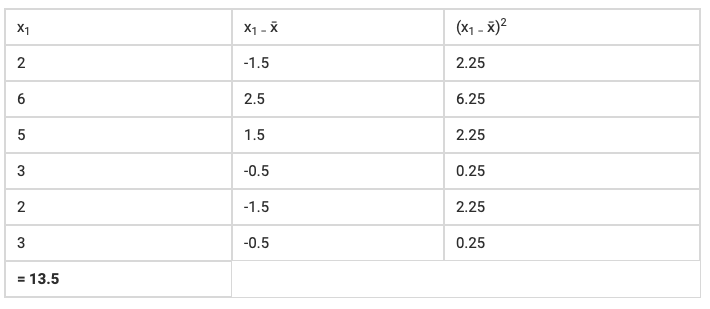
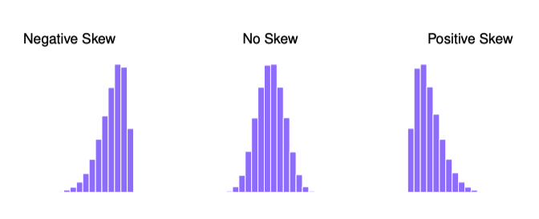
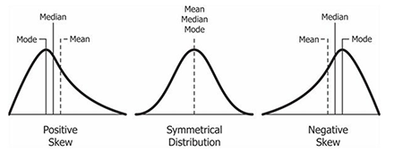
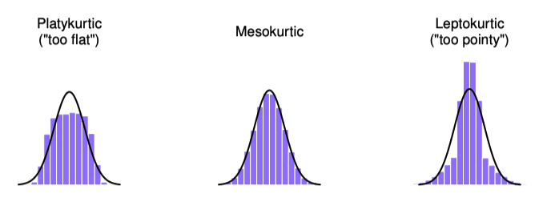
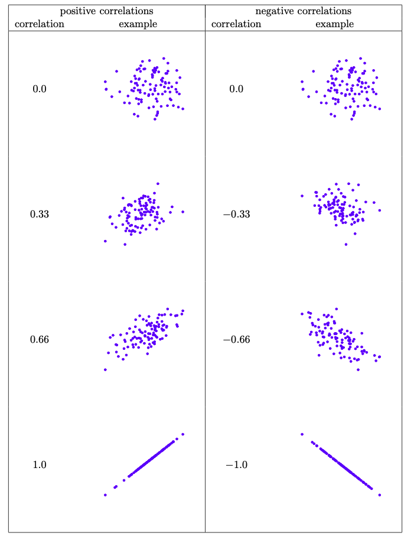

```{r setup, echo=FALSE, message=FALSE}
# loaded packages
library(here)
library(tidyverse)
library(ggplot2)
library(mdsr)
library(mosaicData)
library(fec16)
library(nycflights13)

here <- here::here()
dpath <- "data"

```

# Temel İstatistik Kavramlarına Giriş

## Tanımlayıcı/Betimsel İstatistik

**İstatistiğin Amacı**: İstatistik, verilerden sorularımızı yanıtlamamıza yardımcı olmak için vardır. Yani, verileri analiz ederek, onları anlamaya çalışırız. Fakat ilk olarak verileri anlamamız ve özetlememiz gereklidir.

Verileri özetlemenin bir yolu, **tanımlayıcı/betimsel istatistikler** kullanmaktır. Bu istatistikler, veri setindeki genel durumu anlamamıza yardımcı olur. Ancak, tanımlayıcı istatistiklerin sonuçlarına dayanarak kesin kararlar vermememiz gerekir. Bunun yerine, tanımlayıcı istatistikler bize veri setindeki değişkenler arasındaki ilginç ilişkileri keşfetme fırsatı sunar.

::: callout-note
⚠️ Veri analizi bağlamında, **tanımlayıcı/betimesel istatistik** ve **yorumlayıcı/çıkarımsal istatistik** iki önemli kavramdır. Bu iki istatistik türü, verileri farklı şekillerde kullanmamıza olanak tanır.

**Tanımlayıcı/betimsel İstatistik** Tanımlayıcı istatistikler, bir veri setinin genel özelliklerini özetlemeye yönelik yöntemlerdir. Bu istatistikler, ortalama, medyan, mod, varyans gibi ölçümleri içerir ve verilerin dağılımı hakkında bilgi verir. Ancak, tanımlayıcı istatistiklerden kesin kararlar vermek mümkün değildir; bunlar yalnızca veri setindeki genel durumu anlamamıza yardımcı olur.

**Yorumlayıcı/çıkarımsal İstatistik** Yorumlayıcı istatistik ise verileri analiz etmekle ilgilidir; yani verileri özetlemek yerine, örnek verilerden tüm popülasyon hakkında çıkarımlar yapmayı amaçlar. Yani, yorumlayıcı istatistik, örnek verileri kullanarak popülasyon hakkında sonuçlar çıkarmak veya çıkarımlarda bulunmak için kullanılır. Bu bağlamda, yorumlayıcı istatistik, popülasyon hakkında ne kadar güvenilir sonuçlar çıkarabileceğimizi belirlemek için korelasyonlar, olasılık, regresyon gibi çeşitli istatistiksel yöntemler kullanır.

**Özetle**:

-   **Tanımlayıcı İstatistik**: Veri setinin genel özelliklerini özetler, kesin kararlar vermez.
-   **Yorumlayıcı İstatistik**: Verileri analiz eder ve örnek verilerden popülasyon hakkında çıkarımlar yapar.
:::

## Kategorik Değişkenlerle Kullanılabilen Tanımlayıcı İstatistikler

1.  **Frekans (Frequency)**:

    -   Kategorik değişkenlerin her bir seviyesinin kaç kez tekrarlandığını gösterir. Örneğin, bir anket sonucunda "evet" ve "hayır" cevaplarının sayısı.

2.  **Yüzde (Percentage)**:

    -   Her bir kategorinin toplam içindeki oranını gösterir. Frekansların toplam gözlem sayısına bölünmesiyle elde edilir. Örneğin, "evet" cevabının yüzdesi, "evet" sayısının toplam cevap sayısına bölünmesi ile hesaplanır.

        $$
        p = \frac{\text{kategori içindeki birey sayısı}}{\text{örneklem büyüklüğü}}
        $$

3.  **Mod (Mode)**:

    -   En sık rastlanan kategori veya değer. Kategorik veriler için en yaygın olan seviyeyi belirtir. Örneğin, bir sınıftaki en çok tercih edilen renk.

4.  **Çapraz Tablo (Contingency Table)**:

    -   İki veya daha fazla kategorik değişken arasındaki ilişkiyi gösterir. Her bir kategorinin kesişimindeki frekansları içerir. Örneğin, cinsiyet ve hayatta kalma durumu arasındaki ilişkiyi gösteren bir tablo.

### Örnek 1: Kitap okuma Oranları ve Bilim Haberlerine İlgi

```{r}
# Kitap okuma kategorileri ve sayıları
books_readers <- c("no_books"=395, "print_only"=577, "digital_only"=91, "print_and_digital"=425)

books_readers  # Kitap okuyanların sayısını görüntüle
```

Frekans dışında yüzde olarak da ifade edilebilir:

```{r}
# Kitap okuma kategorilerinin oranlarını yüzde olarak hesapla ve görüntüle
books_readers_percent <- round(prop.table(books_readers) * 100, 2)
books_readers_percent
```

```{r}
# Veri çerçevesine dönüştür
books_df <- as.data.frame(books_readers) %>%
  rownames_to_column(var = "category") %>%
  rename(count = books_readers) %>%
  mutate(percent = round((count / sum(count)) * 100, 2))

# Bar grafiği oluştur
ggplot(books_df, aes(x = category, y = percent, fill = category)) +
  geom_bar(stat = "identity") +
  geom_text(aes(label = paste0(percent, "%")), vjust = -0.5) +
  labs(title = "Kitap Okuma Kategorileri",
       x = "Kategori",
       y = "Yüzde (%)") +
  theme_minimal() +
  theme(legend.position = "none")
```

### Örnek 2: **Etnik Gruplar ve Bilim Haberlerine İlgi**:

```{r}
library(dplyr)
library(tidyr)
library(ggplot2)

# Veriler
white <- c("active"=487, "casual"=916, "uninterested"=1431, "no_answer"=28)
black <- c("active"=59, "casual"=98, "uninterested"=227, "no_answer"=8)
hispanic <- c("active"=89, "casual"=152, "uninterested"=183, "no_answer"=23)

# 1. Veri çerçevesi oluşturma
my_table <- as.data.frame(rbind(white, black, hispanic))

# 2. Oranları hesapla (satır bazında)
prop_table <- round(prop.table(as.matrix(my_table), margin = 1) * 100, 2)
prop_table_df <- as.data.frame(prop_table)

# 3. Oranları tablo olarak görüntüle
prop_table_df
```

```{r}
# Uzun formata dönüştür
prop_long <- prop_table_df %>%
  rownames_to_column(var = "group") %>%
  pivot_longer(cols = -group, names_to = "category", values_to = "percent")

# Bar Plot oluştur
ggplot(prop_long, aes(x = group, y = percent, fill = category)) +
  geom_col(width = 0.7) +
  geom_text(aes(label = paste0(percent, "%")),
            position = position_stack(vjust = 0.5),
            size = 3.5) +
  labs(
    title = "Etnik Gruplara Göre Bilim Haberlerine İlgi",
    x = "Etnik Grup",
    y = "Yüzde (%)",
    fill = "İlgi Kategorisi"
  ) +
  theme_minimal(base_size = 13)
```

### Örnek 3: Titanik'te Hayatta Kalma Oranları

```{r}
# Titanic verisini okuma
titanic <- read.csv("https://raw.githubusercontent.com/bio304-class/bio304-course-notes/master/datasets/titanic_data.csv")

# Gerekli kütüphaneleri yükleyin
library(tidyverse)

# Cinsiyet dağılımı tablosu
table(titanic$sex)

# Cinsiyet dağılımını gösteren çubuk grafiği
barplot(table(titanic$sex), main = "Cinsiyet Dağılımı", xlab = "Cinsiyet", ylab = "Frekans", col = "lightblue")

# Hayatta kalma durumu tablosu
table(titanic$survived)

# Hayatta kalma durumunu gösteren çubuk grafiği
barplot(table(titanic$survived), main = "Hayatta Kalma Durumu", xlab = "Hayatta Kalma", ylab = "Frekans", col = "lightgreen")

# Cinsiyet ve hayatta kalma durumu arasındaki tablo
table_1 <- table(titanic$sex, titanic$survived)

# Toplamları ekleyerek tabloyu gösterme
addmargins(table_1)

# Oran tablosunu gösterme
prop.table(table_1, margin = 2)

# Cinsiyet ve hayatta kalma durumu için çubuk grafiği
barplot(table_1, legend.text = TRUE, main = "Cinsiyet ve Hayatta Kalma", xlab = "Cinsiyet", ylab = "Frekans")

# Sınıf ve hayatta kalma durumu arasındaki tablo
table_2 <- table(titanic$pclass, titanic$survived)

# Toplamları ekleyerek tabloyu gösterme
addmargins(table_2)

# Oran tablosunu gösterme
prop.table(table_2)

# Sınıf ve hayatta kalma durumu için çubuk grafiği
barplot(table_2, legend.text = TRUE, main = "Sınıf ve Hayatta Kalma", xlab = "Sınıf", ylab = "Frekans")

# Yaş ve hayatta kalma durumu arasındaki tablo
table_3 <- table(titanic$age, titanic$survived)

# Toplamları ekleyerek tabloyu gösterme
addmargins(table_3)

# Yaş dağılımını gösteren kutu grafiği
boxplot(titanic$age ~ titanic$survived, main = "Yaş Dağılımı", xlab = "Hayatta Kalma", ylab = "Yaş")

```

**Yorumlar:**

-   **Grup 1**: 123 kişi ölmüş, 200 kişi hayatta kalmış. Toplamda 323 kişi.

-   **Grup 2**: 158 kişi ölmüş, 119 kişi hayatta kalmış. Toplamda 277 kişi.

-   **Grup 3**: 528 kişi ölmüş, 181 kişi hayatta kalmış. Toplamda 709 kişi.

-   **Toplamlar**:

    -   Tüm gruplarda toplam 1309 kişi gözlemlenmiştir.

    -   Ölenlerin toplamı 809, hayatta kalanların toplamı ise 500'dür.

-   **Hayatta Kalma Oranı**:

    -   En yüksek hayatta kalma sayısına sahip grup 1'dir (200 kişi hayatta), en yüksek ölüm sayısına sahip grup ise 3'tür (528 kişi ölmüş).

-   **Hayatta Kalma Oranları**: Kadınların hayatta kalma oranı (67.8%) erkeklerin hayatta kalma oranından (32.2%) oldukça yüksektir. Bu, kadınların Titanic faciasında erkeklere göre daha yüksek bir hayatta kalma oranına sahip olduğunu göstermektedir.

-   **Ölüm Oranları**: Erkekler için ölüm oranı (84.3%) oldukça yüksekken, kadınlar için bu oran çok daha düşüktür (15.7%). Bu durum, kadınların daha iyi korunmuş olabileceğini veya bazı sosyal faktörlerin etkisiyle hayatta kalma şanslarının artmış olabileceğini düşündürmektedir.

## Sayısal Değişkenlerle Kullanılabilen Tanımlayıcı İstatistikler

Tanımlayıcı istatistiklerde veriyi tanımlamak için sıkça kullanılan istatistiksel ölçümler şunlardır:

1.  **Merkezi Eğilim Ölçüleri**: Ortalama, Medyan, Mod

2.  **Merkezi Dağılım Ölçüleri**: Aralık, standart sapma, varyans

3.  **Eğrilik ve Basıklık**: Dağılım grafiklerinin normal dağılımdan farklılaşması

4.  **Korelasyon**: İki değişken arasındaki ilişkinin yönü ve gücü.

### 1. Merkezi Eğilim Ölçüleri:

**1.1 Ortalama (Mean)**:

-   **Tanım**: Verilerin aritmetik ortalaması, tüm değerlerin toplamının gözlem sayısına bölünmesi ile hesaplanır.

-   **Matematiksel Gösterim**: $$\text{Ortalama} = \frac{\sum_{i=1}^{n} x_i}{n}$$ ​​

-   **R Formülü**:

    ```{r}
    veri <- c(34, 67, 23, 45, 89, 12, 56, 78, 99, 5, 62, 48, 39, 75, 80, 22, 90, 11, 36, 50)

    mean(veri)  # veri, ortalamasını almak istediğiniz sayısal vektördür.
    ```

**1.2 Medyan (Median)**:

-   **Tanım**: Verilerin sıralandıktan sonra ortadaki değeri. Özellikle aşırı değerlerin etkisini azaltır.
-   **Matematiksel Gösterim**:
    -   **Eğer** n tek ise:

        $$
        \text{Medyan} = x_{\left(\frac{n+1}{2}\right)}
        $$

    -   **Eğer** n çift ise:

        $$
        \text{Medyan} = \frac{x_{\left(\frac{n}{2}\right)} + x_{\left(\frac{n}{2}+1\right)}}{2}
        $$

```{r}
median(veri)  # veri, medyanını almak istediğiniz sayısal vektördür.
```

::: callout-note
⚠️ Ortalama, veri setinin "ağırlık merkezi"dir: verilerin histogramını katı bir cisim olarak hayal ederseniz, onu dengeleyebileceğiniz nokta (bir tahterevalli gibi) ortalamadır. Buna karşılık, medyan ortadaki gözlemdir. Gözlemlerin yarısı daha küçüktür ve yarısı daha büyüktür.
:::

{fig-align="center"}

**1.3 Mod (Mode)**:

-   **Tanım**: En sık rastlanan sayısal değer. Sayısal veriler için de kullanılabilir, ancak genellikle kategorik verilerle daha yaygındır.

-   **R Formülü:**

```{r}
mode_function <- function(x) {
  uniq_x <- unique(x)
  uniq_x[which.max(tabulate(match(x, uniq_x)))]
}
mode_function(veri)  # veri, modunu almak istediğiniz sayısal vektördür.

```

### 2. Merkezi Dağılım Ölçüleri

**2.1 Aralık (Range)**:

-   **Matematiksel Gösterim**: $$\text{Aralık} = \max(x) - \min(x)$$

-   **R Formülü:**

```{r}
range(veri)  # veri, aralığını almak istediğiniz sayısal vektördür.
max(veri) - min(veri)  # Aralığın hesaplanması
```

**2.2 Standart Sapma (Standard Deviation)**:

-   **Tanım:** Verilerin ortalamadan ne kadar yayıldığını gösterir. Verilerin ne kadar değişken olduğunu ölçer.

-   **Matematiksel Gösterim:** $$\text{Standart Sapma} = \sqrt{\frac{\sum_{i=1}^{n} (x_i - \bar{x})^2}{n-1}} $$

-   **R Formülü**

```{r}
sd(veri)  # veri, standart sapmasını almak istediğiniz sayısal vektördür.
```

**2.3 Varyans (Variance)**:

-   **Tanım**: Verilerin ortalamadan ne kadar saptığını gösteren bir ölçüdür. Standart sapmanın karesidir. Veriler arasındaki dağılımın ne kadar farklı olduğunu anlamamıza yardımcı olur. **Matematiksel Gösterim**: $$ \text{Varyans} = \frac{\sum_{i=1}^{n} (x_i - \bar{x})^2}{n-1}​$$

-   **R Formülü**

```{r}
var(veri)  # veri, varyansını almak istediğiniz sayısal vektördür.
```

{fig-align="center"}

{fig-align="center"}

**2.4 Çeyrekler Aralığı (Interquartile Range, IQR)**:

-   **Tanım**: Verilerin ortasındaki yarısını kapsayan yayılımı gösterir. 1. çeyrek (Q1) ile 3. çeyrek (Q3) arasındaki farktır.

-   **Matematiksel Gösterim**: $$ \text{IQR} = Q3 - Q1 $$

-   **R Formülü**

```{r}
IQR(veri)  # veri, çeyrekler aralığını almak istediğiniz sayısal vektördür.
```

**2.5 Küçük ve Büyük Çeyrekler (Quantiles)**:

-   **Tanım:** Verilerin belirli bir yüzdesine karşılık gelen değerlerdir. Örneğin, %25'lik çeyrek (Q1) ve %75'lik çeyrek (Q3).

-   **R Formulü:**

```{r}
quantile(veri, probs = c(0.25, 0.75))  # %25 ve %75'lik çeyrekler
```

### 3. Dağılımda Sapma: **Eğrilik ve Basıklık**

**3.1 Skewness (Eğrilik)**:

-   **Tanım:** Verinin dağılımının simetrik olup olmadığını gösterir. Pozitif veya negatif eğrilik değerleri, veri dağılımının sağa veya sola kaydığını belirtir.



::: callout-note
💡 Hertür eğrilikte Median daha merkezi bir tanımlayıcı istatistiğe dönüşür.

{fig-align="center" width="667"}
:::

**3.2 Kurtosis (Basıklık)**:

-   **Tanım:** Verinin dağılımının ne kadar "keskin" veya "düz" olduğunu ölçer. Yüksek kurtosis, veri dağılımının keskin zirvelere sahip olduğunu gösterirken, düşük kurtosis daha düz bir dağılımı işaret eder.

{fig-align="center"}

::: callout-note
Ortalama, Medyan, Mod, IQR ve Aralık (Range) Kullanım Rehberi

Veri analizi sırasında, ortalama, medyan, mod, çeyrekler aralığı (IQR) ve aralık (range) gibi tanımlayıcı istatistikleri kullanarak verilerimizi özetleyebiliriz. Ancak, her bir istatistiğin kullanımı, veri setinin özelliklerine bağlıdır. Aşağıda, bu istatistiklerin hangi durumlarda kullanılacağına dair detaylı bir rehber sunulmaktadır.

------------------------------------------------------------------------

**1. Ortalama (Mean)**

-   **Kullanım Durumu**: Sayısal verilerin merkezi eğilimini ölçmek için kullanılır.

-   **Uygun Durumlar**:

    -   Veriler normal dağılım gösteriyorsa.

    -   Aşırı değerler (outlier) yoksa.

-   **Örnek**: Bir sınıfın notları 70, 75, 80, 85, 90 olduğunda ortalama 80’dir. Ancak, eğer sınıfta 0 alan bir öğrenci varsa (notlar: 0, 70, 75, 80, 85, 90), ortalama 50 olur ki bu yanıltıcıdır.

**2. Medyan (Median)**

-   **Kullanım Durumu**: Veri setinin ortasındaki değeri bulmak için kullanılır.

-   **Uygun Durumlar**:

    -   Veriler asimetrik dağılım gösteriyorsa.

    -   Aşırı değerler mevcutsa, çünkü medyan bu değerlerden etkilenmez.

-   **Örnek**: Bir ev fiyatları seti 100.000, 120.000, 130.000, 1.000.000, 1.200.000 olduğunda, ortalama fiyat 510.000, ancak medyan 130.000’dir. Medyan, veri setinin çoğunluğunu daha iyi temsil eder.

**3. Mod (Mode)**

-   **Kullanım Durumu**: En sık rastlanan değeri bulmak için kullanılır.

-   **Uygun Durumlar**:

    -   Kategorik verilerde kullanılır.

    -   Verilerin birden fazla mod değeri (bimodal veya multimodal) varsa.

-   **Örnek**: Bir anket sonucu olarak, katılımcıların tercih ettiği meyveler: Elma, Muz, Elma, Portakal, Elma, Muz. Burada mod "Elma"dır çünkü en sık rastlanan değerdir.

**4. Çeyrekler Aralığı (IQR)**

-   **Kullanım Durumu**: Verilerin yayılımını ölçmek için kullanılır.

-   **Uygun Durumlar**:

    -   Verilerin ortasındaki yayılımı anlamak için.

    -   Aşırı değerlere karşı dayanıklıdır, bu yüzden özellikle asimetrik dağılımlarda tercih edilir.

-   **Örnek**: Bir test notları setinde, 60, 70, 75, 80, 85, 90, 95, 100 değerleri mevcutsa, IQR (Q3 - Q1) hesaplanarak veri setinin ortasında yer alan yayılım gösterilir. Q1 = 72.5 ve Q3 = 90 ise, IQR = 90 - 72.5 = 17.5 olacaktır.

**5. Aralık (Range)**

-   **Kullanım Durumu**: Verilerin en küçük ve en büyük değeri arasındaki farkı bulmak için kullanılır.

-   **Uygun Durumlar**:

    -   Veri setinin yayılımını genel olarak anlamak için.

    -   Aşırı değerlere dikkat edilmelidir, çünkü aralık bu değerlerden etkilenir.

-   **Örnek**: Bir grup öğrencinin notları 50, 60, 70, 80, 90 olduğunda, aralık 90 - 50 = 40’tır. Ancak, 0 alan bir öğrenci eklenirse (notlar: 0, 50, 60, 70, 80, 90), aralık 90 - 0 = 90 olacaktır.

------------------------------------------------------------------------

**Hangi İstatistiğin Kullanılacağına Dair Karar Verirken Dikkat Edilmesi Gerekenler**

-   **Veri Dağılımı**: Verilerin normal mi yoksa asimetrik mi dağıldığına bakın. Normal dağılımda ortalama kullanılabilirken, asimetrik dağılımda medyan daha iyi bir temsil sunar.

-   **Aşırı Değerler**: Veri setinde aşırı değerlerin (outlier) olup olmadığına dikkat edin. Aşırı değerlerin varlığında medyan ve IQR daha güvenilir ölçümler sağlar.

-   **Veri Türü**: Verilerin sayısal mı yoksa kategorik mi olduğunu belirleyin. Kategorik veriler için mod, sayısal veriler için ortalama ve medyan daha uygundur.

-   **Analiz Amacı**: Hangi bilgiyi elde etmek istediğinizi düşünün. Eğer yayılımı ölçmek istiyorsanız, IQR veya aralık kullanın; merkezi eğilimi ölçmek istiyorsanız, ortalama veya medyan tercih edin.
:::

### Örnek 3: Avustralya Futbol Ligi

```{r}
library(here)
load(here("data", "aflsmall.Rdata"))

# Bu iki veri, Avustralya futbol ligi ile ilgilidir. afl.margins, 176 oyunun kazanç farkını içerir; afl.finalists ise 1987 ile 2010 arasında final oynayan 400 takımın isimlerini içerir. 

table(afl.finalists) # Bu, bir vektördeki bir girişin kaç kez göründüğünü hesaplamak için tablo fonksiyonunu kullanır.

print(afl.margins)

```

Verileri tanımlamak için bir histogram ile başlayalım. Bu, tanımlamaya çalıştığımız verilerin nasıl göründüğüne dair bir fikir edinmenizi sağlayacaktır.

```{r}
# Histogram oluşturma
ggplot(data = data.frame(margins = afl.margins), aes(x = margins)) +
  geom_histogram(bins = 10, fill = "lightblue", color = "black", alpha = 0.7) +
  labs(title = "Kazanç Farklarının Histogramı", x = "Kazanç Farkı", y = "Frekans") +
  theme_minimal()

```

```{r}
# Tanımlayıcı istatistikleri hesaplama
ortalama <- mean(afl.margins)
medyan <- median(afl.margins)

# Mod fonksiyonu tanımlama
mode_function <- function(x) {
  uniq_x <- unique(x)
  uniq_x[which.max(tabulate(match(x, uniq_x)))]
}
mod <- mode_function(afl.margins)

varyans <- var(afl.margins)
standart_sapma <- sd(afl.margins)
IQR_val <- IQR(afl.margins)

# Sonuçları görüntüleme
result <- data.frame(
  İstatistik = c("Ortalama", "Medyan", "Mod", "Varyans", "Standart Sapma", "Çeyrekler Aralığı"),
  Değer = c(ortalama, medyan, mod, varyans, standart_sapma, IQR_val)
)

print(result)
```

### 4. Değişkenler Arası İlişki: Korelasyon

Korelasyon, iki sayısal değişkenin doğrusal olarak ne derece ilişkili olduğunu ifade eden istatistiksel bir ölçüttür (yani, iki değişkenin birlikte sabit bir oranda değişip değişmediğini gösterir). Korelasyon, basit ilişkileri tanımlamak için sıkça kullanılır ancak bu ilişki hakkında bir nedensellik iddiasında bulunmaz; yalnızca iki değişkenin nasıl birlikte hareket ettiğini gösterir.

Örneğin, sıcaklık arttıkça dondurma satışlarının da artması bir korelasyon gösterebilir, ancak bu dondurma satışlarının artmasının sebebinin sıcaklık olduğunu kesin olarak kanıtlamaz. Korelasyon, genellikle -1 ile +1 arasında değişen bir korelasyon katsayısı (r) ile ifade edilir.

-   **Pozitif Korelasyon (r \> 0):** Bir değişken arttıkça diğer değişken de artar. Örneğin, eğitim seviyesi ile gelir arasındaki ilişki genellikle pozitif korelasyon gösterir.

-   **Negatif Korelasyon (r \< 0):** Bir değişken arttıkça diğer değişken azalır. Örneğin, bir araç ne kadar hız yaparsa gidebileceği mesafe o kadar azalır.

-   **Korelasyon Yok (r ≈ 0):** İki değişken arasında anlamlı bir doğrusal ilişki yoktur.

### Örnek 4: Ebeveyinlik

Korelasyon hakkında daha ayrıntılı inceleme yapmak için yeni bir veri seti kullanarak örneklemeye başlayalım:

```{r}
# veriyi yükle
load(here("data", "parenthood.Rdata"))

# veriye göz at
str(parenthood)

```

Öncelikle, `summary()` fonksiyonu ile veri setinin özetini alabiliriz. Bu, her bir değişken için temel tanımlayıcı istatistikleri (ortalama, medyan, minimum, maksimum, çeyrekler gibi) sağlar. Ardından, bir değişkenin dağılımını görselleştirmek için `ggplot2` kütüphanesini kullanarak histogram çizebiliriz.

```{r}
# Veri setinin özetini al
summary(parenthood)

```

```{r}
# Dan'in uyku süresi dağılımı histogramı
ggplot(data=parenthood, aes(x=dan.sleep)) + 
  geom_histogram(binwidth=1, fill="blue", color="black") +
  labs(title="Dan'in Uyku Saatlerinin Dağılımı", x="Uyku Saatleri", y="Frekans") +
  theme_minimal()

```

```{r}
# Bebeğin uyku süresi dağılımı histogramı
ggplot(data=parenthood, aes(x=baby.sleep)) + 
  geom_histogram(binwidth=1, fill="blue", color="black") +
  labs(title="Bebeğin Uyku Saatlerinin Dağılımı", x="Uyku Saatleri", y="Frekans") +
  theme_minimal()

```

```{r}
# Dan'in uyku süresi ile bebeğin uyku süresi arasındaki ilişki (korelasyon)
ggplot(data=parenthood, aes(x=dan.sleep, y=baby.sleep)) +
  geom_point() +
  labs(title="Dan'in Uyku Süresi ile Bebeğin Uyku Süresi Arasındaki İlişki", x="Dan'in Uyku Süresi", y="Bebeğin Uyku Süresi") +
  theme_minimal()
```

```{r}
# Dan'in stres (grumpiness) seviyesinin dağılımı histogramı
ggplot(data=parenthood, aes(x=dan.grump)) +
  geom_histogram(binwidth=1, fill="blue", color="black") +
  labs(title="Dan'in Stres Seviyesinin Dağılımı", x="Stres Seviyesi", y="Frekans") +
  theme_minimal()
```

```{r}
# Dan'in uyku süresi ile stres seviyesi arasındaki ilişki (korelasyon)
ggplot(data=parenthood, aes(x=dan.sleep, y=dan.grump)) +
  geom_point() +
  labs(title="Dan'in Uyku Süresi ile Stres Seviyesi Arasındaki İlişki", x="Dan'in Uyku Süresi", y="Stres Seviyesi") +
  theme_minimal()
```

```{r}
# parenthood veri setindeki tüm değişkenler arasındaki korelasyonları hesapla
korelasyon_matrisi <- cor(parenthood)

# Korelasyon matrisini yazdır
print(korelasyon_matrisi)
```

::: callout-note
**Korelasyon Katsayısı:**

Korelasyon katsayısı, iki değişken arasındaki doğrusal ilişkinin yönünü ve gücünü ölçen bir istatistiksel ölçüdür. -1 ile +1 arasında değerler alır.

-   **+1:** Mükemmel pozitif korelasyon. Bir değişken arttıkça, diğer değişken de aynı oranda artar. Görselde en alttaki sol grafikte görüldüğü gibi, tüm noktalar yükselen bir doğru üzerinde yer alır.

-   **+0.66:** Güçlü pozitif korelasyon. Bir değişken arttıkça, diğer değişken de genellikle artar, ancak mükemmel bir ilişki yoktur. Görselde ortadaki sol grafikte görüldüğü gibi, noktalar yükselen bir doğru etrafında kümelenmiştir, ancak doğrudan üzerinde değillerdir.

-   **+0.33:** Zayıf pozitif korelasyon. Bir değişken arttıkça, diğer değişkenin artma eğilimi vardır, ancak ilişki daha az belirgindir. Görselde üstteki sol grafikte görüldüğü gibi, noktalar dağınık bir şekilde yükselen bir trend gösterir.

-   **0:** Korelasyon yok. Değişkenler arasında doğrusal bir ilişki yoktur. Değişkenlerden birinin değeri değiştiğinde, diğerinin değeri üzerinde tahmin edilebilir bir etkisi olmaz.

-   **-0.33:** Zayıf negatif korelasyon. Bir değişken arttıkça, diğer değişkenin azalma eğilimi vardır. Görselde üstteki sağ grafikte görüldüğü gibi, noktalar dağınık bir şekilde azalan bir trend gösterir.

-   **-0.66:** Güçlü negatif korelasyon. Bir değişken arttıkça, diğer değişken genellikle azalır. Görselde ortadaki sağ grafikte görüldüğü gibi, noktalar azalan bir doğru etrafında kümelenmiştir.

-   **-1:** Mükemmel negatif korelasyon. Bir değişken arttıkça, diğer değişken aynı oranda azalır. Görselde en alttaki sağ grafikte görüldüğü gibi, tüm noktalar azalan bir doğru üzerinde yer alır.

{fig-align="center"}
:::

#### Korelasyon bir nedensellik değildir

Korelasyon, iki değişken arasındaki ilişkinin yönünü ve gücünü ifade eder. Pozitif korelasyon, bir değişken arttığında diğerinin de artma eğiliminde olduğunu, negatif korelasyon ise bir değişken arttığında diğerinin azalma eğiliminde olduğunu gösterir.

**Önemli nokta:** Korelasyon, nedensellik anlamına gelmez. Yani, iki değişken arasında korelasyon olması, birinin diğerine neden olduğu anlamına gelmez.

**Örnek:** Dondurma satışları ile denizde boğulma vakaları arasında pozitif bir korelasyon vardır. Yani, dondurma satışları arttığında, boğulma vakaları da artar. Ancak bu, dondurma yemek insanların boğulmasına neden oluyor anlamına gelmez. Aslında, her iki değişken de sıcak hava gibi üçüncü bir faktörden etkilenir. Sıcak havalarda insanlar daha çok dondurma yerler ve denize girerler, bu da boğulma vakalarının artmasına neden olur.

**Başka bir örnek:** Ayakkabı numarası ile okuma becerileri arasında pozitif bir korelasyon olabilir. Yani, ayakkabı numarası büyük olan çocuklar genellikle daha iyi okuma becerilerine sahiptir. Ancak bu, büyük ayakların çocukların daha iyi okumasına neden olduğu anlamına gelmez. Aslında, her iki değişken de yaş gibi üçüncü bir faktörden etkilenir. Çocuklar büyüdükçe ayakları büyür ve okuma becerileri gelişir.

**Sonuç olarak:** Korelasyon, iki değişken arasında bir ilişki olduğunu gösterir, ancak bu ilişkinin nedensel olup olmadığını belirlemek için daha fazla araştırma yapmak gerekir.

```{r}
# "here" fonksiyonunu kullanabilmek için "here" paketini yükle
if (!require("here")) install.packages("here")

# Gerekli kütüphaneleri yükle
library(here)
library(ggplot2)

# Veri setini yükle
load(here("data", "anscombesquartet.Rdata"))

# X1, Y1, X2, Y2 vb. vektörlerini kullanarak bir data.frame oluştur
anscombesquartet <- data.frame(X1, Y1, X2, Y2, X3, Y3, X4, Y4)

# Farklı ikililer arası scatter plotlar oluştur
ggplot(anscombesquartet, aes(x = X1, y = Y1)) + 
  geom_point() + 
  ggtitle("X1 ve Y1")

ggplot(anscombesquartet, aes(x = X2, y = Y2)) + 
  geom_point() + 
  ggtitle("X2 ve Y2")

ggplot(anscombesquartet, aes(x = X3, y = Y3)) + 
  geom_point() + 
  ggtitle("X3 ve Y3")

ggplot(anscombesquartet, aes(x = X4, y = Y4)) + 
  geom_point() + 
  ggtitle("X4 ve Y4")

# Korelasyon katsayılarını hesapla
cor(anscombesquartet$X1, anscombesquartet$Y1)
cor(anscombesquartet$X2, anscombesquartet$Y2)
cor(anscombesquartet$X3, anscombesquartet$Y3)
cor(anscombesquartet$X4, anscombesquartet$Y4)

```

::: callout-note
👋 **Anscombe's Quartet veri seti neden önemli?**

Anscombe's Quartet, korelasyon katsayısının tek başına bir ilişkinin tam resmini veremeyeceğini gösteren önemli bir örnektir. Dört veri kümesinin de korelasyon katsayıları neredeyse aynıdır, ancak grafiklerine baktığımızda çok farklı ilişkiler olduğunu görürüz:

-   X1 ve Y1: Doğrusal bir ilişki var gibi görünüyor.

-   X2 ve Y2: Doğrusal bir ilişki yoktur, parabolik bir ilişki vardır.

-   X3 ve Y3: Doğrusal bir ilişki vardır, ancak bir aykırı değer bu ilişkiyi etkilemektedir.

-   X4 ve Y4: X4 neredeyse sabittir, tek bir aykırı değer Y4 ile yüksek bir korelasyon göstermektedir.

Bu nedenle, sadece korelasyon katsayısına bakmak yerine, verileri görselleştirmek ve ilişkinin doğasını anlamak çok önemlidir.
:::

::: callout-note
💡 **`cor()` Fonksiyonunun `method` Parametresi**

R'daki `cor()` fonksiyonu, varsayılan olarak Pearson korelasyon katsayısını hesaplar. Ancak, farklı korelasyon türleri hesaplamak isteyebilirsiniz. İşte `method` parametresi ile kullanabileceğiniz seçenekler:

-   **"pearson"**: Pearson korelasyon katsayısı (varsayılan). İki değişken arasındaki doğrusal ilişkinin gücünü ölçer.
-   **"spearman"**: Spearman sıra korelasyon katsayısı. Değişkenlerin sıraları arasındaki korelasyonu ölçer. Doğrusal olmayan, monotonik ilişkilere duyarlıdır.
-   **"kendall"**: Kendall korelasyon katsayısı. İki değişken arasındaki uyum (concordance) sayısını temel alır. Aykırı değerlere karşı daha dayanıklıdır.

Örnek olarak, Spearman sıra korelasyonunu hesaplamak için `cor()` fonksiyonunu şu şekilde kullanabilirsiniz:

``` r
cor(x, y, method = "spearman")
```

**Eksik Verilerle Başa Çıkma**

Veri setlerinde eksik veriler olması yaygın bir durumdur. `cor()` fonksiyonu, eksik verilerle nasıl başa çıkacağını belirlemek için `use` parametresini kullanır. İşte `use` parametresi ile kullanabileceğiniz seçenekler:

-   **"everything"**: Tüm gözlemleri kullanır. Eksik veri içeren herhangi bir çift, `NA` (Not Available) değeri üretir.
-   **"all.obs"**: Herhangi bir eksik veri varsa hata verir.
-   **"complete.obs"**: Eksik veri içeren gözlemleri tamamen çıkarır ve sadece tam gözlemleri kullanarak korelasyonu hesaplar.
-   **"na.or.complete"**: "complete.obs" ile aynıdır.
-   **"pairwise.complete.obs"**: Her bir değişken çifti için, eksik veri içeren gözlemleri çıkarır ve kalan gözlemlerle korelasyonu hesaplar.

Örnek olarak, eksik verileri olan gözlemleri çıkararak Pearson korelasyonunu hesaplamak için `cor()` fonksiyonunu şu şekilde kullanabilirsiniz:

``` r
cor(x, y, use = "complete.obs")
```

Eksik verilerle nasıl başa çıkılacağı, veri setinin özelliklerine ve analiz amacına bağlıdır. Eksik verileri yok saymak veya yanlış yöntemlerle doldurmak, yanıltıcı sonuçlara yol açabilir. Bu nedenle, eksik verileri dikkatli bir şekilde ele almak önemlidir.
:::

## Özet

Gerçek verileri analiz ederken yapacağınız ilk şeylerden biri temel betimsel istatistikleri hesaplamaktır ve betimsel istatistikler, çıkarımsal istatistiklerden çok daha kolay anlaşılır. Bu derste, aşağıdaki konuları ele aldık:

**Merkezi eğilim ölçüleri:** Bu ölçüler, veri setinin tipik veya merkezi bir değerini temsil etmeye çalışır. Ortalama, tüm değerlerin toplamının değer sayısına bölünmesiyle elde edilir. Medyan, sıralanmış veri setinin orta değeridir. Mod ise en sık görünen değerdir. Hangi merkezi eğilim ölçüsünün kullanılacağı, verilerin dağılımına ve analiz amacına bağlıdır.

**Merkezi dağılım ölçüleri:** Bu ölçüler, verilerin yayılımını veya dağılımını gösterir. Aralık, en büyük değer ile en küçük değer arasındaki farktır. Standart sapma, verilerin ortalamadan ne kadar uzakta olduğunu gösterir. Çeyrekler arası aralık ise, veri setinin %25'i ile %75'i arasındaki farktır.

**R'da değişkenlerin özetlerini alma:** Bu ders R'da veri analizi yapmaya odaklandığından, R'da betimsel istatistiklerin nasıl hesaplanacağı hakkında biraz zaman harcadık.

**Korelasyonlar:** İki sayısal değişken arasındaki ilişkinin yönünü ve boyutunu incelemek üzere korelasyon hesaplamaları yaptık

**Eksik veriler:** Eksik veriler, veri analizinde yaygın bir sorundur ve sonuçları etkileyebilir. Eksik verilerle başa çıkmak için çeşitli yöntemler vardır, örneğin eksik verileri silmek, ortalama veya medyan ile doldurmak veya daha gelişmiş istatistiksel yöntemler kullanmak.
