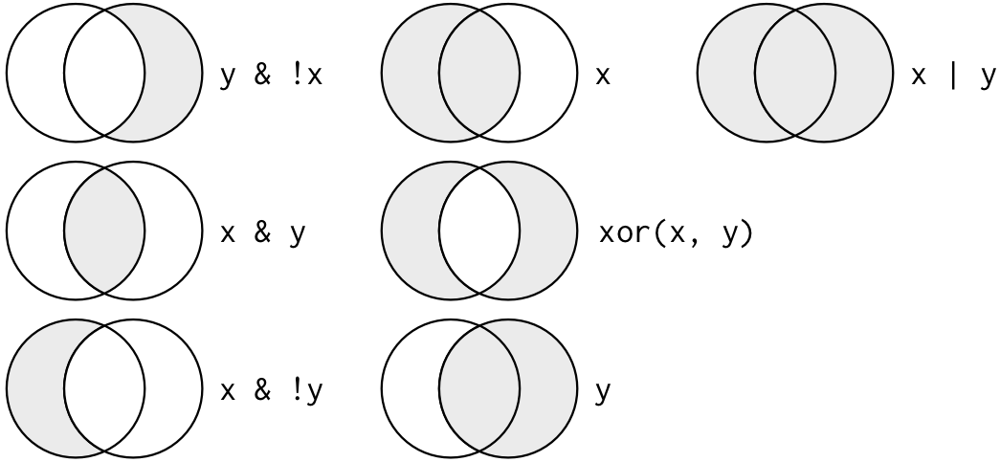
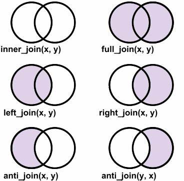
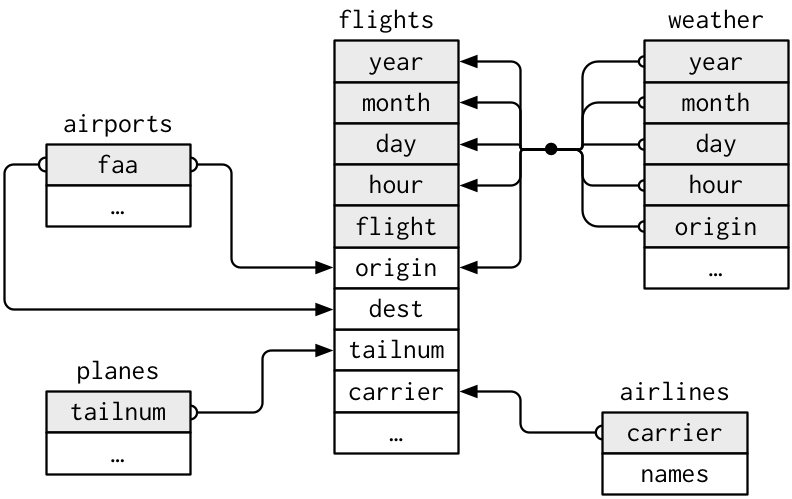

```{r setup, echo=FALSE, message=FALSE}
# loaded packages
library(here)
library(tidyverse)
library(ggplot2)
library(mdsr)
library(mosaicData)
library(fec16)
library(nycflights13)

here <- here::here()
dpath <- "data"
```

# Veri Düzenleme için Bir Dilbilgisi

Tıpkı `ggplot2` paketinin veri görselleştirme için güçlü ve esnek bir dilbilgisi sunması gibi, `dplyr` paketi de R programlama dilinde veri manipülasyonu ve düzenleme işlemleri için son derece kullanışlı ve etkili bir dilbilgisi sunar. Bu paket, veri analizi sürecini daha verimli ve anlaşılır hale getiren bir dizi araç sağlar.

Özellikle, `dplyr` paketi veri çerçeveleri üzerinde çeşitli karmaşık işlemler gerçekleştirmek için "fiil" olarak adlandırılan işlevsel fonksiyonlar sunar. Bu fiiller, veri setlerini filtreleme, sıralama, gruplama, özetleme ve birleştirme gibi temel veri manipülasyon görevlerini gerçekleştirmek için kullanılır. Her bir fiil, belirli bir görevi yerine getirmek üzere tasarlanmıştır ve birbirleriyle kolayca birleştirilebilir, böylece karmaşık veri dönüşümlerini bile anlaşılır ve okunabilir bir şekilde ifade etmek mümkün olur.

::: callout-note
**💡** `dplyr` paketindeki temel fiiller şunlardır:

-   `select()`: Veri çerçevesinden belirli sütunları seçmek için kullanılır.

-   `filter()`: Belirli koşulları sağlayan satırları seçmek için kullanılır.

-   `mutate()`: Yeni sütunlar oluşturmak veya mevcut sütunları değiştirmek için kullanılır.

-   `arrange()`: Veri çerçevesindeki satırları belirli sütunlara göre sıralamak için kullanılır.

-   `summarize()`: Verileri satırlar arasında özetlemek için kullanılır.

Bu fiilleri birleştirerek karmaşık veri manipülasyon işlemlerini kolayca gerçekleştirebilirsiniz. `dplyr` paketi, R ile veri analizi yapan herkes için olmazsa olmaz bir araçtır. Bu paketin sunduğu dilbilgisi yaklaşımı, veri manipülasyonunu daha kolay, anlaşılır ve etkili hale getirir.
:::

## 1. select() ve filter()

-   **`select()`**: Veri çerçevesinden belirli **sütunları** seçmek için kullanılır. Örneğin, `select(veri, sutun1, sutun2)` kodu, `veri` adlı veri çerçevesinden sadece `sutun1` ve `sutun2` adlı sütunları seçer. Bu fonksiyon, veri setinizi sadeleştirmek ve sadece ihtiyacınız olan değişkenleri tutmak için faydalıdır.

-   **`filter()`**: Belirli koşulları sağlayan **satırları** seçmek için kullanılır. Örneğin, `filter(veri, sutun1 > 10)` kodu, `veri` veri çerçevesinde `sutun1` değerleri 10'dan büyük olan satırları filtreler. Bu fonksiyon, analiziniz için belirli kriterleri karşılayan gözlemleri seçmenize olanak tanır.

```{r}
presidential |> 
  select(name, party)
  
```

::: callout-note
👋 `tidyverse` içindeki `pipe` operatörü (`|>`) veri manipülasyonunu ve analizini kolaylaştırmak için kullanılır. Kodunuzu daha okunabilir ve anlaşılır hale getirir.

**`pipe` Operatörü Nasıl Çalışır?**

`pipe` operatörü (`|>`), bir fonksiyonun çıktısını bir sonraki fonksiyonun girdisi olarak kullanmanıza olanak tanır. Bu sayede, iç içe geçmiş fonksiyonlar yerine, işlemleri adım adım zincirleme bir şekilde yazabilirsiniz.
:::

```{r}
presidential |> 
  filter(party=="Republican")
```

`select` ve `filter`'ı birlikte kullanmaya ne dersiniz?

```{r}
presidential |> 
  select(name, party) |> 
  filter(party=="Republican") 

```

`filter()` ve `select()` komutlarını birleştirmek, çok belirli bilgilere ulaşmayı sağlar. Örneğin, presidential veri setinde Watergate skandalından beri görev yapan Demokrat başkanları bulabiliriz.

```{r}
presidential |> 
  filter(year(start) > 1973 & party == "Democratic") |> 
  select(name)
```

## 2. mutate() ve rename()

Veri analizi yaparken sıklıkla verilerimiz üzerinde değişiklikler yapmamız gerekir. Bu değişiklikler, yeni değişkenler oluşturmayı, mevcut değişkenleri yeniden tanımlamayı veya değişkenlerin isimlerini değiştirmeyi içerebilir. `dplyr` paketi, `mutate()` ve `rename()` fonksiyonları ile bu işlemleri kolayca yapmamızı sağlar.

Örneğin, elimizde ABD başkanlarının görev sürelerine ilişkin bir veri setimiz olan presidential verisini düşünelim. Bu veri setinde, her başkanın göreve başlama ve görevden ayrılma tarihleri bulunmaktadır. Ancak, her başkanın görev süresinin uzunluğunu gösteren bir değişken yoktur. `mutate()` fonksiyonunu kullanarak, bu bilgiyi mevcut tarihlerden hesaplayabilir ve veri setimize yeni bir sütun olarak ekleyebiliriz.

::: callout-note
⚠️ Mevcut veri setini değiştirmek yerine, genellikle yeni bir veri seti oluşturmak iyi bir uygulamadır. Bu sayede, orijinal veri setini koruyabilir ve üzerinde istediğiniz değişiklikleri yapabilirsiniz. Örneğin, `mutate()` fonksiyonunun çıktısını yeni bir veri setine kaydedebilirsiniz.
:::

```{r}
my_presidents <- presidential |>
  mutate(term.length = interval(start, end) / dyears(1))
head(my_presidents) 
```

`mutate()` fonksiyonu, mevcut bir sütundaki verileri değiştirmek için de kullanılabilir. Örneğin, veri çerçevemize her başkanın seçildiği yılı içeren bir değişken eklemek istediğimizi düşünelim. İlk (basit) yaklaşımımız, her başkanın göreve başlamadan önceki yıl seçildiğini varsayabilir. `mutate()` fonksiyonunun bir veri çerçevesi döndürdüğünü unutmayın. Bu nedenle, mevcut veri çerçevemizi değiştirmek istiyorsak, onu yeni sonuçlarla güncellememiz gerekir.

```{r}
my_presidents <- my_presidents |>
  mutate(elected = year(start) - 1)
head(my_presidents) 
```

`rename()` fonksiyonu ise, değişkenlerin isimlerini değiştirmek için kullanılır.

```{r}
my_presidents <- my_presidents |>
  rename(term_length = term.length)
head(my_presidents) 
```

::: callout-note
💡 `janitor` paketi, R ile veri temizleme işlemlerini kolaylaştırmak için geliştirilmiş kullanışlı bir pakettir. Özellikle değişken isimlerini temizlemek ve düzenlemek için sunduğu `clean_names()` fonksiyonu oldukça faydalıdır.

**`clean_names()` fonksiyonu ne işe yarar?**

`clean_names()` fonksiyonu, veri setinizdeki değişken isimlerini otomatik olarak temizler ve standart bir formata dönüştürür. Bu sayede, değişken isimleriyle çalışmak daha kolay hale gelir ve kodunuz daha okunabilir olur.

**`clean_names()` fonksiyonu hangi işlemleri yapar?**

-   **Büyük/küçük harf dönüşümü:** Tüm harfleri küçük harfe dönüştürür.

-   **Boşlukların kaldırılması:** Değişken isimlerindeki boşlukları kaldırır veya alt çizgi (\_) ile değiştirir.

-   **Özel karakterlerin kaldırılması:** Noktalama işaretleri ve diğer özel karakterleri kaldırır veya alt çizgi (\_) ile değiştirir.

-   **Sayıların eklenmesi:** Değişken isimlerinin başına veya sonuna sayılar ekler (eğer aynı isimde birden fazla değişken varsa).

-   **Standart formata dönüştürme:** Değişken isimlerini "snake_case" (alt çizgi ile ayrılmış küçük harfli kelimeler) gibi standart bir formata dönüştürür.

**`clean_names()` fonksiyonu nasıl kullanılır?**

`clean_names()` fonksiyonunu kullanmak için öncelikle `janitor` paketini yüklemeniz gerekir:

install.packages("janitor")

library(janitor)
:::

## 3. arrange()

Temel bir R fonksiyonu olan `sort()` fonksiyonu bir vektörü sıralar, ancak bir veri çerçevesini sıralamaz. `arrange()` fonksiyonu ise bir veri çerçevesini sıralar. `arrange()` fonksiyonunu bir veri çerçevesinde kullanmak için, veri çerçevesini ve sıralamak istediğiniz sütunu belirtmeniz gerekir. Ayrıca, sıralama yönünü de belirtmeniz gerekir. Birden çok sıralama koşulu belirtmek, eşitlikleri çözmeye yardımcı olur.

```{r}
my_presidents |>
  arrange(desc(term_length))
```

Başkanlık veri çerçevemizi her başkanın görev süresinin uzunluğuna göre sıralamak için, term_length sütununun azalan sırada olmasını belirtiyoruz. Ayrıca, parti ve seçilme yılına göre de sıralama yapabiliriz.

```{r}
my_presidents |>
  arrange(desc(term_length), party, elected)
```

## 4. summarize() ve group_by()

Tek tablo analizi için beş fiilimizden sonuncusu, neredeyse her zaman group_by() ile birlikte kullanılan summarize()'dır. Önceki dört fiil, bir veri çerçevesini güçlü ve esnek şekillerde işlemek için bize araçlar sağladı. Ancak yalnızca bu dört fiille gerçekleştirebileceğimiz analizlerin kapsamı sınırlıdır. group_by() ile birlikte summarize() kullanmak ise bize karşılaştırmalar yapma imkanı sunar.

```{r}
my_presidents |>
  summarize(
    N = n(), 
    first_year = min(year(start)), 
    last_year = max(year(end)), 
    num_dems = sum(party == "Democratic"), 
    years = sum(term_length), 
    avg_term_length = mean(term_length)
  )
```

Sonraki iki değişken, bu başkanlardan birinin göreve başladığı ilk yılı ve en son başkanın görevinin bittiği yılı belirler. İlki, `start` sütunundaki en küçük yıl, ikincisi ise `end` sütunundaki en büyük yıldır. `num_dems` değişkeni, `party` değişkeninin "Democratic" olduğu satır sayısını sayar. Son iki değişken ise `term_length` değişkeninin toplamını ve ortalamasını hesaplar. Sonuçlar gösteriyor ki, 1953'ten 2021'e kadar görev yapan 12 başkandan 5'i Demokrat'tır ve bu 68 yıllık dönemde ortalama görev süresi yaklaşık 5,6 yıldır.

```{r}
my_presidents |>
  group_by(party) |>
  summarize(
    N = n(), 
    first_year = min(year(start)), 
    last_year = max(year(end)), 
    num_president = sum(party == "Democratic" | party == "Republican"), 
    years = sum(term_length), 
    avg_term_length = mean(term_length)
  )
```

## Dplyr için bir ek örnek

Bu örnekte `dplyr`'ın temel veri işleme fiillerini keşfetmek için `nycflights13::flights` veri setini kullanacağız. Bu veri çerçevesi, 2013 yılında New York şehrinden kalkan 336.776 uçuşun tamamını içerir. Veriler ABD Ulaştırma İstatistikleri Bürosu'ndan alınmıştır ve `?flights` komutu ile dokümantasyonuna erişebilirsiniz.

### 1. filter()

```{r}
head(flights)
```

```{r}
jan1 <- flights |> 
  filter(month == 1, day == 1)
head(jan1)
```

::: callout-note
**R'da Kullanılan Boolean operatörler**


:::

Aşağıdaki kod, Kasım veya Aralık aylarında kalkan tüm uçuşları bulur:

```{r}
flights |> 
  filter(month == 11 | month == 12) |> 
  head()
```

::: callout-note
Bu kod için kullanışlı bir kısaltma `x %in% y`'dir. Bu, `x`'in `y` içindeki değerlerden biri olduğu her satırı seçecektir. Yukarıdaki kodu yeniden yazmak için kullanabiliriz:
:::

```{r}
nov_dec <- filter(flights, month %in% c(11, 12))
```

De Morgan yasasını hatırlayarak karmaşık alt kümeleme işlemlerini basitleştirebilirsiniz. Bu matematiksel kural, mantıksal ifadelerin dönüşümünü sağlar ve veri analizinde oldukça kullanışlıdır. İki temel dönüşüm şu şekildedir:

1.  `!(x & y)`, `!x | !y` ile aynıdır: Bu, "x ve y'nin değili" ifadesinin "x'in değili veya y'nin değili" ile eşdeğer olduğunu gösterir.

2.  `!(x | y)`, `!x & !y` ile aynıdır: Bu da "x veya y'nin değili" ifadesinin "x'in değili ve y'nin değili" ile eşdeğer olduğunu belirtir.

Bu kurallar, karmaşık sorguları basitleştirmek ve daha etkili hale getirmek için kullanılabilir. Örneğin, havayolu verilerini analiz ederken, varışta veya kalkışta iki saatten fazla gecikmeyen uçuşları bulmak istiyorsanız, şu iki filtreden birini kullanabilirsiniz:

```{r}
flights |> 
  filter((arr_delay > 120 | dep_delay > 120))
flights |> 
  filter(arr_delay <= 120, dep_delay <= 120)
```

::: callout-note
⚠️ `filter()` yalnızca koşulun DOĞRU olduğu satırları içerir; hem YANLIŞ hem de NA değerlerini hariç tutar. Eksik değerleri korumak istiyorsanız, bunları açıkça isteyin!
:::

### `filter()` için daha fazla alıştırma

Aşağıdaki özelliklere sahip uçuşları bulun:

-   Varışta iki saat veya daha fazla gecikme olan

-   Houston'a (IAH veya HOU) uçan

-   United, American veya Delta tarafından işletilen

-   Yaz aylarında (Temmuz, Ağustos ve Eylül) kalkan

-   İki saatten fazla gecikmeli varan, ancak kalkışta gecikme olmayan

-   En az bir saat gecikmeli, ancak uçuş sırasında 30 dakikadan fazla telafi eden

-   Gece yarısı ile sabah 6 arasında (dahil) kalkan

Bir diğer kullanışlı `dplyr` filtreleme yardımcısı `between()`'dır. Ne işe yarar? Önceki soruları cevaplamak ve gereken kodu basitleştirmek için kullanabilir misiniz?

Kaç uçuşun `dep_time` değeri eksik? Hangi diğer değişkenler eksik? Bu satırlar neyi temsil ediyor olabilir?

### 2. arrange()

arrange() fonksiyonu, filter() fonksiyonuna benzer şekilde çalışır, ancak satırları seçmek yerine sıralarını değiştirir. Bu fonksiyon, sıralama işlemi için bir veri çerçevesi ve bir dizi sütun adı (veya daha karmaşık ifadeler) kullanır.

```{r}
flights |> 
  arrange(year, month, day) |> 
  head()
```

Azalan düzende bir sütuna göre yeniden sıralamak için `desc()` kullanın:

```{r}
flights |> 
  arrange(desc(dep_delay)) |> 
  head()
```

::: callout-note
👋 Eksik değerler her zaman sonda sıralanır!
:::

#### **arrange için daha fazla alıştırma**

-   Tüm eksik değerleri başa sıralamak için `arrange()` fonksiyonunu nasıl kullanabilirsiniz? (İpucu: `is.na()` kullanın).

-   Uçuşları en çok gecikmiş uçuşları bulmak için sıralayın. En erken kalkan uçuşları bulun.

-   En hızlı (en yüksek hız) uçuşları bulmak için uçuşları sıralayın.

-   Hangi uçuşlar en uzağa gitti? Hangileri en kısa mesafeyi kat etti?

### **3. `select()`**

Yüzlerce hatta binlerce değişken içeren veri setlerine sahip olmak nadir değildir. Bu durumda, ilk zorluk genellikle gerçekten ilgilendiğiniz değişkenlere odaklanmaktır. `select()` fonksiyonu, değişkenlerin adlarına dayalı işlemler kullanarak yararlı bir alt kümeye hızlıca odaklanmanızı sağlar.

```{r}
flights |> 
  select(year, month, day) |> 
  head()
```

`select()` içinde kullanabileceğiniz bir dizi yardımcı fonksiyon vardır:

-   `starts_with("abc")`: "abc" ile başlayan isimleri eşleştirir.

-   `ends_with("xyz")`: "xyz" ile biten isimleri eşleştirir.

-   `contains("ijk")`: "ijk" içeren isimleri eşleştirir.

-   `matches("(.)\\1")`: düzenli bir ifadeyle eşleşen değişkenleri seçer. Bu, tekrarlanan karakterler içeren herhangi bir değişkenle eşleşir. Düzenli ifadeler hakkında daha fazla bilgiyi diziler bölümünde öğreneceksiniz.

-   `num_range("x", 1:3)`: x1, x2 ve x3 ile eşleşir.

Daha fazla ayrıntı için `?select` komutuna bakın.

::: callout-note
👋 `select()` fonksiyonu değişkenleri yeniden adlandırmak için kullanılabilir, ancak açıkça belirtilmeyen tüm değişkenleri kaldırdığı için nadiren kullanışlıdır. Bunun yerine, açıkça belirtilmeyen tüm değişkenleri koruyan bir `select()` çeşidi olan `rename()` fonksiyonunu kullanın.
:::

```{r}
flights |> 
  rename(tail_num = tailnum) |> 
  head()
```

::: callout-note
Başka bir seçenek de `select()` fonksiyonunu `everything()` yardımcısı ile birlikte kullanmaktır. Bu, veri çerçevesinin başına taşımak istediğiniz birkaç değişkeniniz varsa kullanışlıdır.
:::

```{r}
flights |> 
  select(time_hour, air_time, everything()) |> 
  head()
```

### `select()` için daha fazla alıştırma

-   `flights` veri setinden `dep_time`, `dep_delay`, `arr_time` ve `arr_delay` değişkenlerini seçmek için mümkün olduğunca çok yol düşünün.

-   Bir `select()` çağrısında bir değişkenin adını birden çok kez eklerseniz ne olur?

-   `any_of()` fonksiyonu ne işe yarar? Bu vektörle birlikte neden yardımcı olabilir?

```         
vars <- c("year", "month", "day", "dep_delay", "arr_delay")
```

-   Aşağıdaki kodu çalıştırmanın sonucu sizi şaşırtıyor mu? `select()` yardımcıları varsayılan olarak büyük/küçük harfle nasıl başa çıkıyor? Bu varsayılanı nasıl değiştirebilirsiniz?

```         
select(flights, contains("TIME"))
```

### `4. mutate()`

`mutate()` her zaman veri setinizin sonuna yeni sütunlar ekler, bu nedenle yeni değişkenleri görebilmemiz için daha dar bir veri seti oluşturarak başlayacağız.

```{r}
flights |> 
  mutate(
    gain = dep_delay - arr_time,
    hours = air_time /60,
    gain_per_hour = gain/hours
  )|> 
  head()
```

```{r}
flights_sml <- flights |> 
  select(year:day, 
         ends_with("delay"),
         distance,
         air_time, 
         arr_time,
         dep_time) |> 
  mutate(
    gain = dep_delay - arr_time,
    hours = air_time /60,
    gain_per_hour = gain/hours
  ) |> 
  arrange(desc(gain_per_hour)) |> 
  select(gain_per_hour, everything()) |> 
  filter(gain_per_hour > 400)

head(flights_sml)

```

Eğer sadece yeni değişkenleri tutmak istiyorsanız, `transmute()` fonksiyonunu kullanın:

```{r}
flights |> 
  transmute(
  gain = dep_delay - arr_delay,
  hours = air_time / 60,
  gain_per_hour = gain / hours)|> 
  head()
```

### `mutate()` için daha fazla alıştırma

-   Şu anda `dep_time` ve `sched_dep_time` değişkenlerine bakmak kolay, ancak gerçekte sürekli sayılar olmadıkları için hesaplamalar yapmak zor. Bunları gece yarısından itibaren geçen dakika sayısının daha uygun bir gösterimine dönüştürün.

-   `air_time` ile `arr_time - dep_time` karşılaştırmasını yapın. Ne görmeyi bekliyorsunuz? Ne görüyorsunuz? Düzeltmek için ne yapmanız gerekiyor?

-   `dep_time`, `sched_dep_time` ve `dep_delay` değişkenlerini karşılaştırın. Bu üç sayının nasıl ilişkili olmasını beklersiniz?

-   Bir sıralama fonksiyonu kullanarak en çok gecikmeli 10 uçuşu bulun. Eşitlikleri nasıl ele almak istiyorsunuz? `min_rank()` fonksiyonunun dokümantasyonunu dikkatlice okuyun.

-   `1:3 + 1:10` ne döndürür? Neden?

-   R hangi trigonometrik fonksiyonları sağlar?

### `5. summarise()`

Son anahtar fiil `summarise()`'dır. Bir veri çerçevesini tek bir satıra daraltır:

```{r}
flights |> 
  summarise(delay=mean(dep_delay, na.rm = TRUE))
```

`summarise()` fonksiyonu, `group_by()` ile eşleştirilmedikçe çok kullanışlı değildir. Bu, analiz birimini tüm veri setinden bireysel gruplara değiştirir.

```{r}
flights |> 
  group_by(year, month, day) |> 
  summarise(delay = mean(dep_delay, na.rm = T))|> 
  head()
```

### Birden çok işlemi birleştirme

Her konum için mesafe ve ortalama gecikme arasındaki ilişkiyi incelemek istediğimizi hayal edin. `dplyr` hakkında bildiklerinizi kullanarak şu şekilde bir kod yazabilirsiniz:

```{r}
flights %>% 
  group_by(dest) %>% 
  summarise(
    count = n(),
    dist = mean(distance, na.rm = TRUE),
    delay = mean(arr_delay, na.rm = TRUE)
  ) %>% 
  filter(count > 20, dest != "HNL") |>  
  ggplot(aes(x = dist, y = delay)) +
  geom_point(aes(size = count), alpha = 1/3) +
  geom_smooth(se = FALSE)
#> `geom_smooth()` using method = 'loess' and formula = 'y ~ x'
# It looks like delays increase with distance up to ~750 miles 
# and then decrease. Maybe as flights get longer there's more 
# ability to make up delays in the air?
```

# Düzenli (Tidy) Veri ve R'da Veri Düzenleme

Veri düzenleme, R'da verileri "düzenli veri" (tidy data) adı verilen bir sistem kullanarak tutarlı bir şekilde organize etmeyi ifade eder. Verilerinizi bu formata getirmek başlangıçta biraz çaba gerektirir, ancak bu çaba uzun vadede karşılığını verir. Düzenli verilere ve `tidyverse` paketlerinin sağladığı düzenli araçlara sahip olduğunuzda, verileri bir gösterimden diğerine dönüştürmek için çok daha az zaman harcarsınız. Böylece, önemsediğiniz veri sorularına daha fazla zaman ayırabilirsiniz.

Bir veri setini düzenli hale getiren birbiriyle ilişkili üç kural vardır:

-   Her değişken bir sütundur; her sütun bir değişkendir.

-   Her gözlem bir satırdır; her satır bir gözlemdir.

-   Her değer bir hücredir; her hücre tek bir değerdir.

Bu kurallar, çoğu gerçek analizin en azından biraz düzenleme gerektireceği anlamına gelir. İşe temel değişkenlerin ve gözlemlerin ne olduğunu anlayarak başlarsınız. Bu bazen kolaydır; diğer zamanlarda verileri orijinal olarak oluşturan kişilere danışmanız gerekebilir. Ardından, verilerinizi sütunlarda değişkenler ve satırlarda gözlemler olacak şekilde düzenli bir forma dönüştürürsünüz.

`tidyr` paketi, verileri dönüştürmek için iki fonksiyon sağlar: `pivot_longer()` ve `pivot_wider()`. İlk önce `pivot_longer()` ile başlayacağız çünkü en yaygın durum budur.

## `1. pivot_longer()`

`billboard` veri seti, 2000 yılındaki şarkıların Billboard sıralamasını kaydeder:

```{r}
head(billboard)
```

Bu veri setinde her bir gözlem bir şarkıdır. İlk üç sütun (`artist`, `track` ve `date.entered`) şarkıyı tanımlayan değişkenlerdir. Sonra her hafta şarkının sıralamasını tanımlayan 76 sütunumuz (`wk1-wk76`) var. Burada, sütun adları bir değişkendir (hafta) ve hücre değerleri başka bir değişkendir (sıralama).

Bu verileri düzenlemek için `pivot_longer()` fonksiyonunu kullanacağız:

```{r}
billboard |> 
  pivot_longer(
    cols = starts_with("wk"),
    names_to = "week",
    values_to = "rank",
    values_drop_na = TRUE
  )
```

Burada üç önemli argüman vardır:

-   `cols`: Hangi sütunların dönüştürülmesi gerektiğini, yani hangi sütunların değişken olmadığını belirtir. Bu argüman `select()` ile aynı sözdizimini kullanır, bu nedenle burada `!c(artist, track, date.entered)` veya `starts_with("wk")` kullanabiliriz.

-   `names_to`: Sütun adlarında depolanan değişkeni adlandırır, biz bu değişkene `week` adını verdik.

-   `values_to`: Hücre değerlerinde depolanan değişkeni adlandırır, biz bu değişkene `rank` adını verdik.

-   `values_drop_na`: `TRUE`, NA'lı satırların bırakıldığı anlamına gelir.

::: callout-note
👋 Kodda "week" ve "rank" kelimelerinin tırnak içinde olduğuna dikkat edin çünkü bunlar oluşturduğumuz yeni değişkenlerdir, `pivot_longer()` çağrısını çalıştırdığımızda henüz verilerde mevcut değillerdir.
:::

### Başka bir örnek: pivot_longer()

Sütun adlarına sıkıştırılmış birden çok bilgi parçasına sahip olduğunuzda ve bunları ayrı yeni değişkenlerde depolamak istediğinizde daha zorlu bir durum ortaya çıkar. Örneğin, `table1` ve `friends` tablolarının kaynağı olan `who2` veri setini ele alalım:

```{r}
head(who2)
```

Dünya Sağlık Örgütü tarafından toplanan bu veri seti, tüberküloz teşhisleri hakkında bilgi kaydeder. Zaten değişken olan ve yorumlanması kolay iki sütun vardır: `country` ve `year`. Bunları `sp_m_014`, `ep_m_4554` ve `rel_m_3544` gibi 56 sütun izler. Bu sütunlara yeterince uzun süre bakarsanız, bir kalıp olduğunu fark edeceksiniz. Her sütun adı \_ ile ayrılmış üç parçadan oluşur. İlk parça, `sp/rel/ep`, teşhis için kullanılan yöntemi, ikinci parça, `m/f` cinsiyeti (bu veri setinde ikili bir değişken olarak kodlanmıştır) ve üçüncü parça, `014/1524/2534/3544/4554/5564/65` yaş aralığını açıklar (örneğin, 014, 0-14'ü temsil eder).

Yani bu durumda `who2`'de kaydedilmiş altı bilgi parçamız var: ülke ve yıl (zaten sütunlar); teşhis yöntemi, cinsiyet kategorisi ve yaş aralığı kategorisi (diğer sütun adlarında bulunur); ve bu kategorideki hasta sayısı (hücre değerleri). Bu altı bilgi parçasını altı ayrı sütunda düzenlemek için, `names_to` için bir sütun adı vektörü ve orijinal değişken adlarını `names_sep` için parçalara ayırmak üzere talimatlar ve `values_to` için bir sütun adı ile `pivot_longer()` kullanırız:

```{r}
who2 |> 
  pivot_longer(
    cols = !(country:year),
    names_to = c("diagnosis", "gender", "age"),
    names_sep = "_",
    values_to = "count"
  )
```

## 2. Pivot_wider()

Şimdiye kadar, değerlerin sütun adlarında yer aldığı yaygın sorun sınıfını çözmek için `pivot_longer()` kullandık. Şimdi, sütunları artırarak ve satırları azaltarak veri setlerini daha geniş hale getiren `pivot_wider()`'a geçeceğiz (HA HA) ve tek bir gözlemin birden çok satıra yayıldığı durumlarda yardımcı olur. Bu, gerçek hayatta daha az yaygın gibi görünüyor, ancak hükümet verileriyle uğraşırken çok ortaya çıkıyor gibi görünüyor.

Hastaların deneyimleri hakkında veri toplayan Medicare ve Medicaid Hizmetleri Merkezleri'nden bir veri seti olan `cms_patient_experience`'a bakarak başlayacağız:

```{r}
head(cms_patient_experience)
```

İncelenen temel birim bir kuruluştur, ancak her kuruluş, anketteki her ölçüm için bir satır olmak üzere altı satıra yayılmıştır. `measure_cd` ve `measure_title` için tüm değer kümesini `distinct()` kullanarak görebiliriz:

```{r}
cms_patient_experience |> 
  distinct(measure_cd, measure_title)
```

Bu sütunların hiçbiri özellikle harika değişken adları oluşturmaz: `measure_cd` değişkenin anlamına dair bir ipucu vermez ve `measure_title` boşluklar içeren uzun bir cümledir. Şimdilik yeni sütun adlarımızın kaynağı olarak `measure_cd`'yi kullanacağız, ancak gerçek bir analizde hem kısa hem de anlamlı olan kendi değişken adlarınızı oluşturmak isteyebilirsiniz.

`pivot_wider()` fonksiyonu, `pivot_longer()`'a zıt bir arayüze sahiptir: yeni sütun adları seçmek yerine, değerleri (`values_from`) ve sütun adını (`names_from`) tanımlayan mevcut sütunları sağlamamız gerekir:

```{r}
cms_patient_experience |> 
  pivot_wider(
    id_cols = starts_with("org"),
    names_from = measure_cd,
    values_from = prf_rate
  )
```

# İlişkisel Veri Tablolarını Birleştirme

Bir veri analizinin yalnızca tek bir veri tablosu içermesi nadirdir. Genellikle birçok veri tablonuz olur ve ilgilendiğiniz soruları yanıtlamak için bunları birleştirmeniz gerekir. Birden çok veri tablosu topluca ilişkisel veri olarak adlandırılır, çünkü önemli olan yalnızca bireysel veri setleri değil, ilişkilerdir.

İlişkisel verilerle çalışmak için tablo çiftleriyle çalışan fiillere ihtiyacınız vardır:

 **Örnekler**

`dplyr`'daki iki tablolu fiilleri kullanarak `nycflights13`'ten ilişkisel verileri inceleyeceğiz.



`nycflights13` için:

-   `flights`, `planes` tablosuna `tailnum` değişkeni aracılığıyla bağlanır.

-   `flights`, `airlines` tablosuna `carrier` değişkeni aracılığıyla bağlanır.

-   `flights`, `airports` tablosuna iki şekilde bağlanır: `origin` ve `dest` değişkenleri aracılığıyla.

-   `flights`, `weather` tablosuna `origin` (konum) ve `year`, `month`, `day` ve `hour` (zaman) değişkenleri aracılığıyla bağlanır.

## **`inner_join()`**

`flights` tablosunun ilk birkaç satırını incelersek, `carrier` sütununun havayoluna karşılık gelen iki karakterlik bir dize içerdiğini gözlemleriz.

```{r}
glimpse(flights)
```

`airlines` tablosunda, aynı iki karakterlik dizelere sahibiz, ancak aynı zamanda havayolunun tam adlarını da içeriyor.

```{r}
head(airlines)
```

Her uçuşun bir listesini ve her bir uçuşu yöneten havayollarının tam adlarını almak için, `flights` tablosundaki satırları, her iki tabloda da `carrier` sütunu için karşılık gelen değerlere sahip olan `airlines` tablosundaki satırlarla eşleştirmemiz gerekir. Bu, `inner_join()` fonksiyonu ile gerçekleştirilir.

```{r}
flights_joined <- flights |> 
  inner_join(airlines, by= c("carrier"="carrier"))
glimpse(flights_joined)
```

`flights_joined` veri çerçevesinin artık `name` adlı ek bir değişkene sahip olduğuna dikkat edin. Bu, artık birleştirilmiş veri çerçevesine dahil edilen `airlines` tablosundan gelen sütundur. Şifreli iki karakterlik kodlar yerine havayollarının tam adlarını görüntüleyebiliriz.

```{r}
flights_joined |> 
  select(carrier, name, flight, origin, dest) |> 
  head(3)
```

## **Dış Birleştirmeler (Outer Joins)**

Bir iç birleştirme (`inner join`), her iki tabloda da görünen gözlemleri tutar. Bir dış birleştirme (`outer join`), tablolardan en az birinde görünen gözlemleri tutar. Üç tür dış birleştirme vardır:

-   Bir sol birleştirme (`left join`), `x`'deki tüm gözlemleri tutar.

-   Bir sağ birleştirme (`right join`), `y`'deki tüm gözlemleri tutar.

-   Tam bir birleştirme (`full join`), `x` ve `y`'deki tüm gözlemleri tutar.

### **`left_join()`**

`flights` ve `weather` tabloları ortak değişkenlerinde eşleşir: `year`, `month`, `day`, `hour` ve `origin`.

```{r}
flights_joined |> 
  left_join(weather)
```

```{r}
flights_joined |> 
  left_join(planes, by="tailnum")
```

## **Filtreleme Birleştirmeleri (Filtering Joins)**

Filtreleme birleştirmeleri, gözlemleri değiştirme birleştirmeleriyle aynı şekilde eşleştirir, ancak değişkenleri değil, gözlemleri etkiler. İki tür vardır:

-   `semi_join(x, y)`, `y`'de eşleşmesi olan `x`'deki tüm gözlemleri tutar.

-   `anti_join(x, y)`, `y`'de eşleşmesi olan `x`'deki tüm gözlemleri bırakır.

Yarı birleştirmeler (`semi_join`), filtrelenmiş özet tablolarını orijinal satırlarla eşleştirmek için kullanışlıdır. Örneğin, en popüler on varış noktasını bulduğunuzu hayal edin:

```{r}
top_dest <- flights |> 
  count(dest, sort=TRUE) |> 
  head(10)
```

```{r}
flights_joined |> 
  semi_join(top_dest)
```

Bir yarı birleştirmenin tersi, bir karşı birleştirmedir (`anti_join`). Bir karşı birleştirme, eşleşmesi olmayan satırları tutar. Karşı birleştirmeler, birleştirme uyuşmazlıklarını teşhis etmek için kullanışlıdır. Örneğin, `flights` ve `planes` tablolarını birleştirirken, `planes` tablosunda eşleşmesi olmayan birçok uçuş olduğunu bilmek ilginizi çekebilir:

```{r}
flights |> 
  anti_join(planes, by = "tailnum") |> 
  count(tailnum, sort = TRUE)
```
