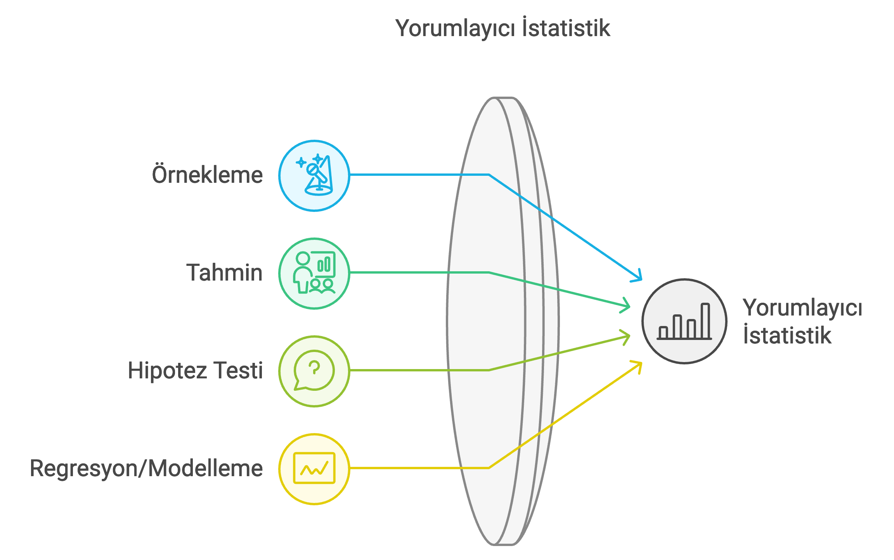
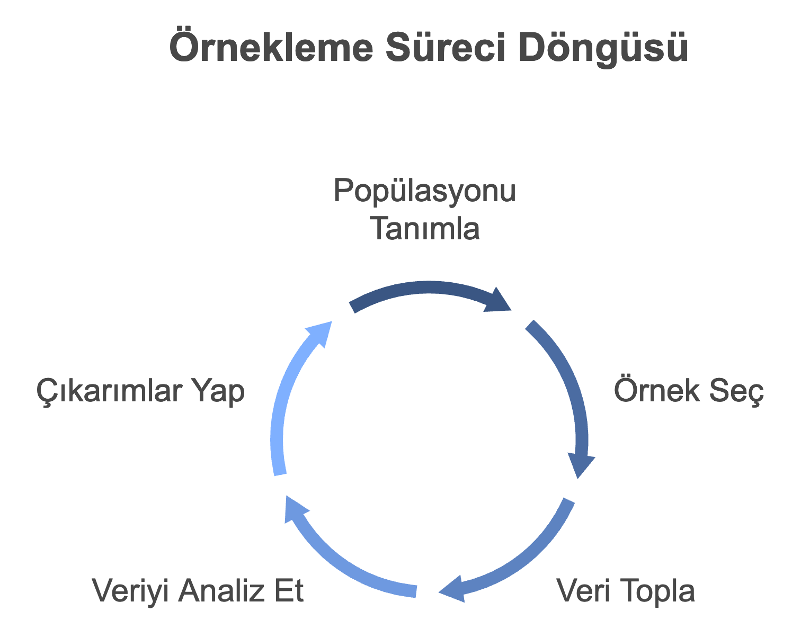
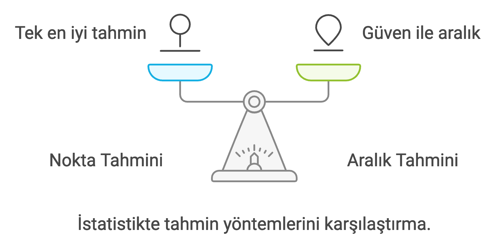

```{r setup, echo=FALSE, message=FALSE}
# loaded packages
library(here)
library(tidyverse)

here <- here::here()
dpath <- "data"
```

# Çıkarımsal İstatistik

Veriyi **tanımlayıcı istatistikler** (betimleyici istatistik olarak da bilinir) kullanarak özetledikten sonra, istatistiksel çıkarım yöntemleriyle sorulara yanıt verebiliriz. Tanımlayıcı istatistikler, veri setinin temel özelliklerini tanımlamak ve özetlemek için kullanılır. Ancak bu istatistik türü, veriye dair sadece yüzeysel bir genel bakış sunar ve elde edilen sonuçlar yalnızca mevcut veriyle sınırlıdır.

İstatistiğin asıl güçlü ve geniş kapsamlı kısmı, **veriler hakkında çıkarımlar yapmamızı sağlayan Çıkarımsal istatistiktir**. Çıkarımsal istatistik, veriyi analiz ederek daha geniş bir kitleye dair genellemeler yapmamızı sağlar ve bu sayede gözlemlediğimiz örneklemden yola çıkarak evrensel ya da daha büyük popülasyonlar hakkında tahminlerde bulunabiliriz. Bu, yalnızca örneklemin ötesine geçerek daha geniş bir perspektif elde etmemizi mümkün kılar ve araştırma sonuçlarını anlamlandırmada önemli bir rol oynar.

{fig-align="center"}

Çıkarımsal istatistik, daha küçük bir gruptan (örneklem) elde edilen verilerle daha büyük bir grup (popülasyon) hakkında çıkarımlarda bulunmayı içerir. Bu yöntem son derece yararlıdır, çünkü çoğu zaman bir popülasyondaki tüm bireylerden veri toplamak pratik değildir ya da imkansızdır.

Çıkarımsal istatistik geleneksel olarak dört ana alana ayrılır: örnekleme, tahmin, hipotez testi ve regresyon/modelleme.

{fig-align="center"}

## **Örnekleme (Sampling):**

Örnekleme, popülasyonun tamamı yerine, onu temsil edecek küçük bir grup seçmeyi kapsar. Bu süreç, popülasyon hakkında güvenilir çıkarımlar yapabilmek için oldukça kritiktir. Örneğin, bir şehirdeki tüm bireylerin gelir düzeyini incelemek yerine, iyi bir şekilde seçilmiş bir örneklemden elde edilen verilerle popülasyonun genel gelir düzeyi hakkında sonuçlar çıkarabiliriz. Örneklem uygun şekilde seçildiğinde, örneklemden elde edilen sonuçlar genelde popülasyonun tamamını doğru bir şekilde yansıtır.

{fig-align="center"}

## **Tahmin (Estimation):**

Tahmin, örneklem verilerini kullanarak popülasyonun bilinmeyen bir parametresini öngörmeyi amaçlar. Tahmin iki türde yapılabilir:

-   **Nokta tahmini (Point estimation):** Bir parametre için tek bir en iyi tahmin sunar (örneğin, belirli bir örneklem grubunun ortalama gelirini popülasyonun ortalama geliri olarak tahmin etmek gibi).

-   **Aralık tahmini (Interval estimation):** Parametrenin belirli bir güven aralığı içinde hangi değere sahip olduğunu belirtir (örneğin, popülasyonun ortalama gelir düzeyinin %95 güven düzeyiyle 40.000 TL ile 45.000 TL arasında olduğunu tahmin etmek).

{fig-align="center"}

## **Regresyon/Modelleme**:

Regresyon ve modelleme, veri içindeki değişkenler arasındaki ilişkileri incelemek ve bir sonuç değişkenini (bağımlı değişken) tahmin etmek için kullanılan yöntemlerdir. Regresyon analizinin temel amacı, bir veya birden fazla bağımsız değişkenin bağımlı değişken üzerindeki etkisini ölçmektir. Bu yöntem, sadece bir ilişkiyi tanımlamakla kalmaz, aynı zamanda bu ilişkiyi sayısal olarak modelleyerek gelecekteki gözlemler için tahmin yapmamızı sağlar.

Örneğin, sosyal bilimlerde bir araştırmacı, bireylerin eğitim düzeylerinin gelirleri üzerindeki etkisini incelemek isteyebilir. Bu durumda, bağımsız değişken eğitim seviyesi, bağımlı değişken ise gelir düzeyi olur. Doğrusal regresyon modeli, eğitim düzeyindeki değişikliklerin gelir üzerindeki etkisini sayısal olarak ifade eder.

Regresyon ve modelleme çeşitli alt türlere sahiptir:

-   **Doğrusal Regresyon**: Bağımlı ve bağımsız değişken arasındaki ilişkiyi doğrusal bir model ile ifade eder.

-   **Lojistik Regresyon**: Bağımlı değişkenin iki olasılıklı (örneğin, evet/hayır gibi) olduğu durumlar için kullanılır.

-   **Çoklu Regresyon**: Birden fazla bağımsız değişkenin, bağımlı değişken üzerindeki etkisini ölçer.

{fig-align="center"}

Regresyon ve modelleme yöntemleri, sadece mevcut veriyi anlamak için değil, aynı zamanda gelecekteki durumlara dair tahminler yapmak için de kritik öneme sahiptir. Bu özellikleriyle, hipotez testinden ayrılarak araştırmada ileri düzeyde analiz ve öngörü sağlarlar.

::: callout-note
💡 **Not: Farklı Regresyon ve Modelleme Türleri**

Regresyon analizinde kullanılan birçok farklı modelleme tekniği, veri yapısına ve analiz amaçlarına göre seçilir. Bu teknikler, farklı ilişkileri ve etkileri daha doğru anlamamıza olanak tanır. İşte bazı yaygın modelleme türleri:

-   **Polinom Regresyon**: Bağımlı ve bağımsız değişken arasındaki ilişki doğrusal değilse, daha karmaşık eğriler (örneğin, parabolik bir ilişki) kullanılarak modellenir. Örneğin, yaş ve gelir arasındaki ilişki doğrusal olmayabilir ve polinom regresyon daha iyi bir uyum sağlar.

-   **Zaman Serisi Analizi**: Veriler zaman içinde düzenli aralıklarla toplandığında, zaman serisi modelleri kullanılır. Sosyal bilimlerde, ekonomik göstergelerin yıllık değişimlerini incelemek gibi örneklerde bu model faydalıdır.

-   **Panel Veri Modelleri**: Birden fazla değişkenin zaman içindeki değişimlerini dikkate alarak analiz yapar ve genellikle birey veya ülke düzeyinde verilerin karşılaştırılmasında kullanılır.

-   **Karar Ağaçları ve Random Forest**: Bu modeller, karar ağaçları kullanarak veriyi sınıflandırır veya tahmin yapar. Random Forest modeli, birden fazla karar ağacının sonuçlarını birleştirerek daha sağlam ve tutarlı tahminler elde eder.

-   **Kümeleme Analizleri**: Verilerin doğal gruplarını belirlemeye yönelik modelleme tekniğidir. Örneğin, sosyal medya kullanıcılarının davranışlarına göre segmentler oluşturmak için kümeleme analizleri kullanılabilir.

-   **Makine Öğrenmesi Tabanlı Modeller**: Regresyon ve geleneksel modellemeler dışında, doğrusal olmayan ilişkileri daha iyi analiz edebilen yapay sinir ağları, destek vektör makineleri gibi daha karmaşık ve esnek yöntemlerdir.

Bu farklı modeller, özellikle daha karmaşık veri yapılarında ve ileri düzey analizlerde kullanılır. Bu sayede, yalnızca doğrusal ilişkileri değil, çok boyutlu ve dinamik etkileri de kapsamlı bir şekilde analiz edebiliriz.
:::

## **Hipotez Testi (Hypothesis Testing):**

Hipotez testi, örneklem verilerine dayanarak popülasyon hakkında kararlar vermek veya iddiaları test etmek için kullanılır. Örneğin, bir şirket, müşteri memnuniyetinin %90 olduğunu iddia edebilir. Bu iddiayı test etmek için rastgele bir müşteri örnekleminden veriler toplanır ve sonuçlar analiz edilir.

Hipotez testi şu adımları içerir:

-   Karşıt iki hipotez (sav) oluşturma: Biri iddiayı temsil eder (örneğin, müşteri memnuniyeti %90'dır), diğeri ise alternatif bir durumu temsil eder (örneğin, müşteri memnuniyeti %90’dan azdır).

-   Örneklem verilerini analiz ederek, hangi savın mevcut verilere göre daha doğru olduğunu değerlendirme.

{fig-align="center"}

Örnekleme, tahmin, regresyon/modelleme ve hipotez testi, Çıkarımsal istatistiğin temel araçlarıdır ve verilerden çıkarımlar yapmamızı sağlar. Bu araçlar, örneklemin doğal olarak içerdiği rastgele değişim faktörünü hesaba katarak popülasyon hakkında güvenilir ve anlamlı sonuçlar çıkarmamızı mümkün kılar.
