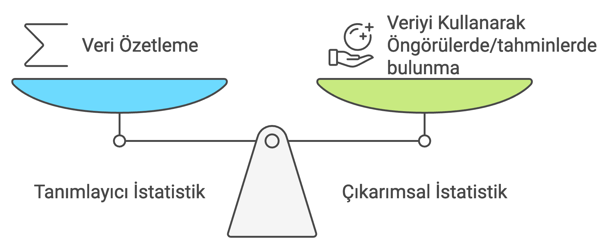
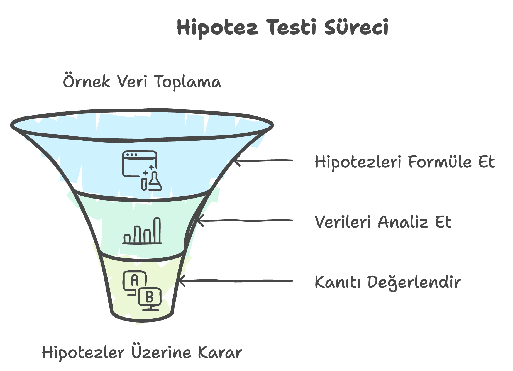
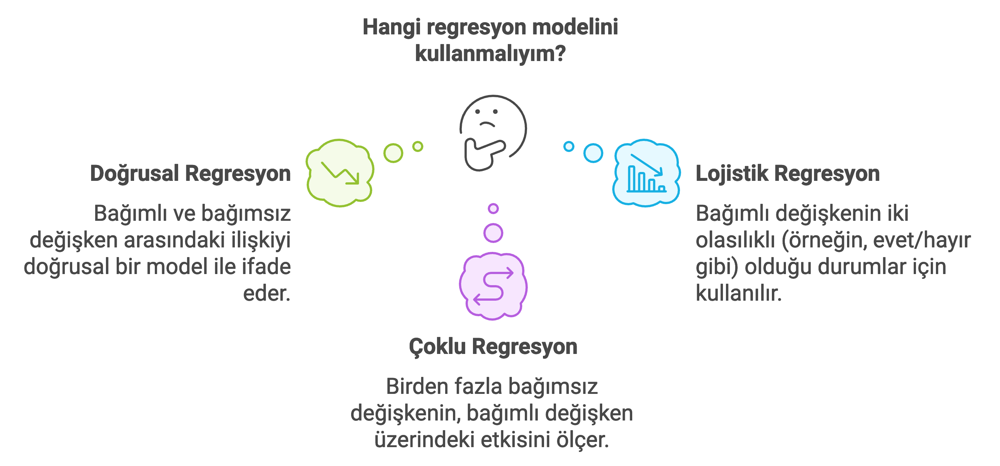

```{r}
#| label: setup
#| include: false
library(dplyr)
library(gapminder)
library(here)
```

# Tanımlayıcıdan Çıkarımsala

Modül 04'te tek bir örneklemi özetlemeyi öğrendiniz: `gapminder`'daki
142 ülkenin yaşam beklentisi ortalamasını, kişi başı GSYİH'nin
medyanını, kıtalar arası korelasyonu hesapladınız. Bu **tanımlayıcı
istatistik**tir — elinizdeki veriyi özetler, ondan öteye geçmez.

Ama araştırmacı olarak asıl sorduğunuz soru nadiren "bu 142 ülkede ne
oldu?" sorusudur. Genelde şunu sorarsınız: *gelecek yıl* ne olur?
*Elimde olmayan* ülkeler için de geçerli mi? Bu örneklemden yola
çıkarak *daha geniş bir evren* hakkında ne söyleyebilirim? Bu sorulara
cevap veren araç **çıkarımsal istatistik**tir.

{fig-align="center"}

Çıkarımsal istatistik, daha küçük bir gruptan (**örneklem**) elde
edilen verilerle daha büyük bir grup (**popülasyon**) hakkında
çıkarımlarda bulunmayı içerir. Bunun gerekli olmasının nedeni basit:
popülasyondaki her birimden veri toplamak çoğu zaman ya imkânsız ya da
gereksiz maliyetlidir.

# Popülasyon ve Örneklem: Bir Düşünce Deneyi

`gapminder`, dünyadaki neredeyse tüm ülkeleri kapsadığı için popülasyon
ile örneklem arasındaki farkı hissetmek zor olabilir. Bunu somutlaştırmak
için 2007 kesitinden **rastgele 20 ülkelik bir örneklem** çekelim ve
sanki elimizde yalnızca bu 20 ülke varmış gibi düşünelim:

```{r}
#| label: ornek-cek
set.seed(2026)
ornek_20 <- gapminder |>
  filter(year == 2007) |>
  slice_sample(n = 20)

ornek_20 |> select(country, continent, lifeExp) |> arrange(desc(lifeExp))
```

```{r}
#| label: ornek-vs-populasyon
populasyon_2007 <- gapminder |> filter(year == 2007)

data.frame(
  grup = c("Örneklem (n = 20)", "Popülasyon (N = 142)"),
  ort_yasam_beklentisi = c(mean(ornek_20$lifeExp), mean(populasyon_2007$lifeExp))
)
```

İki ortalama birbirine yakın ama **aynı değil**. Bu fark, tesadüfen
hangi 20 ülkeyi çektiğimizden kaynaklanır — buna **örnekleme hatası**
denir. Çıkarımsal istatistiğin temel sorusu tam olarak budur: elimdeki
örneklem ortalaması, gerçek popülasyon ortalamasından *ne kadar*
sapabilir, ve bu sapmayı hesaba katarak nasıl güvenilir bir sonuç
çıkarabilirim?

::: callout-note
## Neden `set.seed()`?

`slice_sample()` her çalıştırıldığında farklı bir rastgele örneklem
seçer. `set.seed(2026)` bu rastgeleliği **sabitler**: aynı kodu siz de
çalıştırdığınızda birebir aynı 20 ülkeyi elde edersiniz. Bilimsel
yeniden üretilebilirliğin R'daki karşılığı budur.
:::

# Çıkarımsal İstatistiğin Dört Sütunu

Çıkarımsal istatistik dört ana alana ayrılır. Dönemin geri kalanı
(7.–11. oturumlar) bu dört sütunu sırayla, hep aynı `gapminder`
zemininde işleyecek.

{fig-align="center"}

## Örnekleme (Sampling)

Popülasyonun tamamı yerine, onu temsil edecek küçük bir grup seçme
sürecidir. Örneklem *rastgele* ve *yeterince büyük* olduğunda,
popülasyonu makul bir yaklaşıklıkla yansıtır — yukarıdaki 20 ülkelik
örneklemin ortalamasının popülasyon ortalamasına yakın çıkması tesadüf
değildi. Bu konuyu **7. oturumda** (`07_modul/`), örneklem dağılımı ve
Merkezi Limit Teoremi ile birlikte derinleştireceğiz.

{fig-align="center"}

## Tahmin (Estimation)

Örneklem verisini kullanarak popülasyonun bilinmeyen bir parametresini
öngörmektir. İki türü vardır:

-   **Nokta tahmini:** tek bir sayı (örneğin, yukarıdaki örneklemin
    ortalaması, `r round(mean(ornek_20$lifeExp), 1)` yıl).
-   **Aralık tahmini:** parametrenin belirli bir **güven aralığı**
    içinde olduğunu belirtir ("popülasyon ortalaması %95 güvenle
    X ile Y yılı arasındadır" gibi).

Güven aralıklarını **telafi oturumunda** (`09_modul/`) hesaplayacağız.

{fig-align="center"}

## Hipotez Testi (Hypothesis Testing)

Örneklem verisine dayanarak popülasyon hakkında bir iddiayı test etme
sürecidir. Örneğin: "Avrupa ülkelerinin ortalama yaşam beklentisi,
Asya ülkelerininkinden farklıdır" iddiasını, elimizdeki örneklemin bu
farkı destekleyip desteklemediğine bakarak değerlendiririz. Bunu
**8. ve 9. oturumlarda** (`10_modul/`) t-testi, ki-kare ve ANOVA ile
işleyeceğiz.

{fig-align="center"}

## Regresyon / Modelleme

Değişkenler arasındaki ilişkiyi sayısal olarak ifade edip, bir sonuç
değişkenini (bağımlı değişken) tahmin etmeye yarar. Bu derste **üç**
regresyon türünü işleyeceğiz:

{fig-align="center"}

::: callout-important
## Kapsam sınırı

Regresyon ve modelleme literatürü çok geniştir (zaman serisi, panel
veri modelleri, karar ağaçları, yapay sinir ağları gibi onlarca
yöntem içerir). **Bu ders yalnızca yukarıdaki üç yöntemi** —doğrusal,
çoklu ve lojistik regresyonu— kapsar; bunlar **10. ve 11. oturumlarda**
(`11_modul/`, `12_modul/`, `13_modul/`) işlenecektir. Diğer yöntemler
bu dersin kapsamı dışındadır.
:::

# Bu Yolculuğun İlk Durağı: Olasılık

Yukarıdaki dört sütunun hepsi, ortak bir temel üzerine kuruludur:
**olasılık**. Bir örneklem ortalamasının popülasyon ortalamasından ne
kadar sapabileceğini konuşabilmemiz için önce "sapma" kavramını
sayısallaştırmamız, yani **rastgele değişkenler** ve **olasılık
dağılımları**yla çalışmayı öğrenmemiz gerekiyor. Bir sonraki belgede
(`06_modul_ders_olasilik.qmd`) tam olarak buna bakacağız.

# Özet

::: callout-note
**Bu belgede öğrendikleriniz**

-   Tanımlayıcı istatistik (veriyi özetler) ile çıkarımsal istatistik
    (veriden popülasyona genelleme yapar) arasındaki fark
-   **Popülasyon** ve **örneklem** kavramları; `slice_sample()` ile
    rastgele örneklem çekmek
-   **Örnekleme hatası**: örneklem istatistiğinin popülasyon
    parametresinden sapması
-   `set.seed()` ile rastgeleliği sabitleyip yeniden üretilebilirlik
    sağlamak
-   Çıkarımsal istatistiğin dört sütunu: örnekleme, tahmin, hipotez
    testi, regresyon/modelleme — ve her birinin dönem içindeki yeri
-   Bu dersin regresyon kapsamının doğrusal, çoklu ve lojistik
    regresyonla sınırlı olduğu
:::

# Sırada Ne Var?

Dört sütunun ortak temeli olan **olasılığa** geçiyoruz
(`06_modul_ders_olasilik.qmd`): rastgele değişkenler, olasılık
dağılımları ve bunları R'da nasıl hesaplayacağımız. Ardından
**3. oturumda** bu modülle birlikte işlenen Quarto ile raporlama
konusuna (`06_modul_ders_quarto.qmd`), **7. oturumda** ise örnekleme
dağılımı ve Merkezi Limit Teoremi'ne geçeceğiz.
