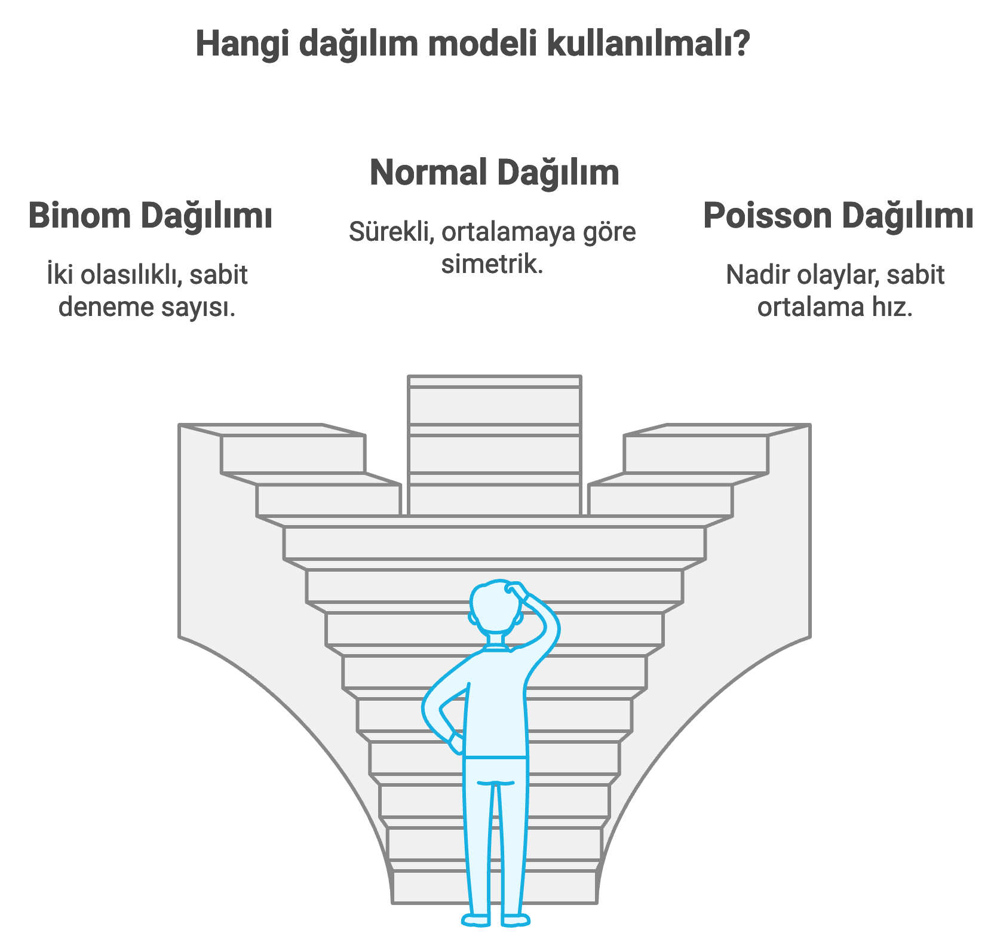

```{r}
#| label: setup
#| include: false
library(dplyr)
library(ggplot2)
library(gapminder)
library(here)
```

# Olasılık Nedir?

**Olasılık**, bir olayın gerçekleşme ihtimalini 0 ile 1 arasında bir
sayıyla ifade eder: 0 "kesinlikle gerçekleşmez", 1 "kesinlikle
gerçekleşir", 0.5 ise "gerçekleşme ve gerçekleşmeme ihtimali eşit"
demektir. Bir madeni parayı attığınızda yazı gelme olasılığı 0.5'tir —
bu sezgi herkese tanıdıktır ve olasılığın "adil" bir örneklem uzayında
ne anlama geldiğini gösterir.

Bu derste bu sezgiyi zar ve para örneklerinde bırakmayıp, kursun
başından beri kullandığımız `gapminder` verisine taşıyacağız. Amaç
yalnızca formülleri elle hesaplamak değil, **R'ın olasılık ve dağılım
fonksiyonlarını** kullanmayı öğrenmektir.

# Klasik ve Deneysel Olasılık

**Klasik (teorik) olasılık**, örneklem uzayındaki tüm sonuçların eşit
olası olduğu varsayımıyla doğrudan hesaplanır:

$$ P(\text{olay}) = \frac{\text{istenen sonuç sayısı}}{\text{olası tüm sonuç sayısı}} $$

`gapminder`'da 1704 ülke-yıl gözlemi var. Rastgele birini seçersem,
Afrika kıtasından olma olasılığı nedir?

```{r}
#| label: klasik-olasilik
teorik_p <- mean(gapminder$continent == "Africa")
teorik_p
```

`mean()` burada bir kısayol: `continent == "Africa"` her gözlem için
`TRUE`/`FALSE` üretir, ortalaması ise "kaçta kaçının doğru olduğu",
yani tam olarak klasik olasılık formülüdür.

**Deneysel (ampirik) olasılık** ise bir deneyi çok sayıda tekrarlayıp,
istenen sonucun görülme *sıklığına* bakar. Deneme sayısı arttıkça
deneysel olasılık teorik değere yaklaşır — buna **Büyük Sayılar
Kanunu** denir. Bunu R'da `sample()` ile simüle edelim:

```{r}
#| label: deneysel-olasilik
set.seed(2026)
buyuklukler <- c(10, 50, 100, 500, 1000, 5000, 10000)
deneysel_p <- sapply(buyuklukler, function(n) {
  ornek <- sample(gapminder$continent, size = n, replace = TRUE)
  mean(ornek == "Africa")
})
data.frame(orneklem_buyuklugu = buyuklukler, deneysel_olasilik = round(deneysel_p, 3))
```

```{r}
#| label: fig-buyuk-sayilar
#| fig-cap: "Deneysel olasılık, örneklem büyüdükçe teorik değere yakınsar"
ggplot(data.frame(n = buyuklukler, p = deneysel_p), aes(n, p)) +
  geom_line(color = "#2E6E8E") +
  geom_point(color = "#2E6E8E", size = 2) +
  geom_hline(yintercept = teorik_p, linetype = "dashed", color = "firebrick") +
  scale_x_log10() +
  labs(x = "Örneklem büyüklüğü (log ölçek)", y = "Deneysel olasılık (Afrika)") +
  theme_minimal()
```

Kesikli çizgi teorik değeri (`r round(teorik_p, 3)`) gösteriyor; mavi
nokta dizisi örneklem büyüdükçe ona yaklaşıyor. `sample(..., replace =
TRUE)`'daki `replace = TRUE` argümanına dikkat edin: her çekilişten
sonra gözlemi "geri koyuyoruz", böylece her deneme birbirinden
**bağımsız** kalıyor. Bağımsızlığın neden önemli olduğuna birazdan
döneceğiz.

# Temel Kavramlar

1.  **Deney**: sonucu belirsiz herhangi bir işlem. `gapminder`'dan
    rastgele bir ülke-yıl gözlemi seçmek bir deneydir.
2.  **Örneklem uzayı**: tüm olası sonuçların kümesi. Kıta değişkeni
    için örneklem uzayı `r paste(levels(gapminder$continent), collapse = ", ")`
    şeklindeki 5 kategoridir.
3.  **Olay**: örneklem uzayının bir alt kümesi. Örneğin, "seçilen
    gözlemin yaşam beklentisinin 70'in üzerinde olması" bir olaydır.
4.  **Bağımsız olaylar**: birinin sonucu diğerini etkilemez. Yukarıdaki
    simülasyonda `replace = TRUE` kullanmamızın nedeni buydu.
5.  **Bağımlı olaylar**: birinin sonucu diğerinin olasılığını
    değiştirir. `gapminder`'dan **yerine koymadan** iki farklı ülke
    seçersek, ilk seçim ikinci seçimin olasılık uzayını daraltır — tam
    da bir desteden yerine koymadan iki kart çekmek gibi.

3. maddedeki olayın olasılığını hesaplayalım:

```{r}
#| label: olay-ornegi
mean(gapminder$lifeExp > 70)
```

::: callout-note
## `replace = TRUE` vs `replace = FALSE`

`sample(x, size, replace = TRUE)` aynı birimi birden çok kez
seçebilir (bağımsız denemeler). `replace = FALSE` (varsayılan) her
birimi en fazla bir kez seçer (bağımlı denemeler) — modül 05'te
`slice_sample()` ile yaptığımız örneklemenin arkasındaki de budur.
:::

# Toplama ve Çarpma Kuralları

**Toplama kuralı**, birbirini dışlayan (aynı anda gerçekleşemeyen)
olaylardan **en az birinin** gerçekleşme olasılığını verir; olasılıklar
toplanır. Bir gözlemin Afrika **veya** Asya kıtasından olma olasılığı:

```{r}
#| label: toplama-kurali
p_afrika <- mean(gapminder$continent == "Africa")
p_asya <- mean(gapminder$continent == "Asia")
p_afrika + p_asya
```

Bir kıta bir gözlemde yalnızca tek bir değer alabildiği için (bir ülke
aynı anda hem Afrikalı hem Asyalı olamaz) bu iki olay birbirini
dışlar ve olasılıklar doğrudan toplanabilir.

**Çarpma kuralı**, **bağımsız** iki olayın **birlikte** gerçekleşme
olasılığını verir; olasılıklar çarpılır. Yerine koyarak seçtiğimiz iki
gözlemin **ikisinin de** Avrupa kıtasından olma olasılığı:

```{r}
#| label: carpma-kurali
p_avrupa <- mean(gapminder$continent == "Europe")
p_avrupa^2
```

::: callout-warning
## Bağımsız değilse çarpma kuralı doğrudan uygulanmaz

Eğer iki seçim **bağımsız değilse** (yerine koymadan seçim gibi),
ikinci olasılık ilkine bağlı olarak değişir ve hesaba **koşullu
olasılık** girer. Koşullu olasılığın kendisi bu dersin kapsamı
dışındadır; burada yalnızca bağımsız durumu işliyoruz.
:::

# Rastgele Değişkenler: Kesikli ve Sürekli

Bir **rastgele değişken**, bir deneyin her olası sonucuna bir sayı
atayan fonksiyondur. İki türü vardır:

{fig-align="center"}

-   **Kesikli rastgele değişken**: sayılabilir, genellikle tam sayı
    değerler alır. Örnek: rastgele seçilen 10 ülkeden kaçının Afrika
    kıtasından olduğu — 0, 1, 2, … 10 değerlerinden birini alır.
-   **Sürekli rastgele değişken**: bir aralıktaki sonsuz sayıda değeri
    alabilir. Örnek: yaşam beklentisinin kendisi (`lifeExp`) — 42.6,
    42.61, 42.611… gibi ondalıklı herhangi bir değer olabilir.

Bu ayrım önemlidir çünkü her tür için **farklı olasılık dağılımı
aileleri** kullanılır.

# Olasılık Dağılımları

Bir **olasılık dağılımı**, bir rastgele değişkenin alabileceği her
değere (veya değer aralığına) bir olasılık atar. R, en yaygın
dağılımlar için dört fonksiyon ailesi sunar: `d` (yoğunluk/kütle),
`p` (kümülatif olasılık), `q` (kantil) ve `r` (rastgele üretim) —
örneğin normal dağılım için `dnorm`, `pnorm`, `qnorm`, `rnorm`.

{fig-align="center"}

## Binom Dağılımı: Kesikli Değişkenler İçin

**Binom dağılımı**, sabit sayıda **bağımsız** denemede (her biri
"başarı" ya da "başarısızlık"), belirli bir başarı sayısının olasılığını
verir. 10 ülkelik bağımsız bir örneklemde kaç tanesinin Afrika
kıtasından çıkacağını modelleyelim (başarı olasılığı, popülasyondaki
gerçek Afrika oranı):

```{r}
#| label: binom-hesap
n_deneme <- 10
p_basari <- mean(gapminder$continent == "Africa")

olasiliklar <- dbinom(0:n_deneme, size = n_deneme, prob = p_basari)
data.frame(afrika_sayisi = 0:n_deneme, olasilik = round(olasiliklar, 4))
```

```{r}
#| label: fig-binom
#| fig-cap: "Binom dağılımı: 10 ülkelik bağımsız örneklemde Afrika sayısı"
ggplot(data.frame(k = 0:n_deneme, p = olasiliklar), aes(k, p)) +
  geom_col(fill = "#2E6E8E") +
  scale_x_continuous(breaks = 0:n_deneme) +
  labs(x = "Afrika kıtasından ülke sayısı (k)", y = "P(X = k)") +
  theme_minimal()
```

`dbinom(k, size, prob)` tam olarak "$k$ başarı olasılığı" sorusuna
cevap verir. `pbinom()` ise **kümülatif** olasılık verir — "en fazla
$k$" sorusuna cevaptır. Örneğin, 10 ülkelik örneklemde **en az 3**
tanesinin Afrika'dan olma olasılığı:

```{r}
#| label: pbinom-ornek
1 - pbinom(2, size = n_deneme, prob = p_basari)
```

("En az 3" = "2 veya daha az değil"; bu yüzden `pbinom(2, ...)`'i
1'den çıkarıyoruz.)

::: callout-tip
## İleri düzey (sınav kapsamı dışı): Ya yerine koymadan seçim yapsaydık?

Yukarıdaki binom modeli **bağımsız denemeleri** varsayar — bu yüzden
sayfanın başında `sample(..., replace = TRUE)` kullanmıştık. Ama
gerçek anket ve saha araştırmalarında bir ülke ya da katılımcı
genellikle **yerine koymadan** seçilir (aynı kişiye anketi iki kez
uygulamazsınız). Yerine koymadan seçimde her çekiliş bir öncekine
**bağımlıdır** ve teknik olarak doğru dağılım binom değil,
**hipergeometrik dağılım**dır (R'da `dhyper()`). Popülasyon örnekleme
oranına göre büyükse (bizim durumumuzda olduğu gibi) iki dağılım
birbirine çok yaklaşır ve binom yaklaşımı pratikte yeterlidir — bu
yüzden bu ders `dhyper()`'i işlemeyecek, yalnızca varlığını bilmeniz
yeterli.
:::

## Normal Dağılım: Sürekli Değişkenler İçin

**Normal dağılım**, ortalama etrafında simetrik, çan eğrisi şeklindeki
sürekli dağılımdır. 2007 kesitindeki yaşam beklentisi değerlerinin bu
şekle ne kadar uyduğuna bakalım:

```{r}
#| label: normal-parametreler
yb_2007 <- gapminder |> filter(year == 2007) |> pull(lifeExp)
ort <- mean(yb_2007)
ss <- sd(yb_2007)
c(ortalama = ort, standart_sapma = ss)
```

```{r}
#| label: fig-normal
#| fig-cap: "2007 yaşam beklentisi dağılımı ve normal yaklaşım"
ggplot(data.frame(x = yb_2007), aes(x)) +
  geom_histogram(aes(y = after_stat(density)), bins = 20,
                  fill = "#EAF1F5", color = "#2E6E8E") +
  stat_function(fun = dnorm, args = list(mean = ort, sd = ss),
                 color = "firebrick", linewidth = 1) +
  labs(x = "Yaşam beklentisi (2007)", y = "Yoğunluk") +
  theme_minimal()
```

::: callout-warning
## Bu dağılım tam simetrik değil

Modül 04'te gördüğünüz gibi, yaşam beklentisi **sola çarpık**tır —
düşük yaşam beklentili birkaç ülke sol kuyruğu uzatır. Normal dağılım
yalnızca bir **yaklaşımdır**; aşağıdaki karşılaştırma bu yaklaşımın ne
kadar sıkı olduğunu gösterir.
:::

`pnorm()`, normal dağılıma göre kümülatif olasılık verir. Yaşam
beklentisi 75'in altında olma olasılığını, normal yaklaşıma göre
hesaplayıp gerçek (ampirik) oranla karşılaştıralım:

```{r}
#| label: pnorm-karsilastirma
data.frame(
  yontem = c("Normal yaklaşım (pnorm)", "Gerçek (ampirik) oran"),
  olasilik = c(pnorm(75, mean = ort, sd = ss), mean(yb_2007 < 75))
)
```

İki değer birbirine yakın ama özdeş değil — tam olarak yukarıdaki
çarpıklık uyarısının öngördüğü küçük sapma.

## Rastgele Üretim: `rbinom()` ve `rnorm()`

`d`/`p`/`q` fonksiyonları olasılık *hesaplar*; `r` ile başlayanlar
("random") ise o dağılımdan rastgele veri *üretir*. Bunlar özellikle
simülasyon tabanlı analizlerde (ör. bootstrap, güç analizi) kullanılır:

```{r}
#| label: rastgele-uretim
set.seed(2026)
rbinom(5, size = n_deneme, prob = p_basari)  # 5 simüle örneklemde Afrika sayısı
rnorm(5, mean = ort, sd = ss)                # normal dağılımdan 5 simüle yaşam beklentisi
```

# Özet

::: callout-note
**Bu belgede öğrendikleriniz**

-   Klasik (teorik) olasılık ile deneysel (ampirik) olasılık; Büyük
    Sayılar Kanunu
-   Deney, örneklem uzayı, olay, bağımsız/bağımlı olay kavramları
-   Toplama kuralı (birbirini dışlayan olaylar için) ve çarpma kuralı
    (bağımsız olaylar için)
-   Kesikli ve sürekli rastgele değişken ayrımı
-   R'ın dağılım fonksiyon ailesi: `d`/`p`/`q`/`r` önekleri
-   Binom dağılımı (`dbinom`, `pbinom`) ve normal dağılım (`dnorm`,
    `pnorm`) ile olasılık hesaplama
-   `rbinom()`/`rnorm()` ile bir dağılımdan rastgele veri üretme
:::

# Sırada Ne Var?

Bu belgede ürettiğimiz normal yaklaşım aslında **7. oturumda**
(`07_modul/`) işleyeceğimiz **örnekleme dağılımı** ve **Merkezi Limit
Teoremi**'nin temelini oluşturuyor: tek tek ülkelerin yaşam beklentisi
dağılımı çarpıkken, *örneklem ortalamalarının* dağılımı — örneklem
yeterince büyükse — neredeyse her zaman normale yakınsar. Bir sonraki
oturumda bunu simülasyonla göstereceğiz.
