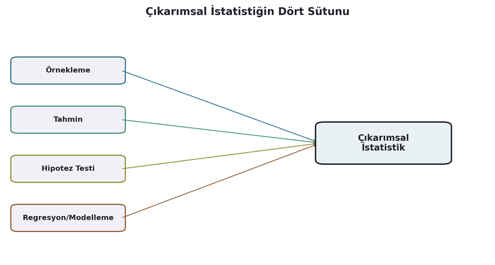

```{r}
#| include: false
library(dplyr)
library(ggplot2)
library(gapminder)
library(here)
```

## 🎯 Öğrenme Hedefleri

Bu oturumun sonunda:

-   Tanımlayıcı ve çıkarımsal istatistik arasındaki farkı
    açıklayabileceksiniz
-   Çıkarımsal istatistiğin dört sütununu (örnekleme, tahmin, hipotez
    testi, regresyon) ve dönem içindeki yerlerini bileceksiniz
-   Klasik ve deneysel olasılığı ayırt edip R'da hesaplayabileceksiniz
-   Kesikli ve sürekli rastgele değişkeni ayırt edebileceksiniz
-   `dbinom()`, `pbinom()`, `dnorm()`, `pnorm()` fonksiyonlarını
    kullanabileceksiniz

# Tanımlayıcıdan Çıkarımsala

## İki Farklı Soru

::: incremental
-   **Tanımlayıcı:** "Bu 142 ülkede yaşam beklentisi ortalaması
    nedir?" — elimdeki veriyle sınırlı.
-   **Çıkarımsal:** "Elimdeki örneklemden yola çıkarak, daha geniş bir
    evren hakkında ne söyleyebilirim?" — genellemeye çalışır.
:::

## Popülasyon vs. Örneklem

```{r}
set.seed(2026)
ornek_20 <- gapminder |> filter(year == 2007) |> slice_sample(n = 20)
populasyon_2007 <- gapminder |> filter(year == 2007)

c(orneklem_ortalamasi = mean(ornek_20$lifeExp),
  populasyon_ortalamasi = mean(populasyon_2007$lifeExp))
```

::: incremental
-   İki değer **yakın ama farklı** → **örnekleme hatası**
-   `set.seed()` → rastgeleliği sabitler, yeniden üretilebilirlik sağlar
:::

# Çıkarımsal İstatistiğin Dört Sütunu

## Dört Sütun, Tek Amaç

```{r}
#| echo: false

```

## Örnekleme

Popülasyonu temsil edecek küçük bir grup seçmek. **→ 7. oturum**
(örneklem dağılımı, Merkezi Limit Teoremi)

## Tahmin

::: incremental
-   **Nokta tahmini:** tek bir sayı
-   **Aralık tahmini:** güven aralığı
:::

**→ Telafi oturumu** (güven aralıkları)

## Hipotez Testi

Örneklem verisiyle bir popülasyon iddiasını test etmek. **→ 8.–9.
oturumlar** (t-testi, ki-kare, ANOVA)

## Regresyon / Modelleme

::: incremental
-   Doğrusal regresyon
-   Çoklu regresyon
-   Lojistik regresyon
:::

::: {.callout-important}
Bu ders yalnızca bu üç yöntemi kapsar — zaman serisi, panel veri,
makine öğrenmesi yöntemleri **kapsam dışı**.
:::

# Olasılığa Giriş

## Klasik Olasılık

```{r}
teorik_p <- mean(gapminder$continent == "Africa")
teorik_p
```

$$ P(\text{olay}) = \frac{\text{istenen sonuç}}{\text{olası tüm sonuçlar}} $$

## Deneysel Olasılık: Büyük Sayılar Kanunu

```{r}
#| fig-height: 3.6
set.seed(2026)
buyuklukler <- c(10, 50, 100, 500, 1000, 5000, 10000)
deneysel_p <- sapply(buyuklukler, function(n) {
  mean(sample(gapminder$continent, size = n, replace = TRUE) == "Africa")
})
ggplot(data.frame(n = buyuklukler, p = deneysel_p), aes(n, p)) +
  geom_line(color = "#2E6E8E") + geom_point(color = "#2E6E8E", size = 2) +
  geom_hline(yintercept = teorik_p, linetype = "dashed", color = "firebrick") +
  scale_x_log10() + theme_minimal()
```

## Temel Kavramlar

::: incremental
-   **Deney** · **Örneklem uzayı** · **Olay**
-   **Bağımsız olaylar:** `replace = TRUE`
-   **Bağımlı olaylar:** `replace = FALSE`
:::

## Toplama ve Çarpma Kuralları

```{r}
p_afrika <- mean(gapminder$continent == "Africa")
p_asya   <- mean(gapminder$continent == "Asia")
p_avrupa <- mean(gapminder$continent == "Europe")

c(toplama_afrika_veya_asya = p_afrika + p_asya,
  carpma_iki_avrupali      = p_avrupa^2)
```

# Rastgele Değişkenler ve Dağılımlar

## Kesikli vs. Sürekli

```{r}
#| echo: false
knitr::include_graphics("images/rasgeledegisken.png")
```

## Binom Dağılımı

```{r}
n_deneme <- 10
p_basari <- mean(gapminder$continent == "Africa")
olasiliklar <- dbinom(0:n_deneme, size = n_deneme, prob = p_basari)

ggplot(data.frame(k = 0:n_deneme, p = olasiliklar), aes(k, p)) +
  geom_col(fill = "#2E6E8E") +
  scale_x_continuous(breaks = 0:n_deneme) + theme_minimal()
```

## Normal Dağılım

```{r}
yb_2007 <- gapminder |> filter(year == 2007) |> pull(lifeExp)
ort <- mean(yb_2007); ss <- sd(yb_2007)

ggplot(data.frame(x = yb_2007), aes(x)) +
  geom_histogram(aes(y = after_stat(density)), bins = 20,
                  fill = "#EAF1F5", color = "#2E6E8E") +
  stat_function(fun = dnorm, args = list(mean = ort, sd = ss),
                 color = "firebrick", linewidth = 1) +
  theme_minimal()
```

## Normal Yaklaşım Ne Kadar Sıkı?

```{r}
c(normal_yaklasim = pnorm(75, mean = ort, sd = ss),
  gercek_oran     = mean(yb_2007 < 75))
```

Yaşam beklentisi **sola çarpık** → normal yaklaşım küçük bir hata
taşır.

## Özet

::: incremental
-   Tanımlayıcı ≠ çıkarımsal; çıkarımsal istatistik popülasyona
    genelleme yapar
-   Çıkarımsal istatistiğin dört sütunu ve dönem içindeki yerleri
-   Klasik vs. deneysel olasılık; Büyük Sayılar Kanunu
-   Toplama (VEYA) ve çarpma (VE) kuralları
-   Kesikli/sürekli rastgele değişken; binom ve normal dağılım
-   `dbinom()`, `pbinom()`, `dnorm()`, `pnorm()`
:::

## Sırada Ne Var?

**7. oturum:** Örnekleme dağılımı ve Merkezi Limit Teoremi
(`07_modul/`) — bugünkü normal yaklaşımın neden işe yaradığının
kanıtı.
