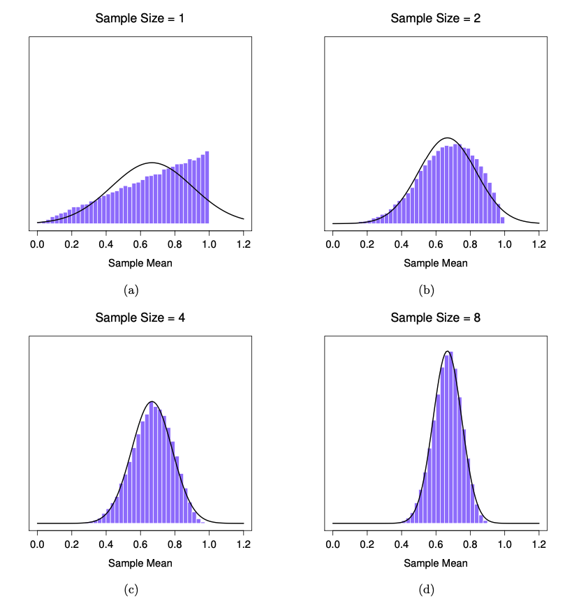

### Örneklem Dağılımları

Araştırmacılar olarak, genellikle elimizde sadece bir veri örneği bulunur. Örneğin, belirli sayıda katılımcıyla bir deney yapmış olabiliriz veya bir anket şirketi, belirli sayıda kişiyi telefonla arayarak oy verme eğilimlerini sormuş olabilir. Ancak her durumda, elimizdeki veri seti sınırlı ve eksiktir.

**İstatistik**, örneklerden hesaplanan sayısal değerlerdir ve genellikle bir popülasyon parametresini tahmin etmek için kullanılır. Örneğin:

-   Örneklem ortalaması $\bar{x}$, popülasyon ortalamasını $\mu$ tahmin eder.

-   Örneklem oranı $\hat{p}$, popülasyon oranını tahmin eder.

Örneğin, bir an için Türkiye'nin nüfusunu tahmin etmeyi düşünelim. Bunu en kesin şekilde bir nüfus sayımı gerçekleştirerek yapabilirsiniz. Nüfus sayımı, her haneye kaç kişinin yaşadığını sorarak tüm nüfusu kapsar. Ancak, bir nüfus sayımı yapmak oldukça maliyetlidir ve ciddi bir zaman ile emek gerektirir.

Daha uygun maliyetli bir alternatif, sadece az sayıda haneye soru sormak ve istatistiksel yöntemler kullanarak tüm nüfus hakkında tahminler yapmaktır. Bu yaklaşım, doğru örnekleme teknikleriyle nüfusun genel yapısını anlamamıza ve makul tahminler yapmamıza olanak tanır.

::: callout-note
### 💡 **Literary Digest ve 1936 ABD Başkanlık Seçimindeki Hata**

**Literary Digest**, 1920'den itibaren başkanlık seçimlerinin kazananlarını doğru tahmin etmesiyle tanınan prestijli bir dergiydi. Ancak, 1936 ABD Başkanlık Seçiminde yaptığı büyük bir hata, bu derginin güvenilirliğini derinden sarstı.

Dergi, bir **anket yöntemi** olan "stray vote poll" (deneme oyu anketi) ile 10 milyon kişilik bir örneklem belirledi. Bu kişiler, otomobil kayıtları ve telefon rehberlerinden seçilmişti. Gönderilen oy pusulalarından yaklaşık 2.4 milyon kişi geri dönüş yaptı, bu da anketi tarihin en büyük ve en pahalı kamuoyu yoklamalarından biri haline getirdi. Anketin sonucu, Cumhuriyetçi aday **Alf Landon'ın** %57, Demokrat aday ve mevcut başkan **Franklin Delano Roosevelt'in** ise %43 oy alacağını öngörüyordu.

Ancak, seçim sonuçları tamamen farklı çıktı. Roosevelt, halk oylarının %62'sini alarak Landon'ı %38'le mağlup etti. Bu, o döneme kadar alınmış en yüksek halk oyu yüzdelerinden biriydi ve ABD tarihinde ikinci en yüksek orandı. Roosevelt, Maine ve Vermont dışındaki tüm eyaletleri kazanarak toplam seçim kurulunun %98.5'ini elde etti.

### **Literary Digest'in Hatasının Nedenleri**

**Literary Digest'in** yanlış tahmini, anket yöntemindeki hatalardan kaynaklanıyordu ve bu durum, kamusal anketlerde bilimsel yöntemlere geçişin başlangıcı oldu. Hatanın temel nedenleri şunlardı:

1.  **Örneklem Seçimindeki Yanlılık**: Otomobil kayıtları ve telefon rehberlerinden alınan örneklem, genellikle ekonomik durumu iyi olan insanlardan oluşuyordu. Bu grup, Cumhuriyetçi adayları destekleme eğilimindeydi.

2.  **Katılım Eksikliği**: Roosevelt destekçileri, ekonomik olarak daha dezavantajlı gruplardan geldiği için bu ankete daha az katılım gösterdi. Geri dönüş yapmayanların çoğu Roosevelt'i destekliyordu, bu da tahminlerde büyük bir sapmaya neden oldu.

3.  **Yanlış Temsil**: Araç sahibi olan veya telefona sahip kişiler, ABD'nin genel seçmen nüfusunu doğru bir şekilde temsil etmiyordu.

### **Sonuç ve Etkiler**

Bu büyük hata, anketlerin sadece büyük örneklem büyüklüğüne dayanarak doğru tahminlerde bulunamayacağını gösterdi. **Bilimsel anket yöntemleri** (örneğin, istatistiksel örnekleme teknikleri) geliştirilerek daha küçük ama temsil gücü yüksek örneklemler kullanılmaya başlandı. Literary Digest'in bu başarısızlığı, kamuoyu yoklamalarında modern yöntemlerin gerekliliğini ortaya koyan önemli bir ders oldu.
:::

### Popülasyon Parametreleri ve Örneklem İstatistikleri

Popülasyon parametreleri ve örneklem istatistikleri, bir veri setinin belirli bir özelliğini ifade eden sayısal değerlerdir. Ancak, temsil ettikleri veri açısından birbirlerinden farklıdırlar.

------------------------------------------------------------------------

### **Popülasyon Parametresi**

-   **Tanım:** Bir popülasyonun tamamını temsil eden bir özelliği tanımlar.

-   **Özellik:** Popülasyon, insanlar, nesneler, olaylar, organizasyonlar, ülkeler veya diğer öğelerden oluşabilir.

-   **Zorluk:** Popülasyon parametrelerini doğrudan ölçmek genellikle zordur, çünkü popülasyonun tüm üyelerinden bilgi toplamak zaman alıcı, pahalı ve pratik olmayabilir.

**Örnek:**

-   Amerika Birleşik Devletleri'ndeki tüm bireylerin ortalama geliri bir **popülasyon parametresidir**.

------------------------------------------------------------------------

### **Örneklem İstatistiği**

-   **Tanım:** Popülasyonun bir alt kümesi olan bir örneklemi temsil eden bir özelliği tanımlar.

-   **Özellik:** Örneklem, popülasyondan rastgele seçilmiş bir grup birey, nesne veya olaydır.

-   **Kullanım:** Örneklemden elde edilen istatistikler, popülasyon parametrelerini tahmin etmek için kullanılır.

**Örnek:**

-   ABD'den rastgele seçilmiş bir grubun ortalama geliri bir **örneklem istatistiğidir**.

------------------------------------------------------------------------

### **Kullanım Amaçları**

Kantitatif araştırmalarda ana hedef, popülasyonun özelliklerini anlamak için **parametreleri bulmaktır**. Ancak, tüm popülasyondan veri toplamak genellikle mümkün olmadığından, **örneklem istatistikleri** kullanılarak popülasyon parametreleri tahmin edilir. Bu tahminlerde **çıkarımsal istatistik** (inferential statistics) önemli bir rol oynar.

### **Popülasyon Parametreleri ve Örneklem İstatistikleri İçin Semboller**

Aşağıdaki tablo, popülasyon parametreleri ve örneklem istatistiklerini ifade etmek için kullanılan sembolleri özetler:

| Açıklama             | **Popülasyon Parametresi** | **Örneklem İstatistiği** |
|---------------------|---------------------------|-------------------------|
| Ortalama             | $\mu$                      | $\bar{x}$                |
| Standart Sapma       | $\sigma$                   | $s$                      |
| Oran                 | $p$                        | $\hat{p}$                |
| İkili Ortalama Farkı | $\mu_1 - \mu_2$            | $\bar{x}_1 - \bar{x}_2$  |
| Regresyon Katsayısı  | $\beta$                    | $\hat{\beta}$            |

### **Özet**

-   **Popülasyon Parametreleri:** Tüm popülasyonu temsil eder, genellikle teorik veya ulaşılması zordur.

-   **Örneklem İstatistikleri:** Örneklemden hesaplanır, popülasyon parametrelerini tahmin etmek için kullanılır.

-   **İlişki:** Örneklem istatistikleri, popülasyon parametrelerinin en iyi tahminleridir. Ancak, örneklem büyüklüğü ve örnekleme yöntemi bu tahminlerin doğruluğunu etkiler.

## Örnekleme Yöntemleri

Örnekleme yöntemleri, bir popülasyondan belirli bir veri kümesini seçmek için kullanılan sistematik yaklaşımlardır. Bu yöntemler, popülasyonun özelliklerini temsil eden bir örnek oluşturmayı amaçlar. Genel olarak, örnekleme yöntemleri iki ana gruba ayrılır: **Rastgele Örnekleme Yöntemleri** ve **Rastgele Olmayan Örnekleme Yöntemleri**.


### 1. **Rastgele Örnekleme Yöntemleri**

Bu yöntemlerde, her bir bireyin örnekleme dahil edilme şansı eşittir ve önyargı (bias) en aza indirilir.

#### 1.1 Basit Rastgele Örnekleme (Simple Random Sampling)

Her bireyin seçilme olasılığı eşit olan bir yöntemdir. Bu yöntem, genellikle bir **rastgele sayı üreteci** veya **çizim yöntemi** ile uygulanır.

**Örnek:** Bir sınıfta 50 öğrenci var. Her bir öğrencinin sınav için seçilme olasılığı eşittir. Rastgele 10 öğrenci seçilir.

**Avantajları:**

-   Kolay ve tarafsızdır.

-   Her bireyin eşit şansı vardır.

**Dezavantajları:**

-   Büyük popülasyonlarda zaman alıcı ve maliyetlidir.

-   Popülasyonun kapsamlı bir listesini gerektirir.

::: callout-note
### ⚠️ Çoğu Örneklem Basit Rastgele Örneklem Değildir!

Genel olarak, şunu unutmamak önemlidir: **rastgele örnekleme bir amaç değil, bir araçtır.** Rastgele örnekleme, doğru sonuçlara ulaşmak için kullanılan bir yöntemdir, ancak her örneklemin basit rastgele örnekleme yöntemiyle oluşturulması gerekmez.

Araştırmacılar, genellikle araştırmanın hedeflerine ve kısıtlamalarına bağlı olarak farklı örnekleme yöntemlerini tercih edebilir. Örneğin, tabakalı örnekleme, sistematik örnekleme veya küme örnekleme gibi yöntemler, belirli durumlarda rastgele örneklemeden daha uygun ve etkili olabilir. Ancak her durumda, hedef popülasyonu en iyi şekilde temsil eden ve yanlılığı minimize eden bir yöntem seçmek esastır.
:::

#### 1.2 Tabakalı Örnekleme (Stratified Sampling)

Popülasyon, belirli özelliklere (örneğin yaş, cinsiyet, gelir düzeyi) göre alt gruplara (tabakalara) ayrılır. Daha sonra her tabakadan rastgele bireyler seçilir.

**Örnek:** Bir şirket, çalışanlarını departmanlarına göre gruplara ayırır ve her departmandan rastgele çalışanlar seçer.

**Avantajları:**

-   Her alt grubun temsil edilmesini sağlar.

-   Daha hassas tahminler üretir.

**Dezavantajları:**

-   Tabakaların belirlenmesi karmaşık olabilir.

-   Daha fazla bilgi ve planlama gerektirir.

#### 1.3 Sistematik Örnekleme (Systematic Sampling)

Popülasyon sıralanır ve belirli bir aralığa göre bireyler seçilir (örneğin, her 10. kişi).

**Örnek:** Bir okuldaki öğrenci listesinden her 5. öğrenci seçilir.

**Avantajları:**

-   Kolay ve hızlıdır.

-   Büyük popülasyonlar için uygundur.

**Dezavantajları:**

-   Sıralama düzeni belirli bir örüntüye sahipse, yanlılık oluşabilir.

#### 1.4 Küme Örnekleme (Cluster Sampling)

Popülasyon, kümeler olarak adlandırılan alt gruplara ayrılır. Rastgele seçilen kümelerdeki tüm bireyler örnekleme dahil edilir.

**Örnek:** Bir şehir, mahallelere ayrılır ve birkaç mahalle seçilerek içindeki tüm haneler anket yapılır.

**Avantajları:**

-   Büyük ve dağınık popülasyonlarda kullanışlıdır.

-   Daha az zaman ve maliyet gerektirir.

**Dezavantajları:**

-   Kümeler arası farklılıklar yüksekse, sonuçlar yanlı olabilir.

### 2. **Rastgele Olmayan Örnekleme Yöntemleri**

Bu yöntemlerde, bireylerin seçilme şansı rastgele değildir. Bu nedenle, genellikle daha fazla yanlılık içerir.

#### 2.1 Kolayda Örnekleme (Convenience Sampling)

Veri toplamak için en kolay ulaşılan bireylerin seçildiği yöntemdir.

**Örnek:** Bir araştırmacı, bir alışveriş merkezinde kolayca ulaşabileceği kişilere anket yapar.

**Avantajları:**

-   Hızlı ve düşük maliyetlidir.

-   Acil durumlarda faydalıdır.

**Dezavantajları:**

-   Sonuçlar genellenemez.

-   Büyük önyargılar içerebilir.

#### 2.2 Amaçlı Örnekleme (Purposive Sampling)

Araştırmacı, belirli kriterlere göre bireyleri seçer. Örnekler, araştırmanın amaçlarına göre belirlenir.

**Örnek:** Bir araştırmada, sadece belirli bir hastalığa sahip bireylerin seçilmesi.

**Avantajları:**

-   Belirli bir grup hakkında derinlemesine bilgi sağlar.

-   Özel durumlar için uygundur.

**Dezavantajları:**

-   Önyargı riski yüksektir.

-   Genelleme yapmak zordur.

#### 2.3 Kartopu Örnekleme (Snowball Sampling)

Bir katılımcı, diğer katılımcıları önerir. Genellikle zor ulaşılan gruplar için kullanılır.

**Örnek:** Araştırmacı, nadir bir meslek grubundaki kişilere ulaşmak için bir katılımcının diğerlerini önermesini ister.

**Avantajları:**

-   Zor ulaşılan gruplara erişim sağlar.

-   Sosyal ağların kullanıldığı durumlarda etkilidir.

**Dezavantajları:**

-   Temsil yeteneği düşüktür.

-   Yanlılık riski yüksektir.

------------------------------------------------------------------------

### Özet

| **Yöntem** | **Özellik** | **Avantaj** | **Dezavantaj** |
|------------------|------------------|------------------|------------------|
| Basit Rastgele | Her bireyin eşit seçilme olasılığı | Kolay ve tarafsız | Büyük popülasyonlarda zor |
| Tabakalı | Popülasyon gruplara ayrılır | Daha hassas sonuç | Karmaşıktır |
| Sistematik | Belirli bir aralıkla birey seçilir | Hızlı ve basit | Örüntü varsa yanlılık olabilir |
| Küme | Gruplardan (kümelerden) rastgele seçim yapılır | Dağınık popülasyonlarda kullanışlı | Gruplar arası farklar yanlılık yaratabilir |
| Kolayda | Erişimi en kolay bireyler seçilir | Hızlı ve düşük maliyet | Genellenemez |
| Amaçlı | Araştırmanın amacına uygun bireyler seçilir | Belirli gruplara odaklanır | Temsil yeteneği sınırlıdır |
| Kartopu | Katılımcılar diğerlerini önerir | Zor ulaşılan gruplara erişim | Yanlılık ve sınırlı temsil yeteneği |

Bu yöntemlerin seçiminde araştırmanın hedefi, popülasyonun büyüklüğü ve temsil gereklilikleri dikkate alınmalıdır.

### R'da Örnekleme Fonksiyonları

R, örnekleme yapabilmek için yerleşik fonksiyonlar ve esnek yöntemler sunar. Özellikle **`sample()`** fonksiyonu, rastgele örnekleme işlemleri için en çok kullanılan araçlardan biridir.

**R Sample Fonksiyonu:**

`sample(x, size, replace = FALSE, prob = NULL)`\`

**Parametreler:**

-   `x`: Örnekleme yapılacak veri (vektör).

-   `size`: Seçilecek örnek boyutu.

-   `replace`: Tekrarlı örnekleme yapılıp yapılmayacağını belirtir (`TRUE`/`FALSE`).

-   `prob`: Her eleman için seçilme olasılıklarını belirten bir vektör.

```{r}
# 1'den 10'a kadar sayılardan 5 eleman seçme (tekrarsız)
sample(1:10, size = 5)

# Tekrarlı örnekleme
sample(1:10, size = 5, replace = TRUE)

# Seçim olasılıklarını belirleme
sample(1:10, size = 5, prob = c(0.1, 0.1, 0.1, 0.1, 0.2, 0.1, 0.1, 0.05, 0.05, 0.1))

```

### **R'da `set.seed()` Fonksiyonu**

R'daki **`set.seed()`** fonksiyonu, rastgele sayı üretimini kontrol etmek için kullanılır. Rastgele sayı üreticisi, algoritmalara dayalı olarak rastgele sayılar oluşturur. Ancak, **`set.seed()`** kullanıldığında, rastgele sayı üreticisi aynı başlangıç noktasından (seed) başlar ve bu da üretilen rastgele sayıların tekrar edilebilir olmasını sağlar.

### **Neden Kullanılır?**

1.  **Tekrarlanabilirlik:**

    -   Aynı kodun her çalıştırıldığında aynı sonuçları üretmesini sağlar. Bu, araştırmacılar veya geliştiriciler için sonuçların doğrulanabilir olması açısından önemlidir.

2.  **Karşılaştırma Kolaylığı:**

    -   Farklı algoritmaların veya işlemlerin aynı rastgele sayılar üzerinde test edilmesi gerektiğinde kullanılabilir.

3.  **Dokümantasyon:**

    -   Raporlarda veya ders materyallerinde aynı çıktıları üretmek için kullanılır.

### **Nasıl Çalışır?**

`set.seed()` fonksiyonu, rastgele sayı üreticisine bir başlangıç değeri (seed) sağlar. Aynı seed değeri kullanıldığında, aynı rastgele sayı dizisi üretilir.

```{r}
set.seed(123)
rnorm(5)  # 5 rastgele normal dağılımlı sayı üretir

# Çıktı: 
# [1] -0.56047565 -0.23017749  1.55870831  0.07050839  0.12928774

```

```{r}
# Farklı bir seed değeri kullanıldığında farklı sonuçlar üretilir
set.seed(456)
rnorm(5)
```

### Örnek 1:

Rastgele IQ puanları oluşturalım ve ardından bu puanların özet istatistiklerini inceleyelim.

```{r}
IQ <- rnorm(n=1000, mean=100, sd=15) # generate IQ scores
IQ <- round(IQ) # IQs are whole numbers
summary(IQ)

```

Şimdi oluşturduğumuz IQ normal dağılımıdan rastgele 5'er IQ puanı üretelim, bu işlemi 5 kez tekrarlayıp ve her set için ortalama değerleri hesaplayalım.

```{r}
IQ.five1 <- round(rnorm(5, mean = 100, sd = 15))
summary(IQ.five1)

```

```{r}
# Daha fazla set üretme
IQ.five2 <- round(rnorm(5, mean = 100, sd = 15))
IQ.five3 <- round(rnorm(5, mean = 100, sd = 15))
IQ.five4 <- round(rnorm(5, mean = 100, sd = 15))
IQ.five5 <- round(rnorm(5, mean = 100, sd = 15))
```

```{r}
# Üretilen tüm setleri birleştirme
replication <- as.data.frame(rbind(IQ.five1, IQ.five2, IQ.five3, IQ.five4, IQ.five5))
# Ortalama hesaplama
replication$mean <- apply(replication[, -1], 1, mean)
replication
```

Oluşturduğunuz IQ verisinden rastgele seçilen 5’erli örneklemlerin ortalamalarını hesaplayarak, bu ortalamaların popülasyon ortalamasına olan uzaklıklarını görselleştirebiliriz.

```{r}
# Popülasyon verisini oluşturma
set.seed(123) # Tekrarlanabilirlik için
IQ <- round(rnorm(1000, mean = 100, sd = 15)) # 1000 kişilik popülasyon

# Gerçek popülasyon ortalaması
pop_mean <- mean(IQ)

# Rastgele seçilen 5'erli örneklemler ve ortalamaları
num_samples <- 100 # 100 farklı örneklem
sample_size <- 5 # Her örneklemin boyutu
sample_means <- replicate(num_samples, mean(sample(IQ, size = sample_size, replace = FALSE)))

# Örneklem ortalamalarının popülasyon ortalamasından sapması
deviations <- sample_means - pop_mean

# Veriyi birleştirme
deviation_df <- data.frame(
  sample_id = 1:num_samples,
  sample_mean = sample_means,
  deviation = deviations
)

# Görselleştirme
library(ggplot2)

# Sapmaları noktasal olarak görme
ggplot(deviation_df, aes(x = sample_id, y = deviation)) +
  geom_point(color = "blue", size = 2) +
  geom_hline(yintercept = 0, color = "red", linetype = "dashed") +
  labs(
    title = "Örneklem Ortalamalarının Popülasyon Ortalamasına Uzaklıkları",
    x = "Örneklem ID",
    y = "Sapma (Popülasyon Ortalamasına Göre)"
  ) +
  theme_minimal()

```

Şimdi örnekleme dağılımının normal dağılım göstereceğini kanıtlamak için bir görselleştirme çalışması yapalım.

```{r}
# Gerekli kütüphane
library(ggplot2)

# Normal dağılımdan örnekler oluşturma
set.seed(123) # Tekrarlanabilirlik için
num_samples <- 1000 # Örnekleme sayısı
sample_size <- 5 # Her örneklemin boyutu

# Her örneklemin ortalamasını hesaplama
sample_means <- replicate(num_samples, mean(rnorm(sample_size, mean = 100, sd = 15)))

# Veriyi veri çerçevesine dönüştürme
sample_means_df <- data.frame(mean = sample_means)

# Örnekleme dağılımını görselleştirme
ggplot(sample_means_df, aes(x = mean)) +
  geom_histogram(binwidth = 1, color = "black", fill = "skyblue") +
  labs(title = "Örnekleme Dağılımı",
       x = "Örneklem Ortalamaları",
       y = "Frekans") +
  theme_minimal()

```

### Merkezi Limit Teoremi (Central Limit Theorem - CLT)

Merkezi Limit Teoremi, istatistikteki en temel kavramlardan biridir ve büyük ölçüde örnekleme dağılımlarını anlamaya dayanır. Bu teorem, aşağıdaki şekilde özetlenebilir:

> **Bir popülasyondan rastgele seçilen örneklerin ortalamalarının dağılımı**, örnek büyüklüğü yeterince büyük olduğunda, popülasyon dağılımı ne olursa olsun **yaklaşık olarak normal dağılım** gösterir.

### **Teoremin Temel Özellikleri**

1.  **Örnekleme Dağılımı:**

    -   Popülasyondan alınan rastgele örneklerin ortalamaları, bir dağılım oluşturur. Bu dağılıma **örnekleme dağılımı** denir.

2.  **Normal Dağılıma Yaklaşma:**

    -   Örnek büyüklüğü arttıkça, örnekleme dağılımı normal dağılıma yaklaşır.

    -   Popülasyon dağılımı simetrik veya çarpık olsa bile, örnekleme dağılımı normalleşir.

3.  **Ortalama ve Standart Sapma:**

    -   Örnekleme dağılımının ortalaması, popülasyon ortalamasına eşittir.

    -   Örnekleme dağılımının standart sapması, popülasyonun standart sapmasının örnek büyüklüğünün kareköküne bölünmesiyle elde edilir (**standart hata**): $$\text{Standart Hata} = \frac{\sigma}{\sqrt{n}}$$ Burada:

        -   $\sigma$: Popülasyonun standart sapması,

        -   $n$: Örnek büyüklüğü.

### **Merkezi Limit Teoreminin Önemi**

1.  **Popülasyonun Dağılımından Bağımsızlık:**

    -   Popülasyon dağılımı çarpık, düzgün veya başka bir biçimde olabilir. Örneklem büyüklüğü yeterince büyükse ($n≥30$ genellikle yeterlidir), örnekleme dağılımı normal olacaktır.

2.  **Tahmin ve Çıkarım:**

    -   Merkezi Limit Teoremi, örnek verilerden yola çıkarak popülasyon hakkında tahmin ve çıkarım yapmayı mümkün kılar.

3.  **Pratik Kullanım:**

    -   Gerçek dünyada, popülasyonun tamamına ulaşmak zordur. Merkezi Limit Teoremi, örneklerden elde edilen bilgilerle güvenilir sonuçlar çıkarmamıza olanak tanır.

------------------------------------------------------------------------

### **Merkezi Limit Teoremi ve IQ Örneği**

Yukarıdaki IQ örneğimizde, rastgele seçilen 5’erlik örneklemlerin ortalamalarını alarak bir **örnekleme dağılımı** oluşturduk. Şimdi bunu Merkezi Limit Teoremi bağlamında açıklayalım:

1.  **Popülasyon:** Ortalama 100, standart sapma 15 olan bir IQ popülasyonu.

2.  **Örneklem:** Her örneklemin boyutu n=5.

3.  **Örnekleme Ortalamaları:** Rastgele seçilen örneklemlerin ortalamaları hesaplandı ve bu ortalamaların bir dağılımı oluşturuldu.

Grafiklerden şu gözlemleri yapabiliriz:

-   Örneklem ortalamalarının dağılımı, popülasyonun kendi dağılımına göre daha dar (daha az yayılmış) görünecektir. Bunun nedeni, standart hatanın küçülmesidir.

-   Örnekleme büyüklüğü küçük olduğu için (örneğin, n=5), dağılım tam anlamıyla normal olmayabilir. Ancak n büyüdükçe (örneğin, n=30 ve üzeri), dağılım hızla normalleşir.

```{r}
# Popülasyonu oluşturma
set.seed(123)
IQ <- rnorm(1000, mean = 100, sd = 15) # Ortalama 100, sd 15

# Örneklem büyüklüklerini tanımlama
sample_sizes <- c(5, 30, 100) # Farklı örneklem boyutları
num_samples <- 500 # Her örneklem büyüklüğü için tekrar sayısı

# Örnekleme dağılımı oluşturma
library(ggplot2)

sample_means <- lapply(sample_sizes, function(size) {
  replicate(num_samples, mean(sample(IQ, size = size, replace = TRUE)))
})

# Veriyi düzenleme
sample_means_df <- data.frame(
  means = unlist(sample_means),
  sample_size = rep(sample_sizes, each = num_samples)
)

# Görselleştirme
ggplot(sample_means_df, aes(x = means, fill = factor(sample_size))) +
  geom_histogram(binwidth = 1, alpha = 0.6, position = "identity") +
  labs(
    title = "Merkezi Limit Teoremi: Farklı Örneklem Büyüklükleri",
    x = "Örneklem Ortalamaları",
    y = "Frekans",
    fill = "Örneklem Büyüklüğü"
  ) +
  theme_minimal()

```

1.  **Küçük Örneklem (**n=5):

    -   Örnekleme dağılımı geniş ve popülasyonun dağılımına daha yakındır.

2.  **Orta Boy Örneklem (**n=30):

    -   Dağılım daralır ve normalleşmeye başlar.

3.  **Büyük Örneklem (**n=100):

    -   Dağılım çok dar ve neredeyse mükemmel bir normal dağılım görünümündedir.



## Örnek 2:

Coffee Quality Database kullanarak örnekleme kavramını anlamak için veri setini inceleyebilir ve örnekleme çalışması gerçekleştirebiliriz. Aşağıdaki adımlar, R dilinde bu süreci uygulamak için bir rehberdir:

### **Adım 1: Veri Setini Yükleme**

Eğer veri setini daha önce `read_fst()` ile yüklediyseniz, aynı veriyle devam edebilirsiniz. Aksi takdirde, James LeDoux'un GitHub sayfasından ya da yerel dosyanızdan yükleme yapabilirsiniz.

```{r}
# Gerekli kütüphaneleri yükleyin
library(here)
library(tidyverse)
library(fst)

# Coffee Quality Database'i yükleyin
data_coffee <- read_fst(here("data", "coffee_ratings_full.fst"))

# Veri setine genel bir bakış
glimpse(data_coffee)

```

### **Adım 2: Örnekleme İçin Veriyi Hazırlama**

Örnekleme yapmadan önce, kullanacağımız anahtar sütunları belirlememiz gerekiyor.

```{r}

# İlgili sütunları seçme ve temizleme
coffee_data <- data_coffee %>%
  select(country_of_origin, variety, total_cup_points) %>%
  drop_na(total_cup_points)  # Eksik değerleri kaldır

# Veri setine göz atalım
glimpse(coffee_data)


```

### **Adım 2: Popülasyonu Görselleştirme**

Toplam puanların (total_cup_points) popülasyon düzeyindeki dağılımını histogram olarak görselleştirelim.

```{r}
# Toplam puan dağılımı
ggplot(coffee_data, aes(x = total_cup_points)) +
  geom_histogram(binwidth = 1, fill = "skyblue", color = "black") +
  labs(
    title = "Coffee Quality Dataset'teki Toplam Puan Dağılımı",
    x = "Toplam Puan",
    y = "Frekans"
  ) +
  theme_minimal()

```

### **Adım 3: Örnekleme Yapma**

```{r}
# the top 10 coffee ratings
mean(head(data_coffee$total_cup_points, 10)) 

# bottom 10 coffee ratings 
mean(tail(data_coffee$total_cup_points, 10))

hist((head(data_coffee$total_cup_points, 10)))
```

Popülasyondan rastgele 50 gözlem seçelim ve örnek dağılımını inceleyelim.

```{r}
set.seed(123) # Tekrarlanabilirlik için

# Rastgele 50 gözlem seçme
sample_10 <- coffee_data %>%
  sample_n(10)

# Örnek dağılımını görselleştirme
ggplot(sample_10, aes(x = total_cup_points)) +
  geom_histogram(binwidth = 1, fill = "lightgreen", color = "black") +
  labs(
    title = "Rastgele Örnekleme (n = 10) Dağılımı",
    x = "Toplam Puan",
    y = "Frekans"
  ) +
  theme_minimal()

```

### **Adım 4: Popülasyon ve Örneklemin Karşılaştırılması**

Popülasyon ve örneklemin dağılımını aynı grafik üzerinde görselleştirelim.

```{r}
# Kaynak etiketleri ekleme
coffee_data <- coffee_data %>%
  mutate(Source = "Popülasyon")

sample_10 <- sample_10 %>%
  mutate(Source = "Örneklem")

# Veri setlerini birleştirme
combined_data <- bind_rows(coffee_data, sample_10)

# Popülasyon ve örneklem dağılımlarını yanyana görselleştirme
ggplot(combined_data, aes(x = total_cup_points, fill = Source)) +
  geom_histogram(
    aes(y = ..density..),
    binwidth = 1,
    position = "dodge",  # Çubukları yanyana yerleştirir
    color = "black",
    alpha = 0.7
  ) +
  labs(
    title = "Popülasyon ve Örneklem Dağılımlarının Karşılaştırılması",
    x = "Toplam Puan",
    y = "Yoğunluk",
    fill = "Kaynak"
  ) +
  theme_minimal()


```

```{r}
# Facet ile popülasyon ve örneklem dağılımlarını görselleştirme
ggplot(combined_data, aes(x = total_cup_points, fill = Source)) +
  geom_histogram(
    aes(y = ..density..),
    binwidth = 1,
    color = "black",
    alpha = 0.7
  ) +
  facet_wrap(~Source, scales = "free_y") +  # Her kaynağı ayrı panelde göster
  labs(
    title = "Popülasyon ve Örneklem Dağılımlarının Facet ile Gösterimi",
    x = "Toplam Puan",
    y = "Yoğunluk",
    fill = "Kaynak"
  ) +
  theme_minimal()

```

### **Adım 5: Merkezi Limit Teoremini Gösterme**

Farklı örneklem setlerinin ortalamalarını hesaplayarak merkezi limit teoremini inceleyelim.

```{r}
set.seed(123) # Tekrarlanabilirlik için

# Rastgele 50 gözlem seçme
sample_50 <- coffee_data %>%
  sample_n(50) %>%
  mutate(Source = "Örneklem")

# Veri setlerini birleştirme
combined_data <- bind_rows(coffee_data, sample_50)

# Popülasyon ve örneklem dağılımlarını yanyana görselleştirme
ggplot(combined_data, aes(x = total_cup_points, fill = Source)) +
  geom_histogram(
    aes(y = ..density..),
    binwidth = 1,
    position = "dodge",  # Çubukları yanyana yerleştirir
    color = "black",
    alpha = 0.7
  ) +
  labs(
    title = "Popülasyon ve Örneklem Dağılımlarının Karşılaştırılması",
    x = "Toplam Puan",
    y = "Yoğunluk",
    fill = "Kaynak"
  ) +
  theme_minimal()
```

```{r}
# Çoklu örneklemlerden ortalamalar hesaplama
sample_means <- replicate(1000, mean(sample(coffee_data$total_cup_points, 50, replace = TRUE)))

# Örneklem ortalamalarının dağılımını görselleştirme
ggplot(data.frame(SampleMean = sample_means), aes(x = SampleMean)) +
  geom_histogram(binwidth = 0.5, fill = "purple", color = "black") +
  labs(
    title = "Örneklem Ortalamalarının Dağılımı (Merkezi Limit Teoremi)",
    x = "Örneklem Ortalaması",
    y = "Frekans"
  ) +
  theme_minimal()

```
