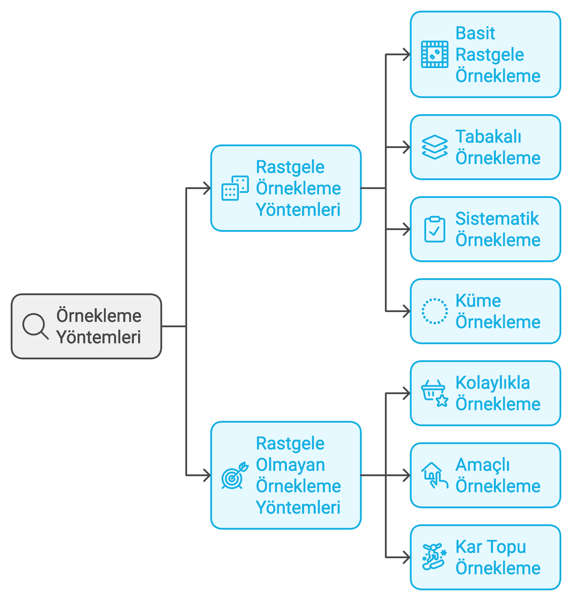

```{r}
#| label: setup
#| include: false
library(dplyr)
library(ggplot2)
library(gapminder)
library(here)
```

# Neden Örnekleme?

Modül 06'da çıkarımsal istatistiğin dört sütununu (**örnekleme, tahmin,
hipotez testi, regresyon**) tanıttık. Bu modül, o dört sütundan
ilkine — **örneklemeye** — tam olarak ayrılıyor: bir örneklemin
davranışını nasıl anlarız ve bu davranıştan popülasyon hakkında ne
öğrenebiliriz?

Araştırmacı olarak elimizde neredeyse hiçbir zaman popülasyonun tamamı
bulunmaz. Belirli sayıda katılımcıyla bir deney yapmış, ya da bir anket
şirketi belirli sayıda kişiyi arayarak oy verme eğilimlerini sormuş
olabilir. Her durumda elimizdeki veri sınırlı ve eksiktir.

**İstatistik**, bir örneklemden hesaplanan ve genellikle bir popülasyon
parametresini tahmin etmek için kullanılan sayısal bir değerdir.
Örneğin:

- Örneklem ortalaması $\bar{x}$, popülasyon ortalamasını $\mu$ tahmin
  eder.
- Örneklem oranı $\hat{p}$, popülasyon oranını $p$ tahmin eder.

Bir an için bir ülkenin nüfusunu tahmin etmeyi düşünelim. Bunu en kesin
şekilde bir **nüfus sayımı** yaparak, yani her haneye kaç kişinin
yaşadığını sorarak yapabiliriz. Ama bu hem maliyetli hem de zaman
alıcıdır. Daha uygun maliyetli bir alternatif, yalnızca az sayıda
haneye soru sorup istatistiksel yöntemlerle tüm nüfus hakkında tahmin
yapmaktır — doğru örnekleme teknikleriyle bu, makul ve güvenilir
tahminler üretebilir.

# Popülasyon Parametresi ve Örneklem İstatistiği

Popülasyon parametreleri ve örneklem istatistikleri, bir veri setinin
belirli bir özelliğini ifade eden sayısal değerlerdir. Ancak temsil
ettikleri veri açısından birbirinden farklıdır.

**Popülasyon parametresi:** popülasyonun **tamamını** temsil eden bir
özelliktir. Popülasyon parametrelerini doğrudan ölçmek genellikle
zordur, çünkü popülasyonun tüm üyelerinden bilgi toplamak zaman alıcı,
pahalı veya pratik olmayabilir.

**Örneklem istatistiği:** popülasyonun bir alt kümesi olan örneklemi
temsil eden bir özelliktir. Örneklemden elde edilen istatistikler,
popülasyon parametrelerini tahmin etmek için kullanılır.

`gapminder`'ın 2007 kesiti dünyadaki neredeyse tüm ülkeleri kapsadığı
için burada **popülasyon** rolünü oynayabilir. Bu popülasyonun
gerçek yaşam beklentisi ortalamasını ($\mu$) hesaplayalım, sonra
rastgele 20 ülkelik bir **örneklem** çekip örneklem ortalamasını
($\bar{x}$) hesaplayalım:

```{r}
#| label: populasyon-ornek
populasyon_2007 <- gapminder |> filter(year == 2007)
mu_lifeExp <- mean(populasyon_2007$lifeExp)
mu_lifeExp
```

```{r}
#| label: ornek-cek
set.seed(2026)
ornek_20 <- populasyon_2007 |> slice_sample(n = 20)
xbar_lifeExp <- mean(ornek_20$lifeExp)
xbar_lifeExp
```

İki değer **yakın ama farklıdır**: aradaki fark
(`r round(mu_lifeExp - xbar_lifeExp, 2)` yıl), hangi 20 ülkenin
tesadüfen seçildiğinden kaynaklanan **örnekleme hatası**dır. Bu
modülün geri kalanı, bu hatanın ne kadar büyük olabileceğini ve
örneklem büyüklüğü arttıkça nasıl küçüldüğünü sistematik olarak
anlamaya ayrılmıştır.

::: callout-note
## "Hata" iki farklı anlama gelir: örnekleme hatası ≠ ölçüm hatası

Günlük dilde "hata" bir beceriksizlik ya da yanlışlık çağrıştırır.
İstatistikte **örnekleme hatası (sampling error)** bunun tam tersidir:
bir beceriksizlik değil, evrenin tamamına ulaşamadığımız için
katlandığımız **matematiksel bir bedeldir** ve bir formülle
(standart hata, bu modülün ilerleyen bölümünde) ölçülebilir.

Bununla karıştırılmaması gereken ayrı bir kavram **ölçüm hatası
(measurement error)**dır: bir anket sorusunun yanlış/yönlendirici
sorulması, katılımcının yalan söylemesi veya bir ölçüm aletinin hatalı
kalibre edilmesi gibi nedenlerden kaynaklanır. Örnekleme hatasının
aksine, ölçüm hatası istatistiksel bir formülle otomatik olarak
düzeltilemez — düzeltilmesi gereken yer araştırma tasarımıdır.
:::

## Semboller

| Açıklama | Popülasyon Parametresi | Örneklem İstatistiği |
|---|---|---|
| Ortalama | $\mu$ | $\bar{x}$ |
| Standart Sapma | $\sigma$ | $s$ |
| Oran | $p$ | $\hat{p}$ |
| İkili Ortalama Farkı | $\mu_1 - \mu_2$ | $\bar{x}_1 - \bar{x}_2$ |
| Regresyon Katsayısı | $\beta$ | $\hat{\beta}$ |

**Özet:** popülasyon parametreleri tüm popülasyonu temsil eder ve
genellikle ulaşılması zordur; örneklem istatistikleri örneklemden
hesaplanır ve popülasyon parametrelerini tahmin etmek için kullanılır.
Örneklem istatistikleri popülasyon parametrelerinin **en iyi
tahminleridir**, ama örneklem büyüklüğü ve örnekleme yöntemi bu
tahminlerin doğruluğunu etkiler.

::: callout-note
## 💡 Örnekleme Hatasının Tarihi Bir Dersi: *Literary Digest* ve 1936 ABD Başkanlık Seçimi

***Literary Digest***, 1920'den itibaren başkanlık seçimlerinin
kazananını doğru tahmin etmesiyle tanınan prestijli bir dergiydi. Ama
1936 ABD Başkanlık Seçiminde yaptığı büyük hata, kamuoyu
araştırmalarında bilimsel örneklemeye geçişin miladı oldu.

Dergi, **"straw poll"** (gayri resmi, bağlayıcı olmayan bir tür anket)
yöntemiyle 10 milyon kişilik bir posta listesi oluşturdu — bu isimler
otomobil kayıtları, telefon rehberleri ve kulüp üyelik listelerinden
seçilmişti. Gönderilen oy pusulalarından yaklaşık 2,4 milyon kişi geri
dönüş yaptı; bu, o güne kadarki en büyük ve en pahalı kamuoyu
yoklamalarından biriydi. Sonuç: Cumhuriyetçi aday **Alf Landon**'ın
%57, mevcut başkan **Franklin D. Roosevelt**'in ise %43 oy alacağı
öngörülmüştü.

Seçim sonucu tam tersi çıktı: Roosevelt halk oylarının yaklaşık
%61-62'sini alarak Landon'ı büyük farkla geride bıraktı ve Maine ile
Vermont dışındaki tüm eyaletleri kazanarak seçim kurulunun %98,5'ini
elde etti — o zamana kadarki en büyük seçim zaferlerinden biri.

**Hatanın nedeni büyüklük değil, temsil gücüydü.** 10 milyonluk dev
örneklem, popülasyonu doğru temsil etmiyordu:

1.  **Örneklem çerçevesi yanlılığı:** otomobil, telefon ve kulüp
    üyeliği kayıtları, 1936'nın Büyük Buhran koşullarında
    **ekonomik durumu iyi olan** insanları aşırı temsil ediyordu — bu
    grup Cumhuriyetçi adaya daha yakındı.
2.  **Yanıt vermeme yanlılığı (nonresponse bias):** 10 milyondan
    yalnızca 2,4 milyonu (%24) yanıt verdi; yanıt verenlerle
    vermeyenlerin siyasi eğilimleri sistematik olarak farklıydı.

Bu, istatistikte tekrar eden bir dersi gösterir: **örneklem büyüklüğü,
temsil gücünün yerini tutmaz.** Rastgele seçilmiş küçük bir örneklem,
yanlı seçilmiş devasa bir örneklemden çok daha güvenilirdir — nitekim
aynı seçimde George Gallup'ın çok daha küçük ama rastgele örneklemi
doğru sonucu tahmin etmişti.
:::

::: callout-tip
## İleri düzey (sınav kapsamı dışı): Yanlı bir örneklem çöpe mi atılır?

Akla şu soru gelebilir: *"Bir araştırmacı elindeki örneklemin
popülasyonu yansıtmadığını (örneğin belirli bir kıtanın aşırı temsil
edildiğini) fark ederse, örneklemi çöpe mi atar?"* Genellikle hayır.
Modern kamuoyu araştırmalarının çözümü **ağırlıklandırma (survey
weighting / post-stratification)**dır: bir alt grup popülasyonda %50
iken örneklemde %30 temsil ediliyorsa, o alt gruptaki gözlemlerin
katkısı ağırlıklandırılarak (çarpan katsayısıyla büyütülerek) örneklem
popülasyona yeniden dengelenir. Bu, Modül 05'te gördüğünüz `mutate()`
fonksiyonuyla sahada sıkça hesaplanan bir katsayıdır. Ağırlıklandırmanın
istatistiksel gerekçesi bu dersin kapsamı dışındadır.
:::

# Örnekleme Yöntemleri

Örnekleme yöntemleri, bir popülasyondan belirli bir veri kümesi seçmek
için kullanılan sistematik yaklaşımlardır ve popülasyonun özelliklerini
temsil eden bir örnek oluşturmayı amaçlar. İki ana gruba ayrılırlar:
**rastgele örnekleme yöntemleri** ve **rastgele olmayan örnekleme
yöntemleri**.

{#fig-ornekleme-tipolojisi fig-align="center" width="85%"}

## 1. Rastgele Örnekleme Yöntemleri

Bu yöntemlerde her bireyin örnekleme dahil edilme şansı bilinir ve
önyargı (bias) en aza indirilir — Literary Digest örneğinin tam tersi.

### 1.1 Basit Rastgele Örnekleme (Simple Random Sampling)

Her bireyin seçilme olasılığının eşit olduğu yöntemdir; genellikle bir
rastgele sayı üreteci ile uygulanır.

**Örnek:** `gapminder`'daki 142 ülkeden rastgele 20'sini seçmek (yukarıda
yaptığımız tam olarak budur).

**Avantajları:** kolay ve tarafsızdır; her bireyin eşit şansı vardır.\
**Dezavantajları:** büyük popülasyonlarda zaman alıcı olabilir;
popülasyonun kapsamlı bir listesini gerektirir.

::: callout-note
## ⚠️ Çoğu örneklem basit rastgele örneklem değildir

Rastgele örnekleme bir **amaç değil, bir araçtır**. Araştırmacılar
genellikle araştırmanın hedeflerine göre farklı yöntemleri tercih
eder — tabakalı, sistematik veya küme örnekleme, bazı durumlarda basit
rastgele örneklemeden daha uygun olabilir. Ama her durumda hedef
popülasyonu en iyi temsil eden ve yanlılığı en aza indiren yöntem
seçilmelidir.
:::

### 1.2 Tabakalı Örnekleme (Stratified Sampling)

Popülasyon belirli özelliklere göre (kıta, gelir düzeyi vb.) alt
gruplara (tabakalara) ayrılır, sonra her tabakadan rastgele bireyler
seçilir.

**Örnek:** `gapminder` popülasyonundan örneklem çekerken her kıtadan
orantılı sayıda ülke seçmek — böylece küçük kıtalar (Okyanusya gibi)
örneklem dışında kalma riskinden korunur.

**Avantajları:** her alt grubun temsil edilmesini sağlar; daha hassas
tahminler üretir.\
**Dezavantajları:** tabakaların belirlenmesi karmaşık olabilir; daha
fazla bilgi ve planlama gerektirir.

### 1.3 Sistematik Örnekleme (Systematic Sampling)

Popülasyon sıralanır ve belirli bir aralıkla bireyler seçilir (örneğin
her 10. birim).

**Örnek:** ülkeleri alfabetik sıraya koyup her 7. ülkeyi seçmek.

**Avantajları:** kolay ve hızlıdır; büyük popülasyonlar için uygundur.\
**Dezavantajları:** sıralama düzeninde gizli bir örüntü varsa yanlılık
oluşabilir.

### 1.4 Küme Örnekleme (Cluster Sampling)

Popülasyon kümelere (gruplara) ayrılır; rastgele seçilen kümelerdeki
**tüm** bireyler örnekleme dahil edilir.

**Örnek:** rastgele birkaç kıta seçip o kıtalardaki tüm ülkeleri
incelemek (tabakalı örneklemenin tersine, burada kıta *seçimi*
rastgeledir, kıta *içi* seçim değil).

**Avantajları:** büyük ve dağınık popülasyonlarda kullanışlıdır; daha
az zaman ve maliyet gerektirir.\
**Dezavantajları:** kümeler arası farklılıklar yüksekse sonuçlar yanlı
olabilir.

## 2. Rastgele Olmayan Örnekleme Yöntemleri

Bu yöntemlerde bireylerin seçilme şansı rastgele değildir; bu nedenle
genellikle daha fazla yanlılık içerirler — Literary Digest'in düştüğü
tuzak tam olarak bu kategoridedir.

### 2.1 Kolayda Örnekleme (Convenience Sampling)

Veri toplamak için en kolay ulaşılan bireylerin seçildiği yöntemdir.

**Avantajları:** hızlı ve düşük maliyetlidir.\
**Dezavantajları:** sonuçlar genellenemez; büyük önyargılar
içerebilir.

### 2.2 Amaçlı Örnekleme (Purposive Sampling)

Araştırmacı belirli kriterlere göre bireyleri seçer.

**Örnek:** yalnızca çok partili demokrasilerdeki ülkeleri incelemek.

**Avantajları:** belirli bir grup hakkında derinlemesine bilgi
sağlar.\
**Dezavantajları:** önyargı riski yüksektir; genelleme yapmak zordur.

### 2.3 Kartopu Örnekleme (Snowball Sampling)

Bir katılımcı diğer katılımcıları önerir; genellikle zor ulaşılan
gruplar için kullanılır (siyaset biliminde sık kullanılır: örneğin
gizli örgüt üyeleri veya belgesiz göçmenlerle görüşme yapmak).

**Avantajları:** zor ulaşılan gruplara erişim sağlar.\
**Dezavantajları:** temsil yeteneği düşüktür; yanlılık riski yüksektir.

## Özet Tablosu

| Yöntem | Özellik | Avantaj | Dezavantaj |
|---|---|---|---|
| Basit Rastgele | Her bireyin eşit seçilme olasılığı | Kolay ve tarafsız | Büyük popülasyonlarda zor |
| Tabakalı | Popülasyon gruplara ayrılır | Daha hassas sonuç | Karmaşıktır |
| Sistematik | Belirli bir aralıkla birey seçilir | Hızlı ve basit | Örüntü varsa yanlılık olabilir |
| Küme | Kümelerden rastgele seçim | Dağınık popülasyonda kullanışlı | Gruplar arası fark yanlılık yaratabilir |
| Kolayda | En kolay erişilen bireyler | Hızlı, düşük maliyet | Genellenemez |
| Amaçlı | Amaca uygun bireyler seçilir | Belirli gruplara odaklanır | Temsil yeteneği sınırlı |
| Kartopu | Katılımcılar diğerlerini önerir | Zor ulaşılan gruplara erişim | Yanlılık, sınırlı temsil |

# R'da Örnekleme: `sample()` ve `set.seed()`

R, örnekleme için `sample()` fonksiyonunu sunar:

```r
sample(x, size, replace = FALSE, prob = NULL)
```

- `x`: örnekleme yapılacak vektör.
- `size`: seçilecek örnek büyüklüğü.
- `replace`: tekrarlı örnekleme yapılıp yapılmayacağı (`TRUE`/`FALSE`).
- `prob`: her eleman için seçilme olasılıklarını belirten vektör
  (verilmezse tüm elemanlar eşit olasılıklıdır).

`gapminder` popülasyonundan tekrarsız 5 ülke seçelim:

```{r}
#| label: sample-tekrarsiz
set.seed(42)
sample(populasyon_2007$country, size = 5)
```

`replace = TRUE` ile **tekrarlı** örnekleme yapalım (Modül 06'da
`sample(gapminder$continent, ..., replace = TRUE)` ile olasılık
simülasyonu yaparken kullandığımız aynı mantık):

```{r}
#| label: sample-tekrarli
set.seed(42)
sample(populasyon_2007$continent, size = 5, replace = TRUE)
```

## `set.seed()`: Neden ve Nasıl?

`set.seed()`, R'ın rastgele sayı üretecini belirli bir başlangıç
noktasına sabitler; bu sayede rastgele işlemler her çalıştırmada
**aynı** sonucu üretir. Üç nedeni vardır:

1.  **Tekrarlanabilirlik:** aynı kod her çalıştırıldığında aynı sonucu
    üretir — bilimsel yeniden üretilebilirliğin temelidir.
2.  **Karşılaştırma kolaylığı:** farklı yöntemleri aynı rastgele
    örneklem üzerinde test edebilirsiniz.
3.  **Dokümantasyon:** ders materyallerinde veya raporlarda aynı
    çıktıyı yeniden üretebilirsiniz.

Aynı seed, aynı sonucu üretir:

```{r}
#| label: seed-tekrar1
set.seed(123)
sample(populasyon_2007$country, size = 5)
```

```{r}
#| label: seed-tekrar2
set.seed(123)
sample(populasyon_2007$country, size = 5)
```

Farklı bir seed, farklı bir sonuç üretir:

```{r}
#| label: seed-farkli
set.seed(456)
sample(populasyon_2007$country, size = 5)
```

# Örnekleme Dağılımı: Gapminder ile Bir Deney

**Örnekleme dağılımı**, aynı popülasyondan tekrar tekrar çekilen
örneklemlerin istatistiklerinin (örneğin ortalamalarının) oluşturduğu
dağılımdır. Bunu somut olarak görmek için 2007 kesitindeki **kişi başı
GSYİH**'yi (`gdpPercap`) popülasyon olarak kullanalım. Bu değişken,
tanımlayıcı istatistik modülünden hatırlayacağınız gibi, **sağa
çarpıktır**: az sayıda zengin ülke ortalamayı yukarı çeker.

```{r}
#| label: fig-gdp-populasyon
#| fig-cap: "Popülasyon dağılımı: 2007 kişi başı GSYİH (142 ülke), sağa çarpık"
ggplot(populasyon_2007, aes(x = gdpPercap)) +
  geom_histogram(bins = 30, fill = "steelblue", color = "white") +
  labs(x = "Kişi başı GSYİH (dolar)", y = "Frekans") +
  theme_minimal()
```

```{r}
#| label: gdp-parametreler
mu_gdp <- mean(populasyon_2007$gdpPercap)
sigma_gdp <- sd(populasyon_2007$gdpPercap)
c(populasyon_ortalamasi = mu_gdp,
  populasyon_medyani = median(populasyon_2007$gdpPercap),
  populasyon_std = sigma_gdp)
```

Ortalamanın medyandan çok daha büyük olması, sağa çarpıklığın tipik bir
işaretidir (bkz. Modül 04).

## Ara Durak: Büyük Sayılar Kanunu

Örnekleme dağılımını inşa etmeden önce, daha basit bir soruya bakalım:
**tek bir** örneklemi büyüttükçe, onun ortalaması popülasyon
ortalamasına nasıl yaklaşır? Bu, Modül 06'da `gapminder$continent`
üzerinde Afrika kıtası oranıyla gördüğünüz **Büyük Sayılar Kanunu**
simülasyonunun, sürekli bir değişken (kişi başı GSYİH) için
tekrarıdır. 200 gözlemlik tek bir çekiliş yapıp, her adımda o ana
kadarki **kümülatif ortalamayı** hesaplayalım:

```{r}
#| label: fig-buyuk-sayilar-gdp
#| fig-cap: "Büyük Sayılar Kanunu: tek bir örneklemin kümülatif ortalaması, gözlem sayısı arttıkça popülasyon ortalamasına (kırmızı kesik çizgi) yaklaşır"
set.seed(2026)
buyuk_cekilis <- sample(populasyon_2007$gdpPercap, size = 200, replace = TRUE)
kumulatif_ortalama <- cumsum(buyuk_cekilis) / seq_along(buyuk_cekilis)

ggplot(data.frame(n = seq_along(kumulatif_ortalama), ortalama = kumulatif_ortalama),
       aes(x = n, y = ortalama)) +
  geom_line(color = "steelblue", linewidth = 0.8) +
  geom_hline(yintercept = mu_gdp, color = "firebrick", linetype = "dashed") +
  labs(x = "Örneklem Büyüklüğü (n)", y = "Kümülatif Örneklem Ortalaması") +
  theme_minimal()
```

Çizgi başlangıçta belirgin biçimde dalgalanır (ilk birkaç gözlem
tesadüfen çok zengin ya da çok yoksul bir ülke içerebilir), ama $n$
büyüdükçe kırmızı çizgiye (popülasyon ortalaması) yaklaşıp etrafında
dar bir bantta dalgalanmaya başlar. **Bu, "neden daha büyük örneklem
çekmeliyiz?" sorusunun görsel kanıtıdır** — ve bir sonraki bölümde
inşa edeceğimiz örnekleme dağılımının da temelini oluşturur.

Şimdi bu popülasyondan **büyüklüğü 5 olan 1000 farklı örneklem** çekip
her birinin ortalamasını hesaplayalım — bu 1000 ortalama, örnekleme
dağılımını oluşturur:

```{r}
#| label: fig-gdp-orneklem-dagilimi-5
#| fig-cap: "Örnekleme dağılımı (n = 5): popülasyon çarpık olsa da örneklem ortalamaları daha simetrik dağılır"
set.seed(2026)
n <- 5
num_ornek <- 1000
ornek_ortalamalari_5 <- replicate(
  num_ornek,
  mean(sample(populasyon_2007$gdpPercap, size = n, replace = TRUE))
)

ggplot(data.frame(ortalama = ornek_ortalamalari_5), aes(x = ortalama)) +
  geom_histogram(bins = 30, fill = "darkorange", color = "white") +
  labs(x = "Örneklem Ortalaması (n = 5)", y = "Frekans") +
  theme_minimal()
```

```{r}
#| label: gdp-orneklem-dagilimi-ozet
c(orneklem_dagiliminin_ortalamasi = mean(ornek_ortalamalari_5),
  populasyon_ortalamasi = mu_gdp,
  orneklem_dagiliminin_std = sd(ornek_ortalamalari_5),
  teorik_standart_hata = sigma_gdp / sqrt(n))
```

İki önemli gözlem: (1) örnekleme dağılımının ortalaması popülasyon
ortalamasına çok yakındır; (2) örnekleme dağılımının standart sapması,
aşağıda tanımlayacağımız **standart hata** formülüyle hesaplanan
teorik değere çok yakındır. Bu tesadüf değil — bir sonraki bölümün
konusu tam olarak budur.

# Merkezi Limit Teoremi (Central Limit Theorem — CLT)

Merkezi Limit Teoremi, istatistikteki en temel kavramlardan biridir:

> Bir popülasyondan rastgele seçilen örneklemlerin ortalamalarının
> dağılımı, örneklem büyüklüğü yeterince büyük olduğunda, **popülasyon
> dağılımı ne olursa olsun** yaklaşık olarak normal dağılım gösterir.

## Teoremin Temel Özellikleri

1.  Popülasyondan alınan örneklemlerin ortalamaları bir dağılım
    oluşturur — buna **örnekleme dağılımı** denir.
2.  Örneklem büyüklüğü arttıkça, örnekleme dağılımı normale yaklaşır —
    popülasyon dağılımı simetrik olsun ya da çarpık olsun.
3.  Örnekleme dağılımının ortalaması popülasyon ortalamasına eşittir.
4.  Örnekleme dağılımının standart sapması — **standart hata** —
    popülasyonun standart sapmasının örneklem büyüklüğünün kareköküne
    bölünmesiyle elde edilir:

$$\text{Standart Hata} = \frac{\sigma}{\sqrt{n}}$$

Burada $\sigma$ popülasyonun standart sapması, $n$ örneklem
büyüklüğüdür. Formülden görüleceği gibi, $n$ büyüdükçe standart hata
**küçülür**: daha büyük örneklemler, popülasyon ortalamasına daha
yakın tahminler üretir.

::: callout-tip
## İleri düzey (sınav kapsamı dışı): $\sigma$'yı gerçekte bilmiyoruz

Yukarıdaki formülde popülasyonun **gerçek** standart sapmasını
($\sigma$) kullandık — çünkü `gapminder` popülasyonun tamamına sahip
olduğumuz özel bir durumdu. Gerçek araştırmada popülasyona erişimimiz
olmadığı için $\sigma$'yı da bilmeyiz; onun yerine örneklemin standart
sapmasını ($s$) kullanırız. Bu küçük ama önemli değişiklik, dağılımı
normalden biraz farklılaştırır: normal yerine daha kalın kuyruklu olan
**Student's t-dağılımı** kullanılır. Bu, **Modül 10**'da (t-testi)
karşınıza çıkacak.
:::

## Neden Önemlidir?

- **Popülasyonun dağılımından bağımsızlık:** popülasyon çarpık, düzgün
  veya başka bir biçimde olabilir; örneklem büyüklüğü yeterince
  büyükse ($n \geq 30$ genellikle yeterlidir), örnekleme dağılımı yine
  de normale yaklaşır.
- **Tahmin ve çıkarım:** CLT, örneklem verisinden yola çıkarak
  popülasyon hakkında güvenilir tahmin ve çıkarım yapmayı mümkün
  kılar — Modül 09 (tahmin, güven aralıkları) ve Modül 10-11 (hipotez
  testi) bu temele dayanır.

## Canlı Kanıt: Çarpık Bir Popülasyondan Normale

`gdpPercap` popülasyonu **belirgin biçimde sağa çarpık** olduğu için,
CLT'nin gücünü göstermek için ideal bir örnektir: eğer örnekleme
dağılımı çarpık bir popülasyondan bile normale yaklaşırsa, teoremin
"popülasyonun dağılımından bağımsızlık" iddiası somutlaşır. Üç farklı
örneklem büyüklüğü (n = 2, 10, 50) ile karşılaştıralım:

```{r}
#| label: fig-clt-karsilastirma
#| fig-cap: "Merkezi Limit Teoremi: örneklem büyüklüğü arttıkça, sağa çarpık bir popülasyondan (2007 kişi başı GSYİH) çekilen örneklem ortalamaları normale yaklaşır"
#| fig-width: 7.5
#| fig-height: 3.2
orneklem_buyuklukleri <- c(2, 10, 50)
num_tekrar <- 2000

# Not: bu tür tekrarlı simülasyonlar modern R iş akışında genellikle
# purrr::map_dfr() ile de yazılır; burada Modül 06'dan tanıdık olan
# base R lapply()/replicate() ikilisi tercih edildi.
set.seed(2026)
sonuclar <- lapply(orneklem_buyuklukleri, function(n) {
  ortalamalar <- replicate(
    num_tekrar,
    mean(sample(populasyon_2007$gdpPercap, size = n, replace = TRUE))
  )
  data.frame(ortalama = ortalamalar, n = paste0("n = ", n))
})
sonuclar_df <- bind_rows(sonuclar)
sonuclar_df$n <- factor(sonuclar_df$n, levels = paste0("n = ", orneklem_buyuklukleri))

ggplot(sonuclar_df, aes(x = ortalama)) +
  geom_histogram(bins = 40, fill = "seagreen", color = "white") +
  facet_wrap(~n, scales = "free") +
  labs(x = "Örneklem Ortalaması", y = "Frekans") +
  theme_minimal()
```

Gözlemler:

- **n = 2:** dağılım hâlâ belirgin biçimde sağa çarpık — popülasyonun
  asimetrisini yansıtıyor, CLT henüz "devreye girmedi".
- **n = 10:** çarpıklık azalıyor, dağılım daha simetrik bir görünüm
  kazanıyor.
- **n = 50:** dağılım neredeyse mükemmel bir normal dağılım
  görünümünde — popülasyon hâlâ çarpık olsa da.

Sayısal olarak da doğrulayalım: n = 50 için ampirik standart sapmanın,
teorik standart hataya ne kadar yakın olduğuna bakalım.

```{r}
#| label: clt-dogrulama-n50
n50 <- sonuclar_df |> filter(n == "n = 50")
c(ampirik_ortalama = mean(n50$ortalama),
  populasyon_ortalamasi = mu_gdp,
  ampirik_standart_sapma = sd(n50$ortalama),
  teorik_standart_hata = sigma_gdp / sqrt(50))
```

İki çift neredeyse birebir örtüşüyor — bu, Merkezi Limit Teoremi'nin
teorik önermesinin, tamamen çarpık bir popülasyonda bile ampirik
olarak doğrulandığını gösterir.

::: callout-tip
## İleri düzey (sınav kapsamı dışı): Bootstrap ve güven aralıkları

Bu modülde örnekleme dağılımını **simülasyonla** (popülasyonun
tamamına erişimimiz olduğu için) inşa ettik. Gerçek araştırmada
popülasyona erişimimiz olmaz; yalnızca **tek bir örneklemimiz**
vardır. O zaman örnekleme dağılımını simüle etmenin bir yolu
**bootstrap** yöntemidir: elimizdeki tek örneklemden, yerine koyarak
tekrar tekrar örneklem çekip aynı mantığı uygularız. Bu yöntem ve
örnekleme dağılımından **güven aralığı** inşa etmek, **Modül 09'da**
(tahmin ve güven aralıkları, telafi dersi) ele alınacak.
:::

# Kapsam Sınırı

Bu modül yalnızca **örnekleme, örnekleme dağılımı ve Merkezi Limit
Teoremi**ni kapsar. Aşağıdakiler bu modülün kapsamı dışındadır ve
ilerleyen modüllerde ayrı ayrı işlenecektir:

- **Güven aralığı hesaplama** → Modül 09 (telafi dersi).
- **Hipotez testi** (t-testi, ki-kare, ANOVA) → Modül 10-11 (8. ve 9.
  oturumlar).
- **Sonlu popülasyon düzeltmesi** (yerine koymadan seçimde örneklem
  popülasyona göre büyükse gereken düzeltme) — bu ders bunu
  işlemeyecek; öğrenim çıktılarında yer almıyor ve `gdpPercap`
  örneğimizde örneklem büyüklükleri (n ≤ 50) popülasyona (n = 142) göre
  yeterince küçük olduğu için pratikte ihmal edilebilir düzeydedir.

# Özet

- **Popülasyon parametresi** ($\mu$, $\sigma$, $p$) popülasyonun
  tamamını; **örneklem istatistiği** ($\bar{x}$, $s$, $\hat{p}$)
  örneklemi tanımlar.
- Örneklem büyüklüğü, temsil gücünün **yerini tutmaz** — Literary
  Digest'in 10 milyonluk yanlı örneklemi, çok daha küçük ama rastgele
  bir örneklemden daha kötü sonuç verdi.
- Rastgele örnekleme yöntemleri (basit, tabakalı, sistematik, küme) ve
  rastgele olmayan yöntemler (kolayda, amaçlı, kartopu) farklı
  yanlılık riskleri taşır.
- **Örnekleme dağılımı**, aynı popülasyondan tekrar tekrar çekilen
  örneklemlerin istatistiklerinin dağılımıdır.
- **Merkezi Limit Teoremi**, popülasyon dağılımı ne olursa olsun,
  örneklem büyüklüğü arttıkça örnekleme dağılımının normale
  yaklaşacağını söyler; standart hata ($\sigma / \sqrt{n}$) bu
  yaklaşmanın hızını belirler.

# Sırada Ne Var?

**8. oturumda** (hipotez testi I) bu modülün üzerine inşa edeceğiz:
örnekleme dağılımı ve standart hata kavramları, bir örneklem
ortalamasının "şans eseri mi yoksa gerçek bir etkiden mi"
kaynaklandığına karar vermemizi sağlayacak. Aradaki **telafi dersinde**
(Modül 09) ise örnekleme dağılımından **güven aralığı** inşa etmeyi
öğreneceğiz.
