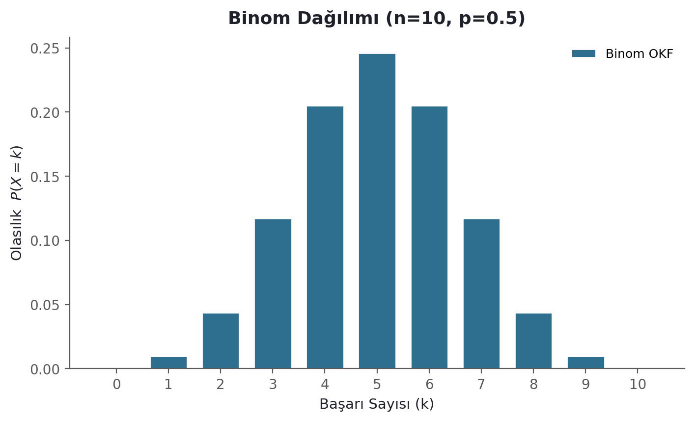
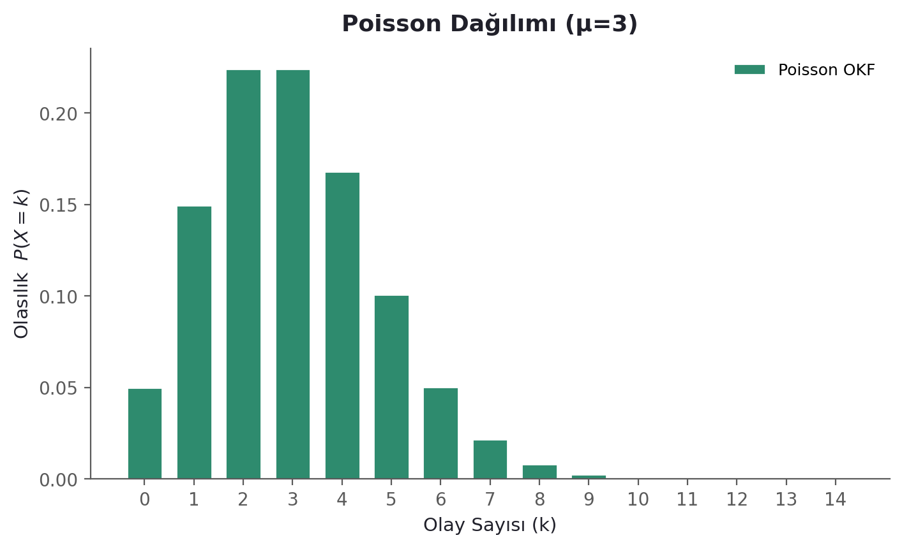
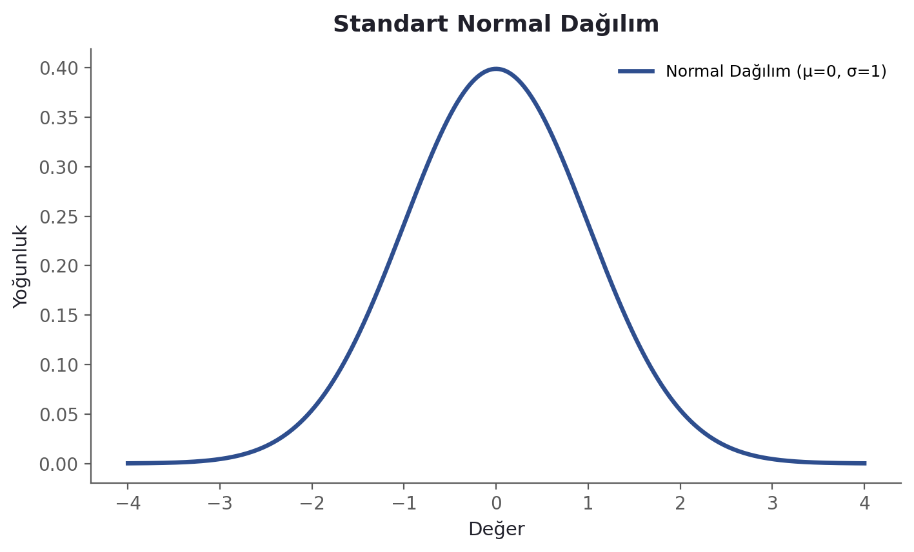
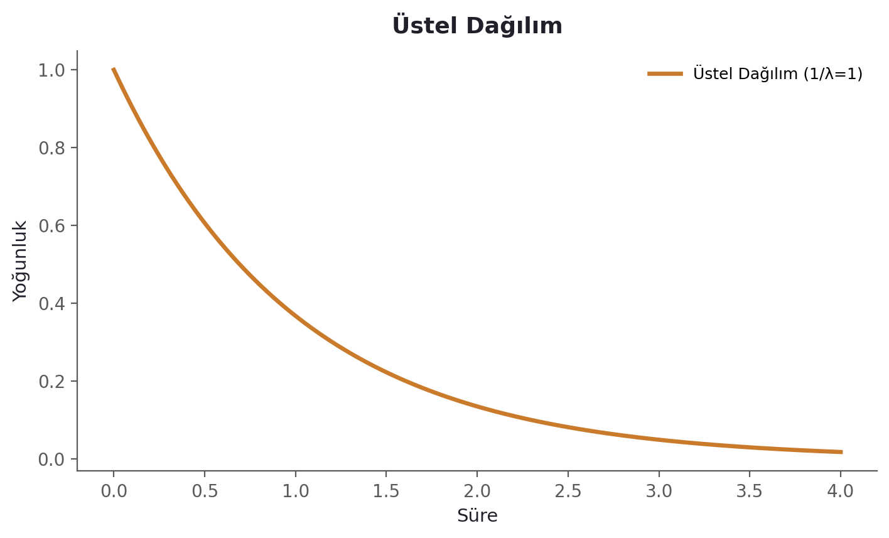
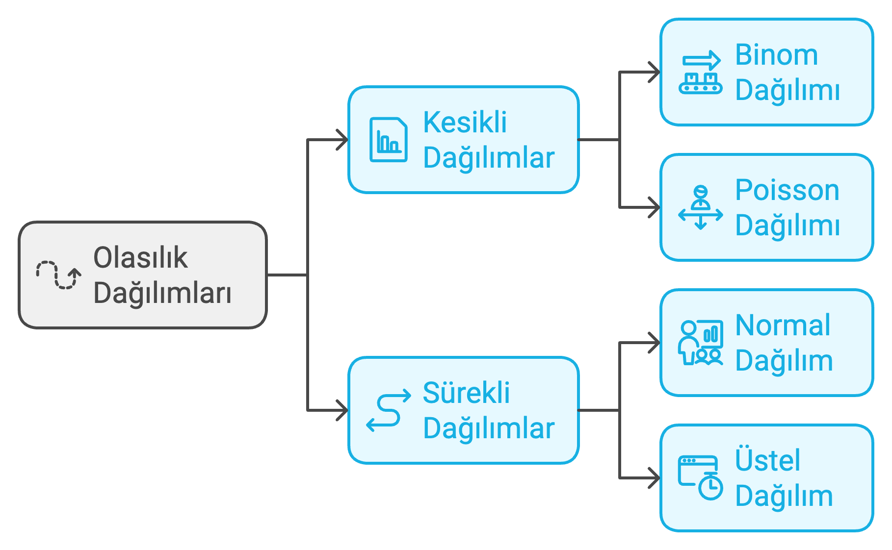
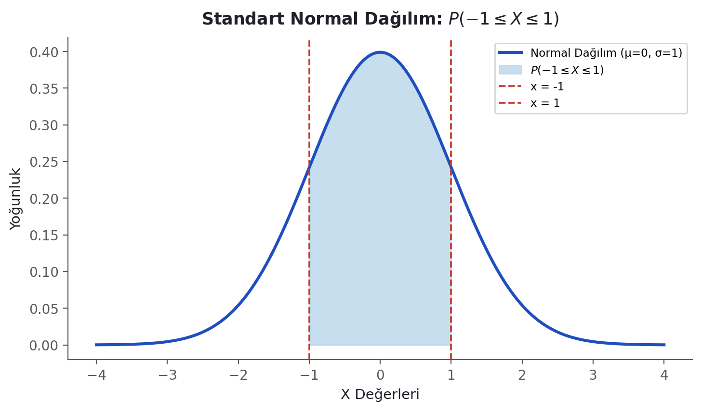
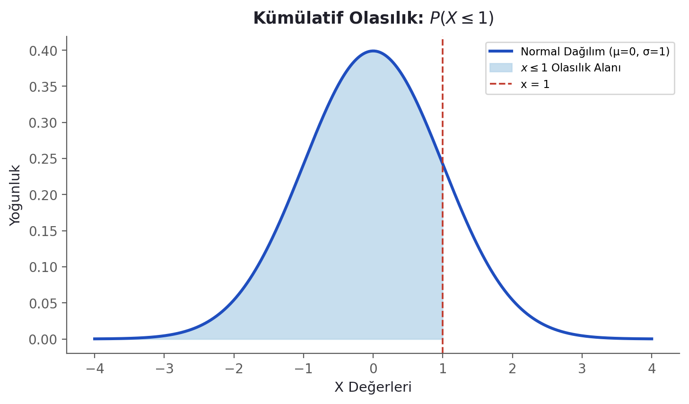
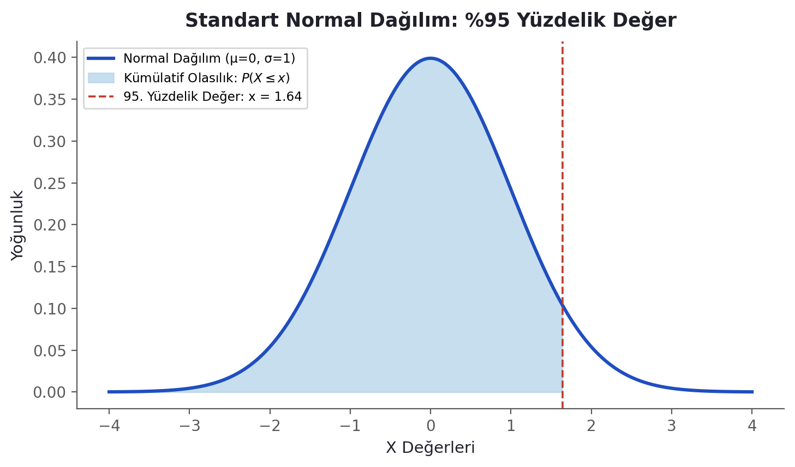

### **Rastgele Değişkenler ve Olasılık Dağılımları**

Sayısal değişkenlerden bahsettiğimizde, aslında rastgele bir olayın sayısal bir özetini ifade eden bir **rastgele değişkenden** söz ederiz.

-   **Kesikli Rastgele Değişken:** Sayılabilir sayıda sonuca sahip bir rastgele değişkendir.

-   **Sürekli Rastgele Değişken:** Sayılamayacak kadar çok (sonsuz) sonuca sahip bir rastgele değişkendir.

------------------------------------------------------------------------

#### **Kesikli Rastgele Değişken Örnekleri**

-   Bir ailedeki çocuk sayısı,

-   Sinemada bir Cuma gecesi seyirci sayısı,

-   Bir doktor muayenehanesindeki hasta sayısı,

-   Onluk bir kutuda bulunan hatalı ampul sayısı.

#### **Sürekli Rastgele Değişken Örnekleri**

-   Kütle,

-   Sıcaklık,

-   Enerji,

-   Hız,

-   Uzunluk vb.

### **Olasılık Dağılımı (Probability Distribution)**

Bir **olasılık dağılımı**, rastgele bir değişkenin alabileceği tüm olası değerleri ve bu değerlerin gerçekleşme olasılıklarını sistematik bir şekilde gösteren matematiksel bir modeldir. Rastgele değişkenin türüne bağlı olarak, olasılık dağılımı farklı şekillerde ifade edilebilir:

1.  **Kesikli Rastgele Değişkenler İçin:**

    -   Kesikli değişkenlerde olasılık dağılımı, her bir sonucun belirli bir olasılığa sahip olduğu bir liste ya da tablo şeklinde ifade edilir. Bu tür dağılımlar **olasılık kütle fonksiyonu (Probability Mass Function, PMF)** ile tanımlanır.

2.  **Sürekli Rastgele Değişkenler İçin:**

    -   Sürekli değişkenlerde olasılık dağılımı, rastgele değişkenin belirli bir aralıktaki değerleri almasının olasılığını gösterir. Sürekli dağılımlar **olasılık yoğunluk fonksiyonu (Probability Density Function, PDF)** ile ifade edilir ve toplam olasılık 1'e eşittir.


------------------------------------------------------------------------

#### **Kesikli Olasılık Dağılımı Örneği**

Bir madeni paranın iki kez atılması durumunda, yazıların sayısını ifade eden rastgele değişkeni X olarak tanımlayalım. Olasılık dağılımı şu şekilde ifade edilebilir:

| $X$ (Yazı Sayısı) | $P(X)$ (Olasılık) |
|:-------------------|:-------------------|
| 0 (Hiç yazı yok)    | $P(X=0)=0.25$       |
| 1 (Bir yazı)        | $P(X=1)=0.50$       |
| 2 (İki yazı)        | $P(X=2)=0.25$       |

-   **Açıklama:** X'in alabileceği değerler 0,1,2'dir ve bu değerlerin gerçekleşme olasılıklarının toplamı 1'e eşittir.

------------------------------------------------------------------------

#### **Sürekli Olasılık Dağılımı Örneği**

Bir aracın hızını (X) ölçtüğümüzü düşünelim. Hız sürekli bir değişkendir ve 0 ile 120 km/s arasında bir değer alabilir. Bu durumda, hızı tanımlayan olasılık yoğunluk fonksiyonu (PDF) şu şekilde ifade edilebilir:

$$
f(X) = \begin{cases} \frac{1}{120} & \text{eğer } 0 \leq X \leq 120 \\ 0 & \text{diğer durumlar için}\end{cases}
$$

Bu PDF'yi kullanarak belirli bir hız aralığındaki olasılığı hesaplayabiliriz:

-   Örneğin, aracın hızının 60 ile 80 km/s arasında olma olasılığı:

$$
P(60 \leq X \leq 80) = \int_{60}^{80} \frac{1}{120} \, dx = \frac{80 - 60}{120} = \frac{20}{120} = 0.167
$$

------------------------------------------------------------------------

### **Olasılık Dağılımlarının Kullanım Alanları**

1.  **Kesikli Dağılımlar:**

    -   **Binom Dağılımı:** Örneğin, bir ürünü üreten makinenin belirli bir üretim partisindeki kusurlu ürün sayısını modellemek.

    

Grafik, 10 denemeli $(n=10)$ ve başarı olasılığı 0.5 $(p=0.5)$ olan bir binom dağılımını gösterir.

Çubuklar, belirli bir başarı sayısının olasılığını temsil eder.

#### **Binom Dağılımının Ana Özellikleri:**

1.  **Kesikli sonuçlar:** Sonuçlar sayılabilir. Örneğin, bir madeni parayı 10 kez atarsınız ve yazı gelme sayısını sayarsınız.

2.  **Sabit deneme sayısı:** Örneğin, madeni parayı tam 10 kez atacağınızı bilirsiniz.

3.  **İki olası sonuç:** Her atış, yazı veya tura ile sonuçlanır.

4.  **Sabit olasılık:** Yazı gelme olasılığı her atışta aynıdır.

**Basitçe söylemek gerekirse:** Bir deneyi belirli sayıda tekrarlıyorsanız ve her denemenin yalnızca iki olası sonucu varsa (örneğin, başarılı/başarısız), binom dağılımını kullanabilirsiniz.

-   **Poisson Dağılımı:** Belirli bir zamanda bir mağazaya gelen müşteri sayısını modellemek.



Grafik, ortalaması $(\mu=3)$ olan bir Poisson dağılımını temsil eder.

Çubuklar, belirli bir olay sayısının (örneğin, bir saatte mağazaya gelen müşteri sayısı) gerçekleşme olasılığını gösterir.

#### **Poisson Dağılımının Ana Özellikleri:**

1.  **Nadir olayları modellemek:** Olaylar nadir ve bağımsız bir şekilde meydana gelir.

2.  **Sabit bir ortalama hız** $(\lambda)$: Belirli bir zaman aralığında ortalama olay sayısı sabittir.

3.  **Sabit zaman/mekân aralığı:** Olayların meydana geldiği aralık sabittir.

4.  **Kesikli sonuçlar:** Sonuçlar (örneğin, olay sayısı) tam sayı olarak ifade edilir.

**Örnek:** Bir otobüs durağında bir saatte otobüs gelme sayısını modellemek için Poisson dağılımını kullanabilirsiniz. Eğer ortalama olarak saatte 3 otobüs geliyorsa $(\lambda=3)$ , bu dağılım otobüs sayısının olasılıklarını hesaplamanıza olanak tanır.

**Basitçe:** Poisson dağılımını, belirli bir aralıktaki olay sayısını modellemek için kullanırsınız.

**Sürekli Dağılımlar:**

-   **Normal Dağılım:** Örneğin, bir popülasyondaki bireylerin boy uzunluklarını modellemek.



Grafik, ortalama $(\mu=0)$ ve standart sapması $(\sigma=1)$ olan standart normal dağılımın yoğunluk fonksiyonunu (PDF) gösterir.

Çizgi, sürekli verilerin simetrik bir şekilde dağıldığı çan şeklini temsil eder.

#### **Normal Dağılımın Ana Özellikleri:**

1.  **Sürekli sonuçlar:** Sonuçlar ölçülebilir, ancak sayılabilir değildir. Boy ölçüleri milimetreye kadar değişebilir ve sonsuz sayıda hassas değer alabilir.

2.  **Ortalamaya göre simetri:** Çan eğrisi ortada (ortalama boy civarında) en yüksek değerine ulaşır ve yanlara doğru simetrik olarak azalır. Çoğu insan ortalama boya yakındır, çok azı çok kısa veya çok uzundur.

3.  **Teorik olarak sonsuz değer aralığı:** Pratikte boylar makul bir aralıkta olsa da, teoride normal dağılım sonsuz olasılıkları kapsar.

**Basitçe ifade etmek gerekirse:** Bir şeyi ölçüyorsanız ve sonuçlar simetrik bir çan eğrisi oluşturuyorsa normal dağılımı kullanabilirsiniz. Bu genellikle boy, kilo, sınav notları gibi sürekli ve merkezi bir değerin etrafında değişen veriler için geçerlidir.

-   **Üstel Dağılım:** Belirli bir cihazın arızalanma süresini modellemek.



Grafik, ölçek parametresi $(\lambda^{-1} = 1)$ olan üstel dağılımın yoğunluk fonksiyonunu (PDF) gösterir.

Çizgi, olaylar arasındaki süreyi modellemek için kullanılan bu dağılımın negatif eğimli olduğunu gösterir.

#### **Üstel Dağılımın Ana Özellikleri:**

1.  **Sürekli sonuçlar:** Olaylar arasındaki süre ölçülebilir ve sürekli bir değişkendir.

2.  **Hafif eğimli azalan eğri:** Daha kısa süreler daha olasıdır; ancak daha uzun sürelerin olasılığı sıfır değildir.

3.  **Bağımsız olaylar:** İki olay arasındaki süre bir önceki olaydan bağımsızdır.

4.  **Tek parametre** $(\lambda)$: Ortalama hızın tersi $(1/\lambda)$, beklenen süreyi temsil eder.

**Örnek:** Bir ATM’de müşteriler arasında geçen süreyi modellemek için üstel dağılım kullanılabilir. Eğer ortalama olarak iki müşteri arasında 2 dakika geçiyorsa $(\lambda=0.5)$, üstel dağılım bu sürelerin dağılımını tanımlar.

**Basitçe:** Üstel dağılım, olaylar arasındaki süreyi modellemek için kullanılır.



------------------------------------------------------------------------

### **Kullanım Farklılıkları**

-   **Binom Dağılımı:**

    -   Kesikli sonuçlara ve sabit sayıda denemeye sahiptir.

    -   Her denemenin iki olası sonucu vardır (örneğin, evet/hayır, geçme/kalma).

    -   Örneğin, bir seçimde evet oyu verenlerin sayısı veya 10 üründen kaçının kusurlu olduğu gibi durumlarda kullanılır.

-   **Normal Dağılım:**

    -   Sürekli verilere uygulanır ve genellikle ortalama çevresinde kümelenir.

    -   Boy, kilo veya test skorları gibi ölçümlerde sıklıkla kullanılır.

    -   İstatistiksel çıkarımlar için matematiksel özelliklerinden dolayı oldukça kullanışlıdır.

-   **Poisson Dağılımı:**

    -   Kesikli bir dağılımdır.

    -   Belirli bir zaman veya mekân aralığında gerçekleşen olayların sayısını modellemek için kullanılır.

    -   Örneğin, bir kütüphanede bir saatte alınan ödünç kitap sayısını modellemek.

-   **Üstel Dağılım:**

    -   Sürekli bir dağılımdır.

    -   İki olay arasındaki süreyi modellemek için kullanılır.

    -   Örneğin, bir mağazaya gelen müşteriler arasında geçen süreyi modellemek.

### **Poisson ve Üstel Dağılımın İlişkisi**

Poisson ve üstel dağılımlar birbirine bağlıdır:

-   **Poisson dağılımı, belirli bir süre içindeki olayların sayısını modellemek için kullanılırken;**

-   **Üstel dağılım, bu olaylar arasındaki süreyi modellemek için kullanılır.**

Örneğin, bir çağrı merkezinde bir saatte alınan çağrı sayısını modellemek için Poisson dağılımını, çağrılar arasındaki bekleme süresini modellemek için ise üstel dağılımı kullanabilirsiniz.

### **Genel Not**

Olasılık dağılımları, istatistik ve veri analizinde rastgele değişkenlerin davranışlarını anlamak ve modellemek için kritik öneme sahiptir. Dağılımlar, örnekleme, hipotez testi ve tahmin gibi birçok alanda temel araçlardır.

## R Fonksiyonları

R'da farklı dağılım türleri için çeşitli fonksiyonlar bulunmaktadır. Bu fonksiyonlar, çeşitli dağılımlar üzerinde hesaplama yapmanıza ve rastgele veri üretmenize olanak tanır.

### **Özet Tablo**

| Dağılım | Yoğunluk Fonksiyonu | Dağılım Fonksiyonu | Ters Dağılım Fonksiyonu | Rastgele Sayı Üretme |
|----|----|----|----|----|
| Normal | `dnorm` | `pnorm` | `qnorm` | `rnorm` |
| Binomial | `dbinom` | `pbinom` | `qbinom` | `rbinom` |
| Poisson | `dpois` | `ppois` | `qpois` | `rpois` |
| Exponential | `dexp` | `pexp` | `qexp` | `rexp` |
| Uniform | `dunif` | `punif` | `qunif` | `runif` |
| t-Dağılımı | `dt` | `pt` | `qt` | `rt` |
| Chi-Square | `dchisq` | `pchisq` | `qchisq` | `rchisq` |

R dilinde istatistiksel dağılımlarla çalışırken kullanılan fonksiyonların başına gelen **d-p-q-r** harfleri, o dağılımın hangi özelliğini hesaplamak istediğinizi belirtir. Bu harfler İngilizce terimlerin baş harflerinden gelir: **D**ensity, **P**robability (Cumulative), **Q**uantile, **R**andom. Aşağıda her önek, önce sürekli (Normal) sonra kesikli (Binom) bir örnekle açıklanmaktadır.

------------------------------------------------------------------------

### 1. `d` - Density (Yoğunluk / Olasılık)

Bu fonksiyon, dağılımın **yüksekliğini** (olasılık yoğunluğunu) verir.

-   **Sürekli dağılımlarda** (örn. `dnorm`): Eğrinin $x$ noktasındaki yüksekliğini verir ($f(x)$). Bu tek başına bir olasılık değeri değildir (sürekli dağılımlarda tek bir noktanın olasılığı 0'dır), ancak eğrinin şeklini çizdirmek için kullanılır.
-   **Kesikli dağılımlarda** (örn. `dbinom`): Olayın tam olarak o değerde gerçekleşme olasılığını verir ($P(X=k)$).

Örnek (Normal Dağılım) — standart normal dağılımın (ortalama=0, ss=1) tam tepe noktasındaki (0 noktası) yüksekliği nedir?

```{r}
dnorm(0)
# Sonuç: 0.3989 (Çan eğrisinin en yüksek noktası)
```

Örnek (Binom Dağılımı) — bir madeni parayı 10 kere attığımda, tam olarak 5 kere tura gelme olasılığı nedir?

```{r}
dbinom(x = 5, size = 10, prob = 0.5)
# Sonuç: 0.246 (Tam olarak 5 tura gelme ihtimali %24.6)
```



Grafikte, standart normal dağılım $(\mu=0,\sigma=1)$ gösterilmektedir. Kırmızı kesik çizgiler $x=-1$'i temsil ederken, mavi gölgeli alan $P(-1\le X\le1)$ kümülatif olasılığını ifade etmektedir. Bu alan, iki değer arasındaki olasılığın `p` fonksiyonlarının farkı alınarak da hesaplanabileceğini gösterir:

```{r}
pnorm(1, mean = 0, sd = 1) - pnorm(-1, mean = 0, sd = 1)  # -1 ile 1 arasındaki olasılık
```

------------------------------------------------------------------------

### 2. `p` - Probability (Kümülatif Olasılık)

Bu fonksiyon, **eğrinin sol tarafında kalan alanı** verir: $P(X \le x)$. Bir değerin (veya o değerden küçüklerin) gerçekleşme ihtimalini hesaplarken kullanılır.

Örnek (Normal Dağılım) — Z-skoru 1.96 olan değerin solunda kalan alan (kümülatif olasılık) nedir?

```{r}
pnorm(1.96)
# Sonuç: ~0.975
```

Örnek (Binom Dağılımı) — 10 denemede en fazla 3 başarı elde etme olasılığı nedir?

```{r}
pbinom(3, size = 10, prob = 0.5)
# Sonuç: en fazla 3 başarı olasılığı
```



Grafikte, standart normal dağılım $(\mu=0,\sigma=1)$ gösterilmektedir. Kırmızı kesik çizgi $x=1$'i temsil ederken, mavi gölgeli alan $P(X\le1)$ kümülatif olasılığını göstermektedir.

------------------------------------------------------------------------

### 3. `q` - Quantile (Kartil / Yüzdelik)

Bu fonksiyon, `p` fonksiyonunun **tam tersidir** (Ters Kümülatif Dağılım Fonksiyonu). Siz R'a bir olasılık (alan) verirsiniz, R size bu olasılığa denk gelen **x sınır değerini** (kesme noktasını) verir. "Hangi değerin altında verilerin %95'i kalır?" sorusunun cevabıdır.

Örnek (Normal Dağılım) — sınıfın en başarılı %10'una girmek için (yani %90'ından daha yüksek not almak için) notum kaç olmalı? (Ortalama 60, SS 10 olsun.)

```{r}
qnorm(0.90, mean = 60, sd = 10)
# Sonuç: ~72.8 (72.8'den yüksek alırsan ilk %10'dasın)
```

Örnek (Binom Dağılımı) — 10 denemede %95'lik dilimde kaç başarı olabileceğini bulmak:

```{r}
qbinom(0.95, size = 10, prob = 0.5)
# Sonuç: %95 yüzdelik başarı sayısı
```



Grafikte, standart normal dağılım $(\mu=0,\sigma=1)$ ve %95 yüzdelik değeri gösterilmektedir. Kırmızı kesik çizgi x değerinin %95'lik dilime denk geldiği noktayı işaret eder $(x\approx1.645)$. Mavi gölgeli alan, bu değerin altında kalan toplam olasılığı temsil eder $(P(X\le1.645)=0.95)$.

------------------------------------------------------------------------

### 4. `r` - Random (Rastgele Sayı Üretme)

Bu fonksiyon, belirtilen dağılıma uygun **simülasyon verisi** (rastgele sayılar) üretir. Analiz, test veya Monte Carlo simülasyonları yaparken kullanılır.

Örnek (Normal Dağılım) — ortalaması 100, standart sapması 15 olan (IQ testi gibi) bir dağılımdan rastgele 5 kişi seç (simüle et):

```{r}
rnorm(n = 5, mean = 100, sd = 15)
```

Örnek (Binom Dağılımı) — 10 denemelik bir binom dağılımından rastgele 10 gözlem üret:

```{r}
rbinom(10, size = 10, prob = 0.5)
```

------------------------------------------------------------------------

### Özet Tablosu

|  |  |  |  |
|----|----|----|----|
| **Önek** | **Tam Adı** | **Matematiksel Anlamı** | **Ne İşe Yarar?** |
| **d** | Density | $f(x)$ veya $P(X=x)$ | Eğri yüksekliği veya tam olasılık (kesikli). |
| **p** | Probability | $F(x) = P(X \le x)$ | Sol taraftaki kümülatif alan (Olasılık). |
| **q** | Quantile | $F^{-1}(p)$ | Olasılığa karşılık gelen sınır değeri. |
| **r** | Random | \- | Dağılıma uygun rastgele veri üretmek. |

Bu fonksiyonların kullanımı Binom (`binom`), Poisson (`pois`), Üstel (`exp`), T-dağılımı (`t`), F-dağılımı (`f`) gibi R'daki tüm dağılımlar için aynı mantıkla çalışır.
