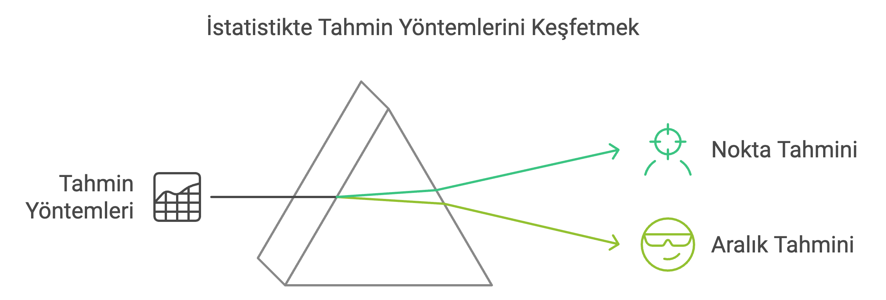
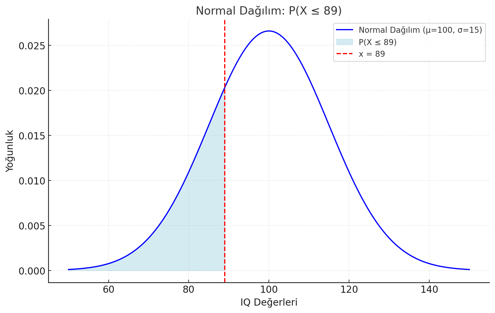
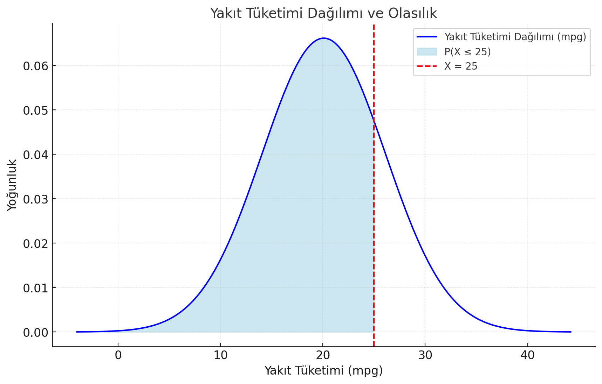
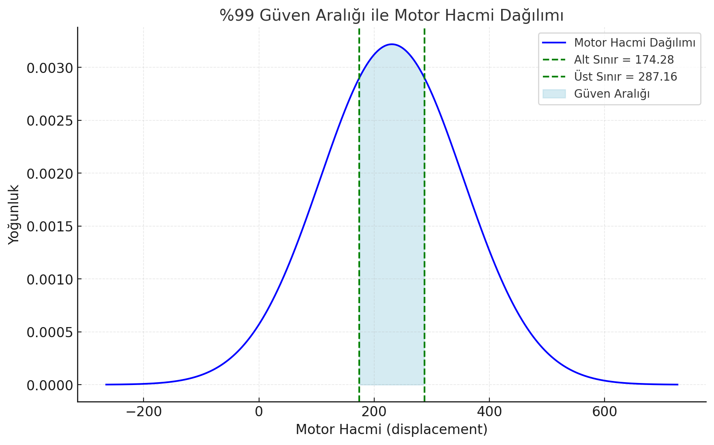

------------------------------------------------------------------------

#### **Tahmin (Estimation)**

Tahmin, örneklem verilerini kullanarak popülasyondaki bilinmeyen bir parametrenin değerini tahmin etmeyi içerir. Örneğin, bir şehirdeki tüm yetişkinlerin ortalama boyunu bilmek istiyorsanız, o şehirden bir grup insanın boyunu ölçebilirsiniz. Bu örneklemin ortalama boyu, şehirdeki tüm yetişkinlerin ortalama boyunu tahmin etmeye yardımcı olur.

Tahmin iki türdedir:

-   **Nokta Tahmini (Point Estimation):** Bir parametre için (örneğin, ortalama boy) tek bir en iyi tahmin sağlar.

-   **Aralık Tahmini (Interval Estimation):** Parametrenin düşmesi muhtemel olduğu bir aralık verir. Örneğin, "ortalama boyun 1,65 cm ve 1,75 cm arasında olduğunu ve bu tahmine %95 güven duyulduğunu" belirtebilir.



------------------------------------------------------------------------

**Hatırlayalım: Çıkarımsal istatistik (Inferential Statistics)**, örneklemlerden elde edilen veriler yardımıyla, bir popülasyon hakkında genelleme yapmayı veya çıkarımda bulunmayı amaçlayan istatistik dalıdır. Yani, çıkarımsal istatistik, sınırlı bir veri kümesinden hareketle daha geniş bir kitleye yönelik tahminlerde bulunmamıza olanak sağlar.

### **Çıkarımsal İstatistiğin Araçları ve Yöntemleri**

1.  **Tahmin:**

    -   **Nokta Tahmini:** Bir popülasyon parametresinin tek bir değerle tahmin edilmesi. Örneğin, bir popülasyonun ortalamasını örneklem ortalamasıyla tahmin etmek.

    -   **Aralık Tahmini:** Popülasyon parametresinin, belirli bir güven düzeyinde, bir aralık içinde yer alma olasılığını ifade eder.

2.  **Hipotez Testi:**

    -   Null hipotez (H0​) ve alternatif hipotez (Ha ya da H1​) kurularak popülasyon hakkında bir iddiayı test etme sürecidir.

    -   Örneğin, bir ilacın etkili olup olmadığını test etmek.

3.  **Regresyon ve Korelasyon Analizi:**

    -   İki veya daha fazla değişken arasındaki ilişkileri incelemek.

4.  **Olasılık Dağılımları:**

    -   Verilerin belirli bir dağılıma (örneğin normal dağılım) uyup uymadığını incelemek.


## Nokta Tahmini (Point Estimation)

-   Bir popülasyon parametresinin tek bir sayısal değerle tahmin edilmesidir.

İstatistikte, R dilindeki **pnorm** fonksiyonu, normal dağılım için kümülatif dağılım fonksiyonunu (CDF) hesaplamak için kullanılır. Eğer popülasyonun gerçek ortalaması ($\mu$) ve standart sapması ($\sigma$) biliniyorsa, olasılıkları hesaplamak için **pnorm** fonksiyonunu doğrudan kullanabilirsiniz.

```{r}
# Sahte IQ puanları oluşturalım
set.seed(178) # Rastgele sayı üretimini sabitle
IQ <- rnorm(n=1000, mean=100, sd=15) # 1000 IQ puanı üret (ortalama=100, sd=15)
IQ <- round(IQ) # IQ puanlarını tam sayıya yuvarla


# Bir öğrencinin IQ puanının 89 veya daha düşük olma olasılığını hesapla
prob <- pnorm(89, mean=100, sd=15)

# Sonucu yazdır
cat("Bir öğrencinin IQ puanının 89 veya daha düşük olma olasılığı:", round(prob, 2))

```



Grafikte, normal dağılım $(\mu=100,\sigma=15)$ gösterilmektedir. Kırmızı kesik çizgi, $x=89$'u temsil ederken, mavi gölgeli alan $P(X\le89)$ olasılığını ifade etmektedir. Bu, X rastgele değişkeninin 89 veya daha düşük IQ'da olma olasılığıdır.

Peki 89'dan büyük olma olasılığını nasıl hesaplarız?

```{r}
# eğer hesapladığınız olasılığı 1'den çıkartırsanız tersi olasılığı bulursunuz
1-prob

# Sonucu yazdır
cat("Bir öğrencinin IQ puanının 89'dan büyük olma olasılığı:", round(1-prob, 2))

```

Bir ek örnek olarak mtcars veri setinden tahmini bir yakıt tüketimi dağılımına bakalım ve bu veri setinden rastgele bir araç seçtiğimizde yakıt tüketiminin mil başına 25 galondan daha az olma ihtimalini kontrol edelim.

```{r}
# Ortalama yakıt tüketimi 
mean_mpg <- mean(mtcars$mpg)  # Ortalama yakıt tüketimi (mpg)
sd_mpg <- sd(mtcars$mpg)      # Yakıt tüketimi standart sapması
value <- 25                  # Kontrol edilecek değer

# P(X <= 25) olasılığını hesaplama
prob <- pnorm(25, mean=mean_mpg, sd=sd_mpg)

# Sonuçları yazdır
cat("mtcars veri setindeki ortalama yakıt tüketimi (mpg):", mean_mpg, "\n")
cat("Yakıt tüketiminin 25 veya daha düşük olma olasılığı (P(X <= 25)):", round(prob, 4), "\n")


```



Grafik, mtcars veri setinden tahmini bir yakıt tüketimi dağılımını göstermektedir. Kırmızı kesik çizgi $X=25$ değerini temsil ederken, mavi gölgeli alan $P(X\le25)$, yani yakıt tüketiminin 25 mpg veya daha az olma olasılığını ifade eder.

Yakıt tüketiminin 25 galondan fazla olma ihtimali?

```{r}
# basit bir şekilde 25'ten küçük olma olasılığını 1'den çıkartırsanız büyük olma olasılığını bulursunuz

1- pnorm(25, mean=mean_mpg, sd=sd_mpg)

# sonucu yazdıralım

cat("Yakıt tüketiminin 25 veya daha düşük olma olasılığı (P(X <= 25)):", round(1- pnorm(25, mean=mean_mpg, sd=sd_mpg), 4), "\n")

```

### Z-Skoru

Z-skoru, bir veri noktasının bir dağılım içindeki ortalamadan ne kadar uzakta olduğunu standart sapma cinsinden ifade eden bir ölçüttür. Z-skoru, bir veriyi standart normal dağılıma (ortalama = 0, standart sapma = 1) dönüştürmek için kullanılır.

##### **Formül:**

$$z = \frac{(X - \mu)}{\sigma}$$

-   X: Değer

-   $\mu$: Ortalama (popülasyon ortalaması)

-   $\sigma$: Standart sapma (popülasyon standart sapması)

#### **Z-Skorunun Anlamı:**

**Z-skoru**, bir değerin ortalamadan ne kadar uzakta olduğunu gösteren bir sayıdır. **Bu uzaklığı standart sapma cinsinden ifade eder.**

-   **Pozitif Z-Skoru:** Veri, ortalamanın üzerindedir.

-   **Negatif Z-Skoru:** Veri, ortalamanın altındadır.

-   **z=0:** Veri, tam olarak ortalamadadır.

**Örnek:** Bir öğrencinin sınav puanı 85, sınıfın ortalama puanı 70 ve standart sapması 10 ise:

$$z = \frac{(85 - 70)}{10} = 1.5 $$

Bu, öğrencinin puanının sınıf ortalamasının 1.5 standart sapma üzerinde olduğunu gösterir.

::: callout-note
Tekrar edelim:

**Z-skoru**, verileri standartlaştırarak olasılıkları hesaplamaya ve bunları standard bir düzlemde karşılaştırmaya olanak tanır.
:::

R'da bir örnekle bakacak olursak:

Popülasyon parametreleri ile Bireysel Değer Tahmini

```{r}

# Ortalaması 100 standard sapması 15 olan bir normal dağılım için pnorm ile bireysel bir değerin 110'dan küçük olma olasılığını hesapla

prob <- pnorm(110, 100, 15)

# Sonucu yazdır
cat("Popülasyon içinde herhangi bir bireysel değerin 110'dan küçük olma olasılığı:", round(prob, 2))

```

**Z-Skoru ile Bireysel Değer Tahmini**

```{r}
# 110 değeri için z-skorunu hesapla ve örneklem ortalamasının 110'dan küçük olma olasılığına z skor ile bak
z <- ((110 -100) / 15)

# Örneklem ortalamasının 110'dan küçük olma olasılığını hesapla
olasilik <- pnorm(z)

cat("Bireysel bir değerin 110'dan küçük olma olasılığı:", round(olasilik, 2))
```

## **Aralık Tahmin Yapma**

Esasında aralık tahmini yapmak nokta tahmini yapma ile benzerdir. Tek yapılması gereken alt ve üst sınırlar için nokta tahmini yapmak ve noktalar arası farkı almaktır.

### Örnek 1:

Örneğin, yukarıdaki örnekte kullandığımız IQ verisetinden rastgele seçilen bir öğrencinin IQ'sunun 89 ile 101 arasında olma olasılığı nedir sorusu için ilk yapmamız gereken alt sınır 89 ve üst sınır 101 arası nokta tahminlerini yapmak ve çıkan sonucu (büyükten küçüğü) çıkarmaktır.

```{r}
# 89 için olasılık
having_89 <- pnorm(89, 100, 15)
# 101 için olasılık
having_101 <- pnorm(101, 100, 15)

# Sonucu yazdır
cat("Rastgele bir seçimin 89 ile 101 arasında olma olasılığı:", having_101 - having_89)
```

Bunu Görselleştirelim:

```{r}
library(ggplot2)

# Verileri tanımlama
mean_est <- 100    # Ortalama
sd_est <- 15       # Standart sapma

# x değerlerini oluştur (dağılımı çizmek için)
x_values <- seq(60, 140, by = 0.1) # 60 ile 140 arasında değerler
y_values <- dnorm(x_values, mean = mean_est, sd = sd_est) # Yoğunluk hesaplama

# Verileri birleştirme
data <- data.frame(x = x_values, y = y_values)

# ggplot ile çizim
plot <- ggplot(data, aes(x = x, y = y)) +
  geom_line(color = "blue", size = 1) +  # Normal dağılım çizgisi
  geom_area(data = subset(data, x >= 89 & x <= 101), aes(x = x, y = y), 
            fill = "red", alpha = 0.5) +  # 89-101 arası alan
  labs(
    title = "Normal Dağılım ve 89-101 Arası Alan",
    x = "IQ Değerleri",
    y = "Olasılık Yoğunluğu"
  ) +
  theme_minimal() +
  theme(
    plot.title = element_text(hjust = 0.5, size = 16, face = "bold")
  )

# Çizimi göster
print(plot)

```

### Örnek 2: Z Skoru Kullanma

Öncelikle IQ puanları için tipik parametreleri tanımlayalım: bir ortalama ($\mu$) 100 ve bir standart sapma ($\sigma$) 15. Daha sonra, bir IQ puanının 85 ile 115 arasında olma olasılığını hesaplayacağız.

```{r}
# 1. Parametreleri Tanımla
mean_IQ <- 100  # Ortalama IQ
sd_IQ <- 15     # Standart sapma
lower_bound <- 85  # Alt sınır
upper_bound <- 115  # Üst sınır

# 2. z-skorlarını hesapla
z_lower <- (lower_bound - mean_IQ) / sd_IQ  # Alt sınır z-skoru
z_upper <- (upper_bound - mean_IQ) / sd_IQ  # Üst sınır z-skoru

# 3. Olasılıkları Hesapla
prob_lower <- pnorm(z_lower)  # P(X < 85)
prob_upper <- pnorm(z_upper)  # P(X < 115)
prob_interval <- prob_upper - prob_lower  # P(85 < X < 115)

# 4. Sonuçları Yazdır
cat(sprintf("Rastgele seçilen bir öğrencinin IQ puanının %s ile %s arasında olma olasılığı yaklaşık %.4f", 
            lower_bound, upper_bound, prob_interval))
```

Bunu da görselleştirelim:

```{r}
library(ggplot2)
# grafik oluşturalım
x <- seq(60, 140, length.out=300)  # X ekseni için aralık
y <- dnorm(x, mean=mean_IQ, sd=sd_IQ)  # Normal dağılım yoğunluk fonksiyonu

# ggplot fonksiyonu ile grafiği çizelim
ggplot(data=NULL, aes(x=x)) +
  geom_line(aes(y=y), color="blue") +  # Normal dağılım eğrisi
  geom_area(aes(y=ifelse(x >= lower_bound & x <= upper_bound, y, 0)), fill="lightgreen") +  # Aralık için gölgeli alan
  geom_vline(xintercept=lower_bound, linetype="dashed", color="red") +  # Alt sınır çizgisi
  geom_vline(xintercept=upper_bound, linetype="dashed", color="red") +  # Üst sınır çizgisi
  labs(
    title="IQ Dağılımı",
    subtitle=sprintf("IQ puanının %s ile %s arasında olma olasılığı", lower_bound, upper_bound),
    x="IQ Puanı",
    y="Yoğunluk"
  ) +
  theme_minimal()


```

### **Z-Skoru mu Doğrudan Değer mi?**

| **Durum** | **Kullanım** | **Kod Örneği** |
|----|----|----|
| Standart normal dağılım ($\mu=0, \sigma=1$) | Z-skoru girilmeli | `pnorm(-1.5)` |
| Orijinal dağılım ($\mu \ne 0, \sigma \ne 1$) | Veri değerleri ve dağılım parametreleri girilmeli | `pnorm(85, mean=100, sd=15)` |

**Standart Normal Dağılıma Dönüştürme** basit bir şekilde verilerin z-skorlarının hesaplanmasıdır. Örneğin veri setimiz 4 kişilik bir örneklemin 85, 100, 115, 130 şeklinde IQ skorları olduğunu var sayalım:

```{r}
# Veriler
x <- c(85, 100, 115, 130)  # IQ değerleri
mu <- 100  # Ortalama IQ
sigma <- 15  # Standart sapma

# Standart normal dağılıma dönüştürme (z-skoru hesaplama)
z_scores <- (x - mu) / sigma
z_scores
```

Bu durumda **standart normal dağılıma dönüştürülmüş veriler -1, 0, 1, 2 olacaktır. Yani z-skorlarıdır.** Standart normal dağılıma dönüştürmek, verilerinizi ortalamadan ve standart sapmadan bağımsız bir ölçekte ifade etmeyi sağlar.

Örneğin **`mtcars` veri setini kullanarak standart normal dağılıma dönüştürmeyi açıklayalım.**

`mtcars` veri setinde **"mpg"** (mil/gallon) sütununu kullanacağız. Bu sütun, bir aracın yakıt verimliliğini temsil eder. Ham değerleri standart normal dağılıma dönüştürüp **z-skorlarını** hesaplayacağız.

### **Adım 1: Veriyi İnceleyelim**

Öncelikle, `mtcars` veri setinin özetine bakalım ve ortalama ile standart sapmayı hesaplayalım.

```{r}
# mtcars veri setini yükle
data(mtcars)

# mpg sütununun özet istatistikleri
summary(mtcars$mpg)

# Ortalama ve standart sapmayı hesaplayalım
mean_mpg <- mean(mtcars$mpg)  # Ortalama
sd_mpg <- sd(mtcars$mpg)      # Standart sapma

cat("mpg için Ortalama:", mean_mpg, "\n")
cat("mpg için Standart Sapma:", sd_mpg, "\n")

```

Bu, `mtcars` veri setindeki **mpg** değerlerinin ortalamasının 20.09, standart sapmasının ise 6.03 olduğunu gösterir.

### **Adım 2: Standart Normal Dağılıma Dönüştürme**

Şimdi, **mpg** sütunundaki her bir değeri standart normal dağılıma dönüştürmek için z-skorlarını hesaplayalım:

```{r}
# Z-skorlarını hesapla
mtcars$z_mpg <- (mtcars$mpg - mean_mpg) / sd_mpg

# İlk birkaç sonucu görelim
head(mtcars[, c("mpg", "z_mpg")])

```

-   **Birinci araç** için **mpg = 21.0** ve **z-skoru = 0.15**.

    -   Bu araç, ortalamadan 0.15 standart sapma yukarıda.

-   **Altıncı araç** için **mpg = 18.1** ve **z-skoru = -0.33**.

    -   Bu araç, ortalamadan 0.33 standart sapma aşağıda.

### **Adım 3: Görselleştirme**

Verileri standart normal dağılıma dönüştürdüğümüzü göstermek için bir histogram çizelim. Orijinal **mpg** değerlerini ve z-skorlarını görselleştireceğiz.

```{r}
library(ggplot2)

# Orijinal mpg histogramı
ggplot(mtcars, aes(x=mpg)) +
  geom_histogram(binwidth=2, fill="blue", alpha=0.7, color="black") +
  labs(title="Orijinal mpg Dağılımı", x="mpg", y="Frekans") +
  theme_minimal()

# Z-skorlarının histogramı
ggplot(mtcars, aes(x=z_mpg)) +
  geom_histogram(binwidth=0.5, fill="green", alpha=0.7, color="black") +
  labs(title="Standart Normal Dağılıma Dönüştürülmüş mpg", x="z-skoru", y="Frekans") +
  theme_minimal()

```

### **Adım 4: Olasılık Hesaplama**

**Örnek:** $P(15 \le \text{mpg} \le 25)$

Bu aralıktaki olasılığı hesaplayalım:

1.  **Ham değerleri z-skorlarına çevir:**

    -   Alt sınır (x=15): $z_{\text{lower}} = \frac{15 - 20.09}{6.03} \approx -0.84$

    -   Üst sınır (x=25): $z_{\text{upper}} = \frac{25 - 20.09}{6.03} \approx 0.81$

2.  **`pnorm` ile olasılık hesapla:**

```{r}
# Ham değerlerin z-skorlarını hesapla
z_lower <- (15 - mean_mpg) / sd_mpg
z_upper <- (25 - mean_mpg) / sd_mpg

# Olasılığı hesapla
prob <- pnorm(z_upper) - pnorm(z_lower)
cat("P(15 <= mpg <= 25):", prob, "\n")

```

Yani, yaklaşık %58 olasılıkla, rastgele bir aracın yakıt verimliliği 15 ile 25 arasında olacaktır.

### **Z-Skorları Olmadan Olasılık Hesaplama**

Eğer z-skorlarını kullanmadan hesap yapmak istiyorsanız, **`pnorm`** fonksiyonunun parametrelerine ham değerleri, ayrıca ortalama ve standart sapmayı ekleyerek hesap yapabilirsiniz. Örneğin:

```{r}
# Olasılığı doğrudan ham değerlerle hesapla
prob <- pnorm(25, mean=mean_mpg, sd=sd_mpg) - pnorm(15, mean=mean_mpg, sd=sd_mpg)
cat("P(15 <= mpg <= 25):", prob, "\n")

```

### **Sonuç: Z-Skoru Şart mı?**

Hayır, z-skoru olasılık hesaplamaları için şart değildir. Doğrudan ham değerler ve dağılım parametreleri (ortalama ve standart sapma) kullanılarak aynı sonuca ulaşabilirsiniz.

Ancak z-skorları:

-   Verileri standartlaştırır,

-   Karşılaştırmayı kolaylaştırır,

-   Dağılımın genel özelliklerini daha iyi anlamanızı sağlar.

Özellikle eğitim ve standart hesaplamalarda, z-skorlarını öğrenmek ve kullanmak faydalıdır, çünkü daha karmaşık analizlerin temelini oluşturur.

## **Güven Aralığı ile Tahmin Yapma (Confidence Interval)**

Güven aralığı, bir popülasyon parametresinin (örneğin ortalama veya oran) belirli bir olasılık seviyesinde hangi değerler arasında yer alabileceğini ifade eden bir aralıktır. Güven aralığı, bir tahminin güvenilirliğini ve belirsizliğini ölçmek için istatistikte kullanılan önemli bir araçtır.

------------------------------------------------------------------------

### **1. Güven Aralığı Nedir?**

Bir güven aralığı, örneklem verilerinden hesaplanır ve iki sınırdan oluşur:

-   **Alt Sınır:** Parametrenin olası en düşük değeri.

-   **Üst Sınır:** Parametrenin olası en yüksek değeri.

**Örnek:** Bir sınıftaki öğrencilerin ortalama IQ'su için %95 güven aralığı \[98,100\] ise, bu şu anlama gelir:

-   %95 güvenle, gerçek popülasyon ortalaması bu aralık içinde yer alır.

### **2. Güven Aralığının Unsurları**

1.  **Güven Düzeyi (Confidence Level):**

    -   Güven aralığının ne kadar güvenilir olduğunu ifade eder.

    -   Genellikle %90, %95 veya %99 olarak seçilir.

    -   Örneğin, %95 güven düzeyi, 100 örneklemden 95'inde gerçek popülasyon parametresinin aralık içinde olacağını belirtir.

2.  **Standart Hata (Standard Error ):**

    -   Örneklem ortalamasının popülasyon ortalamasından ne kadar sapabileceğini ölçer.

    -   Formülü: $$SE = \frac{\sigma}{\sqrt{n}}$$​

        -   $\sigma$: Standart sapma

        -   n: Örneklem büyüklüğü

3.  **Kritik Z veya t-Değeri:**

    -   Güven aralığını belirlemek için kullanılan çarpan.

    -   Normal dağılım için kritik z-değeri, güven düzeyine göre seçilir (z=1.96 için %95 güven düzeyi).

    -   Örneklem büyüklüğü küçükse (n\<30), t-dağılımı kullanılır.

4.  **Tahmin Edilen Değer:**

    -   Genellikle örneklem ortalamasıdır $(\bar{x})$ .

------------------------------------------------------------------------

### **3. Güven Aralığı Nasıl Hesaplanır?**

Güven aralığı, aşağıdaki formülle hesaplanır:

$$ \text{Güven Aralığı} = \bar{x} \pm (z_{\alpha/2} \times SE)$$

-   $\bar{x}$: Örneklem ortalaması

-   $z_{\alpha/2}​$: Kritik z-değeri

-   SE: Standart hata

**Örnek:**

-   Ortalama $(\bar{x})$ = 100

-   Standart sapma ($\sigma$) = 15

-   Örneklem büyüklüğü (n) = 30

-   Güven düzeyi: %95 (z=1.96)

Standart hata:

$$SE = \frac{\sigma}{\sqrt{n}} = \frac{15}{\sqrt{30}} = 2.74$$

Güven aralığı:

$$\text{Güven Aralığı} = 100 \pm (1.96 \times 2.74) = [94.63, 105.37]$$

Bu durumda, gerçek popülasyon ortalamasının %95 güvenle 94.63 ile 105.37 arasında olduğunu söyleyebiliriz.

------------------------------------------------------------------------

### **4. Güven Aralıklarının Kullanım Alanları**

1.  **Popülasyon Parametrelerini Tahmin Etmek:**

    -   Gerçek popülasyon ortalaması, oranı veya farkını tahmin etmek için kullanılır.

2.  **Hipotez Testi:**

    -   Güven aralığı, H0​ hipotezinin reddedilip reddedilemeyeceğini belirlemek için kullanılabilir.

3.  **Kıyaslama:**

    -   Farklı gruplar arasında istatistiksel olarak anlamlı bir fark olup olmadığını değerlendirmek için.

### **Örnek 1:**

Bir örneklemde, sosyal medyada geçirilen günlük ortalamayı hesaplıyoruz:

-   Örneklem ortalaması ($\bar{x}$): 3 saat.

-   Standart sapma (s): 0.5 saat.

-   Örneklem büyüklüğü (n): 100.

-   Güven düzeyi: %95.

#### **1. Örneklem Değerlerini Tanımla**

Kodun ilk kısmında güven aralığını hesaplamak için gereken örneklem bilgileri tanımlanır:

```{r}
# Örneklem değerleri
mean_x <- 3        # Örneklem ortalaması
sd_x <- 0.5        # Standart sapma
n <- 100           # Örneklem büyüklüğü
confidence <- 0.95 # Güven düzeyi

```

#### **2. Z-Skorunu Hesapla**

Kritik z-değeri, %95 güven aralığı için hesaplanır. Bu, toplam alanın $1 - \alpha / 2 = 0.975$ kısmının altında kalan z-değeridir:

```{r}
z <- qnorm((1 + confidence) / 2)
```

**Açıklama:**

-   (1+confidence)/2: %95 güven düzeyi için yukarıdaki kritik alanı belirler.

    -   (1+0.95)/2=0.975.

    -   Bu, standart normal dağılımda toplam alanın %97.5'ine denk gelir.

-   **`qnorm(0.975)`**: Standart normal dağılımdan bu alan için z-değerini bulur.

    -   z=1.96, yani %95 güven düzeyi için kullanılan standart z-skorudur.

#### **3. Standart Hata Hesapla**

Standart hata (SE), standart sapmanın örneklem büyüklüğüne bağlı ölçeklenmiş bir versiyonudur:

```{r}
se <- sd_x / sqrt(n)
```

#### **4. Alt ve Üst Sınırları Hesapla**

Alt ve üst sınırlar, güven aralığı formülüne göre hesaplanır:

```{r}
lower_bound <- mean_x - z * se
upper_bound <- mean_x + z * se

```

#### **5. Güven Aralığını Oluştur**

Son adımda, alt ve üst sınırlar bir vektör olarak birleştirilir:

```{r}
confidence_interval <- c(lower_bound, upper_bound)
cat("Bu, %95 güven düzeyinde, popülasyonun gerçek ortalamasının", round(confidence_interval,2), "saat arasında olduğunu gösterir.")
```

### Örnek 2:

Aynı işlemi yukarıda daha önce yaptığımız IQ veri seti içinde yapabiliriz (çünkü örneklem sayımız n\>30, n=1000) olduğu için.

#### **1. Örneklem Değerlerini Tanımla**

Kodun ilk kısmında güven aralığını hesaplamak için gereken örneklem bilgileri tanımlanır:

```{r}
mean_est <- 100    # Örneklem ortalaması
sd_est <- 15       # Standart sapma
n <- 1000          # Örneklem büyüklüğü
confidence <- 0.99      # %99 güven aralığı için anlamlılık seviyesi
```

#### 2. Kritik Z-Skoru Hesaplama

Kritik z-değeri, %99 güven aralığı için $\alpha=0.01$. Bu durumda:

$$
z = qnorm(1 - \alpha / 2) = qnorm(0.995)
$$

```{r}
alpha <- 1 - confidence
z <- qnorm(1 - alpha / 2)
```

#### **3. Standart Hata Hesapla**

Standart hata (SE), standart sapmanın örneklem büyüklüğüne bağlı ölçeklenmiş bir versiyonudur:

```{r}
se <- sd_est / sqrt(n)
```

#### **4. Alt ve Üst Sınırları Hesapla**

Alt ve üst sınırlar, güven aralığı formülüne göre hesaplanır:

```{r}
lower_bound <- mean_est - z * se
upper_bound <- mean_est + z * se
```

#### **5. Güven Aralığını Oluştur**

Son adımda, alt ve üst sınırlar bir vektör olarak birleştirilir:

```{r}
confidence_interval <- c(lower_bound, upper_bound)
cat("Bu, %99 güven düzeyinde, popülasyonun gerçek ortalamasının", round(confidence_interval,2), "IQ skoru arasında olduğunu gösterir.")
```

### **t-Dağılımını Kullanma Durumu**

Eğer örneklem büyüklüğü küçükse (n\<30 ) veya popülasyon standart sapması bilinmiyorsa, t-dağılımı kullanılır:

$$GA = \bar{x} \pm t \cdot \frac{s}{\sqrt{n}}$$​

Burada:

-   t: İstenen güven düzeyine ve serbestlik derecesine (df=n−1) göre t-dağılım tablosundan alınan t-skoru

**R'da `qnorm()` kullanarak güven aralığı hesaplama**, büyük örneklemlerde (örneğin $n \ge 30$) standart normal dağılım varsayılarak yapılır. Eğer küçük örneklemle çalışıyorsanız, **t-dağılımı** kullanarak `qt()` ile aynı işlemi yapabilirsiniz. R'daki `qt()` fonksiyonu, **t-dağılımı tablosundan kritik değerleri** bulmak için kullanılır. Bu fonksiyon özellikle **küçük örneklemler** ($n < 30$) veya popülasyon standart sapmasının bilinmediği durumlarda güven aralığı ve hipotez testlerinde kullanılır.

qt(p,df) fonksiyonunda:

-   **`p` (Probability):** Dağılımın altında kalan alanın oranı. Genellikle $(\text{güven düzeyi}) / 2$ formülüyle hesaplanır.

    -   Örneğin, %95 güven düzeyi için p=0.975.

-   **`df` (Degrees of Freedom):** Serbestlik derecesi. Genellikle df=n−1 formülüyle bulunur.

### **Adımlar: t-dağılımı ile Kritik Değer Bulma**

### Örnek 3:

Bir örneklemin ortalaması 3 saat, standart sapması 0.5 saat ve örneklem büyüklüğü 10. Güven düzeyi %95.

#### **1. Serbestlik Derecesi (df) Hesapla:** df=n−1

```{r}
n <- 10
df <- n - 1  # Serbestlik derecesi
```

#### **2. Güven Düzeyine Göre `p` Hesapla:** %95 güven düzeyi için:

```{r}
confidence <- 0.95
p <- (1 + confidence) / 2  # Güven düzeyi için p
```

#### 3. `qt()` ile t-değerini Bul:

```{r}
t_value <- qt(p, df)  # Kritik t-değeri
```

#### 4. **Güven Aralığını Hesapla:** Güven aralığı denklemi:

```{r}
mean_x <- 3  # Örneklem ortalaması
sd_x <- 0.5  # Standart sapma
se <- sd_x / sqrt(n)  # Standart hata

lower_bound <- mean_x - t_value * se
upper_bound <- mean_x + t_value * se
confidence_interval <- c(lower_bound, upper_bound)
confidence_interval
```

------------------------------------------------------------------------

```{r}
# Yaşam süresi tahmini (gapminder veri seti)
library(gapminder)

# Ortalama ve standart sapma hesaplama
mean_life <- mean(gapminder$lifeExp)  # Ortalama yaşam süresi
sd_life <- sd(gapminder$lifeExp)      # Standart sapma
n_life <- length(gapminder$lifeExp)  # Örneklem büyüklüğü

# P(X <= 70) olasılığını hesaplama
value <- 70
prob <- pnorm(value, mean=mean_life, sd=sd_life)

# Güven aralığı hesaplama
alpha <- 0.05  # %95 güven düzeyi
z <- qnorm(1 - alpha / 2)  # Kritik z-değeri
error <- z * (sd_life / sqrt(n_life))  # Hata payı
lower_bound <- mean_life - error
upper_bound <- mean_life + error

# Sonuçları yazdırma
cat(sprintf("Gapminder veri setindeki ortalama yaşam süresi: %.2f yıl (%s%% güven aralığı: %.2f - %.2f)\n", 
            mean_life, 100 * (1 - alpha), lower_bound, upper_bound))

cat(sprintf("Rastgele seçilen bir kişinin yaşam süresinin 70 yıldan az olma olasılığı: %.4f\n", prob))
```

```{r}
# Güven aralığı ile displacement tahmini
mean_disp <- mean(mtcars$disp)  # Ortalama motor hacmi
sd_disp <- sd(mtcars$disp)      # Standart sapma
n_disp <- length(mtcars$disp)   # Örneklem büyüklüğü
alpha <- 0.01  # %99 güven düzeyi
z <- qnorm(1 - alpha / 2)  # Kritik z-değeri

# Güven aralığı
error <- z * (sd_disp / sqrt(n_disp))
lower_bound <- mean_disp - error
upper_bound <- mean_disp + error

cat(sprintf("mtcars veri setindeki ortalama motor hacmi: %.2f (displacement) (%s%% güven aralığı: %.2f - %.2f)\n", 
            mean_disp, 100 * (1 - alpha), lower_bound, upper_bound))

```



Grafikte, motor hacmi dağılımı ve %99 güven aralığı gösterilmektedir:

-   **Yeşil kesik çizgiler**: Alt ve üst sınırları temsil eder.

-   **Mavi gölgeli alan**: Güven aralığı içindeki değerleri ifade eder.

## t.test ile hesap vs Manual Yöntem

1.  **Senaryo A:** Elimizde sadece özet bilgiler (Ortalama, Standart Sapma vb.) var.

2.  **Senaryo B:** Elimizde ham veri seti (excel satırları gibi) var.

------------------------------------------------------------------------

### 1. YÖNTEM: Manuel Hesaplama (Özet Bilgilerle)

Bu yöntemi, elinizde ham veri olmadığında kullanırsınız. Örneğin bir makalede "Ortalama=50, Standart Sapma=5" yazıyorsa ve siz güven aralığını merak ediyorsanız bu yolu seçmelisiniz.

**Kullanılan Fonksiyon:** `qnorm()` (Normal Dağılım için kritik değer hesaplar).

### Adım Adım Kod (RStudio'da Çalıştırın)

```{r}
# --- ADIM 1: Bilinenleri Tanımlayalım ---
n <- 100           # Örneklem büyüklüğü (Gözlem sayısı)
x_bar <- 50        # Ortalamamız (Mean)
s <- 10            # Standart Sapmamız (Sd)
guven <- 0.95      # %95 Güven düzeyi istiyoruz

# --- ADIM 2: Hata Payını (Margin of Error) Bulalım ---
# Formül: Kritik Değer * Standart Hata

# a) Standart Hata (Standard Error)
se <- s / sqrt(n)  

# b) Kritik Değer (Z Skoru)
# %95 güven için kuyruklarda kalan alan (alpha) 0.05'tir.
alpha <- 1 - guven
z_skoru <- qnorm(1 - alpha/2)  
# Not: qnorm(0.975) bize meşhur 1.96 değerini verir.

# c) Hata Payı
hata_payi <- z_skoru * se

# --- ADIM 3: Aralığı Oluşturalım ---
alt_sinir <- x_bar - hata_payi
ust_sinir <- x_bar + hata_payi

# Sonucu ekrana yazdıralım
cat("Manuel Hesaplanan %95 Güven Aralığı: [", alt_sinir, "-", ust_sinir, "]")
```

> **İpucu:** Eğer örneklem sayınız çok azsa ($n < 30$), `qnorm` yerine `qt` (t-dağılımı) kullanmak daha doğru sonuç verir.

------------------------------------------------------------------------

### 2. YÖNTEM: Otomatik Hesaplama (Ham Veri ile)

Bu yöntem en pratik olandır. Elinizde bir anket sonucu veya ölçüm verileri varsa formül yazmanıza gerek yoktur. R sizin yerinize "Hipotez Testi" fonksiyonlarını kullanarak aralığı hesaplar.

**Kullanılan Fonksiyon:** `t.test()`

### Adım Adım Kod (RStudio'da Çalıştırın)

```{r}
# --- ADIM 1: Veri Setimizi Oluşturalım ---
# Diyelim ki 10 öğrencinin notları elimizde:
notlar <- c(45, 50, 48, 52, 55, 47, 49, 51, 53, 50)

# --- ADIM 2: Tek Komutla Testi Yapalım ---
# t.test fonksiyonu hem test yapar hem güven aralığı verir.
sonuc <- t.test(notlar, conf.level = 0.95)

# --- ADIM 3: Sonucu İnceleyelim ---
# Tüm test sonucunu görmek için:
print(sonuc)

# Sadece Güven Aralığını çekip almak için:
cat("Otomatik Hesaplanan %95 Güven Aralığı:", sonuc$conf.int)
```

------------------------------------------------------------------------

## Özet Karşılaştırma Tablosu

Hangi durumda hangi kodu kullanmalısınız?

|  |  |  |
|----|----|----|
| **Durum** | **Hangi Yöntem?** | **Neden?** |
| **Elinizde Ham Veri Varsa** | `t.test(veri)` | En kolayıdır. Hata yapma riskiniz yoktur. |
| **Sadece Özet Sayılar Varsa** | `qnorm(...)` formülü | Ham veri olmadığı için `t.test` çalışmaz. |
| **Büyük Örneklem (**$n > 30$) | `qnorm` (Z Tablosu) | Veri sayısı arttıkça dağılım Normale döner. |
| **Küçük Örneklem (**$n < 30$) | `qt` (T Tablosu) | Az veride T dağılımı daha hassastır. |

------------------------------------------------------------------------

**Hatırlatma:** Güven aralığı, "Gerçek ortalamanın, %95 olasılıkla bu iki sayı arasında olduğunu" tahmin etmektir.

## Kritik Ayrım: Güven Aralığı vs. Tahmin Aralığı

İki kavram birbirine çok benzer ama hedefleri farklıdır:

### 1. Güven Aralığı (Confidence Interval - CI)

-   **Neyi arar?** Popülasyonun **ORTALAMASINI (**$\mu$ ).

-   **Soru:** "Tüm sınıfın boy ortalaması kaç olabilir?"

-   **Mantık:** Ortalamalar daha kararlıdır. Veri sayısı ($n$) arttıkça ortalamayı daha net biliriz, bu yüzden **veri sayısı arttıkça Güven Aralığı DARALIR.**

### 2. Tahmin Aralığı (Prediction Interval - PI)

-   **Neyi arar?** Tek bir **GÖZLEMİ (**$x$).

-   **Soru:** "Kapıdan girecek sıradaki öğrencinin boyu kaç olabilir?"

-   **Mantık:** Tek bir kişiyi tahmin etmek çok zordur (biri çok kısa veya çok uzun olabilir). Bu yüzden belirsizlik çok daha fazladır. **Veri sayısı artsa bile bu aralık çok fazla DARALMAZ** (çünkü insan doğasındaki çeşitlilik yok olmaz).

------------------------------------------------------------------------

### R ile İspatlayalım (Görsel Fark)

Aşağıdaki kodu RStudio'da çalıştırdığında, senin tanımının (Tahmin Aralığı) neden Güven Aralığından çok daha geniş olduğunu göreceksin.

```{r}
# 1. Veri Oluşturalım (Örn: Sınav Notları)
set.seed(123)
notlar <- rnorm(100, mean = 50, sd = 10) # Ortalaması 50, SS 10 olan 100 not

# Basit bir model kuralım (Sadece ortalama üzerinden)
model <- lm(notlar ~ 1)

# 2. HESAPLAMA
# predict fonksiyonu bir matris (tablo) döndürür: fit (tahmin), lwr (alt), upr (üst)

# A) Güven Aralığı (Confidence Interval) - Sadece ilk satırı alıyoruz
ci <- predict(model, interval = "confidence", level = 0.95)[1, ]

# B) Tahmin Aralığı (Prediction Interval) - Sadece ilk satırı alıyoruz
pi_araligi <- predict(model, interval = "prediction", level = 0.95)[1, ]

# 3. SONUÇLARI KARŞILAŞTIRMA
cat("--- SONUÇLAR ---\n")
# ci["lwr"] ve ci["upr"] isimleriyle çağırıyoruz
cat("Güven Aralığı (Ortalama nerede?): [", round(ci["lwr"], 2), "-", round(ci["upr"], 2), "]\n")
cat("Tahmin Aralığı (Sıradaki öğrenci kaç alır?): [", round(pi_araligi["lwr"], 2), "-", round(pi_araligi["upr"], 2), "]\n")
```

**Çıktıyı yorumlarsak (yaklaşık değerler):**

-   **Güven Aralığı:** `[49 - 52]` -\> "Sınıfın ortalamasının 50 civarında olduğundan çok eminiz." (Dar aralık)

-   **Tahmin Aralığı:** `[30 - 70]` -\> "Ama rastgele bir öğrenci seçersen notu 30 da olabilir, 70 de." (Geniş aralık)

### Özet

-   Eğer **"Genel durum (trend/ortalama) nedir?"** diyorsan -\> **Güven Aralığı**

-   Eğer **"Sıradaki veri ne gelecek?"** diyorsan -\> **Tahmin Aralığı**
