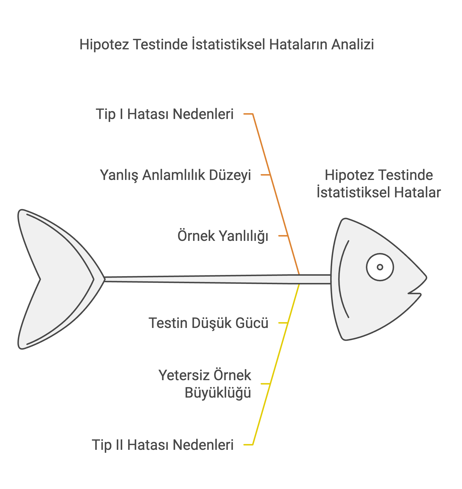

# Hipotez Testi

**Hipotez testi**, bir popülasyon hakkında öne sürülen bir iddianın (hipotezin) istatistiksel olarak doğrulanması veya reddedilmesi için kullanılan bir istatistiksel yöntemdir. Fakat unutmayalım, **hipotez testi,** örneklemden elde edilen verilerden hareketle popülasyonla ilgili bir karar verme sürecini ifade eder.

**Hipotez testi,** yalnızca verilerle desteklenmiş iddiaları kabul ederek objektif ve güvenilir sonuçlara ulaşmamıza olanak tanır ve bu yönüylede oldukça yayğın olarak kullanılan bir istatistiksel yöntemdir.

## **Temel Kavramlar:**

1.  **Null Hipotez (**H0​):

    -   Genellikle "hiçbir fark yoktur" veya "etki yoktur" iddiasını temsil eder.

    -   Örneğin: Bir ilaç, mevcut tedaviye göre daha etkili değildir (H0:μ1=μ2​).

2.  **Alternatif Hipotez (**Ha ya da H1):

    -   Null hipoteze karşı öne sürülen iddiadır.

    -   Örneğin: Bir ilaç, mevcut tedaviye göre daha etkilidir (Ha:μ1\>μ2​).

3.  **Test İstatistiği:**

    -   Hipotez testi için kullanılan hesaplama, genellikle t-skoru veya z-skorudur. Bu istatistik, örneklem verilerinin null hipotezle ne kadar uyumlu olduğunu ölçer.

4.  **Anlamlılık Düzeyi (**α):

    -   Hata yapma ihtimalini ifade eder. Tipik olarak %5 (α=0.05) seçilir.

    -   **Tip I ve Tip II Hataları:**

        -   **Tip I Hatası**: Bu hata, null hipotez (H0​) doğru olduğu halde yanlışlıkla reddedildiğinde meydana gelir. Bu, "yanlış pozitif" hata olarak da bilinir.

        -   **Tip II Hatası**: Bu hata, null hipotez (H0​) yanlış olduğu halde reddedilmediğinde meydana gelir. Bu durum "yanlış negatif" hata olarak adlandırılır.

    ::: callout-note
    👋 **Mahkeme Davası Benzetmesi ile Tip I ve Tip II Hataları**

    Bir mahkeme davasında, bir sanık suçu kanıtlanana kadar masum kabul edilir (Masumiyet Karinesi Hukukun en temel ilkelerindendir). Bu durum, hipotez testine şu şekillerde benzer:

    -   **Null Hipotez (**H0​):Sanık masumdur.

    -   **Alternatif Hipotez (**Ha​): Sanık suçludur.

    -   **Tip I Hatası**: Sanık masumdur, ancak yanlış bir şekilde suçlu bulunur.

    -   **Tip II Hatası**: Sanık suçludur, ancak yanlış bir şekilde beraat eder.
    :::

    -   **P-Değeri:**

        -   **P-değeri (p-value)**, bir istatistiksel testte, null hipotezin (H0​) doğru olduğu varsayımı altında, elde edilen test istatistiği kadar veya daha uç bir sonucun ortaya çıkma olasılığını ifade eden bir değerdir.

        -   P-değeri, hipotez testindeki anlamlılık düzeyini (örneğin, α=0.05) değerlendirmek için kullanılır.

        -   Küçük bir p-değeri (genellikle p\<α ):

            -   Elde edilen sonuçların null hipotezle açıklanmasının zor olduğunu ve alternatif hipotezin (Ha​) daha olası olduğunu gösterir.

        -   Büyük bir p-değeri (genellikle p\>α):

            -   Elde edilen sonuçların null hipotezle uyumlu olduğunu ve H0​'ı reddetmek için yeterli kanıt olmadığını gösterir.

    

5.  **Karar:**

-   **Eğer p-değeri** α'dan küçükse:

    -   **H₀ reddedilir ve H₁ kabul edilir.**\
        Bu durumda, p-değeri, gözlemlenen sonuçların null hipotez (H₀​) doğruyken oluşma olasılığının çok düşük olduğunu gösterir. Bu nedenle, H₀ reddedilir ve alternatif hipotez (H₁​) desteklenir.

-   **Eğer p-değeri** α'dan büyükse:

    -   **H₀ reddedilmez.**\
        Ancak, bu durum H₀​'ın kesinlikle doğru olduğu anlamına gelmez. Sadece, H₀​'yı reddetmek için yeterince güçlü kanıt bulunmadığını ifade eder.

Bu ifade, mahkeme analojisiyle şu şekilde açıklanabilir: Sanık hukukun genel ilkelerinden biri olan masumiyet karinesi uyarınca başlangıçta suçsuz kabul edilir (H0​), ancak mahkeme sürecinde suçluluğunu kanıtlamak için yeterli delil olmadığında sanık beraat eder. Bu, sanığın masum olduğunu kesin olarak kanıtlamaz; yalnızca suçlu olduğuna dair yeterli kanıt bulunmadığını gösterir.

-   **P-Değeri ve Anlamlılık Düzeyi (**α**) Arasındaki İlişki:**

| **P-Değeri** | **Sonuç** |
|----|----|
| p\<0.01 | Çok güçlü bir şekilde H0H_0H0​ reddedilir (sonuç oldukça anlamlıdır). |
| 0.01≤p\<0.05 | H0​ reddedilir (sonuç anlamlıdır). |
| 0.05≤p\<0.10 | Zayıf bir şekilde H0 reddedilir (sonuç marjinal olarak anlamlıdır). |
| p≥0.10 | H0​ reddedilmez (sonuç anlamlı değildir). |

------------------------------------------------------------------------

------------------------------------------------------------------------

## **Adım Adım Hipotez Testi Süreci**

#### **Adım 1: Hipotezleri Belirle**

İlk olarak, null hipotezi (H0​) ve alternatif hipotezi (Ha​) tanımlayın. Bu hipotezler karşılıklı olarak birbirini dışlamalı ve birlikte tüm olasılıkları kapsamalıdır.

-   **Null Hipotez (**H0​): Genellikle, bir etkinin olmadığı veya gruplar arasında fark bulunmadığını ifade eder.\
    Örneğin: "Farklı öğretim yöntemleriyle eğitim alan öğrenciler arasında test puanı ortalamaları arasında fark yoktur."

-   **Alternatif Hipotez (**Ha​): Bir etkinin veya farkın olduğunu ifade eder.\
    Örneğin: "Yöntem B ile eğitim alan öğrencilerin ortalama test puanları, Yöntem A ile eğitim alan öğrencilerden daha yüksektir."

#### **Adım 2: Uygun Bir Test Seç**

Veri türüne ve test etmek istediğiniz hipoteze göre bir istatistiksel test seçin. Test seçimi şu faktörlere bağlıdır:

-   **Veri Türü:** Nominal, ordinal, aralık (interval), oran (ratio) gibi.

-   **Verinin Dağılımı:** Normal dağılım olup olmadığı.

-   **Örneklem Büyüklüğü:** Küçük ya da büyük örneklem.

-   **Örneklemler Arası Bağımlılık:** Bağımsız veya eşleştirilmiş (paired) örneklemler.

**Sık Kullanılan Testler:**

-   **t-Testi:** Tek bir grubun ortalamasını veya iki grubun ortalamalarını karşılaştırır.

-   **ANOVA:** Üç veya daha fazla grubun ortalamalarını karşılaştırır.

-   **Ki-Kare (Chi-Squaere) Testi:** Kategorik değişkenler arasındaki ilişkileri test eder.

-   **Regresyon Analizi:** Değişkenler arasındaki ilişkileri anlamak için kullanılır.

#### **3: Test İstatistiğini Hesapla**

Seçtiğiniz teste göre şu adımları izleyin:

1.  Örnek veriyi toplayın.

2.  Seçilen teste uygun formülü kullanarak test istatistiğini hesaplayın. Bu hesaplama genellikle ortalama, standart sapma gibi ölçümleri içerir.

#### **Adım 4: p-Değerini Hesapla ve Yorumla**

-   **p-Değeri:** Verilerinizin (veya daha aşırı sonuçların) null hipotez doğruyken gözlemlenme olasılığını ifade eder.

-   p-değeri, testin anlamlılık düzeyine göre sonuçların istatistiksel olarak önemli olup olmadığını belirler.

#### **Adım 5: Karar Ver (p-Değeri ve Anlamlılık Düzeyi** α'ya Göre)

-   **p-değeri ≤** α: Null hipotezi reddedin (etkiye dair kanıt var).

-   **p-değeri \>** α: Null hipotezi reddetmeyin (etki olduğuna dair yeterli kanıt yok).

#### **Adım 6: Sonuçları Raporla**

-   **Hipotez Testi Sonucu:** Null hipotezi reddedip reddetmediğinizi açıkça belirtin.

-   **Sonuçların Yorumlanması:** Bulgularınızın çalışmanın bağlamındaki anlamını tartışın.

::: callout-note
👋 Aşağıda, R'de en yaygın kullanılan hipotez testi yöntemi olan **t-testi** açıklanmıştır!

t.test(x, y = NULL, alternative = c("two.sided", "less", "greater"), mu = 0, paired = FALSE, var.equal = FALSE, conf.level = 0.95, …)

Burada:

-   **x, y:** İki veri örneklemi.

-   **alternative:** Testin alternatif hipotezi.

    -   `"two.sided"`: İki yönlü (farklılık olup olmadığı).

    -   `"less"`: Daha küçük (mu'nun altında olup olmadığını test eder).

    -   `"greater"`: Daha büyük (mu'nun üstünde olup olmadığını test eder).

-   **mu:** Gerçek ortalama değeri.

-   **paired:** Eşleştirilmiş t-testi yapılıp yapılmayacağını belirtir (default: **FALSE**, eşleştirilmiş değil).

-   **var.equal:** Örneklemler arasındaki varyansların eşit olup olmadığını varsaymak.

-   **conf.level:** Kullanılacak güven düzeyi (default: %95 güven düzeyi).
:::

------------------------------------------------------------------------

## Örnek 1: Bir Örneklem t-Testi

Bir örneklem t-testi, bir popülasyonun ortalamasının bilinen bir değere eşit olup olmadığını test etmek için kullanılır. Örneğin, tarım bilimcilerinin yeni bir mısır türü geliştirdiğini ve bu türün ortalama boyunun, standart mısır türlerinin ulusal ortalama boyu olan 150 cm'den farklı olduğunu iddia ettiklerini varsayalım.

### Adım 1: Hipotezlerin Formülasyonu

-   **Null Hipotezi (H0):** Yeni mısır türünün ortalama boyu 150 cm'dir.

-   **Alternatif Hipotez (H1):** Yeni mısır türünün ortalama boyu 150 cm değildir.

### Adım 2: Uygun Testin Seçimi

-   **Seçilen Test:** Bir örneklem t-testi, çünkü örneklem ortalamasını bilinen popülasyon ortalaması ile karşılaştırıyoruz.

-   **Veri Türü:** Sürekli (mısır boyları)

-   **Örneklem Büyüklüğü:** 12 mısır bitkisi

### Adım 3: Test İstatistiğinin Hesaplanması

Aşağıdaki R kodunu kullanarak t-testini hesaplayabilirsiniz:

```{r}
# Örneklem verilerini tanımla
corn_heights <- c(155, 153, 149, 156, 151, 154, 152, 150, 151, 153, 152, 150)

# Bir örneklem t-testi yap
t_test_result <- t.test(corn_heights, mu = 150)

```

### Adım 4: p-değerini Almak ve Yorumlamak

```{r}
# Test sonucunu yazdır
print(t_test_result)

```

**Test Çıktısı Yorumlaması:**

p-değeri (0.004697), yaygın α (0.05) seviyesinden önemli ölçüde küçüktür, bu da null hipotezini reddetmek için güçlü istatistiksel bir kanıt olduğunu gösterir. Bu durum, yeni mısır türünün ortalama boyunun 150 cm'den istatistiksel olarak farklı olduğunu belirtir.

### Adım 5: p-değeri ve Alfa (α) Temelinde Karar Vermek

p-değeri (0.004697) \< α (0.05) olduğundan, null hipotezini reddedin.

Veriler, yeni mısır türünün ortalama boyunun 150 cm'den anlamlı şekilde farklı olduğunu göstermektedir.

### Adım 6: Sonuçları Raporlamak

Bir örneklem t-testi ile mısırın ortalama boyunun 150 cm'den farklı olup olmadığı test edilmiştir.

p-değeri 0.004697'dir, bu da 0.05'ten küçük olduğu için null hipotezini reddetmemize ve boy farkının anlamlı olduğunu söylememize olanak sağlar.

%95 güven aralığı 150.8166 ile 153.5168 cm arasındadır. Bu aralık, 150 cm'yi içermediği için null hipotezinin reddedilmesini destekler.

Sonuç olarak, mısırın ortalama boyunun 150 cm'den farklı olduğu, özellikle 150 cm'den yüksek olduğu bulunmuştur.

### Alternatif Hipotez ile t-Testi: Ortalama Mısır Boyunun 150 cm'den Büyük veya Küçük Olup Olmadığını Test Etmek

Eğer mısır boyunun ortalama değeri 150 cm'den büyük mü, yoksa küçük mü olduğunu test etmek istiyorsanız, `alternative` argümanını "greater" veya "less" olarak ayarlayabilirsiniz.

#### 150 cm'den Büyük Olması Durumunda:

```{r}
# 150 cm'den büyük olması durumu için (Ho: mu≤150, H1: mu>150)
t_test_greater <- t.test(corn_heights, mu = 150, alternative = "greater")
print(t_test_greater)

```

**Yorum:** p-değeri 0.002348 olduğundan, null hipotezini reddediyorsunuz ve mısır boyunun 150 cm'den büyük olduğuna dair istatistiksel olarak anlamlı bir kanıt buluyorsunuz. Güven aralığı 151.0651'den başlayarak 150 cm'yi dışlıyor ve bu durumu destekliyor.

::: callout-note
👋 Eğer **150 cm'den büyük olup olmadığını** test ediyorsanız, bu durumda hipotezler şu şekilde olacak:

-   **Null Hipotezi (H0)**: Ortalama boy 150 cm'den küçük veya eşittir (mu ≤ 150).

-   **Alternatif Hipotez (H1)**: Ortalama boy 150 cm'den büyüktür (mu \> 150).

Eğer 150 cm'den küçük olup olmadığını test ediyorsanız, bu durumda hipotezler şu şekilde olacak:

-   **Null Hipotezi (H0)**: Ortalama boy 150 cm'den büyük veya eşittir (mu ≥ 150).

<!-- -->

-   **Alternatif Hipotez (H1)**: Ortalama boy 150 cm'den küçüktür (mu \< 150).
:::

#### 150 cm'den Küçük Olması Durumunda:

```{r}
# 150 cm'den küçük olması durumu için (Ho: mu ≥ 150, H1:mu < 150 )
t_test_less <- t.test(corn_heights, mu = 150, alternative = "less")
print(t_test_less)

```

**Yorum:** p-değeri 0.9977 olduğundan, null hipotezini reddetmiyorsunuz. Bu sonuç, mısır boyunun 150 cm'den küçük olmadığına dair güçlü bir kanıt sağlıyor. Gerçekten de örneklem verileri, mısır boyunun 150 cm'den büyük olduğunu gösteriyor.

------------------------------------------------------------------------

## Örnek 2: **PlantGrowth Veri Seti ile Bir Örneklem t-Testi**

R'deki **PlantGrowth** veri seti, kontrol ve iki farklı tedavi koşulu altında yetiştirilen bitkilerin ağırlıklarını içerir. Bu örnekte, bir tedavi grubunun (trt1) ağırlığının bilinen veya varsayılan bir popülasyon ortalamasından (5 gram) farklı olup olmadığını test edeceğiz.

### **Adım 1: Hipotezlerin Formülasyonu**

-   **Senaryo:** Tarihsel veriler, benzer büyüme koşullarındaki bitkilerin ortalama ağırlığının 5 gram olduğunu öne sürmektedir. Tedavi 1 (trt1) grubundaki bitkilerin ortalama ağırlığının bu değerden farklı olup olmadığını test edeceğiz.

-   **Null Hipotezi (**H0​): Tedavi edilen bitkilerin ortalama ağırlığı 5 gramdır (μ=5).

-   **Alternatif Hipotezi (**H1​): Tedavi edilen bitkilerin ortalama ağırlığı 5 gramdan farklıdır (μ≠5).

### **Adım 2: Uygun Testin Seçimi**

-   **Test Türü:** Bir örneklem t-testi, çünkü bir örneklem ortalamasını bilinen bir popülasyon ortalaması ile karşılaştırıyoruz.

-   **Veri Türü:** Sürekli (bitki ağırlıkları)

-   **Dağılım:** Verinin normal dağıldığı varsayılır. Küçük örneklemler için bu varsayım Shapiro-Wilk testi gibi bir normallik testi ile kontrol edilebilir.

### **Adım 3: Test İstatistiğinin Hesaplanması**

R kodu ile testi gerçekleştirelim:

```{r}
# Veri yükle
data("PlantGrowth")

# 'trt1' grubunun verilerini filtrele
trt1_data <- PlantGrowth$weight[PlantGrowth$group == 'trt1']

# 5'e karşı bir örneklem t-testi yap
t_test_result <- t.test(trt1_data, mu = 5)

```

### Adım 4: p-Değerinin Alınması ve Yorumlanması

```{r}
# Test sonuçlarını yazdır
print(t_test_result)
```

**Test Çıktısının Yorumu:**

-   **p-değeri (0.2098):** Bu değer, yaygın olarak kullanılan anlamlılık seviyesi (α=0.05) ile karşılaştırıldığında büyüktür. Bu, null hipotezi reddetmek için yeterli kanıt olmadığını gösterir.

-   **Sonuç:** Tedavi edilen bitkilerin ortalama ağırlığının varsayılan 5 gramdan anlamlı bir şekilde farklı olduğunu söylemek için yeterli kanıt yoktur.

### **Adım 5: Karar Ver (p-değeri ve** α'ya Göre)

-   **p-değeri (0.2098) \>** α(0.05): Null hipotezi reddetmeyin.

-   Bu karar, tedavi edilen bitkilerin ortalama ağırlığının 5 gramdan farklı olmadığı anlamına gelir.

### **Adım 6: Sonuçları Raporlamak**

Tedavi grubunun (trt1) ortalama ağırlığının 5 gramdan farklı olup olmadığını değerlendirmek için bir t-testi yapıldı. Hesaplanan t-istatistiği -1.3507 ve p-değeri 0.2098'dir. P-değeri 0.05'ten büyük olduğu için null hipotezi reddetmek için yeterli kanıt yoktur.

%95 güven aralığı 4.0932 ile 5.2288 gram arasında olup, 5 gramı içerdiğinden null hipotezin reddedilmesini desteklemez.

Sonuç olarak, tedavi edilen bitkilerin ortalama ağırlığının 5 gramdan farklı olduğuna dair yeterli kanıt yoktur. Bu, trt1 tedavisinin bitki ağırlığını anlamlı bir şekilde değiştirmediğini gösterir.

------------------------------------------------------------------------

## **Örnek 3: Eşleştirilmiş Örneklem t-Testi**

Eşleştirilmiş örneklem t-testi, bir örneklemdeki her bir gözlemin diğer bir örneklemdeki eşleşmiş bir gözlemle karşılaştırılabildiği durumlarda iki örneklemin ortalamalarını karşılaştırmak için kullanılır.

### **Senaryo:**

Bir antrenman programının basketbol oyuncularının maksimum dikey sıçrama yüksekliğini (inç cinsinden) artırıp artırmadığını bilmek istiyoruz.

Bunu test etmek için rastgele 12 üniversite basketbol oyuncusu seçilir ve her birinin maksimum sıçrama yüksekliği ölçülür. Daha sonra oyuncular bir ay boyunca antrenman programını uygular ve ay sonunda sıçrama yükseklikleri tekrar ölçülür.

Bu senaryoda, basketbol oyuncularının antrenman öncesi ve sonrası maksimum sıçrama yüksekliğini karşılaştırmak için **eşleştirilmiş örneklem t-testi** uygun bir yöntemdir. İşte bu hipotez testini adım adım nasıl gerçekleştireceğiniz:

------------------------------------------------------------------------

### **Adım 1: Hipotezleri Belirleme**

-   **Null Hipotezi (**H0): Antrenman programının basketbol oyuncularının maksimum dikey sıçramaları üzerinde hiçbir etkisi yoktur. Matematiksel olarak: μd=0​ antrenman öncesi ve sonrası sıçrama yükseklikleri arasındaki farkın ortalamasıdır.

-   **Alternatif Hipotezi (**H1​): Antrenman programının basketbol oyuncularının maksimum dikey sıçramaları üzerinde etkisi vardır. Matematiksel olarak: μd≠0.

------------------------------------------------------------------------

### **Adım 2: Uygun Testi Seçme**

Bu durumda, iki ölçüm aynı kişilerden alındığı için bireysel değişkenlikleri kontrol eden **eşleştirilmiş örneklem t-testi** en uygun yöntemdir.

-   **Test Türü:** Eşleştirilmiş t-testi.

-   **Veri Türü:** Sürekli (maksimum sıçrama yükseklikleri).

------------------------------------------------------------------------

### **Adım 3: Test İstatistiğini Hesaplama**

R kodu ile testi gerçekleştirelim:

```{r}
# Öncesi ve sonrası sıçrama yüksekliklerini tanımlayın
before <- c(22, 24, 20, 19, 19, 20, 22, 25, 24, 23, 22, 21)
after <- c(23, 25, 20, 24, 18, 22, 23, 28, 24, 25, 24, 20)

# Eşleştirilmiş t-testi yapın
paired_t_test_result <- t.test(x = before, y = after, paired = TRUE)

```

### Adım 4: p-Değerinin Alınması ve Yorumlanması

```{r}
# Test sonucunu yazdır
print(paired_t_test_result)

```

**p-değeri:** 0.02803. Bu değer, null hipotez doğruyken gözlemlenen veya daha uç bir test istatistiği elde etme olasılığını temsil eder.

### **Adım 5: p-Değeri ve Alfa (**α) Temelinde Karar Verme

-   **p-değeri (0.02803) \<** α (0.05): Null hipotez reddedilir.

-   Bu karar, antrenman programının basketbol oyuncularının maksimum dikey sıçrama yükseklikleri üzerinde etkisi olduğunu göstermektedir.

### **Adım 6: Sonuçları Raporlama**

Eşleştirilmiş t-testi yapıldı ve t-istatistiği -2.5289, p-değeri 0.02803 olarak hesaplandı. Bu değer, antrenman sonrası sıçrama yüksekliklerinin antrenman öncesine göre anlamlı şekilde arttığını gösteriyor.

%95 güven aralığı -2.3379 ile -0.1621 inç arasındadır ve 0'ı içermediği için null hipotezi reddetmeyi destekler. Ortalama fark -1.25 inç olup, bu da antrenman sonrası sıçrama yüksekliklerinin ortalama 1.25 inç arttığını belirtir.

Sonuç olarak, antrenman programı basketbol oyuncularının sıçrama performansını artırmada etkili bulunmuştur.

------------------------------------------------------------------------

## Örnek 4: **İki Örneklem t-Testi**

### **Adım 1: Hipotezlerin Belirlenmesi**

-   **Null Hipotezi (**H0​): Mısır türü 1’in ortalama boyu, mısır türü 2’nin ortalama boyuna eşittir. Matematiksel olarak:

    μ1=μ2​

-   **Alternatif Hipotezi (**H1​): Mısır türü 1’in ortalama boyu, mısır türü 2’nin ortalama boyuna eşit değildir. Matematiksel olarak:

    μ1≠μ2​

------------------------------------------------------------------------

### **Adım 2: Uygun Testin Seçilmesi**

-   İki bağımsız örneklemin ortalamalarını karşılaştırmak için **iki örneklem t-testi** uygundur.

-   Bu test, her iki grubun verilerinin normal dağıldığı ve varyanslarının eşit olduğu varsayımı altında kullanılabilir (varyansların eşit olup olmadığını kontrol etmek için gerekirse bir F-testi yapılabilir).

------------------------------------------------------------------------

### **Adım 3: Test İstatistiğinin Hesaplanması**

Aşağıdaki R kodu ile testi gerçekleştirin:

```{r}
# Örnek verileri tanımla
sample1 <- c(155, 153, 149, 156, 151, 154, 152, 150)
sample2 <- c(162, 158, 159, 161, 160, 157, 158, 159)

# Eşit varyans varsayımı ile iki örneklem t-testi yap
t_test_result <- t.test(sample1, sample2, alternative = "two.sided", var.equal = TRUE)

```

### Adım 4: p-Değerinin Alınması ve Yorumlanması

```{r}
# Test sonucunu yazdır
print(t_test_result)

```

-   **p-Değeri:** $1.545 \times 10^{-5}$. Bu çok küçük değer, null hipotezin doğru olduğu varsayımı altında gözlemlenen fark kadar veya daha büyük bir farkın oluşma olasılığının yaklaşık 0.00001545 olduğunu ifade eder.

-   **Yorum:** p-değeri, yaygın olarak kullanılan anlamlılık seviyesi (α=0.05) ile karşılaştırıldığında oldukça küçüktür ve null hipoteze karşı güçlü kanıt sağlar.

### **Adım 5: p-Değeri ve Alfa (**α) Temelinde Karar Verme

-   **Karar:** p-değeri 0.05’ten küçük olduğu için null hipotez reddedilir.

-   **Sonuç:** İki mısır türünün ortalama boyları arasında istatistiksel olarak anlamlı bir fark vardır.

### **Adım 6: Sonuçların Raporlanması**

-   **Test Türü:** İki örneklem t-testi.

-   **t-İstatistiği:** -6.4411. Bu, sample1’in ortalama boyunun sample2’nin ortalama boyundan daha düşük olduğunu gösterir.

-   **Serbestlik Dereceleri:** 14.

-   **p-Değeri:** $1.545 \times 10^{-5}$, oldukça küçüktür.

-   **Güven Aralığı:** Ortalama fark için %95 güven aralığı: -8.998 ile -4.502. Bu aralık 0'ı içermediği için null hipotezin reddedilmesini destekler.

-   **Ortalama Tahminleri:**

    -   Sample1 için ortalama boy: **152.5 cm**.

    -   Sample2 için ortalama boy: **159.25 cm**.

**Sonuç:** İki mısır türünün ortalama boyları arasında anlamlı bir fark vardır. Mısır türü 2’nin ortalama boyu, mısır türü 1’den daha uzundur. Bu fark istatistiksel olarak anlamlıdır.

------------------------------------------------------------------------

## Örnek 5: **sleep Veri Seti ile İki Örneklem t-Testi**

### **Adım 1: Hipotezlerin Belirlenmesi**

-   **Null Hipotezi (**H0​): İki ilaç grubu arasında ortalama ekstra uyku süresi açısından fark yoktur.

-   **Alternatif Hipotezi (**H1​): İki ilaç grubu arasında ortalama ekstra uyku süresi açısından fark vardır.

### **Adım 2: Uygun Testin Seçilmesi**

İki bağımsız grubun ortalamalarını karşılaştırmak için **iki örneklem t-testi** uygundur. Bu test, popülasyon varyanslarının eşit olmadığı varsayımı altında yapılır (**Welch’in t-testi**).

### **Adım 3: Test İstatistiğinin Hesaplanması**

Aşağıdaki R kodu ile testi gerçekleştirebilirsiniz:

```{r}
# Veri yükle
data("sleep")

# İki örneklem t-testi (Welch t-testi)
t_test_result <- t.test(extra ~ group, data = sleep)

```

### Adım 4: p-Değerinin Alınması ve Yorumlanması

```{r}
# Test sonucunu yazdır
print(t_test_result)
```

**p-değeri:** 0.07939. Bu değer, null hipotezin doğru olduğu varsayımı altında, iki grup arasındaki fark kadar veya daha büyük bir fark gözlemleme olasılığını ifade eder.

### **Adım 5: p-Değeri ve Alfa (**α) Temelinde Karar Verme

-   **p-değeri \> 0.05:** Null hipotez reddedilmez.

-   Bu sonuç, iki ilaç grubu arasında ortalama ekstra uyku süresi açısından istatistiksel olarak anlamlı bir fark olmadığını gösterir.

### **Adım 6: Sonuçları Raporlama**

Welch İki Örneklem t-Testi, iki farklı uyku tedavisinin bireylerde sağladığı ekstra uyku süresini karşılaştırmak için yapıldı.

**Test Sonuçları:**

-   **t-İstatistiği:** -1.8608 (Grup 1’in uyku artışı, Grup 2’den daha az).

-   **p-Değeri:** 0.07939 (0.05’ten büyük olduğu için anlamlı değildir).

-   **Güven Aralığı:** -3.365 ile 0.205 (%95 güven aralığı 0’ı içerdiği için fark sıfır olabilir).

-   **Ortalama Uyku Artışı:**

    -   Grup 1: 0.75 saat.

    -   Grup 2: 2.33 saat.

**Sonuç olarak;** İki grup arasında uyku süresi artışı açısından anlamlı bir fark bulunamamıştır. Gözlemlenen fark, rastgele şansa bağlı olabilir. Daha büyük bir örneklem veya farklı koşullarla ek araştırmalara ihtiyaç vardır.

------------------------------------------------------------------------

## Örnek 6: **ToothGrowth Veri Seti ile ANOVA Testi**

ANOVA (Varyans Analizi), üç veya daha fazla grup ortalaması arasında fark olup olmadığını test etmek için kullanılan bir istatistiksel yöntemdir. Bu örnekte, R'deki **ToothGrowth** veri setini kullanarak, farklı doz seviyelerindeki C vitamini takviyelerinin kobaylardaki diş büyümesine etkisini inceleyeceğiz. Veri seti şu değişkenleri içerir:

-   **len**: Diş büyüme uzunluğu.

-   **supp**: Takviye türü (VC: Vitamin C, OJ: Portakal suyu).

-   **dose**: Takviyenin doz seviyesi.

Bu analizde, takviye doz seviyelerine göre diş büyümesi (lenlenlen) ortalamalarını karşılaştırmak için **tek yönlü ANOVA** testi yapacağız.

### **Adım 1: Hipotezlerin Belirlenmesi**

-   **Null Hipotezi (**H0​): Farklı C vitamini dozları arasında ortalama diş büyümesi (lenlenlen) açısından fark yoktur.

-   **Alternatif Hipotezi (**H1​): En az bir doz seviyesi diğerlerinden farklı bir ortalama diş büyümesine sahiptir.

### **Adım 2: Uygun Testin Seçilmesi**

-   Veri, üçten fazla grubun (farklı dozlar) ortalamalarını karşılaştırmayı içerdiğinden, **ANOVA** testi uygundur.

-   ANOVA, şu varsayımlar altında çalışır:

    -   Normal dağılım,

    -   Gözlemler arasında bağımsızlık,

    -   Grupların varyanslarının homojenliği.

### **Adım 3: Test İstatistiğinin Hesaplanması**

Aşağıdaki R kodu ile ANOVA testi gerçekleştirilmiştir:

```{r}
# Veri yükle
data("ToothGrowth")

# 'dose' değişkenini faktöre dönüştür
ToothGrowth$dose <- as.factor(ToothGrowth$dose)

# Veri yapısını kontrol et
str(ToothGrowth)
summary(ToothGrowth)

# ANOVA testi yap
anova_result <- aov(len ~ dose, data = ToothGrowth)
summary(anova_result)
```

### **Adım 4: p-Değerinin Alınması ve Yorumlanması**

-   **F değeri:** 67.42. Bu değer, tedavi grupları (doz seviyeleri) ile artıklardan (hatalardan) kaynaklanan varyans oranını ölçer. Yüksek bir F değeri, modelin güçlü olduğunu gösterir.

-   **p-değeri:** $9.53 \times 10^{-16}$ Bu çok küçük değer, null hipotezin doğru olduğu varsayımı altında, gözlemlenen fark kadar veya daha büyük bir farkın oluşma olasılığının neredeyse sıfır olduğunu gösterir.

**Yorum:** Çok düşük p-değeri, null hipotezi reddetmek için güçlü bir istatistiksel kanıt sağlar. Farklı doz seviyeleri, diş büyümesi üzerinde istatistiksel olarak anlamlı farklı etkilere sahiptir.

### **Adım 5: p-Değeri ve Alfa (**α) Temelinde Karar Verme

-   α seviyesi: 0.05 (genel olarak kullanılan anlamlılık seviyesi).

-   **Karar:** p-değeri $9.53 \times 10^{-16}$, 0.05'ten çok daha küçük olduğu için null hipotez reddedilir.

**Sonuç:** Farklı C vitamini dozlarının kobayların diş büyümesi üzerinde farklı etkileri olduğu istatistiksel olarak anlamlıdır.

### **Adım 6: Sonuçları Raporlama**

-   **Analizin Özeti:** ANOVA testi, farklı dozlarda uygulanan C vitamininin diş büyümesi üzerinde anlamlı farklılıklar yarattığını göstermiştir.

-   **Detaylı Bulgular:**

    -   Doz seviyeleri arttıkça diş uzunluğunda anlamlı değişiklikler gözlemlenmiştir.

    -   Bu sonuçlar, doz-yanıt ilişkisini desteklemektedir.

    -   Bu sonuçlar, C vitamini dozunun kobayların diş büyümesi üzerinde önemli bir etkisi olduğunu göstermektedir.

**Grafiksel Temsil:** Gruplar arasındaki farkları görsel olarak göstermek için kutu grafikleri gibi grafiksel özetlerin eklenmesi faydalı olabilir.

```{r}
boxplot(len ~ dose, data = ToothGrowth,
        main = "Tooth Growth by Vitamin C Dose Levels",
        xlab = "Dose of Vitamin C (mg)",
        ylab = "Tooth Length",
        col = c("lightblue", "lightgreen", "pink"))
```

------------------------------------------------------------------------

## Örnek 7: **UCBAdmissions Veri Seti ile Ki-Kare Bağımsızlık Testi**

### **Adım 1: Hipotezlerin Belirlenmesi**

-   **Null Hipotezi (**H0​): Cinsiyet ve kabul durumu birbirinden bağımsızdır.

-   **Alternatif Hipotezi (**H1​): Cinsiyet ve kabul durumu bağımsız değildir.

### **Adım 2: Uygun Testin Seçilmesi**

Ki-kare bağımsızlık testi, iki kategorik değişken arasındaki ilişkiyi test etmek için uygundur.

### **Adım 3: Test İstatistiğinin Hesaplanması**

R kodu ile testi gerçekleştirin:

```{r}
data("UCBAdmissions")

# Cinsiyet ve kabul durumu için iki yönlü tablo oluştur
admission_table <- apply(UCBAdmissions, c(1, 2), sum)
print(admission_table)

# Ki-kare testi yap
chi_sq_result <- chisq.test(admission_table)
print(chi_sq_result)

```

### **Adım 4: p-Değerinin Yorumlanması**

-   **p-Değeri:** \< $2.2 \times 10^{-16}$. Bu pratikte sıfır anlamına gelir ve null hipotezi reddetmek için güçlü bir kanıt sağlar.

-   **Yorum:** Cinsiyet ve kabul durumu arasındaki ilişki, istatistiksel olarak anlamlıdır.

### **Adım 5: Karar Verme (**α=0.05)

-   **Karar:** p-değeri \<0.05 olduğundan, null hipotez reddedilir.

-   **Sonuç:** Cinsiyet, kabul kararlarında önemli bir etkiye sahiptir. Bu, potansiyel eşitsizlikler veya diğer etkenlerin araştırılmasını gerektirebilir.

### **Adım 6: Sonuçların Raporlanması**

Bu analiz, cinsiyetin kabul kararlarını etkileyebileceğini gösterir. Bu sonuçlar, eğitim politikalarının adil ve eşitlikçi olmasını sağlamak için yeniden değerlendirme gerekliliğini vurgular.

------------------------------------------------------------------------

## Örnek 8: **mtcars Veri Seti ile Basit Doğrusal Regresyon**

### **Adım 1: Hipotezlerin Belirlenmesi**

-   **Null Hipotezi (**H0): Araç ağırlığı (wt) ile yakıt verimliliği (mpg) arasında ilişki yoktur.

-   **Alternatif Hipotezi (**H1​): Daha ağır araçlar (daha büyük wt), daha düşük yakıt verimliliğine (mpg) sahiptir.

### **Adım 2: Uygun Testin Seçilmesi**

Basit doğrusal regresyon, iki sürekli değişken arasındaki ilişkinin yönünü ve gücünü modellemek için uygundur.

### **Adım 3: Test İstatistiğinin Hesaplanması**

R kodu ile regresyonu gerçekleştirin:

```{r}
data("mtcars")

# Regresyon modeli oluştur
model <- lm(mpg ~ wt, data = mtcars)
summary(model)

```

### **Adım 4: p-Değerinin Yorumlanması**

-   **Kesim noktası (Intercept):** 37.2851, p-değeri \<1.29×10−10\< 1.29 \times 10\^{-10}\<1.29×10−10, anlamlıdır.

-   **Ağırlık katsayısı (Slope):** −5.3445-5.3445−5.3445, p-değeri 1.29×10−101.29 \times 10\^{-10}1.29×10−10. Araç ağırlığı ile yakıt verimliliği arasında negatif bir ilişki vardır. Ağırlık arttıkça yakıt verimliliği azalır.

### **Adım 5: Karar Verme (**α=0.05\alpha = 0.05α=0.05)

-   **Karar:** Hem kesim noktası hem de ağırlık katsayısı için p-değeri \<0.05\< 0.05\<0.05. Null hipotez reddedilir.

-   **Sonuç:** Araç ağırlığının yakıt verimliliği üzerinde anlamlı bir etkisi vardır.

### **Adım 6: Sonuçların Raporlanması**

-   **Model Özeti:** Regresyon denklemi: mpg=37.2851−5.3445×wtmpg = 37.2851 - 5.3445 \times wtmpg=37.2851−5.3445×wt. Araç ağırlığı bir birim arttığında, yakıt verimliliği yaklaşık 5.3445 mil/galon azalır.

-   **İstatistiksel Anlamlılık:** Kesim noktası ve ağırlık katsayısı anlamlıdır (p\<0.05p \< 0.05p\<0.05).

-   **Uyum İyiliği:**

    -   **R-kare:** 0.75280.75280.7528, değişkenliğin %75.28'ini açıklar.

    -   **Düzeltilmiş R-kare:** 0.74460.74460.7446, örneklem büyüklüğünü ve değişken sayısını dikkate alır.

-   **Sonuç:** Araç ağırlığı ile yakıt verimliliği arasında anlamlı bir negatif ilişki vardır. Daha ağır araçlar daha az yakıt verimlidir.

### **Grafiksel Temsil**

Araç ağırlığı ve yakıt verimliliği arasındaki ilişkiyi gösteren bir regresyon grafiği oluşturabilirsiniz:

```{r}
library(ggplot2)

# Regresyon grafiği oluştur
plot <- ggplot(mtcars, aes(x = wt, y = mpg)) +
  geom_point() +
  geom_smooth(method = "lm", se = TRUE, color = "blue", fill = "lightblue") +
  labs(title = "Araç Ağırlığı ve Yakıt Verimliliği Arasındaki İlişki",
       x = "Ağırlık (1000 lbs)",
       y = "Mil/Galon") +
  theme_minimal()

# Grafiği göster
print(plot)

```
