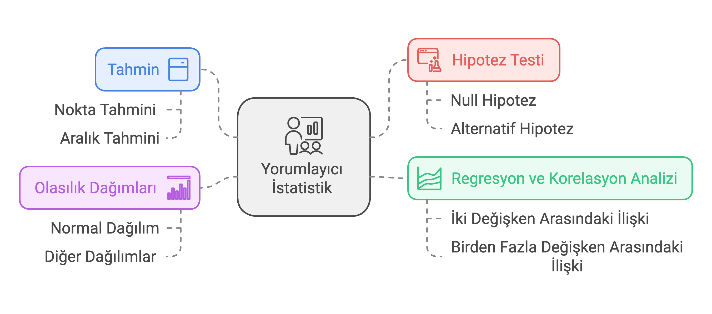
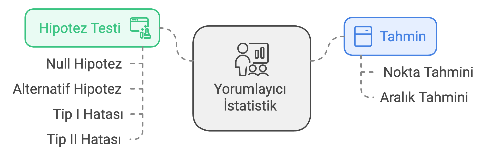

## Öğrenme Hedefleri

Bu oturumun sonunda:

-   **Null** ve **alternatif hipotez** kurabileceksiniz
-   **p-değeri** ile **anlamlılık düzeyi ($\alpha$)** arasındaki ilişkiyi yorumlayabileceksiniz
-   **Tip I/II hataları** ve **p-hacking** riskini ayırt edebileceksiniz
-   Doğru **t-testi** türünü seçip R'da çalıştırabileceksiniz
-   **ANOVA** ve **ki-kare** testlerini yorumlayabileceksiniz
-   Bir testin **varsayımlarını** denetleyebileceksiniz
-   Bir sonucun p-değeri **yanında** **etki büyüklüğünü** (Cohen's d, Cramér's V) raporlayabileceksiniz

------------------------------------------------------------------------

## Hipotez Testi Nedir?

Örneklemden elde edilen verilerle, **popülasyon** hakkında bir iddiayı (hipotezi) sınama süreci.

{fig-align="center" height="450"}

------------------------------------------------------------------------

## Dört Temel Kavram

{fig-align="center" height="450"}

------------------------------------------------------------------------

## Null ve Alternatif Hipotez

-   **Null Hipotez (**$H_0$): "Fark yok / etki yok" iddiası
    -   Örnek: $H_0: \mu_1 = \mu_2$
-   **Alternatif Hipotez (**$H_a$ ya da $H_1$): $H_0$'a karşı öne sürülen iddia
    -   Örnek: $H_1: \mu_1 > \mu_2$

> Test her zaman $H_0$'ı **reddetmeye çalışarak** ilerler; $H_0$'ı hiçbir zaman "doğruladık" demeyiz.

------------------------------------------------------------------------

## Tip I ve Tip II Hataları

::: callout-note
👋 **Mahkeme Benzetmesi**

-   $H_0$: Sanık masumdur — $H_a$: Sanık suçludur
-   **Tip I Hatası:** Masum sanığı suçlu bulmak
-   **Tip II Hatası:** Suçlu sanığı beraat ettirmek
:::

|  | $H_0$ Doğru | $H_0$ Yanlış |
|----|----|----|
| $H_0$ Reddedilmedi | Doğru karar | Tip II Hatası |
| $H_0$ Reddedildi | Tip I Hatası | Doğru karar |

------------------------------------------------------------------------

## ⚠️ P-Hacking ve Replikasyon Krizi

-   $\alpha = 0.05$, **her bir test için** kabul edilen risktir
-   20 değişkeni test edersiniz $\Rightarrow$ şans eseri biri $p<0.05$ çıkabilir
-   "İstediğim p-değerini bulana kadar değişken değiştirme" $\Rightarrow$ **p-hacking**
-   Hipotezler veriye bakmadan **önce** kurulmalı

------------------------------------------------------------------------

## p-Değeri ve $\alpha$

**p-değeri:** $H_0$ doğruyken, gözlemlenen kadar (veya daha uç) bir sonucun gözlenme olasılığı.

| p-Değeri | Karar |
|----|----|
| $p < 0.01$ | $H_0$ çok güçlü şekilde reddedilir |
| $0.01 \le p < 0.05$ | $H_0$ reddedilir |
| $0.05 \le p < 0.10$ | Zayıf/marjinal kanıt |
| $p \ge 0.10$ | $H_0$ reddedilmez |

**Kural:** $p \le \alpha \Rightarrow H_0$ reddedilir.

------------------------------------------------------------------------

## Etki Büyüklüğü: P-Değeri Tek Başına Yetmez

Büyük örneklemlerde, önemsiz bir fark bile $p<0.05$ çıkabilir.

-   **Cohen's d** (t-testleri): $d = (\bar{x}_1-\bar{x}_2)/s_{pooled}$
    -   $0.2$ küçük · $0.5$ orta · $0.8$+ büyük
-   **Cramér's V** (ki-kare): $V=\sqrt{\chi^2 / (n \cdot \min(r{-}1,c{-}1))}$
    -   $0.1$ küçük · $0.3$ orta · $0.5$+ güçlü

> Sonuç raporlanırken p-değeri **ve** etki büyüklüğü birlikte verilir.

------------------------------------------------------------------------

## `t.test()` Fonksiyonu

```{r}
#| eval: false
t.test(x, y = NULL,
       alternative = c("two.sided", "less", "greater"),
       mu = 0, paired = FALSE, var.equal = FALSE,
       conf.level = 0.95)
```

-   `mu`: karşılaştırılacak referans değeri
-   `paired`: eşleştirilmiş örneklem mi?
-   `var.equal`: grup varyansları eşit mi varsayılsın? (varsayılan: **FALSE** = Welch)

------------------------------------------------------------------------

## Örnek: Bir Örneklem t-Testi

Belediye başkanlarının yaş ortalaması 40'tan farklı mı?

```{r}
baskan_yaslari <- c(52, 48, 61, 55, 58, 50, 63, 47, 54, 59, 51, 56, 62, 49, 57)
t.test(baskan_yaslari, mu = 40)
```

$p \approx 2.8\times10^{-8} < \alpha \Rightarrow H_0$ reddedilir; $d \approx 2.85$ (çok büyük etki).

------------------------------------------------------------------------

## Örnek: Anlamsız Çıkan Bir Sonuç

e-Devlet memnuniyeti (10 ilçe), ulusal ortalama 72'den farklı mı?

```{r}
memnuniyet <- c(74, 70, 73, 69, 75, 71, 76, 68, 72, 77)
t.test(memnuniyet, mu = 72)
```

$p \approx 0.61 \Rightarrow H_0$ reddedilmez; $d \approx 0.17$ (ihmal edilebilir). **p-değeri ve etki büyüklüğü aynı hikâyeyi anlatıyor.**

------------------------------------------------------------------------

## Örnek: Eşleştirilmiş t-Testi

Vatandaş memnuniyeti eğitim öncesi/sonrası (12 belediye):

```{r}
egitim_oncesi  <- c(62, 58, 65, 60, 55, 63, 59, 61, 57, 70, 60, 56)
egitim_sonrasi <- c(68, 60, 70, 58, 59, 66, 63, 65, 61, 69, 62, 64)
t.test(egitim_oncesi, egitim_sonrasi, paired = TRUE)
```

$p \approx 0.002$, $d \approx 1.17$ (büyük etki).

------------------------------------------------------------------------

## Örnek: İki Örneklem t-Testi

Demokrasi/otokrasi grupları arası kişi başı GSYİH (temsili veri):

```{r}
demokrasi <- c(38, 41, 35, 44, 39, 42, 37, 40)
otokrasi  <- c(22, 19, 25, 21, 18, 24, 20, 23)
t.test(demokrasi, otokrasi, var.equal = TRUE)
```

::: callout-warning
⚠️ Korelasyon nedensellik değildir — bkz. ders notundaki Simpson Paradoksu tartışması.
:::

------------------------------------------------------------------------

## Örnek: Welch t-Testi — Sınırda Bir Karar

AB üyesi / aday ülkeler arası yolsuzluk algı endeksi (temsili veri):

```{r}
ab_uyesi <- c(58, 65, 52, 61, 45, 68, 55, 50, 63)
aday     <- c(48, 42, 55, 51, 40, 58)
t.test(ab_uyesi, aday)
```

$p \approx 0.0495$ — tam sınırda! $\alpha=0.05$ eşiği keyfidir, sonucu tek başına kesin kabul etmeyin.

------------------------------------------------------------------------

## Varsayımların Denetlenmesi

| Test | Varsayım | R Fonksiyonu |
|----|----|----|
| t-testi | Normallik | `shapiro.test()` |
| İki örn. t-testi | Varyans homojenliği | `bartlett.test()`, `var.test()` |
| ANOVA | Normallik + varyans homojenliği | `shapiro.test(residuals(...))`, `bartlett.test()` |
| Ki-kare | Beklenen frekans $\ge 5$ | `chisq.test(...)$expected` |

> Sınavda: **testi siz hesaplamazsınız**, hazır bir çıktı verilir ve p-değerini **yorumlamanız** istenir.

------------------------------------------------------------------------

## ANOVA: gapminder ile Kıtalara Göre Yaşam Beklentisi

```{r}
library(gapminder)
gapminder_2007 <- subset(gapminder, year == 2007)
anova_result <- aov(lifeExp ~ continent, data = gapminder_2007)
summary(anova_result)
```

------------------------------------------------------------------------

## ANOVA: Varsayım Denetimi — Bu Kez Gerçek Veriyle

```{r}
shapiro.test(residuals(anova_result))
bartlett.test(lifeExp ~ continent, data = gapminder_2007)
```

Her iki testte de $p < 0.05$: **varsayımlar ihlal ediliyor** (Oceania'da yalnızca $n=2$ ülke var). Çözüm: Welch ANOVA.

```{r}
oneway.test(lifeExp ~ continent, data = gapminder_2007, var.equal = FALSE)
```

Standart ($F=59.7$) ve Welch ($F=81.5$) ANOVA aynı sonuca işaret ediyor; $\eta^2 \approx 0.64$ (çok büyük etki).

------------------------------------------------------------------------

## ANOVA: Görselleştirme

```{r}
boxplot(lifeExp ~ continent, data = gapminder_2007,
        main = "Kıtaya Göre Yaşam Beklentisi (2007)",
        xlab = "Kıta", ylab = "Yaşam Beklentisi (yıl)",
        col = c("lightblue", "lightgreen", "pink", "khaki", "lightgray"))
```

------------------------------------------------------------------------

## Ki-Kare Bağımsızlık Testi

Cinsiyet ile kabul durumu arasında ilişki var mı? (`UCBAdmissions`)

```{r}
data(UCBAdmissions)
admission_table <- apply(UCBAdmissions, c(1, 2), sum)
chisq.test(admission_table)
```

$p < 2.2 \times 10^{-16}$ ama Cramér's $V \approx 0.14$ — **anlamlı, fakat küçük-orta düzeyde bir ilişki.**

------------------------------------------------------------------------

## ⚠️ Simpson Paradoksu: Berkeley Kabul Davası

-   Toplam veride: kadınların kabul oranı daha düşük görünüyor
-   **Bölüm bazında** ayrıştırınca: hemen hiçbir bölümde kadın aleyhine önyargı yok
-   Neden? Kadınlar rekabetçi (düşük kabul oranlı) bölümlere daha çok başvurmuş
-   **Karıştırıcı değişken** (bölüm), görünürdeki ilişkiyi tamamen değiştiriyor

> İki değişkenli ki-kare testi bunu **tek başına göremez** — bkz. Modül 11-12: çoklu regresyon.

------------------------------------------------------------------------

## Hangi Test, Ne Zaman?

| Soru Tipi | Test |
|----|----|
| 1 grup ort. $\leftrightarrow$ sabit değer | Tek örneklem t-testi |
| Aynı birimler, öncesi/sonrası | Eşleştirilmiş t-testi |
| 2 bağımsız grup ortalaması | İki örneklem t-testi |
| 3+ grup ortalaması | ANOVA |
| 2 kategorik değişken | Ki-kare bağımsızlık testi |

------------------------------------------------------------------------

## Özet

-   Hipotez testi, $H_0$'ı **reddetmeye çalışan** bir karar sürecidir
-   Karar kuralı tek: $p \le \alpha \Rightarrow H_0$ reddedilir
-   **Varsayımları denetlemeden** sonucu raporlamayın
-   **p-değeri yetmez** — etki büyüklüğünü de raporlayın
-   İlişki $\neq$ nedensellik; karıştırıcı değişkenlere dikkat (Simpson Paradoksu)
-   Sınavda beklenen: R çıktısını **okuyup yorumlamak**, ezbere hesaplamak değil
